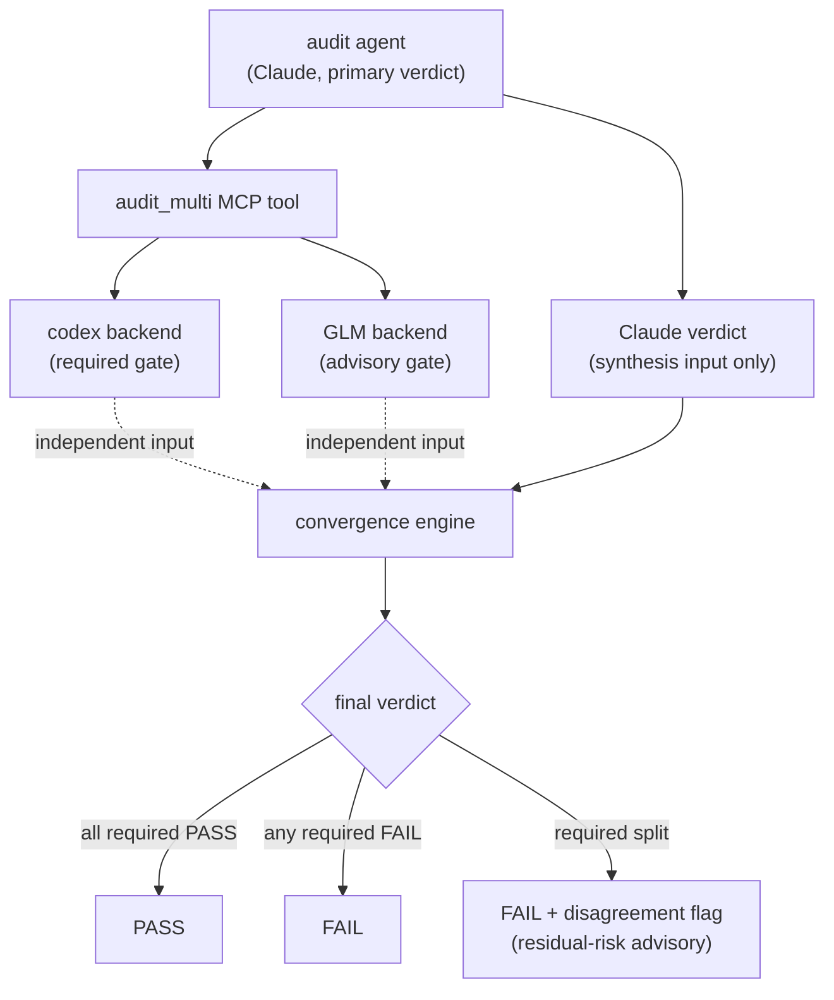
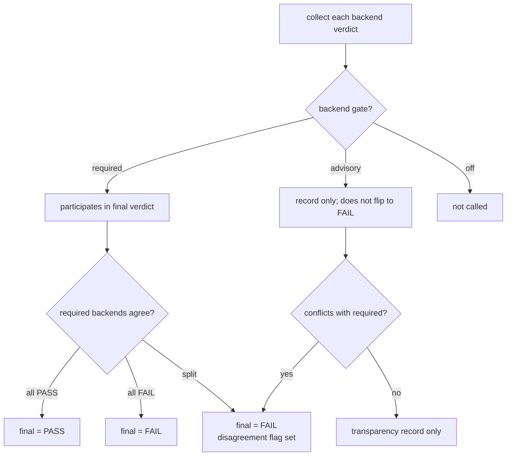




 <strong>Value home</strong>: agentic harness · agentic loop engineering


Multi-model audit convergence (the practice of having several AI models cross-validate the same artifact and merging the results into one final verdict) is MoAI-ADK's audit method for reducing the blind spots of a single model. The verdict issued by the manager agent in charge of the audit (the agent responsible for each of plan, implementation, documentation, and audit) is independently re-verified by a model from a different family. When the two verdicts agree, trust adds up; when they diverge, where the risk lies is made explicit as residual risk (the uncertainty that remains even after verification). This page covers why this double verification is needed, what rules the convergence runs under, and how it meets the autonomous loop.

## Why Single-Model Audit Is Not Enough

When you leave audit (the stage that independently confirms an artifact meets criteria) to a single model, that model's blind spots seep into the audit result. Some models catch certain patterns of errors well but miss others; some are strong on security context but weak on concurrency bugs. The design report's phrasing — "Codex is not smarter, it is _differently smart_" — is the same point. Models with different training data and reasoning habits have different blind spots.

The problem is that the blind spots are not random. Many of the errors a model misses are patterns it misses repeatedly. So verifying once more with the same model does not help much. By contrast, when you bring in a model from a different family, the correlated blind spot (the error area that two or more models fail to see for the same reason) shrinks dramatically. The probability that the second verifier catches what the first verifier missed goes up.

Multi-model audit is the choice to address this correlated blind spot from the audit design onward. Rather than repeating the audit once more, it runs structurally different perspectives in parallel at once and merges the results.

## The super-review Pattern — An Independent Second Opinion

The design backbone of multi-model audit is the super-review pattern (a double-verification structure where a second model independently re-verifies the first verdict issued by one model). It proceeds in three steps. First, the Claude in the session issues the primary analysis. Second, a second backend — such as codex (an OpenAI-family CLI tool) or GLM (a model from z.ai) — looks at the same artifact from scratch. Third, the orchestrator merges the two verdicts into one final verdict.

Here, _independence_ (the state where the second verifier is not influenced by the first verifier's verdict) is key. If the first verdict is shown to the second verifier in advance, the second verifier is pulled toward it and repeats the same conclusion. That makes the fact of having verified twice meaningless. So MoAI-ADK _never_ passes Claude's primary analysis to codex or GLM as context. Claude's verdict is used only as input at the merge stage, and is not handed to the second backend. This is what guarantees the second opinion is genuinely second.

The dotted lines in the diagram express independence — "each backend issues its verdict from its own input, without seeing Claude's primary analysis." The Claude verdict goes in only at the merge stage and does not mix into the codex and GLM verification paths.

## Role Split Among the Three Backends

Convergence deals with three kinds of backends (the AI models that actually perform the audit) by default. Claude brings in the primary verdict analyzed directly by the audit agent inside the session. Without a separate model call, the result the agent already produced is written as the synthesis input. codex has the system call the codex binary to verify the artifact. GLM directly calls the z.ai API to re-verify the same artifact.

Each backend has a setting called an audit_gate (the setting that decides how that backend's verdict is reflected in the final result). There are three gates. `required` is the mandatory participant whose verdict decides the final result. `advisory` is the advisory participant whose verdict is recorded and reported as residual risk but does not flip the final result. `off` means that backend is not called at all. The default profile puts Claude and codex as required and GLM as advisory. Putting two required backends from different families is itself a device for reducing the correlated blind spot.

## The Convergence Algorithm — When Opinions Diverge

Convergence (the procedure that merges the verdicts of multiple backends into one final verdict) follows a fixed order. First, if all required-gate backends PASS, the final verdict is PASS. Second, if any required-gate backend FAILs, the final verdict is FAIL. Third, if the required gates split — one PASS, one FAIL — the final verdict falls to FAIL and at the same time the disagreement_flag (a marker indicating the verdicts split among required backends) is set. This flag appears as an advisory signal in the orchestrator's completion report (the Verification Matrix, the verification table of the completion report) along with a residual-risk explanation. Fourth, advisory or off backends never flip the final verdict to FAIL. The verdict of an advisory backend is recorded for transparency and only adds a disagreement flag when it conflicts with a required backend.

An important design decision here is that disagreement is not itself a blocking reason. We do not create a new blocking category called "required opinions split." Instead, the split is handled as FAIL under the conservative default rule "FAIL if any required FAILs," and the fact of the split rises as a separate advisory signal. Keeping the rule simple lets the side reading the convergence result see "why FAIL" at a glance.

The second diagram shows the path from a backend's gate setting to the final verdict. An advisory backend only adds a disagreement flag on conflict; it never changes the verdict itself.

## fail-open — A Missing Backend Does Not Stop the Flow

Multi-model audit follows fail-open (the principle of designing so that the absence of a non-mandatory element does not stop the whole flow). For example, if you set the GLM backend as an advisory gate but API auth is missing or the call fails, that backend's verdict is treated as no-result and convergence continues with the remaining active backends. One missing advisory backend does not halt the whole audit or end in an error.

For backends set as required gates, however, the story is different. If a required backend is missing or returns an error, its verdict is treated as no-result, and by the convergence rule, no PASS can be issued without a PASS from the required backends. That is, the absence of a required backend is handled conservatively, tilting toward FAIL, which matches the setting's intent — "if you marked it required, you are staking that much trust on it."

This fail-open identity becomes more important in the autonomous loop. A transient error in one backend must not halt the whole autonomous loop. So a missing backend is recorded with a "no information" marker, and the verdict proceeds with the rest.

## Where It Meets the Autonomous Loop — multi-review-gate

Multi-model audit is used in two paths. The first is existing audit stages like plan-audit and sync-audit. The audit agent calls the `moai-ref-cross-model-audit` skill to augment the in-session Claude verdict with codex and GLM, and reflects the merged result in its own audit verdict. This path follows existing skill-routing rules as-is, so no new routing mechanism appears.

The second is the fully-autonomous goal convergence loop. When you declare a completion condition with `/moai goal` and let the session work without human intervention until the condition is met, the Stop hook (the check point that runs at the end of every turn) that executes at every turn-end reads the multi-model audit result and emits ALLOW or BLOCK. We call this gate multi-review-gate, and it has the same form of self-gate (a device that itself decides whether this turn needs real verification of a code change) as the existing codex-review-gate. If there is no code change or it is a status-report turn, it immediately emits ALLOW to prevent false blocks.

The key is that disagreement does not break the autonomous loop. If the required backends split, the gate conservatively emits BLOCK, but a split among advisory backends alone never leads to BLOCK. A disagreement at the advisory level rises only as a residual-risk advisory, and the loop keeps running. This preserves both the unbroken flow of the autonomous loop and the safety net of cross-validation.

## In Summary

Multi-model audit convergence establishes three things at once. It reduces the correlated blind spot by running models from different families in parallel, merges verdicts with clear precedence rules, and preserves the fail-open identity by treating disagreement as advisory rather than blocking. The primary verdict is never exposed to the second verifier, so independence is preserved; a missing backend is treated as no-result and does not stop the whole flow. And all of this works on the same MCP surface of existing audit stages like plan-audit and sync-audit, and of the fully-autonomous goal loop. Rather than repeating the audit once more, it inserts one more perspective — this is the heart of multi-model audit convergence.
