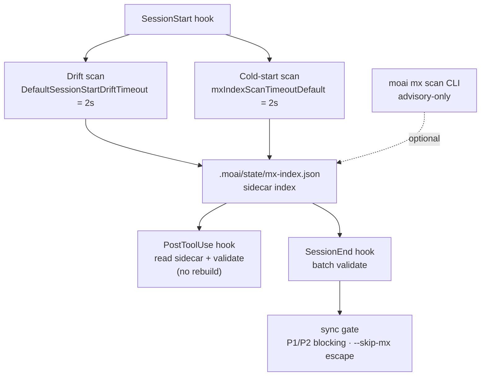

# MX Scanner Internals

The `moai mx` scanner reads the codebase, builds an index keyed on `@MX:` tags, and runs validation across several points in time. This document explains — grounded in the codebase — the four behaviors hidden behind the tag syntax: the rotRisk score, the LSP fan-in engine selection, the CGO-gated complexity measurement, and the scan automation timing. For tag authoring see [MX Tags](/en/advanced/mx-tags); for the command form see [`moai mx`](/en/utility-commands/moai-mx).

## rotRisk Score

`rotRisk` is a field that exists only on `@MX:DEBT` tags. The scanner always fills this field when parsing a DEBT tag; other tag kinds do not have this field.

The value depends on the presence of the `@MX:UPGRADE` sub-line.

- When `@MX:UPGRADE` is absent, `rotRisk` is set to the string `"no-trigger"`. The rot signal is not "dangerous right now" but "debt without an upgrade plan."
- When `@MX:UPGRADE` follows, `rotRisk` is initialized to the empty string and omitted from the sidecar. Debt with a planned upgrade is no longer a rot candidate.

 The presence or absence of `@MX:CEILING` is not a criterion for rot. CEILING is a quality memo meaning "this limit is known," and is independent of the rot gate. The rot gate is determined solely by the presence or absence of `@MX:UPGRADE`.

Entries shown as `"rotRisk": "no-trigger"` in the `moai mx query --kind DEBT --json` result are exactly the debt without an upgrade plan. The tag semantics can be re-confirmed at [MX Tags - DEBT](/en/advanced/mx-tags#debt).

## LSP fan-in Engine

When verifying that an `@MX:ANCHOR` satisfies the "fan_in ≥ 3" threshold, the scanner counts call references in one of two ways.

- **LSP first**: when an active language server is available, it calls `textDocument/references` to collect exact reference locations. This result is recorded in the sidecar's `fan_in_method` field as `"lsp"`.
- **Textual fallback**: when LSP is unavailable, it falls back to a regex-based grep. The sidecar records `fan_in_method: "textual"`.

In the default non-strict mode, when LSP is missing the scanner silently falls back to textual. The `fan_in_method` field in the query result exposes this fact, so always check this field as well when interpreting results.

 To force LSP, set the environment variable `MOAI_MX_QUERY_STRICT=1`. In this mode, when LSP is unavailable the scanner returns `LSPRequiredError` and does not fall back. Use this in environments where correctness matters more than fallback, such as CI.

## CGO Complexity Measurement

Cyclomatic complexity and if-branch count are measured by tree-sitter, and tree-sitter requires CGO. As a result, behavior changes significantly depending on the build tag.

- **Non-CGO build**: the `//go:build !cgo` stub file returns `Result{Supported: false}` for every language input. This is not a fallback heuristic but a hard stub — in a non-CGO build, no language supports complexity measurement.
- **CGO build**: tree-sitter is active, but the result is still `Supported: false` when — the language is only scaffolded, the file exceeds 1 MiB (1,048,576 bytes), a parse error occurs, a query compile error occurs, or the function body cannot be found.

 `Supported: false` is a silent skip. The scanner classifies that file's complexity as "unmeasurable" and moves on to the next file. It raises no error, and logs only at the `slog.Debug` level so nothing propagates upward.

## Scan Automation Timing

The scanner runs at five points in time, each with a different purpose and constraint.

1. **Explicit CLI**: running `moai mx scan` scans the entire codebase and rebuilds the index. It is advisory-only and blocks no flow.
2. **SessionStart lazy cold-start scan**: runs in the background at session start. On large repositories this can take time, so it is protected by **two distinct 2-second ceilings** — `mxIndexScanTimeoutDefault` (the ceiling on the cold-start scan itself) and `DefaultSessionStartDriftTimeout` (the ceiling on the drift check). The two ceilings merely happen to share the same 2s value; they are not the same gate. On failure it is treated as fail-open.
3. **PostToolUse validation**: after a file edit, it reads the sidecar (`.moai/state/mx-index.json`) and validates the affected tags. The index is not rebuilt at this point.
4. **SessionEnd batch validation**: performs a batch validation at session end.
5. **sync gate**: when `/moai sync` runs, P1 (exported function with fan_in ≥ 3 missing ANCHOR) and P2 (goroutine missing WARN) are blocking actions, while P3 and P4 are advisory. Escape with `--skip-mx`.

The following diagram shows how the five points connect around the sidecar index. The diagram source is preserved byte-identically across the four locales — translation applies only to the prose around the diagram.

## Next Steps

- [MX Tags](/en/advanced/mx-tags) — syntax and sub-lines for each tag kind
- [`moai mx`](/en/utility-commands/moai-mx) — scan/query/validate subcommand forms
