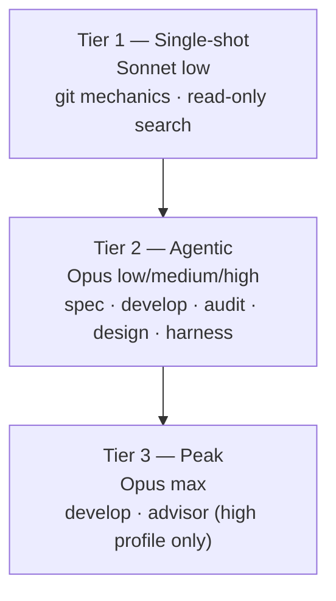

MoAI-ADK v3.0 excludes Haiku from the routing model set and distributes work across a 3-tier structure keyed to task character. This design is grounded in empirical data from the DeepSWE leaderboard. This page explains why Haiku is excluded, how the 3 tiers are configured, and distinguishes design intent from implemented behavior.

## Why Haiku Is Excluded

The key finding from the DeepSWE leaderboard is that **"weak model + high effort = enemy of availability."** A weaker model does not finish a long-horizon task more cheaply — it spends more steps and more output tokens failing to converge. At `max` effort, Sonnet 5 consumes 268 steps and 214k output tokens on the same task set that Opus 5 finishes in 99 steps.

Measurements below are from the leaderboard's **"All effort levels"** view (113 tasks / 91 repos / 5 languages, mini-swe-agent harness). Because effort is reported per level, the tiers can be derived from the shape of each model's cost/score curve rather than from a single operating point.

| Model | effort | Score | $/task | Output tokens | Steps |
|---|---|---|---|---|---|
| Opus 5 | low | 58% | $1.66 | 20k | 36 |
| Opus 5 | medium | 69% | $3.29 | 37k | 52 |
| Opus 5 | high | 73% | $6.08 | 64k | 73 |
| Opus 5 | xhigh | 73% | $9.07 | 92k | 89 |
| Opus 5 | max | 74% | $11.84 | 118k | 99 |
| Sonnet 5 | low | 31% | $2.19 | 36k | 77 |
| Sonnet 5 | medium | 40% | $4.08 | 57k | 108 |
| Sonnet 5 | high | 48% | $7.43 | 87k | 147 |
| Sonnet 5 | xhigh | 50% | $11.89 | 121k | 186 |
| Sonnet 5 | max | 54% | $26.40 | 214k | 268 |
| Fable 5 | high | 69% | $9.18 | 57k | 59 |
| Fable 5 | max | 70% | $21.63 | 119k | 88 |

List price per MTok (in/out): Opus 5 $5/$25 · Sonnet 5 $2/$10 (introductory, through 2026-08-31, then $3/$15) · Fable 5 $10/$50.

 **Price inversion**: Sonnet's per-token price is *below* Opus, yet its per-task cost is higher at every comparable point — Opus 5 at `low` costs $1.66 and scores 58%, while Sonnet 5 at `max` costs $26.40 and scores 54%. The conventional wisdom that "running a cheaper model saves quota" does not hold for long-horizon agentic work, because completion efficiency, not unit price, sets the bill.

Under this data, including Haiku in routing would add step waste without adding capability. Sonnet is instead confined to single-shot, input-dominated work where multi-step completion failure does not apply.

## 3-Tier Definition

Models and effort are assigned to 3 tiers based on task character.

### Tier 1 — Single-shot

 Work that completes in one pass and is dominated by input rather than by iteration. Multi-step completion failure — the effect that makes weaker models expensive — does not apply here, so Sonnet's lower input price is the operative factor. Sonnet at `low` effort minimizes step count. Agents: `manager-git`, `Explore`. These two rows are fixed across all three profiles.

### Tier 2 — Agentic

 Every multi-turn row — planning, implementation, audit, design, harness generation, documentation, E2E. Opus carries all of them, because Opus at `low` already outscores Sonnet at any effort while costing less per task. The profile selects where on the Opus effort ladder each row sits: `low` in the economical column, `medium` in the default column, `high` in the quality column. Agents: `manager-spec`, `manager-develop`, `plan-auditor`, `sync-auditor`, `manager-design`, `builder-harness`, `manager-docs`, `e2e-tester`.

### Tier 3 — Peak

 `max` effort is confined to the two rarest-invocation rows in the `high` profile only: `manager-develop` and `super-advisor`. Above `medium` the marginal cost per point rises sharply ($0.15/point for `low`→`medium` vs $0.70/point for `medium`→`high`), so peak effort is spent only where a single decision carries disproportionate downstream cost. `xhigh` is used nowhere — on Opus it matches `high` on score at 49% higher cost.

## DeepSWE Leaderboard Rationale

Four conclusions drawn from the per-effort measurements:

1. **Opus 5 Pareto-dominates Sonnet 5 at every effort.** Opus at `low` (58%, $1.66) beats all five Sonnet points on both axes, including Sonnet at `max` (54%, $26.40). The routing thesis "send busy agents to the cheaper model" is falsified for long-horizon agentic work.
2. **The cause is completion efficiency, not price.** Sonnet spends roughly 2.7× the steps to finish the same task set. The extra steps and output tokens, not the per-token rate, are what make the task expensive.
3. **`xhigh` is a net loss on Opus.** `high` and `xhigh` both score 73%, but `xhigh` costs 49% more and takes 22% more steps. The same flat top appears on Fable. Effort past the knee buys tokens, not points.
4. **`medium` is the knee.** Marginal cost per point: `low`→`medium` $0.15, `medium`→`high` $0.70 (4.7×), `xhigh`→`max` $2.77 (18.6×). The default profile anchors `manager-develop` at `medium` for this reason.

 **Limitation note**: the benchmark measures **coding** agents. Documentation authoring, audit judgment, and SPEC authoring quality are not directly measured, so those row placements rest on a similarity inference to multi-turn agentic work rather than on observation. Confidence intervals also matter: `medium` (69%±1) and `high` (73%±2) do not overlap, but `max` (74%±4) overlaps `high` — which is why `max` is confined to two rarely-invoked cells. Every default is reversible per-agent via `llm.agent_overrides`.

 **On Fable 5**: Fable is dominated on the coding axis at every effort — Fable at `high` (69%, $9.18) matches Opus at `medium` (69%, $3.29) for nearly triple the cost — so it appears in no matrix cell. It remains a valid value in the model enum and stays wired as the GLM backend's Fable slot; only the defaults changed.

## Design Report vs Implementation

 **REQ-DA-061 honesty distinction**: The content on this page must clearly distinguish design-stage from implemented behavior.

**Design stage** (`.moai/reports/agent-architecture-redesign-v2-20260709.html`) — the v2 architecture design intent. Presents the 3-tier model policy principles and DeepSWE rationale.

**Implemented behavior** — a single profile matrix performs the actual routing. The active profile (`high`/`medium`/`low`) selects one column of the matrix, and the resolver determines each agent's `{model, effort}` and injects the model as a runtime argument at spawn time. For the detailed matrix, see the [Profile Matrix](/en/advanced/profile-matrix/) page.

Readers must be able to distinguish design intent (the DeepSWE rationale on this page) from implemented behavior (the single profile matrix).

## Connection to Harness Self-Evolution

The 3-tier architecture is the substrate for harness self-evolution. For the evolution loop (observation → reflection → promotion) to be effective, routing decisions in the observation phase must go to the right model at the right effort. For details on self-evolution, see the [Harness Self-Evolution](/en/advanced/self-evolving/) page.

## Next Steps

- [Profile Matrix](/en/advanced/profile-matrix/) — the single 3-column per-agent profile matrix (11 agents × 3 profiles = 33 cells)
- [Tokenomics Overview](/en/advanced/tokenomics-overview/) — Layer B routing of the 4-layer tokenomics structure
