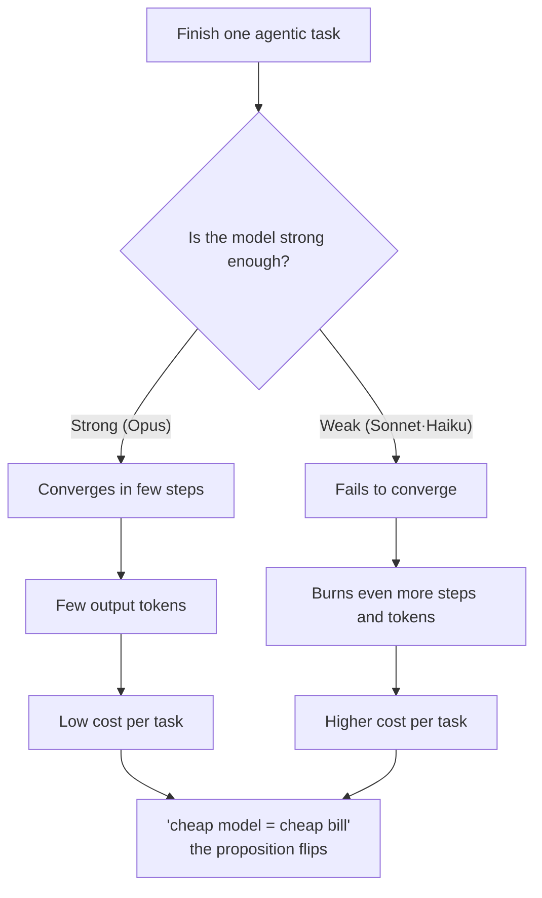
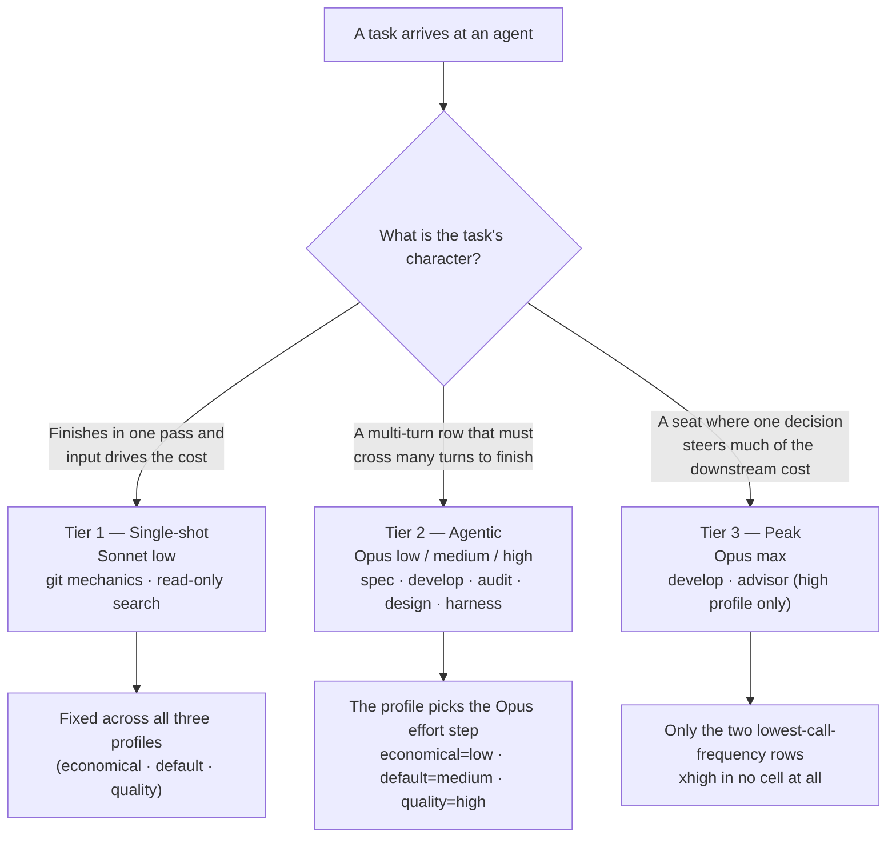

MoAI-ADK removes Haiku from the routing model set and splits the remaining models into three tiers used according to the character of the work. This page is written so you could explain it to a friend — *"Slotting a cheap model into the busy seats looks like it saves money, but on long-horizon tasks the opposite happens. MoAI confirmed with data that using the expensive model more often actually shrinks the bill, and on top of that defined a three-tier assignment rule by task type."*

Here, the **agent** (an AI helper that works and judges on its own) and the **effort** (reasoning depth — the five levels `low` → `medium` → `high` → `xhigh` → `max` that decide how deeply the model thinks for one answer) are the two axes that decide cost. This page covers why these two axes are assigned the way they are, why Haiku was removed entirely, and why these "tiers" are a different concept from the autonomy grade.

## Where intuition and reality diverge

The common assumption goes like this: "Run the cheap per-token models (say Sonnet · Haiku) in the busy seats, save the expensive model (Opus) for the important seats only, and the total cost will drop." Looking at the token (the billing unit in which the model reads and writes text) price table alone, the assumption looks right.

But the assumption needs one premise to hold — that *a weaker model still finishes the same task in the same number of steps*. On a long-horizon agentic task (one that calls tools repeatedly, revises its own plan, and ends only when it sees the end), the premise collapses. The weaker model fails to converge, and as it fails it spins more steps and emits more output tokens without finishing. The per-token price is cheap, but the *amount of tokens burned* is far larger, so the per-task bill actually grows.

That is the starting point of this entire page. **What sets the bill is not the unit price but completion efficiency.**

## What the data says — the DeepSWE leaderboard

The source that confirmed the intuition above is the **"All effort levels"** view of the DeepSWE leaderboard (113 tasks / 91 repos / 5 languages, mini-swe-agent harness). Because effort is reported per level, the tiers can be derived from the shape of each model's cost/score curve, not from a single operating point.

| Model | effort | Score | $/task | Output tokens | Steps |
|---|---|---|---|---|---|
| Opus 5 | low | 58% | $1.66 | 20k | 36 |
| Opus 5 | medium | 69% | $3.29 | 37k | 52 |
| Opus 5 | high | 73% | $6.08 | 64k | 73 |
| Opus 5 | xhigh | 73% | $9.07 | 92k | 89 |
| Opus 5 | max | 74% | $11.84 | 118k | 99 |
| Sonnet 5 | low | 31% | $2.19 | 36k | 77 |
| Sonnet 5 | medium | 40% | $4.08 | 57k | 108 |
| Sonnet 5 | high | 48% | $7.43 | 87k | 147 |
| Sonnet 5 | xhigh | 50% | $11.89 | 121k | 186 |
| Sonnet 5 | max | 54% | $26.40 | 214k | 268 |
| Fable 5 | high | 69% | $9.18 | 57k | 59 |
| Fable 5 | max | 70% | $21.63 | 119k | 88 |

List price per MTok (in/out): Opus 5 $5/$25 · Sonnet 5 $2/$10 (introductory, through 2026-08-31, then $3/$15) · Fable 5 $10/$50.

 **Price inversion**: Sonnet's per-token price is *lower* than Opus's, yet at every comparable point its per-task cost is higher — Opus 5 at `low` gets 58% for $1.66, while Sonnet 5 at `max` gets 54% for $26.40. The conventional wisdom "running a cheap model saves quota" does not hold on long-horizon agentic work, because what sets the bill is completion efficiency, not unit price.

Four conclusions read from the data:

1. **Opus 5 Pareto-dominates Sonnet 5 at every effort.** Opus `low` (58%, $1.66) leads all five Sonnet points on both axes — score and cost — and Sonnet `max` (54%, $26.40) is no exception. The routing thesis "send the busy agents to the cheap model" is falsified on long-horizon agentic work.
2. **The cause is completion efficiency, not unit price.** Sonnet spends roughly 2.7× the steps to finish the same task set. What makes the task expensive is not the per-token rate but those extra steps and output tokens.
3. **`xhigh` is a net loss on Opus.** `high` and `xhigh` both score 73%, but `xhigh` costs 49% more and takes 22% more steps. Fable's ceiling flattens at the same spot. Effort past the knee buys tokens, not points.
4. **`medium` is the knee.** Marginal cost per point of score: `low` → `medium` $0.15, `medium` → `high` $0.70 (4.7×), `xhigh` → `max` $2.77 (18.6×). That is why the default profile anchors the core implementation agent at `medium`.

## Why Haiku is removed entirely

Even Sonnet costs more per task than Opus on long-horizon work. Haiku is weaker than Sonnet. So adding Haiku to routing adds no capability — only step waste; the completion-failure pattern already observed on Sonnet would appear even more steeply on Haiku.

That is why MoAI excludes Haiku from the routing model set entirely (the No-Haiku policy, SPEC-AGENT-ARCH-V2-001 §D). Haiku remains a valid value in the model enum, so it appears in docs and example YAML, but it enters no cell of the actual agent assignment matrix. Remove Haiku and the cost-cutting axis still remains — tiering effort (reasoning depth) per step instead of switching model classes. That is the starting point of the 3-tier structure.

## The 3-tier assignment rule

The remaining models (Opus, Sonnet) and effort are assigned across three tiers by the character of the work. "Tier" here means *a step of model·effort assignment keyed to task type*.

### Tier 1 — Single-shot

 Work that finishes in one pass, where input rather than repetition drives cost. The thing that makes weaker models expensive — multi-step completion failure — never appears here, so Sonnet's low input price becomes the operative factor. Sonnet at `low` effort keeps the step count minimal. Agents on duty: `manager-git`, `Explore` — and these two rows are fixed across all three profiles (economical · default · quality).

### Tier 2 — Agentic

 Planning, implementation, audit, design, harness generation, documentation, E2E — every multi-turn row. Opus at `low` already outscores Sonnet at any effort while costing less per task, so Opus carries this entire row set. The profile chooses where each row sits among the Opus effort steps — the economical column `low`, the default column `medium`, the quality column `high`. Agents on duty: `manager-spec`, `manager-develop`, `plan-auditor`, `sync-auditor`, `manager-design`, `builder-harness`, `manager-docs`, `e2e-tester`.

### Tier 3 — Peak

 `max` effort is used only on the two lowest-call-frequency rows of the `high` profile — `manager-develop` and `super-advisor`. Above `medium`, the marginal cost per point of score climbs steeply (`low` → `medium` is $0.15 per point, `medium` → `high` is $0.70). So peak effort is assigned only to seats where a single decision steers much of the downstream cost. `xhigh` is used nowhere — on Opus it scores the same as `high` at 49% more cost.

## Model tiers and autonomy tiers are different things

The "tier" on this page is an assignment step for *which model at which reasoning depth goes to which work*. The names are similar and easy to confuse, but MoAI has one **other** "tier."


**Two tiers that share only a name**
- **Model tier** (this page) — fixes *which model · effort* each agent works with, by task type. Its subject is **cost · quality**.
- **Autonomy tier** (`MOAI_AUTONOMY_TIER`) — the grade of *how far an agent may act autonomously* without human approval. Its subject is **permission · control**.


The two are orthogonal. An agent working on an expensive model at high effort (a high model tier) does not thereby get to act without human approval, and vice versa. The autonomy tier is handled by its own environment variable and 3-level mode selection — see the [Autonomy Tier](/en/advanced/autonomy-tier/) page for details.

## Reading design intent and implemented behavior apart

 **An honesty distinction**: this page keeps design-stage intent and actually implemented behavior clearly apart.

**Design stage** (`.moai/reports/agent-architecture-redesign-v2-20260709.html`) — the design intent of the v2 architecture. Presents the principles of the 3-tier model policy and the DeepSWE rationale.

**Implemented behavior** — a single profile matrix performs the actual routing. The active profile (`high` / `medium` / `low`) picks one column of the matrix, the resolver fixes each agent's `{model, effort}`, and the model goes in as a runtime argument at spawn time. See the [Profile Matrix](/en/advanced/profile-matrix/) page for the detailed matrix.

Readers, too, should keep design intent (the DeepSWE rationale on this page) separate from implemented behavior (the single profile matrix).

## What this benchmark does not measure

 **Limitation note**: what this benchmark measures are **coding** agents. Documentation authoring, audit judgment, and SPEC (requirements document) authoring quality were not directly measured, so those row placements lean on the inference that they resemble multi-turn agentic work — they are not observations. Confidence intervals matter too: `medium` (69%±1) and `high` (73%±2) do not overlap, but `max` (74%±4) overlaps `high`. That is why `max` is bundled into two rarely-invoked cells. Every default is reversible per agent via `llm.agent_overrides`.

 **On Fable 5**: Fable loses on coding work across every effort. Fable `high` (69%, $9.18) delivers the same score as Opus `medium` (69%, $3.29) for nearly triple the cost. So it was placed in no matrix cell. It remains a valid value in the model enum, and the Fable-slot wiring of the GLM backend stays alive — only the defaults changed.

## Connection to harness self-evolution

The 3-tier assignment is the foundation of the loop in which the harness improves itself. For the evolution loop — observation → reflection → promotion — to do its job, routing decisions in the observation phase must already go to the right model at the right effort. Mis-assigned routing contaminates the observations themselves, and contaminated observations produce wrong rules at the promotion stage. See the [Harness Self-Evolution](/en/advanced/self-evolving/) page for details.

## Next steps

- [Profile Matrix](/en/advanced/profile-matrix/) — the single 3-column per-agent profile matrix (11 agents × 3 profiles = 33 cells)
- [Autonomy Tier](/en/advanced/autonomy-tier/) — the permission · control autonomy grade, orthogonal to model tiers
- [Tokenomics Overview](/en/advanced/tokenomics-overview/) — the routing layer of the 4-layer tokenomics structure
