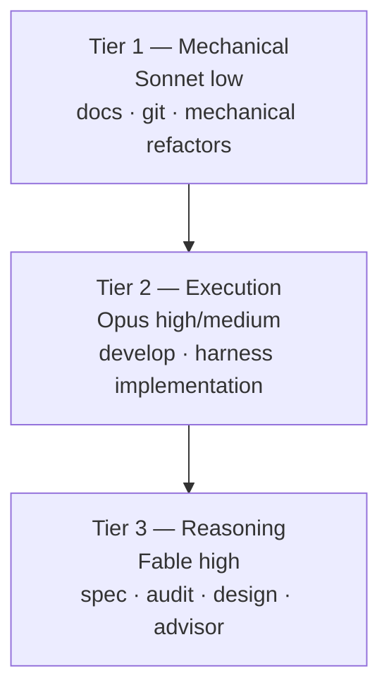

MoAI-ADK v3.0 excludes Haiku from the routing model set and distributes work across a 3-tier structure (Sonnet / Opus / Fable). This design is grounded in empirical data from the DeepSWE leaderboard. This page explains why Haiku is excluded, how the 3 tiers are configured, and distinguishes design intent from implemented behavior.

## Why Haiku Is Excluded

The key finding from the DeepSWE leaderboard (deepswe.datacurve.ai, 113 tasks, 2026-07-09) is that **"weak model + high effort = enemy of availability."** At max effort, Sonnet 5 consumes 268 steps and 214k output tokens, creating excessive retry loops.

| Model [effort] | Pass@1 | Cost/task | $/solved | Tokens/solved | Steps |
|---|---|---|---|---|---|
| Fable 5 [max] | 70% | $21.63 | $30.9 | 170k | 88 |
| Opus 4.8 [max] | 59% | $13.22 | $22.4 | 229k | 120 |
| Sonnet 5 [max] | 54% | $26.40 | $48.9 | 396k | 268 |

 **Price inversion**: Sonnet's nominal price ($3/$15) is half of Opus ($5/$25), but per-task cost inverts: Opus $13.22 < Sonnet $26.40. Sonnet consumes 1.6x tokens and 2.2x steps. The conventional wisdom that "running a cheaper model saves quota" does not hold.

Under this data, including Haiku in routing would cause unnecessary step waste in mechanical tasks. Instead, Sonnet at low effort is assigned to mechanical work to minimize step count.

## 3-Tier Definition

Models and effort are assigned to 3 tiers based on task character.

### Tier 1 — Mechanical

 Documentation, git operations, and mechanical refactors do not require reasoning. Sonnet at low effort minimizes step count. Agents: manager-docs, manager-git.

### Tier 2 — Execution

 Implementation and harness generation become lower-difficulty when a good plan is provided. Opus high (API) or Sonnet high (subscription) is assigned, blocking max-effort loop waste. Agents: manager-develop, builder-harness.

### Tier 3 — Reasoning

 Planning, audit, design, and advisory are the phases that determine downstream rework (= token waste). The top reasoning model is assigned at Fable high (API) or Opus high (subscription). Agents: manager-spec, plan-auditor, sync-auditor, manager-design, super-advisor.

## DeepSWE Leaderboard Rationale

Four conclusions drawn from the leaderboard measurements:

1. **Sonnet 5 max is the worst value in the Claude family** — more expensive than Opus 4.8 max ($26.40 vs $13.22) and lower score (54% vs 59%). The cause is the 268-step excessive retry loop. High effort does not mean high value.
2. **API value leader is Opus 4.8** ($22.4/solved). Quality leader is Fable 5 (70%). Fable's premium is +$8.5/solved.
3. **Availability-wise: Fable(170k) < Opus(229k) < Sonnet(396k)** — subscription weekly quotas are token-based, so weaker models actually burn more quota.
4. **Steps = speed** — Fable 88 < Opus 120 < Sonnet 268. Higher-tier models win on wall-clock time too.

 **Limitation note**: The leaderboard does not have Claude model effort-variant data (low/medium/high/xhigh — all max). Therefore "Sonnet xhigh vs high quality difference" cannot be directly verified; the effort downshift is inferred from (a) Sonnet 5 max loop-waste measurements, (b) Opus 4.8's default effort being high per Anthropic's official positioning, and (c) the general property that effort is quasi-linear with output tokens.

## Design Report vs Implementation

 **REQ-DA-061 honesty distinction**: The content on this page must clearly distinguish design-stage from implemented behavior.

**Design stage** (`.moai/reports/agent-architecture-redesign-v2-20260709.html`) — the v2 architecture design intent. Presents the 3-tier model policy principles and DeepSWE rationale.

**Implemented behavior** (SPEC-MODEL-TIER-PLANTYPE-001, CLOSED) — `ApplyTierProfile` 60-cell profile performs the actual routing. It replaces both model and effort in agent frontmatter (replace-both) to apply the tier profile. For the detailed 60-cell matrix, see the [plan_type Tier Profiles](/en/advanced/plan-type-profiles/) page.

Readers must be able to distinguish design intent (the DeepSWE rationale on this page) from implemented behavior (the 60-cell ApplyTierProfile).

## Connection to Harness Self-Evolution

The 3-tier architecture is the substrate for harness self-evolution. For the evolution loop (observation → reflection → promotion) to be effective, routing decisions in the observation phase must go to the right model at the right effort. For details on self-evolution, see the [Harness Self-Evolution](/en/advanced/self-evolving/) page.

## Next Steps

- [plan_type Tier Profiles](/en/advanced/plan-type-profiles/) — the 60-cell profile matrix (10 agents × 3 tiers × 2 plan_types)
- [Tokenomics Overview](/en/advanced/tokenomics-overview/) — Layer B routing of the 4-layer tokenomics structure
