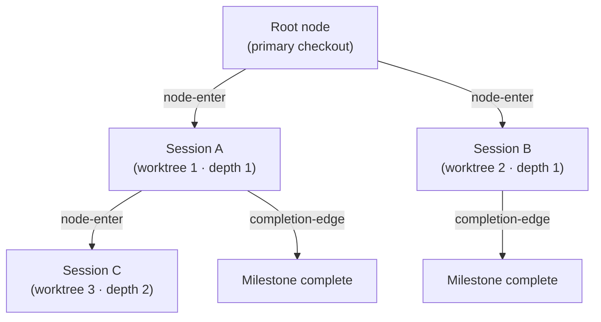

# Origin-Trail Chain


 <strong>Value area</strong>: agentic loop engineering · session continuity


The Origin-Trail Chain is an append-only lineage ledger that records where each worktree session branched from. Starting a session inside a worktree creates a node, and a parent-child edge records "this session split off from that one". When you re-enter a deeply nested worktree after `/clear`, you can recover which milestone was finished and what to do next without grepping or digging through scrollback.

The chain is independent of Factory Mode. It needs no factory leader and no lane. Any session launched with a named worktree, such as `moai cc -w <name>`, ends up on the chain. This page covers what the chain records and when, how it is stored, and the `moai chain` commands for reading it.

## The problems it solves

**Depth amnesia** — when worktree sessions spawn further worktree sessions, a session that re-enters after `/clear` forgets who its ancestors were. Recovery used to mean grep and scrollback archaeology. The chain denormalizes the full ID path from the root to the node into the `origin_chain` field, so a single lookup restores the lineage with no traversal.

**A broken handoff** — when a child session ends and its parent never learns of it, the parent waits for work that is already done. The chain writes a `completion-edge` event when a session ends, together with the last milestone completed and the next thing to resume (`resume_target`). The ledger stays current even if the parent session has died or been cleared.

## When it records

Three places write to the ledger, and a failure in any of them never blocks a session (fail-open). The chain is auxiliary telemetry, not a gate.

| When | Written by | What it does |
|------|------------|--------------|
| A session starts with a named worktree | The launcher (`moai cc -w <name>`) | Appends a `node-enter` event and passes the new node ID to the child through the `MOAI_CHAIN_NODE_ID` environment variable |
| The child session's SessionStart | The SessionStart hook | Fills in the session ID with a `node-update`. If `/clear` dropped the environment variable, it finds the node in the ledger, restores it, and prints a lineage notice |
| A subagent or session stops | The `chain-event` hook (SubagentStop) | Appends a parent-child `completion-edge` |

The launcher creates a node only when `-w` carries a name. A bare `-w` lets Claude Code pick the name itself, so the launcher cannot know the path, and a `-c` (continue) launch reopens an existing session rather than spawning a new one, so it records nothing.

## An append-only event stream

The chain lives in `.moai/state/chain/events.jsonl`. Every write appends one line with `O_APPEND`. Nothing is overwritten or truncated, and the kernel serializes concurrent appends, so several sessions can write at once without one line corrupting another.



Three event types accumulate in the stream.

| Event | Written when | Contents |
|-------|--------------|----------|
| `node-enter` | A worktree session starts | Node ID, parent node, depth, lineage path, worktree path, SPEC ID, entry time |
| `node-update` | A child's SessionStart, or a milestone update | Session ID backfill, milestone and resume-target updates |
| `completion-edge` | A subagent or session stops | Parent and child node, the milestone completed, the next resume target |

The file is only a flat list of events. The current state of each node is derived at read time by replaying the events from the start. There is no mutable tree file anywhere. A broken line is skipped with a warning.

## The 13 fields of a node

A node is rebuilt at read time as a state view with 13 fields.

| Field | Meaning |
|-------|---------|
| `node_id` | A unique ID that sorts chronologically: a millisecond timestamp in hex followed by 4 random bytes |
| `parent_node_id` | The parent node that spawned this one. Empty at the root |
| `depth` | Nesting depth. The primary checkout is 0 and the first worktree is 1 |
| `origin_chain` | The ID path from the root to this node |
| `worktree_path` | Absolute path of the worktree |
| `session_id` | The Claude Code session ID assigned by the runtime, filled in two steps |
| `spec_id` | The SPEC this node is working on |
| `milestone` | The current milestone label |
| `entered_at` | When the node was created (RFC 3339) |
| `exited_at` | When the session ended, derived from how stale the heartbeat is rather than from an exit event |
| `last_completed_milestone` | The most recent milestone marked complete |
| `resume_target` | A one-line description of what to do on resume |
| `resume_command` | The single command to run on resume |

## When a path is reused

If you delete a worktree and recreate it at the same path, different sessions end up with the same `worktree_path`. The chain tells them apart with the `(worktree_path, session_id)` pair.

1. **Primary key**: find the node where both values match. If several nodes at the path match, the latest wins.
2. **Fallback key**: if the session ID is empty or no node matches it, use the most recently entered node at that path. A warning is logged when a session ID was given but nothing matched.

This rule is what restores "which node is current at this path" after `/clear`.

## The session ID is filled in two steps

When a worktree session is launched, its session ID is not yet known, because the Claude Code runtime assigns it only after the child process starts. So the work is split in two.

1. **At session start**: the launcher appends `node-enter` with an empty `session_id` and hands the new node ID to the child in `MOAI_CHAIN_NODE_ID`.
2. **At the child's SessionStart**: once the runtime has assigned the session ID, a `node-update` fills in `session_id`.

## The moai chain command

Five read-oriented commands query the ledger. None depends on factory features, and none asks the user anything.

| Command | Output |
|---------|--------|
| `moai chain status` | A summary of the current node: depth, node ID, parent, SPEC, milestone, completed milestone, resume target, session, worktree |
| `moai chain lineage` | The lineage from the root to the current node, with path, SPEC, milestone, and entry time for each |
| `moai chain back` | The parent node's resume target (`resume target`), resume command (`resume cmd`), and worktree path |
| `moai chain list` | Every node with its depth, session, status (`active` / `stale` / `exited`), and worktree |
| `moai chain prune` | Folds old exited nodes into an archive. The default is a preview; use `--no-dry-run` to actually do it |

```bash
$ moai chain status
depth:     2
node:      0199a3f1c2b7e-9f3a21c4
parent:    0199a3f0d81a2-51be07aa
spec:      SPEC-AUTH-001
milestone: M2
resume:    continue the implementation from M3
worktree:  /path/to/.claude/worktrees/auth-m2
```

`list` judges status by overlaying the session registry. A node with no session ID, or one that has dropped out of the registry, is `exited`; a node whose last heartbeat is older than 15 minutes is `stale`; anything more recent is `active`. `prune` folds exited, old nodes once the ledger is older than 30 days or larger than 10 MB.


 If there is no ledger, or no node matches the current path, the commands print a one-line `no chain context` message instead of failing, and exit normally.


## Limits and boundaries

- **Single host, v1.** On a remote path (for example `ssh://`) the commands only print a notice that lineage is unsupported there. Lineage across machines is not covered.
- **Auxiliary telemetry.** A session starts as usual even if the ledger cannot be written. Chain records stand in for no approval gate.
- **A read-only CLI.** No command launches or moves a session. The chain tells you where to go back to; going back is the job of `moai cc -w <path>` or entering the worktree from within a session.

## Related documents

- [Factory Mode](/en/advanced/factory-mode) — multi-session execution where one leader and several lanes carry cards
- [moai web Console](/en/advanced/moai-web-console) — a browser view of session and card state
- [`moai worktree`](/en/cli-reference/worktree) — creating and cleaning up worktrees
