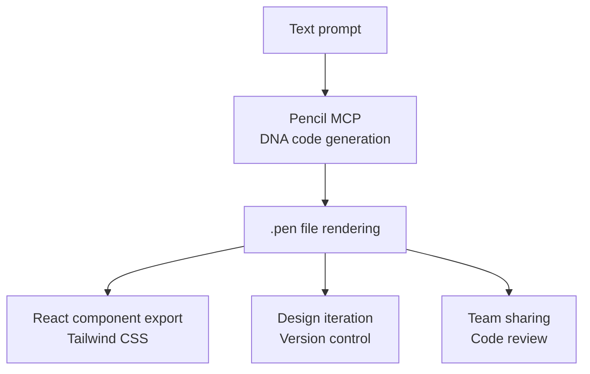
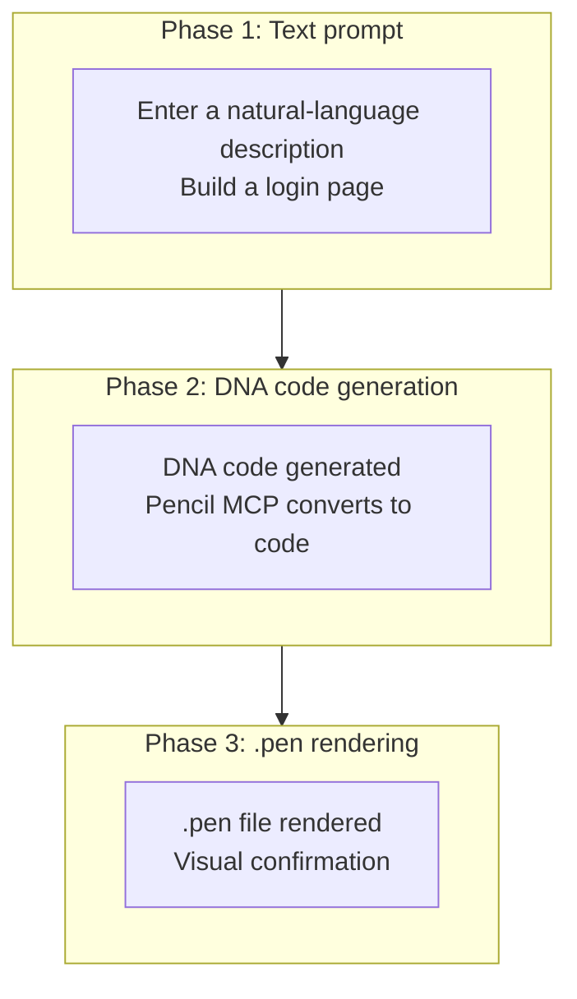
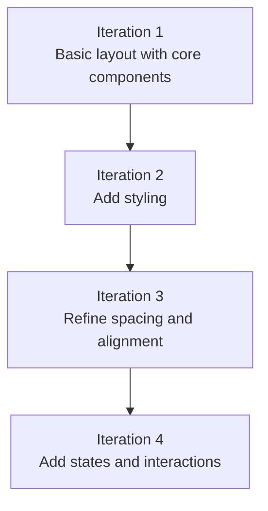
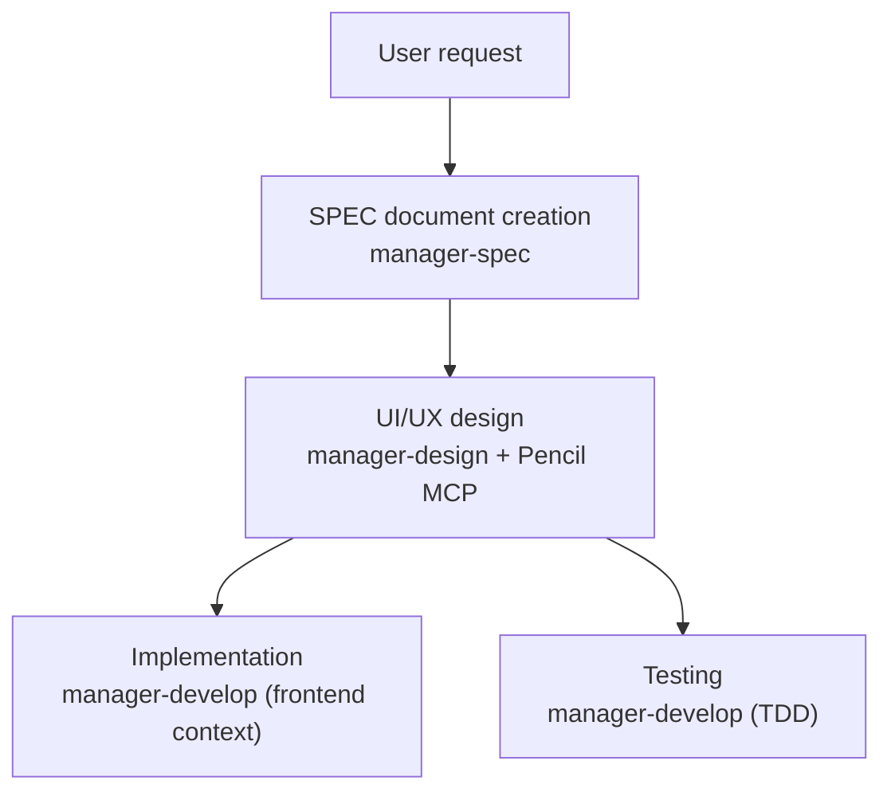

A detailed guide to generating AI-powered UI/UX designs using the Pencil MCP server. Pencil's philosophy of managing design as code is cut from the same cloth as MoAI-ADK's harness philosophy — making things version-controlled, reviewable, and directly manipulable by agents.


**One-line summary**: Pencil is a **code-based design tool**. Through its MCP server you can generate UIs directly from Claude Code, manage them as .pen files, and export them to production code.


## What Is Pencil?

Pencil is an **AI-powered design tool** you can work with directly in your development environment. It closes the gap between design and code, letting developers generate consistent UIs without a separate design tool like Figma.



### Key Features

| Feature | Description |
|------|------|
| **DNA code** | Expresses UI as declarative code (version-controllable) |
| **Text-to-design** | Generates UI screens from natural-language descriptions |
| **.pen files** | An encrypted design file format |
| **React export** | Generates production code with Tailwind CSS applied |
| **Infinite canvas** | Supports large-scale design projects |
| **Team collaboration** | Code-based design review |


Pencil uses an **open-source design format**, and .pen files can be managed directly in your codebase. See https://pencil.dev for details.


## Prerequisites

Using the Pencil MCP requires the following setup.

### Supported AI Assistants

Pencil integrates with a variety of AI tools via MCP (Model Context Protocol).

| AI tool | Support form | Notes |
|---------|----------|------|
| **Claude Code** | CLI and IDE | The most recommended path |
| **Claude Desktop** | Desktop app | Good for personal use |
| **Cursor** | AI-powered IDE | Codebase-aware features |
| **Windsurf IDE** | Codeium | A newer IDE option |
| **Codex CLI** | OpenAI | Terminal-based workflow |
| **Antigravity IDE** | Dedicated IDE | Pencil-dedicated extension |
| **OpenCode CLI** | CLI environment | Scriptable |

### Step 1: Install Pencil

Install the Pencil app or IDE extension.

- **macOS/Windows/Linux**: download the Pencil desktop app
- **VS Code/VSCode-insiders**: install the Pencil extension
- **Cursor**: install the Pencil extension

### Step 2: Run Pencil

When Pencil runs, the MCP server starts automatically. No separate installation or configuration is needed.

```bash
# Pencil 앱이 실행 중인지 확인
# Pencil이 실행 중이면 MCP 서버가 자동으로 시작됩니다
```

### Security and Privacy


**Local-only security**: the Pencil MCP server runs **entirely locally**. Design files are never sent to remote servers, and all design data stays on the local machine.


| Security property | Description |
|----------|------|
| **Local-only** | The MCP server runs only on your machine |
| **No remote access** | Design files stay local |
| **Private storage** | Source code is not made public |
| **Tool inspection** | Available tools can be reviewed in IDE settings |

## MCP Configuration

### Claude Code Configuration

With Pencil running, Claude Code detects the MCP server automatically.

```json
{
  "permissions": {
    "allow": [
      "mcp__pencil__*"
    ]
  }
}
```

### Connection Check

Once configured, you can use the Pencil tools from Claude Code.

```bash
# Claude Code에서 실행
> Pencil로 로그인 버튼을 생성해줘
```

## MCP Tool List

The Pencil MCP provides a range of tools.

### Main Tools

| Tool | Purpose |
|------|------|
| `open_document` | Create a new .pen file or open an existing one |
| `get_editor_state` | Check the current editor state, selection, active file |
| `batch_design` | Create/modify multiple design elements at once |
| `batch_get` | Retrieve multiple node infos at once |
| `get_screenshot` | Capture a screenshot of a .pen file |
| `snapshot_layout` | Analyze the layout structure |
| `get_guidelines` | Retrieve design guidelines |
| `get_style_guide` | Retrieve the style guide |
| `get_style_guide_tags` | Search style-guide tags |
| `get_variables` | Read design variables/themes |
| `set_variables` | Set design variables/themes |
| `find_empty_space_on_canvas` | Find empty space on the canvas |
| `search_all_unique_properties` | Search all unique properties |
| `replace_all_matching_properties` | Change all matching properties |
| `generate_image` | Generate an image with AI |

### Tool Selection Guide

| Goal | Tool to use |
|------|-------------|
| Start a new design | `open_document` |
| Create components | `batch_design` |
| Preview the design | `get_screenshot` |
| Export the design | Export from the Pencil Editor |
| Reference styles | `get_style_guide` |
| Analyze the layout | `snapshot_layout` |
| Manage variables | `get_variables`, `set_variables` |
| Find space | `find_empty_space_on_canvas` |
| Search properties | `search_all_unique_properties` |
| Bulk changes | `replace_all_matching_properties` |

## The DNA Code Format

Pencil expresses UI in a declarative format called DNA code.

### Basic Structure

```dna
// 버튼 컴포넌트 DNA 코드
component Button {
  variant: primary
  size: medium
  content: "클릭하세요"
  onClick: handleSubmit
}
```

### Layout Structure

```dna
// 로그인 폼 레이아웃
layout LoginForm {
  direction: column
  spacing: 16
  children: [
    Input {
      placeholder: "이메일"
      type: email
    }
    Input {
      placeholder: "비밀번호"
      type: password
    }
    Button {
      variant: primary
      content: "로그인"
    }
  ]
}
```

### Design Tokens

```dna
// 토큰 참조
color: primary.500
spacing: md
radius: lg

// 토큰 정의
tokens {
  primary.500 = #3B82F6
  md = 16px
  lg = 8px
}
```

## The Design Generation Workflow

The 3-phase pattern for generating designs with Pencil.



### Practical Example: An E-Commerce Card

```bash
# Phase 1: 텍스트 프롬프트로 디자인 요청
> 제품 카드를 만들어줘. 상단에 제품 이미지, 중간에 제목과 가격,
# 하단에 장바구니 버튼. 깔끔한 미니멀 스타일로

# Phase 2: Pencil이 DNA 코드 생성
# → component ProductCard { ... }

# Phase 3: .pen 파일로 렌더링
# → open_document 후 batch_design으로 생성
```


**Key point**: Pencil **manages design as code**. .pen files can be version-controlled with Git and integrated into your code review process.


## Exporting React Components

The Pencil Editor can export .pen files as React components.

### Export Configuration

```typescript
// pencil.config.js
module.exports = {
  framework: 'react',
  styling: 'tailwind',
  output: './src/components/generated',
  options: {
    typescript: true,
    responsive: true,
    accessibility: true
  }
};
```

### Generated Component Example

```typescript
export interface ButtonProps {
  variant?: 'primary' | 'secondary' | 'tertiary';
  size?: 'small' | 'medium' | 'large';
  isLoading?: boolean;
}

export const Button = ({ variant = 'primary', size = 'medium', isLoading, children, ...props }: ButtonProps) => {
  const baseStyles = 'inline-flex items-center justify-center font-medium rounded-md transition-colors';

  const variantStyles = {
    primary: 'bg-blue-600 text-white hover:bg-blue-700',
    secondary: 'bg-gray-200 text-gray-900 hover:bg-gray-300',
    tertiary: 'bg-transparent text-gray-700 hover:bg-gray-100'
  };

  const sizeStyles = {
    small: 'px-3 py-1.5 text-sm',
    medium: 'px-4 py-2 text-base',
    large: 'px-6 py-3 text-lg'
  };

  return (
    <button className={`${baseStyles} ${variantStyles[variant]} ${sizeStyles[size]}`} {...props}>
      {isLoading ? '로딩 중...' : children}
    </button>
  );
};
```

## Prompt Writing Guide

Structured prompts are essential for good results with Pencil.

### Good Prompts vs Bad Prompts

| Bad prompt | Good prompt |
|--------------|--------------|
| "Make a nice button" | "A medium primary button with a blue background. 'Confirm' text, 16px padding" |
| "A dashboard" | "An analytics dashboard with sidebar navigation. 3 metric cards on top (revenue, users, conversion), a line chart, a table" |
| "Responsive" | "Mobile: vertical stack; desktop: 3-column grid" |

### An Effective Prompt Template

```
[컴포넌트 유형]을 생성해줘.
[컴포넌트 목록] 포함.
[레이아웃]으로 배치.
[스타일] 적용.
[반응형] 고려.
```

### Practical Prompt Examples

**Design generation:**

```bash
# 대시보드 생성
"사이드바와 메인 콘텐츠 영역이 있는 대시보드를 만들어줘"

# 가격표 생성
"3단계 가격표를 만들어줘. 기본, 프로, 엔터프라이즈"

# 히어로 섹션
"제목과 CTA 버튼이 있는 히어로 섹션을 추가해줘"
```

**Design modification:**

```bash
# 색상 변경
"모든 기본 버튼을 파란색으로 변경해줘"

# 크기 조정
"사이드바를 더 좁게 만들어줘"

# 간격 추가
"이 요소들 사이에 간격을 추가해줘"
```

**Design systems:**

```bash
# 버튼 컴포넌트
"변형이 있는 버튼 컴포넌트를 만들어줘"

# 색상 팔레트
"#3b82f6을 기반으로 색상 팔레트를 생성해줘"

# 타이포그래피
"타이포그래피 스케일을 만들어줘"
```

**Code integration:**

```bash
# React 코드
"이 컴포넌트에 대한 React 코드를 생성해줘"

# 가져오기
"내 코드베이스에서 Header를 가져와줘"

# Tailwind 설정
"이 변수들로부터 Tailwind 설정을 만들어줘"
```


**Golden Rule**: the **more specific** the prompt, the better. State colors, spacing, alignment, and interactions clearly.


## Using with Cursor

Cursor is an AI-powered IDE with strong Pencil integration.

### Setup

1. Install the Pencil extension in Cursor
2. Complete activation
3. Authenticate Claude Code
4. Verify the MCP connection: Settings → Tools & MCP

### Cursor-Specific Features

**Inline editing:**

- Select an element in Pencil
- Modify it via Cursor's AI chat
- Changes apply immediately to the `.pen` file

**Codebase awareness:**

- Cursor sees both the code and the design
- Request synchronization between components
- Automatic consistency maintenance

### Common Issues

**"Need Cursor Pro":**

- Some features may require a Cursor Pro subscription
- Check Cursor's pricing page for current limitations

**Missing prompt panel:**

- Verify activation/login state
- Restart Cursor
- Check the MCP connection in settings

## Using with Codex CLI

### Setup

1. **Run Pencil first** - start the desktop app or IDE extension
2. Open Codex in the terminal
3. Check the MCP connection: `/mcp`
4. **Pencil should appear in the MCP server list**

### Working with Codex

**Design prompts from the terminal:**

```bash
# Codex CLI에서
> design.pen에 버튼 컴포넌트를 만들어줘
> 랜딩 페이지에 히어로 섹션을 추가해줘
> 파란색을 기반으로 색상 구성표를 생성해줘
```

**Advantages:**

- Command-line workflow
- Scriptable design generation
- Integration with build tools

### Known Issues

**Codex config.toml modification:**

- Pencil may modify or duplicate the configuration
- The issue is confirmed and under investigation
- Back up your configuration before first use

## Advanced Workflows

### Automated Design Generation

**Style guides:**

```bash
# 특정 디자인 시스템 따르기
"Material Design 원칙을 사용하여 대시보드를 만들어줘"

"현대적인 미니멀 미학으로 랜딩 페이지를 디자인해줘"

"design-system.pen의 디자인 시스템을 따르는 컴포넌트를 만들어줘"
```

**Batch operations:**

```bash
# 버튼 변형
"이 버튼 컴포넌트의 5가지 변형을 만들어줘"

# 완전한 양식
"모든 입력 유형이 있는 완전한 양식을 생성해줘"

# 전체 랜딩 페이지
"히어로, 기능, 가격, 푸터가 있는 전체 랜딩 페이지를 디자인해줘"
```

### Design System Management

**Enforcing consistency:**

```bash
# 색상 변수
"모든 버튼이 기본 색상 변수를 사용하도록 해줘"

# 타이포그래피
"모든 제목이 타이포그래피 스케일을 사용하도록 업데이트해줘"

# 간격
"모든 요소에 8px 간격 그리드를 적용해줘"
```

**Component libraries:**

```bash
# 버튼 컴포넌트
"모든 변형이 있는 완전한 버튼 컴포넌트를 만들어줘"

# 양식 입력
"양식 입력 컴포넌트 (텍스트, 선택, 체크박스, 라디오)를 생성해줘"

# 카드 컴포넌트
"이미지, 제목, 설명, 작업이 있는 카드 컴포넌트를 만들어줘"
```

### Code-Design Workflows

**Importing an existing app:**

```bash
# 컴포넌트 재현
"src/components의 모든 컴포넌트를 Pencil에서 재현해줘"

# 디자인 시스템 가져오기
"Tailwind 설정에서 디자인 시스템을 가져와줘"

# 코드베이스 분석
"코드베이스를 분석하고 일치하는 디자인을 만들어줘"
```

**Synchronizing changes:**

```bash
# React 컴포넌트
"모든 React 컴포넌트를 Pencil 디자인과 일치하도록 업데이트해줘"

# 색상 구성표
"새 색상 구성표를 디자인과 코드에 모두 적용해줘"

# 변수 동기화
"CSS와 Pencil 간에 타이포그래피 변수를 동기화해줘"
```

## Best Practices

| Principle | Description |
|------|------|
| **Code first** | Manage design as code for easy version control and collaboration |
| **Incremental refinement** | Generate the basic layout first, then add details incrementally |
| **Include accessibility** | Always specify ARIA labels and keyboard navigation |
| **State responsiveness** | Always include mobile and desktop behavior |
| **Design system** | Use consistent tokens and components |

### The Incremental Refinement Strategy

Complex screens turn out better when generated over several passes.



### Effective Prompting

**Be specific:**

- ✗ "Make it better"
- ✓ "Increase the button padding to 16px and change the color to blue"

**Provide context:**

- ✗ "Add a form"
- ✓ "Add a login form with email, password, a remember-me checkbox, and a submit button"

**Reference the design system:**

- "Use the existing button component"
- "Follow the spacing scale from the variables"
- "Match the header component's styling"

### Verification

After the AI makes changes, build the habit of checking with your own eyes.

1. Review visually on the canvas
2. Check the structure in the layers panel
3. Test interactions where applicable
4. Request a screenshot to verify complex layouts

## Troubleshooting

### Connection Issues

**"Claude Code not connected":**

1. Verify Claude Code login: `claude`
2. Restart Pencil
3. Open a terminal in the project directory and run `claude`

**MCP server not appearing:**

1. Verify Pencil is running
2. Check the IDE MCP settings
3. Restart both Pencil and the AI assistant

### Permission Issues

**"Cannot access folder":**

- Accept the permission prompt
- Check system folder permissions
- Run the IDE/Pencil with appropriate permissions

**"Permission prompt not showing":**

- Try working in a separate Claude Code session
- Check notification settings
- Check IDE permissions

### AI Output Issues

**"Invalid API key":**

- Re-authenticate Claude Code: `claude`
- Check for conflicting authentication settings
- Clear environment variables

**AI makes unexpected changes:**

- Write more specific prompts
- Ask the AI to explain before applying
- Revert via version control if needed

## Example Session

```bash
# 1. Pencil과 Claude Code 시작
claude
# 2. IDE에서 design.pen 열기
# 3. Cmd + K를 누르고 디자인 시작

사용자: "현대적인 랜딩 페이지 히어로 섹션을 만들어줘"
AI: [제목, 부제, CTA 버튼으로 히어로 생성]

사용자: "3열로 된 기능 섹션을 추가해줘"
AI: [히어로 아래에 기능 섹션 추가]

사용자: "CTA 버튼이 기본 색상 변수를 사용하도록 해줘"
AI: [버튼을 색상 변수 사용으로 업데이트]

사용자: "이 전체 페이지에 대한 React 코드를 생성해줘"
AI: [Tailwind CSS가 있는 React 컴포넌트로 내보내기]

# 4. 검토 및 수정
# 5. Git에 커밋
git add design.pen src/pages/landing.tsx
git commit -m "랜딩 페이지 디자인 및 구현 추가"
```

## Using with MoAI

MoAI can integrate with the Pencil MCP to automate UI design. In v3.0 the `manager-design` agent owns design collaboration (the D1-D5 pipeline) — it is deployed when design-tool work connects to a UI-surfaced SPEC.



## Related Documents

- [MCP Servers Guide](/en/advanced/mcp-servers) - MCP protocol overview
- [settings.json Guide](/en/advanced/settings-json) - MCP server permission configuration
- [Agent Guide](/en/advanced/agent-guide) - the MoAI agent system
- [Skill Guide](/en/advanced/skill-guide) - the moai-design-tools skill


**Tip**: The key to getting the most out of Pencil is **managing design as code**. Managing .pen files with Git makes design version tracking and collaboration much easier.

