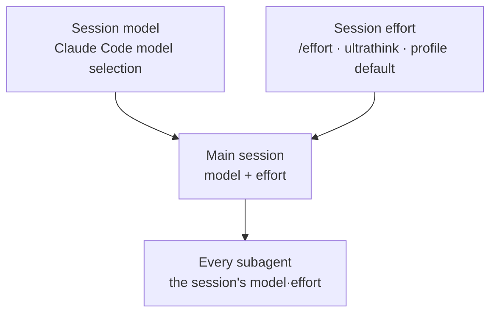

MoAI-ADK used to assign `{model, effort}` to every agent through a **profile
matrix** — a 39-cell table with the 13 retained agents as rows and three
quality columns (`high` / `medium` / `low`) as columns. It was the single
source of model and effort assignment, and the active profile selected one
column whose values applied to every subagent spawn.

That table was **retired in v3.2**. This page explains what took the matrix's
place and how the model and effort are decided today.


**In one line:** the per-agent assignment table is gone, and **session
inheritance** took its place. The main session's model and effort are the
model and effort of every subagent. Agent definitions declare neither, and
spawns pass neither.


## The problem the matrix solved — and the better answer

The matrix existed for a real problem. As agents multiply, "which model for
which agent" becomes unmanageable, and writing assignments into agent files
one by one drifts out of date by day two. So the table gathered the
assignments into one sheet — 13 agent rows, three profile columns — and
reduced the whole thing to choosing a profile.

Operating it exposed a different problem. Measurement showed that fewer than
1% of orchestrator spawns ever carried a model argument. The matrix computed
its values and applied them to nothing; nothing reported that nothing was
applied. Gathering assignments into one sheet does not help when the point of
application is empty.

So instead of making assignment more precise, MoAI removed the act of
assignment. Once subagents simply follow the main session's model and effort,
there is no application point left to be empty — whatever the session runs
on *is* the assignment.

## The rule today — session inheritance

> Subagents inherit the main session's model and effort: pass neither `model`
> nor `effort` when spawning a subagent, and MoAI agent definitions declare
> neither.

- **Agent definition files** (`.claude/agents/moai/*.md`) carry neither model
  nor effort in their frontmatter. The formerly shipped `model: inherit`
  field and effort defaults are retired.
- **Spawns** pass no model or effort argument — that is the normal case. A
  spawn that names a model differing from the session is drift, and the fix
  is to change the session, not the spawn.
- **The session's model** is chosen by Claude Code's model selection; **the
  session's effort** is set by the `/effort` slash command, the `ultrathink`
  keyword, or the profile wizard's default.

## Where the session effort comes from

Three routes decide the session's reasoning depth, and the first one wins.

1. **Adjustment inside the session** — the `/effort low|medium|high|xhigh|max`
   slash command or the `ultrathink` keyword. Change the session effort and
   every subsequent subagent spawn follows.
2. **The profile wizard's session model policy** — the "Session model policy"
   question in `moai profile setup` sets the **default effort fallback** for
   the Claude session launched with this profile. The three values `high` /
   `medium` / `low` map straight onto the effort vocabulary, and apply only
   when no effort level is chosen. With no value set, the launch behavior
   stays exactly Claude Code's default.
3. **The model's own default** — if neither intervenes, the model's default
   effort applies. Opus 5.5 defaults to `medium`; most other effort-capable
   models default to `high`.

## Spawn-time observation

Even with inheritance as the default, a spawn may occasionally still name a
model. An observability layer watches for that: a PreToolUse hook reads the
declared model on every spawn, appends one line to
`.moai/logs/agent-model-audit.jsonl`, and advises when the declaration differs
from the session value. Blocking is opt-in
(`workflow.agent_model_guard.enabled`, default `false`) — normally an
observability layer you can ignore.

## Where the matrix's judgment standards survive

The 39-cell table, the resolver, and the `moai model profile` accessor are
gone, but the **model-choice standards** the matrix established from
measurement did not disappear — they are exactly the standards for choosing a
session model today.

- **Spend on the judging seats**: concentrating deep reasoning on heavy
  judgment work — audits, advisory, coordination — wins on quality per cost.
- **Opus for agentic work**: on long-horizon multi-turn tasks, Opus at `low`
  effort outscores a Sonnet at any level while costing less per task.
- **No-Haiku**: slotting Haiku into long-horizon agentic work raises the
  per-task cost through completion failure and wasted steps.

The DeepSWE benchmark data and the 3-tier design intent behind these standards
are collected on the
[3-Tier Agent Architecture](/en/advanced/no-haiku-3tier/) page, with the raw
cost/score curve in its leaderboard section.

## Harness specialists

The specialists created by `/moai:harness` follow the same rule. Harness agent
definitions declare neither model nor effort, and run on the session's model
and reasoning depth. The former per-purpose-class effort table (borrowing
effort from representative retained-agent rows) belongs to the old matrix and
survives only as a record of the judgment standards.

## Next steps

- [Model Policy](/en/multi-llm/model-policy/) — the session model policy, the effort fallback, and the GLM reasoning cap
- [3-Tier Agent Architecture](/en/advanced/no-haiku-3tier/) — the DeepSWE leaderboard evidence and model-choice standards
- [Tokenomics Overview](/en/advanced/tokenomics-overview/) — the routing layer of the 4-layer tokenomics structure
