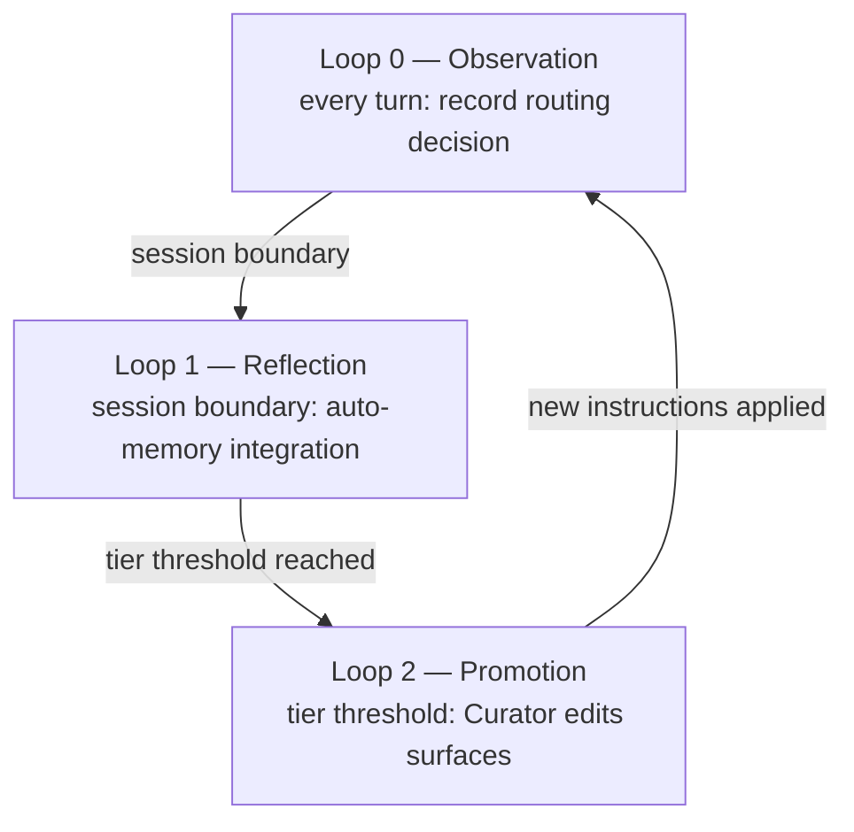

The core of harness competitiveness is its self-improvement design. As Lilian Weng's "Harness Engineering for Self-Improvement" (2026-07-04) names it, a harness is the execution/operations layer surrounding the model, and the realistic path to self-improvement is not weights but improvements to this layer. This page officially documents MoAI-ADK's self-evolving harness — the ACE 3-Loop architecture.

## Why Self-Evolution

According to Weng's framework, a harness is an execution/operations layer that determines 6 axes (planning, tools, context, file/memory, evaluation, permissions). The realistic path to self-improvement is not model weights but improvements to this layer, and the optimization target extends from prompts → structured context → workflows → harness code.

MoAI-ADK concretizes this framework into the ACE role model (Generator → Reflector → Curator) and the 3-Loop structure.

## ACE Role Model

Weng's ACE (Agentic Cognitive Engine) framework defines three roles:

- **Generator** — generates and executes trajectories (the agent's actual work performance)
- **Reflector** — distills trajectories to extract patterns (deriving learning signals from observations)
- **Curator** — updates instructions at bullet granularity (no full rewrites; CRUD within managed blocks only)

These three roles are concretized into the 3-Loop.

## 3-Loop Structure

### Loop 0 — Observation (every turn)

 Every routing decision is recorded as a privacy-preserving digest in routing-ledger.jsonl. Implemented in SPEC-HARNESS-EVOLVE-001 (CLOSED). Recorded fields include routing decisions, gate evidence, `/moai loop` / `/goal` convergence trajectories, and subagent delegation results.

### Loop 1 — Reflection (session boundary)

 Patterns are extracted from observed data and integrated into auto-memory. Tier 1-2 level observations go to temporary memory; Tier 3 level is recorded append-only in CLAUDE.local.md.

### Loop 2 — Promotion (tier threshold)

 When observation frequency reaches tier thresholds (1 / 3 / 5 / 10), the Curator updates editable surfaces. SPEC-HARNESS-EVOLVE-002 (CLOSED) implemented the Curator editing surfaces; SPEC-HARNESS-EVOLVE-003 (CLOSED) implemented production wiring (L2 Canary, L3 Contradiction, negative evidence).

## Tier ↔ Surface Mapping

The 4-tier learning ladder determines the promotion target surface by observation frequency:

| Tier | Threshold | Surface | Writer |
|------|-----------|---------|--------|
| Tier 1-2 | ≥1 observation | auto-memory (temporary) | automatic |
| Tier 3 | ≥3 observations | CLAUDE.local.md (append-only) | automatic |
| Tier 4 | ≥5 observations | CLAUDE.md managed block (≤3K chars, ≤20 bullets) | Curator |
| Tier 5 | ≥10 observations + user approval | CLAUDE.md / rules / agents | user approval required |

## 3-Zone Editable Surface Contract

To prevent reward hacking, editable surfaces are strictly separated into 3 Zones.

| Zone | Surfaces | Safeguards |
|------|----------|------------|
| **Frozen** | `.claude/rules/` · `.claude/agents/moai/` · moai-* skills · evaluators · templates · permission surfaces (settings.json · hook registration · frozen-guard itself) | L1 Frozen Guard blocks paths. Learning cannot modify its own report card or its own fence |
| **Evolvable** | harness-* skills · `.claude/agents/harness/` · harness.yaml auto_detection block | existing 5-layer pipeline + schema range validation |
| **Learned** | CLAUDE.md managed block · CLAUDE.local.md Learned section · routing-ledger.jsonl · lineage · negative evidence | budget cap + expiry pruning. Details in ledger; only summary always-loaded |

 **Permission axis Frozen** (A1 enhancement): not only evaluators but also settings.json, permission mode, hook registration, and frozen-guard itself are included in the Frozen Zone. The learning loop cannot propose changes to its own permissions or safety mechanisms.

## Production Wiring (EVOLVE-003)

SPEC-HARNESS-EVOLVE-003 (CLOSED) production-wired 7 key elements:

1. **A1 Frozen extension** — permission axis explicitly registered in Frozen Zone
2. **A6 tier ↔ surface mapping** — harness.yaml auto_detection block registered as Tier 4 editing surface
3. **A7 negative evidence** — pattern keys of rejected/rolled-back promotions registered to suppress re-proposal
4. **L2 Canary** — held-out validation (regression test before and after changes)
5. **L3 Contradiction** — detect promotions that contradict existing instructions
6. **GLM observe-only** — GLM sessions observe only; promotion-proposal generation is limited to Opus/Fable sessions
7. **anti-fabrication** — prevent fabrication of unobserved evidence

## Roadmap

 **In flight (REQ-DA-063 honesty caveat)**: Loops 0-2 of the self-evolving harness are production-wired (EVOLVE-001/002/003 CLOSED), but the following surfaces are not yet implemented:

- **EVOLVE-004** — console verbs (`/moai harness evolve/promote/demote/freeze`) — verbs for users to directly control promotion/demotion/freezing from the CLI
- **EVOLVE-005** — Recall wiring + typed parser — full wiring of the 2-layer Recall (always-loaded digest + on-demand search ledger) + typed Go parser for harness-spec.yaml

These surfaces are recorded as roadmap items alongside the v5.1 MCE (learning of Recall itself) and v6 evolutionary exploration horizons. They are stated as "in flight / roadmap", NOT "implemented."

## Next Steps

- [3-Tier Agent Architecture](/en/advanced/no-haiku-3tier/) — the model architecture substrate on which self-evolution operates
- [Autonomous Continuation Loops](/en/advanced/autonomous-loops/) — `/moai loop` / `/goal` convergence trajectories integrated into Loop 0 observation
- [Tokenomics Overview](/en/advanced/tokenomics-overview/) — where self-evolution connects to tokenomics
