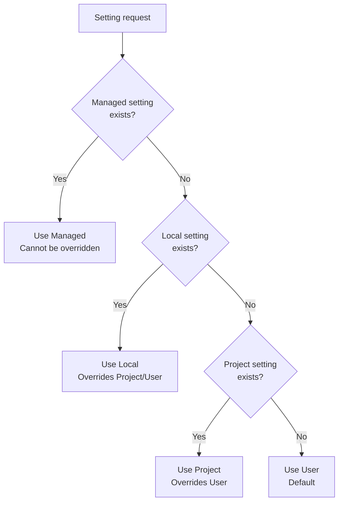
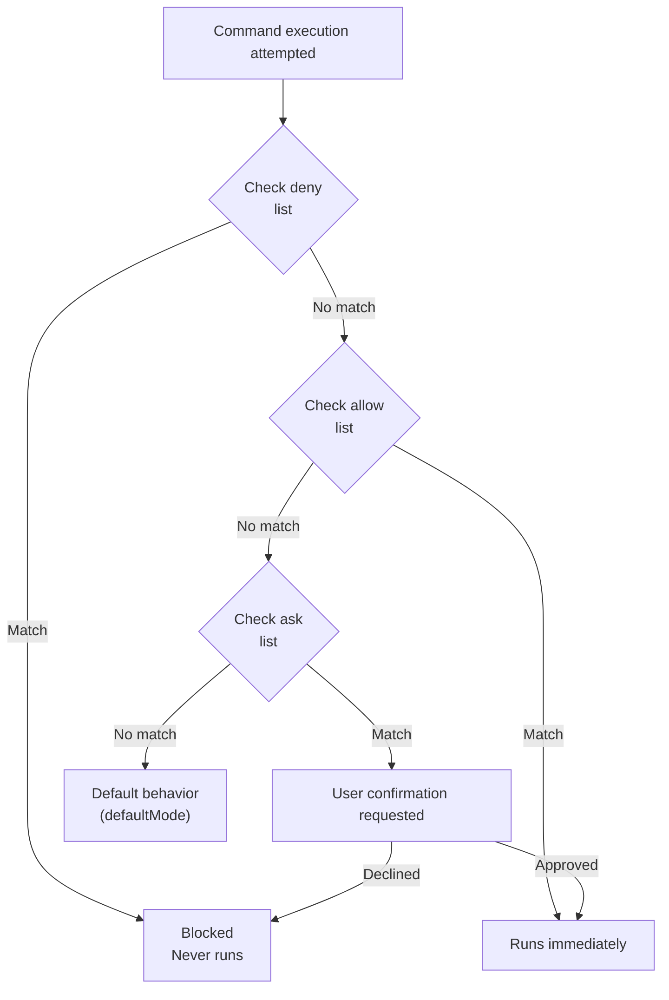

A detailed guide to Claude Code's settings file system. In a harness that delegates execution authority to agents, settings.json is the file that draws the boundary of that delegation — what is auto-allowed, what requires confirmation, and what is absolutely blocked are all decided here.


**One-line summary**: `settings.json` is Claude Code's **control tower**. Permissions, environment variables, hooks, and security policies are managed in one place.


## Configuration Scopes

Claude Code uses a **scope system** to determine where settings apply and with whom they are shared.

### The 4 Scope Types

| Scope | Location | Affects | Team-shared | Precedence |
|------|------|-----------|---------|----------|
| **Managed** | System-level `managed-settings.json` | All users of the machine | ✓ (IT-deployed) | Highest |
| **User** | `~/.claude/` | The individual user (all projects) | ✗ | Low |
| **Project** | `.claude/` | All collaborators on the repository | ✓ (Git-tracked) | Medium |
| **Local** | `.claude/*.local.*` | The user (in this repository only) | ✗ | High |

### Precedence by Scope

When the same setting exists in multiple scopes, the more specific scope wins.



**Precedence:** Managed > command-line arguments > Local > Project > User

### Where to Use Each Scope

**Managed scope** - use for:
- Organization-wide security policies
- Compliance requirements that cannot be overridden
- Standardized configuration deployed by IT/DevOps

**User scope** - use for:
- Personal settings you want in every project (theme, editor settings)
- Tools and plugins used across all projects
- API keys and authentication (stored securely)

**Project scope** - use for:
- Team-shared settings (permissions, hooks)
- Plugins the team should have
- Tool standardization across collaborators

**Local scope** - use for:
- Personal overrides in a specific project
- Testing settings before sharing with the team
- Machine-specific settings that would not work for other users

## File Locations

MoAI-ADK uses 4 settings file locations.

| File | Location | Purpose | Git-tracked |
|------|------|------|----------|
| `managed-settings.json` | System level* | Managed settings (IT-deployed) | No |
| `settings.json` (User) | `~/.claude/settings.json` | Personal global settings | No |
| `settings.json` (Project) | `.claude/settings.json` | Team-shared settings | Yes |
| `settings.local.json` | `.claude/settings.local.json` | Personal project settings | No |

**System-level locations:**
- macOS: `/Library/Application Support/ClaudeCode/`
- Linux/WSL: `/etc/claude-code/`
- Windows: `C:\Program Files\ClaudeCode\`


**Warning**: `.claude/settings.json` is overwritten on MoAI-ADK updates. Always write personal settings in `settings.local.json` or `~/.claude/settings.json`.


## What Is settings.json?

`settings.json` is Claude Code's **global settings file**. It defines which commands are auto-allowed, which are blocked, which hooks run, and which environment variables are set.

## Full Structure

```json
{
  "model": "",
  "language": "",
  "attribution": {},
  "companyAnnouncements": [],
  "autoUpdatesChannel": "",
  "spinnerTipsEnabled": true,
  "terminalProgressBarEnabled": true,
  "sandbox": {},
  "hooks": {},
  "permissions": {},
  "enabledPlugins": {},
  "extraKnownMarketplaces": {},
  "fileSuggestion": {},
  "alwaysThinkingEnabled": false,
  "maxThinkingTokens": 0,
  "statusLine": {},
  "outputStyle": "",
  "cleanupPeriodDays": 30,
  "env": {}
}
```

## Core Settings Reference

### model

Overrides the default model to use.

```json
{
  "model": "claude-sonnet-4-5-20250929"
}
```

### language

Sets Claude's default response language.

```json
{
  "language": "korean"
}
```

Supported languages: `"korean"`, `"japanese"`, `"spanish"`, `"french"`, etc.

### cleanupPeriodDays

Deletes inactive sessions older than this period at startup. Set to `0` to delete all sessions immediately. (Default: 30 days)

```json
{
  "cleanupPeriodDays": 20
}
```

### autoUpdatesChannel

The release channel updates follow.

```json
{
  "autoUpdatesChannel": "stable"
}
```

- `"stable"`: about a week old, skips major regressions
- `"latest"` (default): the most recent release

### spinnerTipsEnabled

Whether to show tips in the spinner while Claude works. Set to `false` to disable tips. (Default: `true`)

```json
{
  "spinnerTipsEnabled": false
}
```

### terminalProgressBarEnabled

Enables the terminal progress bar showing progress in supported terminals such as Windows Terminal and iTerm2. (Default: `true`)

```json
{
  "terminalProgressBarEnabled": false
}
```

### showTurnDuration

Shows a turn-duration message after responses (e.g. "Cooked for 1m 6s"). Set to `false` to hide this message.

```json
{
  "showTurnDuration": true
}
```

### respectGitignore

Controls whether the `@` file picker respects `.gitignore` patterns. When `true` (default), files matching `.gitignore` patterns are excluded from suggestions.

```json
{
  "respectGitignore": false
}
```

### plansDirectory

Customizes where plan files are stored. The path is relative to the project root. Default: `~/.claude/plans`

```json
{
  "plansDirectory": "./plans"
}
```

## Permission Settings

Manages the permissions of the commands Claude Code can run. Permission design has two goals — letting safe commands flow without confirmation so the agentic loop is never broken, and ensuring dangerous commands never get through under any circumstances.

### Permission Structure

```json
{
  "permissions": {
    "defaultMode": "default",
    "allow": [],
    "ask": [],
    "deny": [],
    "additionalDirectories": [],
    "disableBypassPermissionsMode": "disable"
  }
}
```

### defaultMode

The default permission mode when opening Claude Code.

| Value | Description |
|-----|------|
| `"acceptEdits"` | Auto-allows file edits |
| `"allowEdits"` | Allows file edits |
| `"rejectEdits"` | Rejects file edits |
| `"default"` | Default behavior |


**Note**: the current MoAI-ADK settings file uses `"defaultMode": "default"`. This may be a legacy value.


### allow (auto-allow)

The list of commands **allowed to run immediately** without user confirmation.

**Default allowed command categories:**

| Category | Command examples | Count |
|----------|-------------|------|
| File tools | `Read`, `Write`, `Edit`, `Glob`, `Grep` | 7 |
| Git commands | `git add`, `git commit`, `git diff`, `git log`, etc. | 15+ |
| Package management | `npm`, `pip`, `uv`, `npx` | 4 |
| Build/test | `pytest`, `make`, `node`, `python` | 10+ |
| Code quality | `ruff`, `black`, `prettier`, `eslint` | 6+ |
| Exploration tools | `ls`, `find`, `tree`, `cat`, `head` | 10+ |
| GitHub CLI | `gh issue`, `gh pr`, `gh repo view` | 2 |
| Other | `AskUserQuestion`, `Task`, `Skill`, `TodoWrite` | 4 |

**allow format examples:**

```json
{
  "allow": [
    "Read",                          // tool name only
    "Bash(git add:*)",               // Bash + command pattern
    "Bash(pytest:*)",                // wildcard
    "Bash(npm run *)",               // space-separated (new format)
    "WebFetch(domain:example.com)"   // domain pattern
  ]
}
```

### ask (run after confirmation)

The list of commands that run **after asking the user for confirmation**.

```json
{
  "ask": [
    "Bash(chmod:*)",       // change file permissions
    "Bash(chown:*)",       // change ownership
    "Bash(rm:*)",          // delete files
    "Bash(sudo:*)",        // administrator privileges
    "Read(./.env)",        // read environment variable file
    "Read(./.env.*)"       // read environment variable file
  ]
}
```

**How ask works:**
1. Claude Code attempts to run the command
2. The user is asked "Run this command?"
3. It runs if the user approves, and stops if the user declines

### deny (unconditional block)

The list of commands that will **never run** under any circumstances.

**Block categories:**

| Category | Block pattern | Reason |
|----------|-----------|------|
| Sensitive file access | `Read(./secrets/**)`, `Write(~/.ssh/**)` | Protecting security credentials |
| Cloud credentials | `Read(~/.aws/**)`, `Read(~/.config/gcloud/**)` | Protecting cloud accounts |
| System destruction | `Bash(rm -rf /:*)`, `Bash(rm -rf ~:*)` | System protection |
| Dangerous Git | `Bash(git push --force:*)`, `Bash(git reset --hard:*)` | Code protection |
| Disk formatting | `Bash(dd:*)`, `Bash(mkfs:*)`, `Bash(fdisk:*)` | Disk protection |
| System commands | `Bash(reboot:*)`, `Bash(shutdown:*)` | System stability |
| DB deletion | `Bash(DROP DATABASE:*)`, `Bash(TRUNCATE:*)` | Data protection |

**deny format examples:**

```json
{
  "deny": [
    "Read(./secrets/**)",           // block reading the secrets directory
    "Write(~/.ssh/**)",             // block modifying SSH keys
    "Bash(git push --force:*)",     // block force push
    "Bash(rm -rf /:*)",            // block root deletion
    "Bash(DROP DATABASE:*)"        // block DB deletion
  ]
}
```

### additionalDirectories

Additional working directories Claude can access.

```json
{
  "permissions": {
    "additionalDirectories": [
      "../docs/"
    ]
  }
}
```

### disableBypassPermissionsMode

Prevents `bypassPermissions` mode from being activated. Disables the `--dangerously-skip-permissions` command-line flag.

```json
{
  "permissions": {
    "disableBypassPermissionsMode": "disable"
  }
}
```

### disableBundledSkills

`disableBundledSkills` (a boolean, or its environment-variable form) hides Claude Code's bundled skills and workflows — e.g. `/deep-research`, built-in slash-command skills — from discovery, exposing only enterprise + personal + project + plugin skills. Set to `true` to provide a curated, bundle-free skill surface.

```json
{
  "disableBundledSkills": true
}
```

The `--safe-mode` CLI flag applies the same runtime effect at launch time rather than in settings — useful in locked-down environments or when debugging which behavior originates from bundled skills. MoAI-ADK does not generate `disableBundledSkills` or pass `--safe-mode` automatically. Both are documented here as available options.

## Permission Rule Syntax

Permission rules follow the `Tool` or `Tool(specifier)` format. The parameter-scoped wildcard form `Tool(param:value)` is also supported — e.g. `WebFetch(domain:example.com)` allows WebFetch only for that domain, `Bash(cmd:git status)` matches the `git status` command, and `*` wildcards inside the value widen the match (`WebFetch(domain:*.example.com)`, `Bash(cmd:git *)`). This parameter-scoped form offers finer control than the plain `Tool(specifier)` form. MoAI-ADK does not currently generate parameter-scoped rules in its own settings generators. The syntax is documented as an available option for projects needing parameter-level permission control.

### Rule Evaluation Order

When multiple rules match the same tool use, they are evaluated in this order.

1. **Deny** rules are checked first
2. **Ask** rules are checked second
3. **Allow** rules are checked last

The first matching rule determines the behavior. In other words, deny rules always take precedence over allow rules.

### Matching All Uses of a Tool

To match every use of a tool, use just the tool name without parentheses.

| Rule | Effect |
|------|------|
| `Bash` | Matches **every** Bash command |
| `WebFetch` | Matches **every** web fetch request |
| `Read` | Matches **every** file read |

`Bash(*)` is identical to `Bash` and matches every Bash command. The two syntaxes are interchangeable.

### Using Specifiers for Fine-Grained Control

Add a specifier in parentheses to match specific tool uses.

| Rule | Effect |
|------|------|
| `Bash(npm run build)` | Matches the exact command `npm run build` |
| `Read(./.env)` | Matches reading the `.env` file in the current directory |
| `WebFetch(domain:example.com)` | Matches fetch requests to example.com |

### Wildcard Patterns

Bash rules support glob patterns with `*`. Wildcards can appear at any position — start, middle, or end of the command.

```json
{
  "permissions": {
    "allow": [
      "Bash(npm run *)",
      "Bash(git commit *)",
      "Bash(git * main)",
      "Bash(* --version)",
      "Bash(* --help *)"
    ],
    "deny": [
      "Bash(git push *)"
    ]
  }
}
```

**Important:** the space before `*` matters.
- `Bash(ls *)` matches `ls -la` but not `lsof`
- `Bash(ls*)` matches both

**Legacy syntax:** the `:*` suffix syntax (e.g. `Bash(npm run:*)`) is identical to `*` but deprecated.

### Domain-Specific Patterns

Domain-specific patterns can be used with tools like WebFetch.

```json
{
  "permissions": {
    "allow": [
      "WebFetch(domain:docs.anthropic.com)",
      "WebFetch(domain:github.com)"
    ],
    "deny": [
      "WebFetch(domain:malicious-site.com)"
    ]
  }
}
```

### Permission Precedence Diagram



**Precedence:** `deny` > `ask` > `allow` > `defaultMode`

## Sandbox Settings

Configures advanced sandboxing behavior. Sandboxing isolates bash commands from the filesystem and network — if permission rules are the logical line of defense, the OS sandbox is the physical one.


**Important:** filesystem and network restrictions are configured via the Read, Edit, and WebFetch permission rules, not via sandbox settings.


```json
{
  "sandbox": {
    "enabled": true,
    "autoAllowBashIfSandboxed": true,
    "excludedCommands": ["docker"],
    "allowUnsandboxedCommands": false,
    "network": {
      "allowUnixSockets": [
        "/var/run/docker.sock"
      ],
      "allowLocalBinding": true,
      "httpProxyPort": 8080,
      "socksProxyPort": 8081
    },
    "enableWeakerNestedSandbox": false
  }
}
```

### Sandbox Settings Reference

| Key | Description | Example |
|-----|------|------|
| `enabled` | Enables bash sandboxing (macOS, Linux, WSL2). Default: false | `true` |
| `autoAllowBashIfSandboxed` | Auto-approves sandboxed bash commands. Default: true | `true` |
| `excludedCommands` | Commands that must run outside the sandbox | `["docker", "git"]` |
| `allowUnsandboxedCommands` | Allows commands to run outside the sandbox via the `dangerouslyDisableSandbox` parameter. Default: true | `false` |
| `network.allowUnixSockets` | Unix socket paths accessible from the sandbox (SSH agent, etc.) | `["~/.ssh/agent-socket"]` |
| `network.allowLocalBinding` | Allows binding to localhost ports (macOS only). Default: false | `true` |
| `network.httpProxyPort` | HTTP proxy port if you bring your own proxy | `8080` |
| `network.socksProxyPort` | SOCKS5 proxy port if you bring your own proxy | `8081` |
| `enableWeakerNestedSandbox` | Enables a weaker sandbox for unprivileged Docker environments (Linux, WSL2 only). **Reduced security**. Default: false | `true` |

## Attribution Settings

Claude Code adds attribution to git commits and pull requests. These are configured separately.

```json
{
  "attribution": {
    "commit": "Custom attribution text\n\nCo-Authored-By: AI <email@example.com>",
    "pr": ""
  }
}
```

### Attribution Settings Reference

| Key | Description |
|-----|------|
| `commit` | Attribution for git commits (including trailers). An empty string hides commit attribution |
| `pr` | Attribution for pull request descriptions. An empty string hides PR attribution |

### Default Commit Attribution

```
🤖 Generated with [Claude Code](https://claude.com/claude-code)

Co-Authored-By: Claude Sonnet 4.5 <noreply@anthropic.com>
```

### Default PR Attribution

```
🤖 Generated with [Claude Code](https://claude.com/claude-code)
```

## Hook Settings

Registers scripts that respond to Claude Code events.

```json
{
  "hooks": {
    "SessionStart": [
      {
        "matcher": "",
        "hooks": [
          {
            "type": "command",
            "command": "script path"
          }
        ]
      }
    ],
    "PreToolUse": [
      {
        "matcher": "Write|Edit",
        "hooks": [
          {
            "type": "command",
            "command": "security guard script path",
            "timeout": 5
          }
        ]
      }
    ],
    "PostToolUse": [
      {
        "matcher": "Write|Edit",
        "hooks": [
          {
            "type": "command",
            "command": "formatter script path",
            "timeout": 10
          },
          {
            "type": "command",
            "command": "linter script path",
            "timeout": 30
          }
        ]
      }
    ]
  }
}
```

### Hook Event Types

| Event | Description |
|--------|------|
| `SessionStart` | Runs at session start |
| `SessionEnd` | Runs at session end |
| `PreToolUse` | Runs before tool use |
| `PostToolUse` | Runs after tool use |
| `PreCompact` | Runs before context compaction |


For hook configuration details, see the [Hooks Guide](/en/advanced/hooks-guide).


## Plugin Settings

Plugin-related settings.

```json
{
  "enabledPlugins": {
    "formatter@acme-tools": true,
    "deployer@acme-tools": true,
    "analyzer@security-plugins": false
  },
  "extraKnownMarketplaces": {
    "acme-tools": {
      "source": {
        "source": "github",
        "repo": "acme-corp/claude-plugins"
      }
    }
  }
}
```

### enabledPlugins

Controls which plugins are enabled. Format: `"plugin-name@marketplace-name": true/false`

**Scopes:**
- **User settings** (`~/.claude/settings.json`): personal plugin preferences
- **Project settings** (`.claude/settings.json`): project-specific plugins shared with the team
- **Local settings** (`.claude/settings.local.json`): machine-specific overrides (not committed)

### extraKnownMarketplaces

Defines additional marketplaces to make available in the repository. Typically used in repository-level settings so team members can access the required plugin sources.

## File Suggestion Settings

Configures a custom command for `@` file-path autocompletion.

```json
{
  "fileSuggestion": {
    "type": "command",
    "command": "~/.claude/file-suggestion.sh"
  }
}
```

The built-in file suggestion uses fast filesystem traversal, but large monorepos may benefit from project-specific indexing (e.g. a prebuilt file index or a custom tool).

## Extended Thinking Settings

Extended Thinking settings. Reasoning tokens are tokens too — leaving them always on is convenient, but coordinating them with a budget is the tokenomics orthodoxy.

```json
{
  "alwaysThinkingEnabled": true,
  "maxThinkingTokens": 10000
}
```

### Extended Thinking Settings Reference

| Key | Description | Example |
|-----|------|------|
| `alwaysThinkingEnabled` | Enables extended thinking by default in all sessions | `true` |
| `maxThinkingTokens` | Overrides the thinking token budget (default: 31999, 0 = disabled) | `10000` |

## Company Announcements

Announcements displayed to users at startup. Providing multiple announcements rotates them randomly.

```json
{
  "companyAnnouncements": [
    "Welcome to Acme Corp! Review our code guidelines at docs.acme.com",
    "Reminder: Code reviews required for all PRs",
    "New security policy in effect"
  ]
}
```

## Status Line Settings

Configures the status line shown at the bottom of Claude Code.

```json
{
  "statusLine": {
    "type": "command",
    "command": "bash \"$CLAUDE_PROJECT_DIR/.moai/status_line.sh\"",
    "padding": 0,
    "refreshInterval": 10
  }
}
```

| Field | Description |
|------|------|
| `type` | `"command"` (runs a command) |
| `command` | The command to run (returns status info). MoAI-ADK uses the `$CLAUDE_PROJECT_DIR/.moai/status_line.sh` wrapper |
| `padding` | Padding size |
| `refreshInterval` | Refresh interval (seconds) |

## Output Style Setting

```json
{
  "outputStyle": "R2-D2"
}
```

The output style determines Claude Code's response format. You can switch to your preferred style in `settings.local.json`.

## Environment Variable Settings

The `env` section sets environment variables that control Claude Code's behavior.

### MoAI-ADK Environment Variables


**MoAI-ADK extension**: this setting is specific to MoAI-ADK and is not part of official Claude Code.


```json
{
  "env": {
    "MOAI_CONFIG_SOURCE": "sections"
  }
}
```

| Variable | Value | Description |
|------|-----|------|
| `MOAI_CONFIG_SOURCE` | `"sections"` | The MoAI configuration source scheme |

### Official Claude Code Environment Variables

```json
{
  "env": {
    "ENABLE_TOOL_SEARCH": "auto:5",
    "CLAUDE_AUTOCOMPACT_PCT_OVERRIDE": "50"
  }
}
```

### Key Environment Variable Reference

| Variable | Value | Description |
|------|-----|------|
| `ENABLE_TOOL_SEARCH` | `"auto"`, `"auto:N"`, `"true"`, `"false"` | Controls tool search |
| `CLAUDE_AUTOCOMPACT_PCT_OVERRIDE` | `1`-`100` | Auto-compact trigger percentage (default: ~95%) |
| `CLAUDE_CODE_ENABLE_TELEMETRY` | `"1"` | Enables OpenTelemetry data collection |
| `CLAUDE_CODE_DISABLE_BACKGROUND_TASKS` | `"1"` | Disables background tasks |
| `DISABLE_AUTOUPDATER` | `"1"` | Disables auto-updates |
| `HTTP_PROXY` | URL | HTTP proxy server |
| `HTTPS_PROXY` | URL | HTTPS proxy server |


**Tip**: the `ENABLE_TOOL_SEARCH` value `"auto:5"` enables tool search at 5% context usage. `"auto"` defaults to 10%, `"true"` is always on, `"false"` always off.


### Tool Search Details

`ENABLE_TOOL_SEARCH` controls tool search. Instead of loading all tool schemas permanently, they are searched and loaded on demand — a large context saving in environments with many servers.

| Value | Description |
|-----|------|
| `"auto"` (default) | Activates at 10% context |
| `"auto:N"` | Custom threshold (e.g. `"auto:5"` for 5%) |
| `"true"` | Always enabled |
| `"false"` | Disabled |

## settings.json vs settings.local.json

| Item | settings.json | settings.local.json |
|------|---------------|---------------------|
| Managed by | MoAI-ADK | The user |
| Git-tracked | Tracked | .gitignore |
| On update | Overwritten | Preserved |
| Purpose | Team-shared settings | Personal settings |
| Precedence | Base | Override (wins) |

### settings.local.json Usage Example

```json
{
  "permissions": {
    "allow": [
      "Bash(bun:*)",     // personally used tool
      "Bash(bun add:*)"
    ]
  },
  ],
  "outputStyle": "Mr.Alfred"  // personally preferred output style
}
```


Settings in `settings.local.json` are **merged** into those in `settings.json`. On identical keys, `settings.local.json` wins.


### settings.local.json Permission Hardening (0o600) {#settings-local-json-permission}

From v2.20.0-rc1, `settings.local.json` is enforced to **`0o600`** (owner-only read/write) permission on creation and update. The previous `0o644` risked exposing sensitive credentials such as `ANTHROPIC_AUTH_TOKEN` to other local users on multi-user workstations (CWE-732 / CWE-552).

**Self-audit**:

```bash
# Linux
stat -c '%a' .claude/settings.local.json
# Expected: 600

# macOS
stat -f '%A' .claude/settings.local.json
# Expected: 600
```

If the permission is not `600`, MoAI-ADK corrects it automatically at the next session start. To correct it immediately, run `chmod 0600 .claude/settings.local.json`.

For the detailed security model, threat analysis, and additional audit procedures, see [Security Notes — CWE-732](/en/advanced/security-notes/#cwe-732).

## MoAI-Specific Settings


**MoAI-ADK extension**: the settings in this section are specific to MoAI-ADK and are not included in the official Claude Code documentation.


### The MoAI Custom statusLine

MoAI-ADK provides a custom status line.

```json
{
  "statusLine": {
    "type": "command",
    "command": "bash \"$CLAUDE_PROJECT_DIR/.moai/status_line.sh\"",
    "padding": 0,
    "refreshInterval": 10
  }
}
```

### MoAI Statusline Features

MoAI-ADK statusline includes the following.

- **Gradient colors**: dynamic color gradients based on context usage
- **5H/7D usage monitoring**: 5-hour and 7-day API usage bars
- **Multi-line layout**: Compact (3-line), default, and full display modes
- **Themes** (defined in `internal/statusline/theme.go`):
  - **catppuccin-mocha** (default): a dark palette
  - **catppuccin-latte**: a light palette for bright environments


**Note**: an unknown theme name falls back to `catppuccin-mocha`. The color values come from `internal/tui/catppuccin.go`.


The statusline theme and segments are configured in `.moai/config/sections/statusline.yaml`.

### MoAI Custom Hooks

MoAI-ADK provides the following custom hooks.

MoAI-ADK's hooks follow a **shell-script wrapper → Go binary** structure. Rather than Python/`uv`, for each event a `.claude/hooks/moai/handle-<event>.sh` wrapper forwards the stdin JSON to the `moai hook <event>` subcommand.

```json
{
  "hooks": {
    "SessionStart": [
      {
        "matcher": "",
        "hooks": [
          {
            "type": "command",
            "command": "bash \"$CLAUDE_PROJECT_DIR/.claude/hooks/moai/handle-session-start.sh\"",
            "timeout": 30
          }
        ]
      }
    ],
    "PreCompact": [
      {
        "matcher": "",
        "hooks": [
          {
            "type": "command",
            "command": "bash \"$CLAUDE_PROJECT_DIR/.claude/hooks/moai/handle-compact.sh\"",
            "timeout": 30
          }
        ]
      }
    ],
    "SessionEnd": [
      {
        "matcher": "",
        "hooks": [
          {
            "type": "command",
            "command": "bash \"$CLAUDE_PROJECT_DIR/.claude/hooks/moai/handle-session-end.sh\"",
            "timeout": 10
          }
        ]
      }
    ],
    "PreToolUse": [
      {
        "matcher": "Write|Edit",
        "hooks": [
          {
            "type": "command",
            "command": "bash \"$CLAUDE_PROJECT_DIR/.claude/hooks/moai/handle-pre-tool.sh\"",
            "timeout": 5
          }
        ]
      }
    ],
    "PostToolUse": [
      {
        "matcher": "Write|Edit",
        "hooks": [
          {
            "type": "command",
            "command": "bash \"$CLAUDE_PROJECT_DIR/.claude/hooks/moai/handle-post-tool.sh\"",
            "timeout": 10
          }
        ]
      }
    ]
  }
}
```

Each wrapper is a thin shell script that reads the stdin JSON and passes it to the Go binary.

```bash
#!/bin/bash
# .claude/hooks/moai/handle-session-start.sh
moai hook session-start
```

Why shell scripts: there is no Python startup overhead (fast execution), no `uv`/`python` dependency is required, and they are cross-platform (bash, /bin/sh). The unit of a hook `timeout` value is **seconds** (not milliseconds).

### MoAI Output Style

```json
{
  "outputStyle": "Mr.Alfred"
}
```

This style provides the distinctive response format of the Alfred AI orchestrator.

## Practical Examples: Customizing Settings

### Allowing a New Tool

If your project uses `bun`, add it to `settings.local.json`.

```json
{
  "permissions": {
    "allow": [
      "Bash(bun:*)",
      "Bash(bun add:*)",
      "Bash(bun remove:*)",
      "Bash(bun run:*)"
    ]
  }
}
```

### Enabling the Sandbox

Enable the sandbox for security, excluding Docker.

```json
{
  "sandbox": {
    "enabled": true,
    "autoAllowBashIfSandboxed": true,
    "excludedCommands": ["docker"],
    "network": {
      "allowUnixSockets": [
        "/var/run/docker.sock"
      ]
    }
  },
  "permissions": {
    "deny": [
      "Read(.envrc)",
      "Read(~/.aws/**)"
    ]
  }
}
```

### Adding a Custom Hook

Register a personal hook.

```json
{
  "hooks": {
    "PostToolUse": [
      {
        "matcher": "Write|Edit",
        "hooks": [
          {
            "type": "command",
            "command": "bash .claude/hooks/my-hooks/custom_check.sh",
            "timeout": 10
          }
        ]
      }
    ]
  }
}
```

### Customizing Attribution

```json
{
  "attribution": {
    "commit": "Generated with AI\n\nCo-Authored-By: AI <email@example.com>",
    "pr": ""
  }
}
```

## Related Configuration Files

### Harness Configuration (harness.yaml)

Defines the quality-pipeline depth levels and auto-detection thresholds. The configuration surface of adaptive quality, scaling verification cost to the size of the change.

**3 depth levels:**

| Level | Description | evaluator | Skipped phases |
|------|------|-----------|---------------|
| minimal | Fast iteration (simple changes) | Disabled | 0, 0.5, 2.0, 2.5, 2.75, 2.8a, 2.9, 2.10 |
| standard | Balanced quality (most development) | Enabled | None |
| thorough | Maximum quality (critical features) | Enabled | None |

```yaml
# .moai/config/sections/harness.yaml
harness:
  default_profile: "default"
  mode_defaults:
    solo: auto
    team: auto
    cg: thorough
  auto_detection:
    enabled: true
    rules:
      minimal:
        conditions:
          - "file_count <= 3 AND single_domain"
          - "spec_type in [bugfix, docs, config]"
      thorough:
        conditions:
          - "security_keywords OR payment_keywords present"
          - "spec_priority == critical"
  effort_mapping:
    minimal:  "low"
    standard: "medium"
    thorough: "high"
  levels:
    thorough:
      evaluator: true
```

### Constitution Configuration (constitution.yaml)

Defines the project's technical constraints in machine-readable form.

```yaml
# .moai/config/sections/constitution.yaml
constitution:
  approved_languages: [go, typescript, python]
  approved_frameworks: [cobra, viper, gin, react, next]
  forbidden_patterns:
    - "global mutable state"
    - "panic() in library code"
  security:
    required_checks: [input-validation, sql-injection-prevention]
    forbidden_practices: ["hardcoded credentials", "HTTP without TLS"]
```

### Evaluator Profiles (evaluator-profiles/)

4 evaluator profiles are provided.

| Profile | Description | Coverage | Security |
|--------|------|----------|----------|
| default | Standard skeptical evaluation | >= 85% | No Critical/High |
| strict | Strengthened security/reliability (auth/payments) | >= 90% | ANY finding = FAIL |
| lenient | Relaxed evaluation (prototypes) | >= 60% | Critical only = FAIL |
| frontend | UI/UX-focused | N/A | WCAG AA required |

Profile file location: `.moai/config/evaluator-profiles/{name}.md`

## Related Documents

- [Official Claude Code settings docs](https://code.claude.com/docs/en/settings) - official Claude Code settings
- [Hooks Guide](/en/advanced/hooks-guide) - hook configuration details
- [CLAUDE.md Guide](/en/advanced/claude-md-guide) - project instruction configuration
- [IAM docs](https://code.claude.com/docs/en/iam) - permission system overview


**Tip**: after changing settings, restart Claude Code for them to apply. `settings.local.json` is not tracked by Git, so feel free to modify it for your personal environment.

