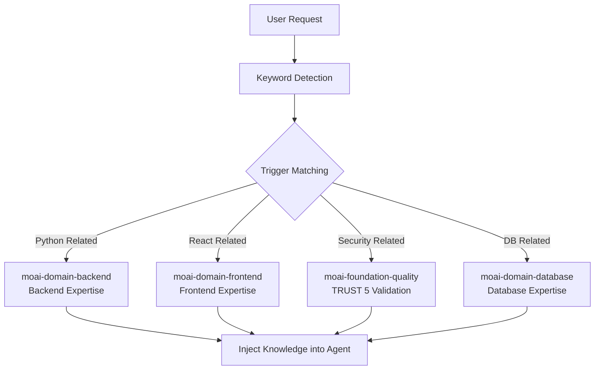
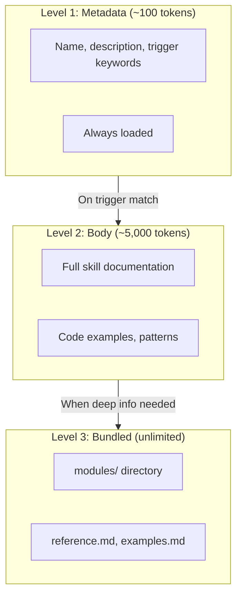
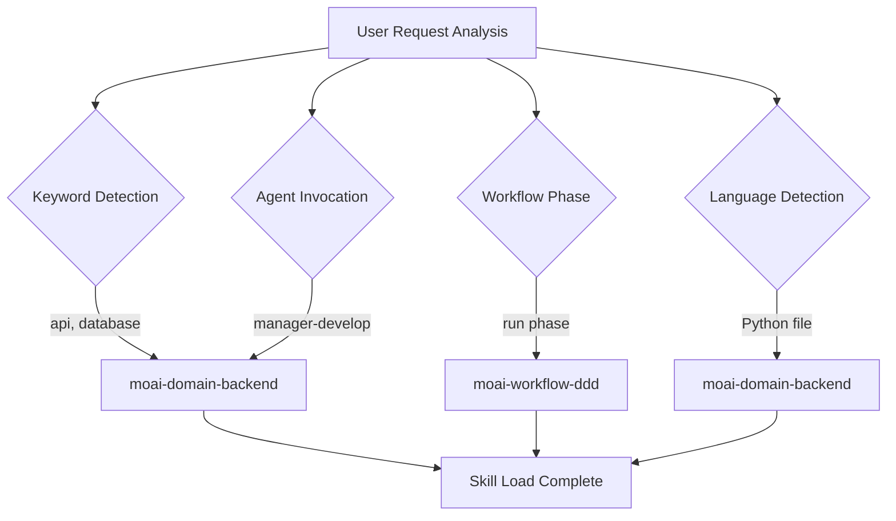
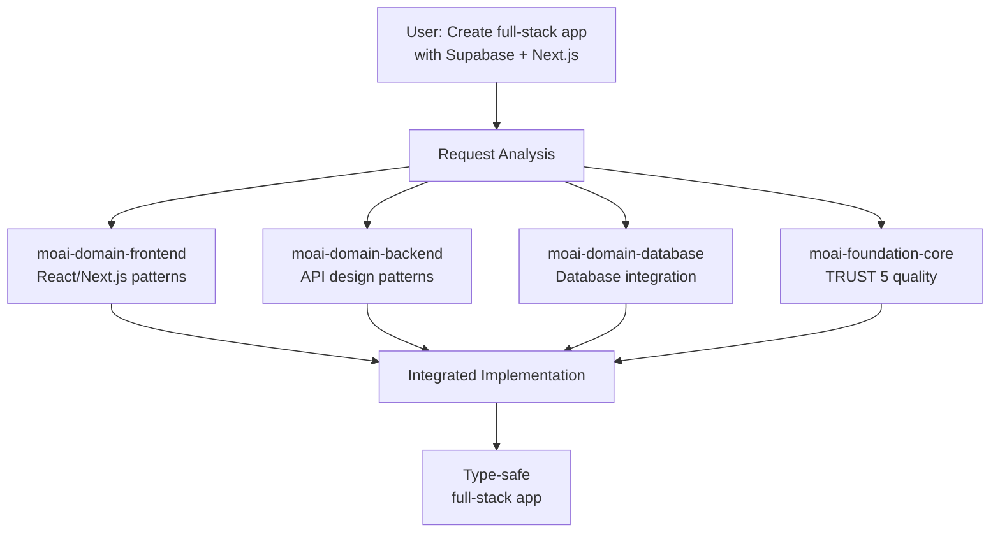

Detailed guide to MoAI-ADK's skill system.



**What is a Skill?**

Remember the helicopter scene from the 1999 movie **The Matrix**? Neo asks Trinity
if she knows how to fly a helicopter, and she calls headquarters to tell them the
helicopter model and asks them to send the operating manual.

<p align="center">
  <iframe
    width="720"
    height="360"
    src="https://www.youtube.com/embed/9Luu4itC-Zs"
    title="The Matrix Helicopter Scene"
    frameBorder="0"
    allow="accelerometer; autoplay; clipboard-write; encrypted-media; gyroscope; picture-in-picture"
    allowFullScreen
  ></iframe>
</p>

**Claude Code's skills** **(are that **operating manual**. They load only the
necessary knowledge at the moment it's needed, allowing the AI to immediately act
like an expert.



## What is a Skill?

A skill is a **knowledge module** that provides Claude Code with specialized
knowledge in a specific domain.

To use a school analogy: Claude Code is the student and skills are textbooks.
Just as you open a math textbook for math class and a science textbook for
science class, Claude Code loads the Python skill when writing Python code and
the Frontend skill when creating React UIs.



**Without skills**: Claude Code responds with only general knowledge. **With
skills**: Applies MoAI-ADK's rules, patterns, and best practices to respond.

## Skill Categories

MoAI-ADK has a total of **31 skills** — the `moai` umbrella router plus 30 specialized skills classified into 6 categories: Foundation, Workflow, Domain, Reference, Meta/Harness, and Design. Programming-language support is delivered through rules under `rules/moai/languages/`, not as separate skills.

### Foundation (Core Philosophy) - 4 skills

| Skill Name                    | Description                                           |
| ----------------------------- | ----------------------------------------------------- |
| `moai-foundation-core`        | SPEC-based TDD/DDD, TRUST 5 framework, execution rules    |
| `moai-foundation-cc`          | Claude Code extension patterns (Skills, Agents, hooks) |
| `moai-foundation-thinking`    | Structured thinking, ideation, first principles analysis |
| `moai-foundation-quality`     | Automatic code quality validation, TRUST 5 validation  |

### Workflow (Automation Workflows) - 10 skills

| Skill Name                | Description                                     |
| ------------------------- | ------------------------------------------------ |
| `moai-workflow-spec`      | SPEC document creation, EARS format, analysis   |
| `moai-workflow-project`   | Project initialization, docs creation, language |
| `moai-workflow-ddd`       | ANALYZE-PRESERVE-IMPROVE cycle                  |
| `moai-workflow-tdd`       | RED-GREEN-REFACTOR test-driven development      |
| `moai-workflow-testing`   | Test creation, debugging, code review           |
| `moai-workflow-worktree`  | Git worktree based parallel development         |
| `moai-workflow-loop`      | Ralph Engine autonomous loop, LSP integration   |
| `moai-workflow-ci-loop`   | CI watch and auto-fix loop workflow             |
| `moai-workflow-gan-loop`  | Builder-Evaluator GAN loop for design quality   |
| `moai-workflow-design`    | Design workflow, Claude Design import, brand context |

### Domain (Domain Expertise) - 9 skills

| Skill Name                        | Description                                             |
| --------------------------------- | ------------------------------------------------------- |
| `moai-domain-backend`             | API design, microservices, database integration         |
| `moai-domain-frontend`            | React 19, Next.js 16, Vue 3.5, component architecture   |
| `moai-domain-database`            | PostgreSQL, MongoDB, Redis, advanced data patterns      |
| `moai-domain-ideation`            | Lean Canvas, proposal generation, diverge-converge      |
| `moai-domain-research`            | Market research, ecosystem analysis, WebSearch           |
| `moai-domain-brand-design`        | Brand-aligned visual design, design tokens              |
| `moai-domain-design-handoff`      | Claude Design handoff packages                          |
| `moai-domain-copywriting`         | Brand-aligned marketing copy, anti-AI-slop              |
| `moai-domain-humanize`            | AI-text humanization, post-editing, Korean AI-tell taxonomy |

### Reference (Best Practices) - 5 skills

| Skill Name                   | Description                                             |
| ----------------------------- | ------------------------------------------------------- |
| `moai-ref-api-patterns`       | REST/GraphQL API design patterns, error handling        |
| `moai-ref-git-workflow`       | Git workflow, branch strategies, Conventional Commits   |
| `moai-ref-owasp-checklist`    | OWASP Top 10 security patterns, input validation        |
| `moai-ref-react-patterns`     | React/Next.js component patterns, state management      |
| `moai-ref-testing-pyramid`    | Test pyramid strategy, coverage targets                 |

### Meta/Harness (System Extension) - 2 skills

| Skill Name                 | Description                                      |
| ------------------------- | ------------------------------------------------ |
| `moai-meta-harness`       | Dynamic project-specific agent team generation   |
| `moai-harness-learner`    | Harness learning subsystem, auto-update proposals |

> The `moai` umbrella skill (the unified `/moai` router) is counted in the total of 31 but is not a categorized capability skill — it dispatches the subcommands described in this guide.

## Progressive Disclosure System

MoAI-ADK's skills use a **3-level progressive disclosure** system. Loading all
skills at once would waste tokens, so only the necessary amount is loaded
incrementally.



### Role of Each Level

| Level  | Tokens | Load Timing | Content                                  |
| ------ | ------ | ----------- | ---------------------------------------- |
| Level 1 | ~100   | Always      | Skill name, description, trigger keywords |
| Level 2 | ~5,000 | On trigger  | Full documentation, code examples, patterns |
| Level 3 | Unlimited| On demand | modules/, reference.md, examples.md       |

### Token Savings

- **Old method**: Load all 31 skills = ~160,000 tokens (impossible)
- **Progressive disclosure**: Load only metadata = ~3,100 tokens (98% savings)
- **On-demand load**: Only 2-3 skills needed for task = ~15,000 additional tokens

## Skill Trigger Mechanism

Skills are automatically loaded via **4 trigger conditions**.



### Trigger Configuration Example

```yaml
# Define triggers in skill frontmatter
triggers:
  keywords: ["api", "database", "authentication"] # Keyword matching
  agents: ["manager-spec", "manager-develop"] # On agent invocation (8 retained agents only)
  phases: ["plan", "run"] # Workflow phases
  languages: ["python", "typescript"] # Programming language
```

**Trigger Priority:**

1. **Keywords**: Load immediately when keyword detected in user message
2. **Agents**: Auto-load when specific agent is invoked (one of 8 retained agents)
3. **Phases**: Load according to Plan/Run/Sync phase
4. **Languages**: Load based on programming language of files being worked on

## Skill Usage

### Explicit Invocation

You can directly invoke skills in Claude Code conversations.

```bash
# Invoke skills in Claude Code
> Skill("moai-domain-backend")
> Skill("moai-domain-frontend")
> Skill("moai-ref-api-patterns")
```

### Auto Load

In most cases, skills are **automatically loaded** via the trigger mechanism.
Users don't need to invoke them directly; the conversation context is analyzed
to activate appropriate skills.

## Skill Directory Structure

Skill files are located in the `.claude/skills/` directory.

```
.claude/skills/
├── moai-foundation-core/       # Foundation category
│   ├── skill.md                # Main skill document (under 500 lines)
│   ├── modules/                # Deep documentation (unlimited)
│   │   ├── trust-5-framework.md
│   │   ├── spec-first-ddd.md
│   │   └── delegation-patterns.md
│   ├── examples.md             # Real-world examples
│   └── reference.md            # External reference links
│
├── moai-domain-backend/        # Domain category
│   ├── skill.md
│   └── modules/
│       ├── api-patterns.md
│       └── microservices.md
│
└── my-skills/                  # User custom skills (excluded from updates)
    └── my-custom-skill/
        └── skill.md
```


  **Warning**: Skills with `moai-*` prefix are overwritten on MoAI-ADK updates.
  Personal skills must be created in `.claude/skills/my-skills/` directory.


### Skill File Structure

Each skill's `skill.md` follows this structure.

```markdown
---
name: moai-domain-backend
description: >
  Backend development expert. API design, microservices, database integration
  patterns provided. Use for API, web app, data pipeline development.
version: 3.0.0
category: domain
status: active
triggers:
  keywords: ["api", "database", "microservices", "authentication"]
allowed-tools: ["Read", "Grep", "Glob", "Bash", "Context7 MCP"]
---

# Backend Development Expert

## Quick Reference

(Quick reference - 30 seconds)

## Implementation Guide

(Implementation guide - 5 minutes)

## Advanced Patterns

(Advanced patterns - 10 minutes+)

## Works Well With

(Related skills/agents)
```

## Real-World Examples

### Auto Skill Load in Python Project

Scenario where user is working on a Python FastAPI project.

```bash
# 1. User requests API development
> Create a user authentication API with FastAPI

# 2. Keywords automatically detected by MoAI-ADK
# "FastAPI" → moai-domain-backend trigger (Python patterns via rules/moai/languages/)
# "authentication" → moai-domain-backend trigger
# "API" → moai-domain-backend trigger

# 3. Auto-loaded skills
# - moai-domain-backend (Level 2): API design patterns, auth strategy
# - moai-foundation-core (Level 1): TRUST 5 quality standards

# 4. Agent uses skill knowledge for implementation
# - Apply FastAPI router patterns
# - Apply JWT authentication best practices
# - Auto-generate pytest tests
# - Meet TRUST 5 quality standards
```

### Skill Collaboration

Process where multiple skills collaborate on a single task.



## Skill Scope and Discovery

### Nested `.claude/skills` loading

Claude Code discovers `.claude/skills/` not only at the project root but also in nested subdirectories (parent-walk), so a monorepo can place package-local skills in each package's own `.claude/skills/` directory. When you are working inside a nested directory that contains its own `.claude/skills/`, the skills in that nested directory are loaded alongside the root-level skills for the duration of the work in that subtree.

### Closest-wins on name collision

When the same skill name appears in more than one `.claude/skills/` directory along the nested chain, the **closest-directory-wins** rule resolves the collision: the `.claude/skills/` nearest to the current working directory shadows the one further up the tree. This mirrors the precedence that already applies to agents, workflows, and output-styles under nested `.claude/` directories — the innermost `.claude/` wins. A package-local skill that intentionally overrides a root skill MUST keep the same name; renaming it would create a second skill rather than an override.

### `disableBundledSkills` toggle

`disableBundledSkills` (settings.json boolean, or its environment-variable form) hides the Claude Code bundled skills and workflows — e.g. `/deep-research`, built-in slash-command skills — from discovery, leaving only enterprise + personal + project + plugin skills visible. Use it when shipping a curated, bundle-free skill surface. MoAI-ADK does not emit this toggle from its own generators; it is documented here as an available option. The companion `--safe-mode` launch flag is documented in [Settings JSON Guide](/advanced/settings-json#disablebundledskills).

## Related Documentation

- [Agent Guide](/advanced/agent-guide) - Agent system that uses skills
- [Builder Agents Guide](/advanced/builder-agents) - Custom skill creation
- [CLAUDE.md Guide](/advanced/claude-md-guide) - Skill configuration and rules


  **Tip**: The key to using skills effectively is **using appropriate keywords**.
  Requesting "Create a REST API with Python" will automatically activate the
  `moai-domain-backend` skill (Python patterns are provided via `rules/moai/languages/`)
  to generate optimal code.

