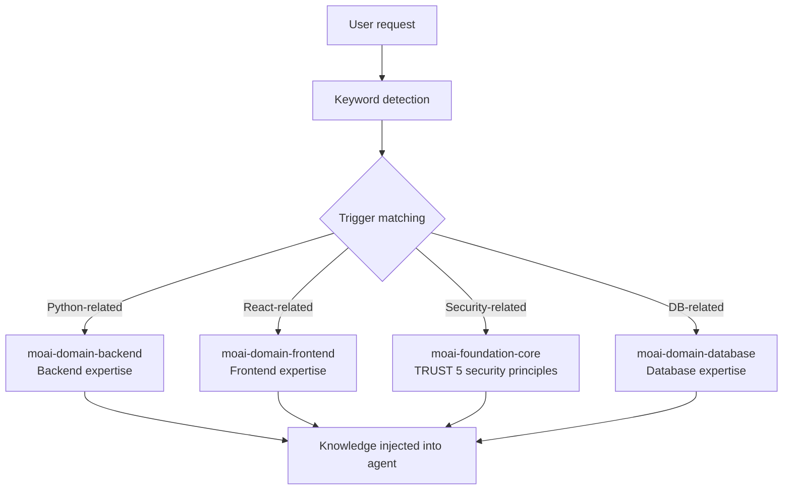
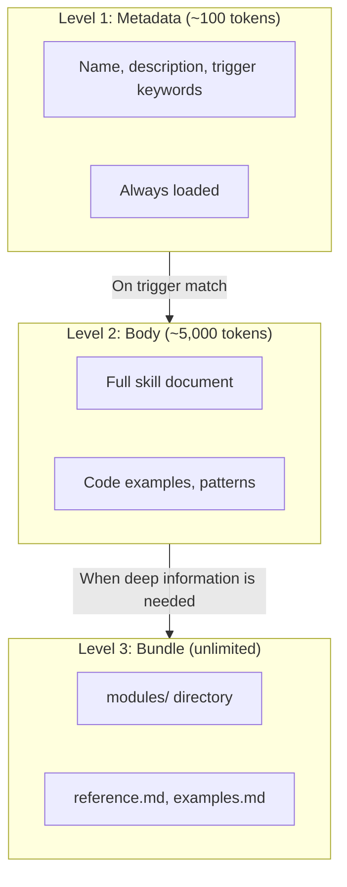
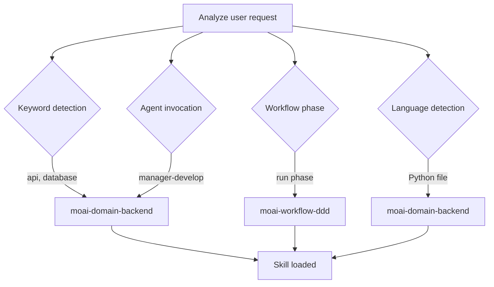
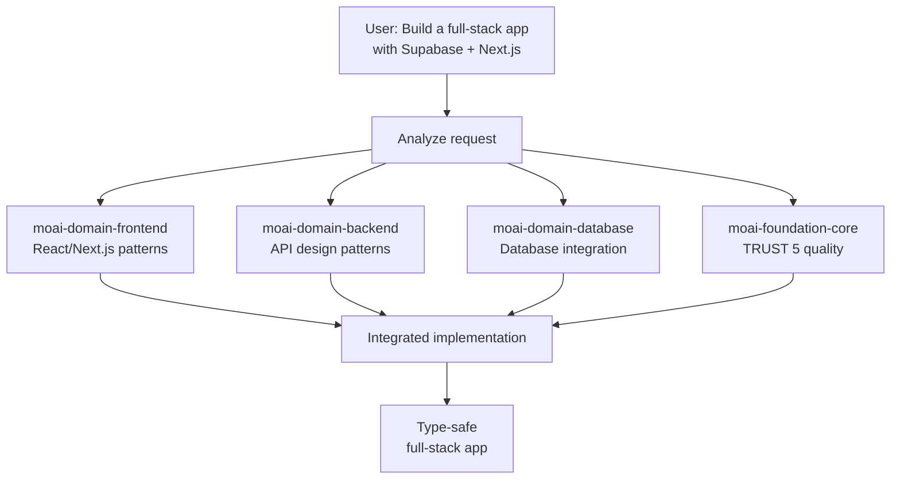

A detailed guide to MoAI-ADK's skill system. Skills are the knowledge layer of the agentic harness — and, in that they "load only the needed knowledge at the needed moment," they are also where tokenomics is most concretely implemented.



**What is a skill?**

Remember the helicopter scene from the 1999 film **The Matrix**? When Neo asks Trinity whether she can fly a helicopter, Trinity calls headquarters, names the helicopter model, and asks for the operating program to be uploaded.

<p align="center">
  <iframe
    width="720"
    height="360"
    src="https://www.youtube.com/embed/9Luu4itC-Zs"
    title="The Matrix helicopter scene"
    frameBorder="0"
    allow="accelerometer; autoplay; clipboard-write; encrypted-media; gyroscope; picture-in-picture"
    allowFullScreen
  ></iframe>
</p>

**Claude Code's skills** are exactly that **operating manual**. They load only the needed knowledge at the needed moment, letting the AI instantly act like an expert.



## What Is a Skill?

A skill is a **knowledge module** that provides Claude Code with specialized expertise in a particular field.

In a school analogy, Claude Code is the student and skills are the textbooks. Just as you open the math textbook in math class and the science textbook in science class, Claude Code loads the Python skill when writing Python code and the Frontend skill when building a React UI.


```mermaid
flowchart TD
    USER[User request] --> DETECT[Keyword detection]
    DETECT --> TRIGGER{Trigger matching}
    TRIGGER -->|Python-related| PY["moai-domain-backend<br>Backend expertise"]
    TRIGGER -->|React-related| FE["moai-domain-frontend<br>Frontend expertise"]
    TRIGGER -->|Security-related| SEC["moai-foundation-core<br>TRUST 5 security principles"]
    TRIGGER -->|DB-related| DB["moai-domain-database<br>Database expertise"]

    PY --> AGENT[Knowledge injected into agent]
    FE --> AGENT
    SEC --> AGENT
    DB --> AGENT
```

**Without skills**: Claude Code responds with general knowledge only. **With skills**: it responds by applying MoAI-ADK's rules, patterns, and best practices.

## Skill Categories

The MoAI-ADK template includes a total of **27 `moai-*` skills**, classified into 5 functional categories (Foundation 4 + Workflow 8 + Domain 5 + Reference 8 + Meta/Harness 2 = 27). In addition, there is 1 separate `moai` umbrella skill that routes requests to specialized skills. In user projects, you can additionally author custom `harness-*` skills. Programming-language support is provided by rules under `rules/moai/languages/` and is not a separate skill.

This number is also a result of dieting — the skill catalog was refined from 48 → 38 → 27 over the v3 period.

### Foundation (Core Philosophy) - 4

| Skill name                  | Description                                                |
| -------------------------- | --------------------------------------------------- |
| `moai-foundation-core`     | SPEC-based TDD/DDD, the TRUST 5 framework, execution rules    |
| `moai-foundation-cc`       | Claude Code extension patterns (Skills, Agents, Hooks)       |
| `moai-foundation-thinking` | Structured thinking, ideation, first-principles analysis             |
| `moai-foundation-quality`  | Automatic code-quality verification, TRUST 5 validation             |

### Workflow (Automated Workflows) - 8

| Skill name                | Description                                          |
| ------------------------ | --------------------------------------------- |
| `moai-workflow-spec`     | SPEC document creation, GEARS format, requirements analysis     |
| `moai-workflow-project`  | Project initialization, docs generation, language setup         |
| `moai-workflow-ddd`      | The ANALYZE-PRESERVE-IMPROVE cycle               |
| `moai-workflow-tdd`      | RED-GREEN-REFACTOR test-driven development           |
| `moai-workflow-testing`  | Test creation, debugging, code-review integration           |
| `moai-workflow-worktree` | Git-worktree-based parallel development                   |
| `moai-workflow-loop`     | Ralph Engine autonomous loop, LSP integration              |
| `moai-workflow-ci-loop`  | CI watch and auto-fix loop workflow          |

### Domain (Domain Expertise) - 5

| Skill name                   | Description                                             |
| --------------------------- | ------------------------------------------------ |
| `moai-domain-backend`       | API design, microservices, database integration      |
| `moai-domain-frontend`      | React 19, Next.js 16, Vue 3.5, component architecture |
| `moai-domain-database`      | PostgreSQL, MongoDB, Redis, advanced data patterns     |
| `moai-domain-html-report`   | Markdown → single-file HTML report renderer (6 modes, no external dependencies) |
| `moai-domain-humanize`      | AI text humanization and post-editing (KO/EN/JA/ZH)    |

### Reference (Best Practices) - 8

| Skill name                  | Description                                              |
| -------------------------- | ------------------------------------------------- |
| `moai-ref-api-patterns`    | REST/GraphQL API design patterns, error handling             |
| `moai-ref-git-workflow`    | Git workflow, branch strategies, Conventional Commits |
| `moai-ref-owasp-checklist` | OWASP Top 10 security patterns, input validation                 |
| `moai-ref-react-patterns`  | React/Next.js component patterns, state management            |
| `moai-ref-testing-pyramid` | Test pyramid strategy, coverage targets               |
| `moai-ref-llm-security`    | AI/LLM defensive security (prompt injection, OWASP LLM Top 10) |
| `moai-ref-secops`          | DevSecOps/container/API operational defensive security             |
| `moai-ref-supply-chain`    | Software supply-chain defensive security (SBOM, SLSA, Sigstore) |

### Meta/Harness (System Extension) - 2

| Skill name              | Description                                        |
| ---------------------- | ------------------------------------------- |
| `moai-meta-harness`    | Dynamic generation of project-specific agent teams         |
| `moai-harness-learner` | The harness learning subsystem, auto-update proposals |

> The 27 `moai-*` skills ship with the MoAI-ADK template by default, and each skill loads independently to save tokens. Users can additionally author per-project custom `harness-*` skills.

## The Progressive Disclosure System

MoAI-ADK skills use a **3-level Progressive Disclosure** system. Loading every skill at once wastes tokens, so they load incrementally, only as needed. Think of it as the skill-layer implementation of the context diet.


```mermaid
flowchart TD
    subgraph L1["Level 1: Metadata (~100 tokens)"]
        M1["Name, description, trigger keywords"]
        M2["Always loaded"]
    end

    subgraph L2["Level 2: Body (~5,000 tokens)"]
        B1["Full skill document"]
        B2["Code examples, patterns"]
    end

    subgraph L3["Level 3: Bundle (unlimited)"]
        R1["modules/ directory"]
        R2["reference.md, examples.md"]
    end

    L1 -->|"On trigger match"| L2
    L2 -->|"When deep information is needed"| L3

```

### The Role of Each Level

| Level    | Tokens   | Loaded when      | Content                                |
| ------- | ------ | -------------- | ----------------------------------- |
| Level 1 | ~100   | Always           | Skill name, description, trigger keywords      |
| Level 2 | ~5,000 | On trigger match | Full document, code examples, patterns          |
| Level 3 | Unlimited | On demand       | modules/, reference.md, examples.md |

### Token Savings

- **Naive approach**: loading all 27 skills = about 135,000 tokens (infeasible)
- **Progressive disclosure**: metadata only = about 5,200 tokens (97% savings)
- **Load on demand**: only the 2-3 skills the task needs = about 15,000 additional tokens

## The Skill Trigger Mechanism

Skills load automatically via **4 trigger conditions**.


```mermaid
flowchart TD
    REQ[Analyze user request] --> KW{Keyword detection}
    REQ --> AG{Agent invocation}
    REQ --> PH{Workflow phase}
    REQ --> LN{Language detection}

    KW -->|"api, database"| SKILL1[moai-domain-backend]
    AG -->|"manager-develop"| SKILL1
    PH -->|"run phase"| SKILL2[moai-workflow-ddd]
    LN -->|"Python file"| SKILL3[moai-domain-backend]

    SKILL1 --> LOAD[Skill loaded]
    SKILL2 --> LOAD
    SKILL3 --> LOAD
```

### Trigger Configuration Example

```yaml
# Define triggers in the skill frontmatter
triggers:
  keywords: ["api", "database", "authentication"] # keyword matching
  agents: ["manager-spec", "manager-develop"] # when an agent is invoked
  phases: ["plan", "run"] # workflow phase
  languages: ["python", "typescript"] # programming language
```

**Trigger priority:**

1. **Keywords**: load immediately when a keyword is detected in the user message
2. **Agents**: auto-load when a specific agent is invoked
3. **Phases**: load according to the Plan/Run/Sync phase
4. **Languages**: load according to the programming language of the file being worked on

## Using Skills

### Explicit Invocation

You can invoke a skill directly in a Claude Code conversation.

```bash
# Invoke a skill in Claude Code
> Skill("moai-domain-backend")
> Skill("moai-domain-frontend")
> Skill("moai-ref-api-patterns")
```

### Automatic Loading

In most cases skills are **loaded automatically** by the trigger mechanism. The conversation context is analyzed and the appropriate skills are activated without the user invoking anything.

## Skill Directory Structure

Skill files live in the `.claude/skills/` directory.

```
.claude/skills/
├── moai-foundation-core/       # Foundation category
│   ├── skill.md                # main skill document (500 lines or fewer)
│   ├── modules/                # in-depth documents (unlimited)
│   │   ├── trust-5-framework.md
│   │   ├── spec-first-ddd.md
│   │   └── delegation-patterns.md
│   ├── examples.md             # real-world examples
│   └── reference.md            # external reference links
│
├── moai-domain-backend/        # Domain category
│   ├── skill.md
│   └── modules/
│       ├── api-patterns.md
│       └── microservices.md
│
└── my-skills/                  # user custom skills (excluded from updates)
    └── my-custom-skill/
        └── skill.md
```


  **Warning**: Skills with the `moai-*` prefix are overwritten on MoAI-ADK updates.
  Always create personal skills in the `.claude/skills/my-skills/` directory.


### Skill Namespaces

A skill prefix distinguishes the **distribution owner**, and `moai update` behaves differently.

| Prefix | Ownership | `moai update` behavior |
|--------|--------|-------------------|
| `moai-*` / `moai-harness-*` | template-managed | Overwrite (sync) |
| `hns-*` | user-owned (harness) | Preserve (no modify/delete) |
| (no prefix) / other | user-owned (personal) | Preserve |

The `hns-*` prefix means a user-created harness skill, which `moai update` never overwrites or deletes. You must not mirror `hns-*` skills in the template (a CI guard detects it).


  **Note**: Skills with the `moai-*` prefix are overwritten on a MoAI-ADK update.
  Create personal skills and harness skills in a `hns-*`-prefixed or prefix-less directory.


### Skill File Structure

Each skill's `skill.md` follows this structure.

```markdown
---
name: moai-domain-backend
description: >
  Backend development specialist. Provides API design, microservices, and database integration patterns.
  Use when developing APIs, web apps, or data pipelines.
version: 3.0.0
category: domain
status: active
triggers:
  keywords: ["api", "database", "microservices", "authentication"]
allowed-tools: ["Read", "Grep", "Glob", "Bash"]
---

# Backend Development Specialist

## Quick Reference

(quick reference - 30 seconds)

## Implementation Guide

(implementation guide - 5 minutes)

## Advanced Patterns

(advanced patterns - 10 minutes+)

## Works Well With

(related skills/agents)
```

## Practical Examples

### Automatic Skill Loading in a Python Project

A scenario where the user is working in a Python FastAPI project.

```bash
# 1. The user requests API development
> Build a user authentication API with FastAPI

# 2. Keywords MoAI-ADK detects automatically
# "FastAPI" → moai-domain-backend trigger (Python patterns come from rules/moai/languages/)
# "authentication" → moai-domain-backend trigger
# "API"     → moai-domain-backend trigger

# 3. Skills loaded automatically
# - moai-domain-backend (Level 2): API design patterns, authentication strategies
# - moai-foundation-core (Level 1): TRUST 5 quality standards

# 4. The agent implements using skill knowledge
# - Applies FastAPI router patterns
# - Applies JWT authentication best practices
# - Auto-generates pytest tests
# - Meets TRUST 5 quality standards
```

### Skill Collaboration

How multiple skills cooperate on a single task.


```mermaid
flowchart TD
    REQ["User: Build a full-stack app<br>with Supabase + Next.js"] --> ANALYZE[Analyze request]

    ANALYZE --> S1["moai-domain-frontend<br>React/Next.js patterns"]
    ANALYZE --> S2["moai-domain-backend<br>API design patterns"]
    ANALYZE --> S3["moai-domain-database<br>Database integration"]
    ANALYZE --> S4["moai-foundation-core<br>TRUST 5 quality"]

    S1 --> IMPL[Integrated implementation]
    S2 --> IMPL
    S3 --> IMPL
    S4 --> IMPL

    IMPL --> RESULT["Type-safe<br>full-stack app"]
```

## Skill Scope and Discovery

### Nested `.claude/skills` Loading

Claude Code discovers `.claude/skills/` not only at the project root but also in nested subdirectories (parent-walk). Monorepos can therefore place package-local skills in each package's own `.claude/skills/` directory. When working inside a nested directory containing its own `.claude/skills/`, that nested directory's skills are loaded alongside the root-level skills while working within that subtree.

### closest-wins on Name Collisions

When the same skill name appears in more than one `.claude/skills/` directory along the nesting chain, the **closest-directory-wins** rule resolves the conflict: the `.claude/skills/` closest to the current working directory shadows the one higher up the tree. This is the same precedent rule already applied to agents, workflows, and output-styles under nested `.claude/` directories — the innermost `.claude/` wins. A package-local skill that deliberately overrides a root skill must keep the same name. Renaming it creates a second skill, not an override.

### The `disableBundledSkills` Toggle

`disableBundledSkills` (a settings.json boolean, or its environment-variable form) hides Claude Code's bundled skills and workflows — e.g. `/deep-research`, built-in slash-command skills — from discovery, exposing only enterprise + personal + project + plugin skills. Use it when providing a curated, bundle-free skill surface. MoAI-ADK does not generate this toggle in its own generators. It is documented here as an available option. The companion `--safe-mode` launch flag is documented in the [Settings JSON Guide](/en/advanced/settings-json#disablebundledskills).

## Related Documents

- [Agent Guide](/en/advanced/agent-guide) - the agent system that uses skills
- [Builder Agents Guide](/en/advanced/builder-agents) - how to create custom skills
- [CLAUDE.md Guide](/en/advanced/claude-md-guide) - skill configuration and the rules system


  **Tip**: The key to using skills well is **using the right keywords**. Ask "build
  a REST API in Python" and the `moai-domain-backend` skill activates automatically
  (Python patterns are provided via `rules/moai/languages/`) to generate optimal code.

