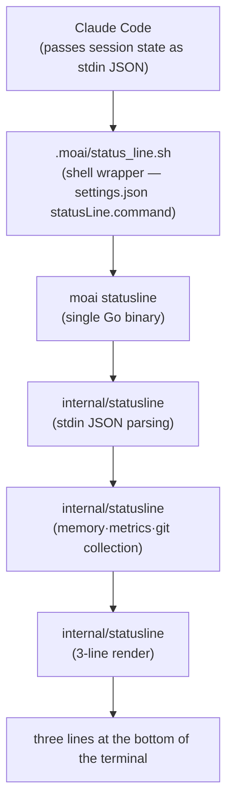
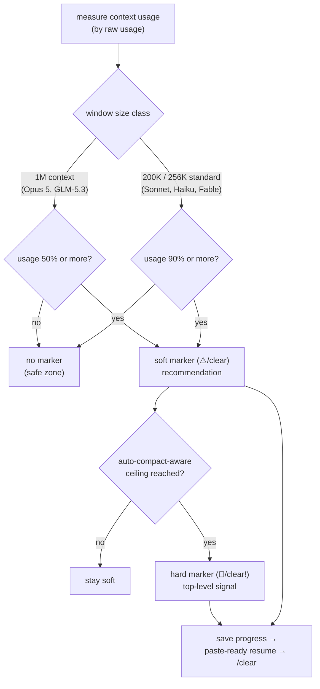

You cannot control what you do not measure. An agentic development session spends hundreds of thousands of tokens, fills the context window (the total conversation a model can hold in mind at once) quickly, and runs several agents (AI assistants that work on their own) in parallel — all of which moves the prompt cache (a technique that reuses the same context to cut cost) hit rate. When none of this is visible in the terminal, the question "why did this session cost twice as much" has no answer. The **custom statusline system** starts exactly there. Tokenomics (spending tokens economically) begins with measurement, so the context usage rate, the cache hit rate, and the rate-limit depletion sit at the bottom of your terminal at all times.

This document explains, at introductory depth, what the statusline shows, how the data flows, and what signals fire as the context fills. It explains "why you need this information and how to read it" before the fine detail of segment formats.

## Why you need a statusline

Five variables decide cost and quality in agentic coding: which model you are on, at which reasoning depth it runs, how full the context window is, how much rate limit remains, and whether the prompt cache is actually hitting. These five are connected. A full context produces SSE stream stalls (streaming coming to a halt), a cold cache raises cost immediately, and an exhausted rate limit stops heavy work.

The problem is that none of these variables is visible by default. Claude Code's own statusline is rich, but it does not carry the information MoAI workflows deal in — the active SPEC (a requirements specification document), the review state of the current PR, or when a handoff (the work of bridging one session to the next) is recommended. So MoAI raises its own statusline at the bottom of the terminal in three lines — appending a fourth in a multi-session run — so that "how tokens are being spent right now" and "where, and on what, you are working" read at a glance.

## The lines at a glance

The base layout is three lines; when a session name or backlog observation exists, a fourth line (the session line) is appended conditionally at the end. The example below is one instance of actual rendered output, copied verbatim down to the glyphs (small pictographic characters) each segment uses.

```text
🤖 Opus │ 🧠 xhigh·t │ ♻️ 87% │ 🔅 cc v2.1.212 │ 🗿 v3.1.1 │ ⏳ 4h 52m │ 💬 MoAI
🪫 CW: ███████░░░ 72% (⚠️/clear) │ 🔋 5H: █████░░░░░ 56% (46m) │ 🔋 7D: █░░░░░░░░░ 13% (May 28)
📁 moai-adk-go │ 📡 modu-ai/moai-adk, 5/0 🐛12 🔀3 | 🅱️ main +2 │ 📫 +0 M1 ?1 │ 💌 PR #1234 (⌥approved)
🏷️ run │ 👤 manager-develop │ 🔄 TODO: 1/3
```

- **Line 1 — how the session is running**: model, reasoning depth, cache hit rate, Claude Code version, MoAI version, session time, and output style in one line. It tells you at once which configuration the session is running under.
- **Line 2 — how much budget remains**: context-window usage (CW) and two rolling rate limits (5-hour · 7-day) as gauge bars. This is the evidence for deciding whether a heavy job can run right now.
- **Line 3 — where, and on what**: directory, repository and branch, open issue and change-request counts, git status, the active SPEC task, and the review state of the open PR, bundled together. This is the line you will see most often in a PR-centric workflow.
- **Line 4 (conditional) — as whom, and how much is queued**: the session name (🏷️), agent name (👤), and backlog state (🔄 `TODO: in progress/queued`). It appears naturally on named sessions — kanban companions — and segments shrink when their source of observation is missing; when all are empty, the line itself is omitted. It is also where the session name is highlighted, which makes it the first signal when you have several terminals open and lose track of which window plays which role.

## The path the data takes

The statusline is not a single program but a short pipeline. Every render cycle, Claude Code produces the session state as JSON and hands it over; MoAI receives it, shapes it into three lines, and returns it to the terminal.



Why does a shell wrapper sit in between? Claude Code's `statusLine.command` accepts a single command string. So `.moai/status_line.sh` acts as a minimal shell wrapper invoking the `moai statusline` binary, and all the heavy lifting (parsing, collection, rendering) happens fast inside the compiled Go binary. Every render then draws a generous amount of information at once, without spawning multiple processes.

The data-collection stage also supplements what stdin lacks. Git status is parsed directly from a local `git status --porcelain`, the MoAI version is read from local settings, and the active task comes from the session state file. This packs context Claude Code does not hand over into a single line.

## Line 1 — how the session is running

Line 1 reads the session's configuration and state. Beyond the model name, the **effort/thinking** values added to stdin since Claude Code v2.1.139 show at which reasoning depth the session runs and whether extended thinking is on. A `·t` suffix after the level, as in `xhigh·t`, means extended thinking is active — with this display you can check at a glance whether the model policy is actually applied.

Among these, the **cache hit rate** is the core tokenomics metric. It is `cache_read` tokens divided by `(cache_read + cache_creation)`; shrink the always-loaded instructions and this number rises immediately. Conversely, reading a large file fresh every turn, or a sudden change to the instruction tree, drags it down. A low hit rate is a clue for tracking which change is eating the cache.

When data is missing, values are not invented — the segment hides quietly (graceful degradation). If cache-creation tokens are 0, or both values are 0, the hit-rate segment is not shown at all. This humble omission is what prevents false confidence from numbers that do not exist.

## Line 2 — how much budget remains

Line 2 consists of three gauge bars, each with a different meaning.

- **CW (context window)**: how full the current session's window is. The bar's color is a continuous gradient from green through yellow to red, and the battery glyph in front switches to a "weak battery" mark once the displayed percentage crosses 70%. A full window raises the risk of SSE stream stalls, so this gauge is the first signal for when to switch sessions.
- **5H (5-hour rolling)**: rate-limit depletion over the last 5 hours. The reset time is shown alongside, telling you how long until the limit lifts.
- **7D (7-day rolling)**: rate-limit depletion over the last 7 days. It lets you gauge how much of the weekly budget remains.

For subscription-plan users, the 5H/7D bars are effectively budget gauges. Reading them lets you decide reasonably between running the heavy job now and handing it to GLM workers in CG mode to save cost. When the CW bar is full and the 5H bar is high too, stopping the session and continuing via a handoff favors both cost and stability.

## Line 3 — where, and on what

Line 3 bundles the work's context. Directory, repository and branch (including ahead/behind and dirty-file counts), git status, the active SPEC task, and the review state of the open PR all sit in one line.

The repository and branch render as one merged segment. The `owner/name` part comes from `workspace.repo`, added to stdin since Claude Code v2.1.145, followed by the ahead/behind commit pair against the remote, slash-joined as `5/0`. The branch is read from local git. The repo display carries the 📡 glyph and joins the branch with an ASCII pipe (`|`); merged, "which repo's which branch am I working in" lands at a glance. When working in a worktree (a linked separate working directory), a `[WT]` mark precedes the branch to distinguish it from an ordinary checkout.

### Open item counts — 🐛 issues, 🔀 change requests

The repo segment is followed by the counts of **open issues (🐛) and open change requests (🔀)** for this repository. These used to sit on line 4; they now ride on the same segment as the repository they belong to, so position answers "which repo is this number about".

Each number carries **its own glyph and no slash joins them**. The ahead/behind pair in front (`5/0`) is already a slash-joined pair, and putting a second slash-joined pair beside it made an operator read the branch's ahead/behind as "issues over PRs". So the pair is slashed and the counts are glyph-tagged — separated by shape rather than by position. A zero is omitted, and when both are zero the whole suffix disappears.

### `statusline.forge` — which hosting service to ask

Where those counts come from is decided by the `statusline.forge` key in `statusline.yaml`.

```yaml
statusline:
  forge: gitlab    # github | gitlab | none
```

| Value | Behavior |
|---|---|
| Unset (default) | Decided from the `origin` remote's host — `github.com` selects `gh`, `gitlab.com` selects `glab` |
| `github` | Always counts via `gh` |
| `gitlab` | Always counts via `glab` |
| `none` (or `off`) | No counting — the suffix is not rendered |
| Any other value | Renders nothing, and **does not fall back to detection** |

That last row matters. On a typo, quietly counting against whatever the hostname suggested would make a wrong number look right. So an unrecognised value shows as a **missing** segment — a symptom that traces straight back to the value just typed.

A self-hosted instance carries no signal in its name: a company GitLab at `git.example.com` is indistinguishable in shape from a company GitHub Enterprise. Only the two public hosts are auto-detected; anything else waits for this key rather than being guessed at.

When the CLI (`gh` or `glab`) is absent from PATH there are simply no counts, not an error — the suffix stays quietly empty and the rest of the line renders unchanged. The GitHub path asks for totals in a single call; the GitLab path enumerates one page (up to 100 items), so a project with more open items than that reports the page rather than the true count.

Git status leads with mailbox glyphs — 📬 staged, 📫 modified, 📪 untracked files present, 📭 clean — followed by the `+staged Mmodified ?untracked` counts. It uses both color and shape, so it reads in a black-and-white terminal too.

The PR segment separates review states by color. `approved` renders green, `pending` yellow, `changes_requested` red, and `draft` gray, so the state of a review-awaiting PR is graspable by color alone. MoAI workflows produce a plan-PR → run-PR → sync-PR cycle for every SPEC, so keeping PR state always visible directly helps decide the next move.

## Handoff markers — when the context fills

The marker attached beside the CW bar is the statusline's most important recommendation. When context usage crosses the per-model threshold, it turns on in two stages. The soft stage is a recommendation to switch sessions if you can; the hard stage is the top-level signal to switch right now.



The thresholds differ by model class because the larger the window, the more an early switch favors SSE-stall prevention. On 1M-context models the soft marker fires at half full (50%); on 200K/256K models at 90%. The hard marker is a ceiling that anticipates when auto-compact would fire. Since the runtime's auto-compact often pre-empts this ceiling first, the hard stage is in practice a top-level signal that fires rarely.

When the marker turns on, follow the fixed order: save in-flight work to `progress.md`, receive the orchestrator's paste-ready resume message, `/clear` the session, and paste the message into the new session to continue. This flow matches the session handoff rules.

### GLM context gauge correction (Issue #653)

One caveat. GLM-5.3 is a genuine 1M-context model, but Claude Code reports `context_window_size` by the Claude slot regardless of provider (Opus=1M, Sonnet/Haiku=200K). So in a GLM session the raw observation can misreport at about 180K. MoAI corrects the value at two points — the launcher declares the 1M window to the session via the `CLAUDE_CODE_MAX_CONTEXT_TOKENS` environment variable, and the statusline corrects the observation via `ResolveGLMContextWindow` in `internal/statusline/memory.go`. `glm-5.3` maps to 1,000,000, and you can override it directly with the `MOAI_STATUSLINE_CONTEXT_SIZE` environment variable or configure it through the `llm.glm.context_windows` table. In a GLM session, trust the MoAI statusline's CW%, not the raw value.

## The context-usage snapshot — for the next session

The statusline also records its observation to `.moai/state/context-usage.json` on every render. The next session's start reads this snapshot as grounds for how full the window was just before. `raw_pct` (raw usage) and `stage` (none/soft/hard) are the key fields; `session_id`, `writer_pid`, and `captured_at` ride along so the writing session can be told apart.

Why does the session need distinguishing? When several sessions share one working directory, one session must not inherit another's usage and misjudge the window as full. So the identity of the session that wrote the record is checked, and records that mismatch or are stale are ignored, falling back to raw observation. The goal is to act conservatively, not to draw false confidence from a value that is not yours.

## Configuration — toggling on and off

Segments toggle in `.moai/config/sections/statusline.yaml`. Each key is one segment toggle.

```yaml
statusline:
  theme: catppuccin-mocha    # color theme
  forge: gitlab              # github | gitlab | none (unset = decide from the origin host)
  segments:
    # line 1
    model: true
    effort_thinking: true
    cache_hit: true
    claude_version: true
    moai_version: true
    session_time: true
    output_style: true
    # line 2
    context: true
    usage_5h: true
    usage_7d: true
    # line 3
    directory: true
    git_branch: true         # repository + branch merged
    git_status: true
    task: true
    pr: true
    worktree: false          # opt-in
    github: true             # 🐛/🔀 open item counts (repo-segment suffix)
    # line 4 — session line (on by default; rendered even when unstated)
    session: true            # 🏷️ session name + 👤 agent
    backlog: true            # 🔄 TODO: in progress/queued
```

Sixteen keys form the official configuration schema. The `owner/name` repository part is a seventeenth element rendered inside the `git_branch` segment, outside the schema, so it has no individual toggle. The `github` key keeps its name but now toggles the 🐛/🔀 suffix on the **line 3** repo segment, while the `forge` key above decides which hosting service is asked. The session line's two keys (`session` · `backlog`) are separate from this 16-key schema and render on by default even when unstated in the configuration — segments whose source of observation is missing (session name, backlog queue, forge cache) are quietly omitted. The former named presets (full/compact/minimal) are deprecated, so toggle the combination you want per segment.

The refresh interval is set by `statusLine.refreshInterval` in `settings.json` (unit: seconds, default 10). This is a Claude Code runtime setting, not a statusline configuration file. Too short an interval burdens the CPU; too long delays the reflection of context-usage changes. The default is usually enough.

## Troubleshooting

**If the PR does not show**, check three things. Claude Code must be v2.1.145 or later for the `pr` field to arrive on stdin. Confirm an open PR exists on the current branch with `gh pr view`. And check that the configuration does not explicitly say `pr: false`.

**If the handoff marker does not show**, that is usually normal. Below 50% on a 1M model, or below 90% on a 200K/256K model, the threshold simply has not been reached. If it does not show even past the threshold, check that the model's window size is mapped correctly (especially the GLM correction).

**If colors do not show**, check that the terminal supports ANSI 256-color, that `NO_COLOR=1` is not set, and that the theme fits the environment.

**To see the actual output**, pipe a sample stdin and render the statusline once. Feed the `moai statusline` command a JSON string carrying session state on standard input, and the three lines destined for the terminal come out as-is. This lets you inspect how a configuration change affects the render, without rendering.

## Changing directory with `/cd` (CC 2.1.169+)

On Claude Code 2.1.169 or later, the `/cd <path>` command changes the session's working directory **while preserving the prompt cache**. The statusline's directory display updates to the new path, but the accumulated reasoning context is not rebuilt. Think of it as a way to keep the cache alive instead of opening a new terminal session. When you want to move only the working directory mid-session without losing context (for example, switching into a worktree mid-task), it is the least-effort choice. For how this ties into the resume pattern, see [Session handoff](/en/workflow-commands/moai-sync).

## Related docs

- [Settings JSON](/en/advanced/settings-json) — configuring the Claude Code `statusLine` field
