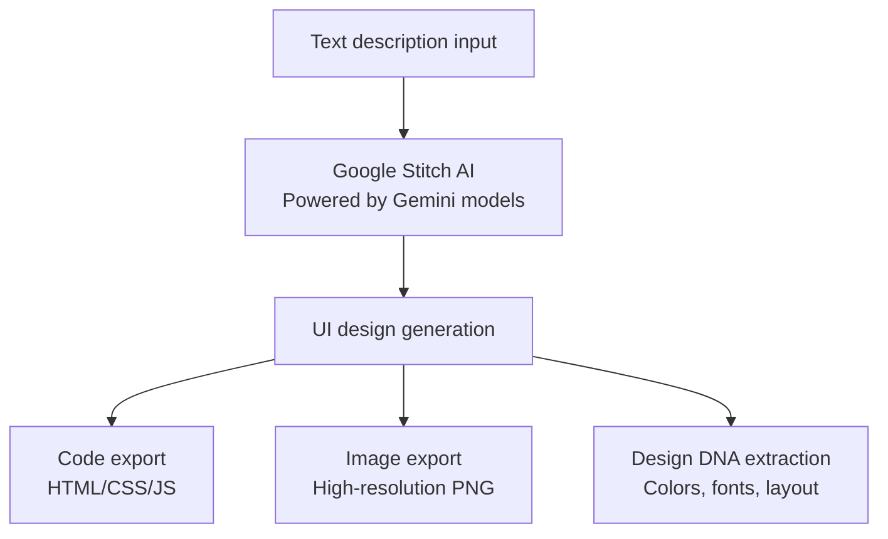
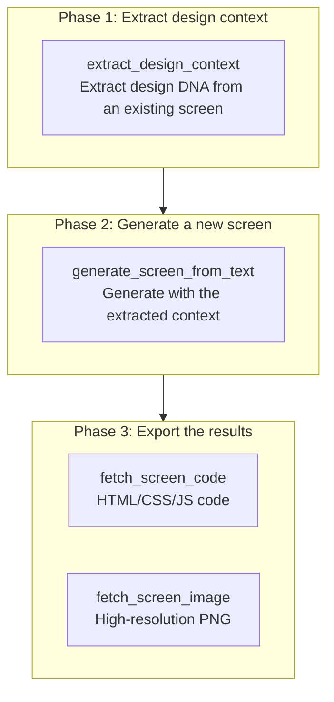
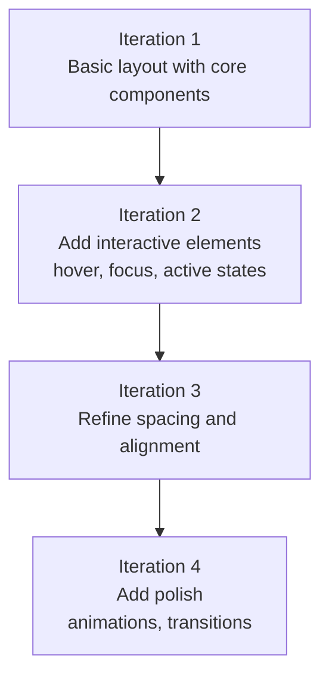

A detailed guide to generating AI-powered UI/UX designs using the Google Stitch MCP server. The agentic harness does not stop at code — connect a design generation tool via MCP and UI prototyping flows within the same agentic workflow.


**One-line summary**: Google Stitch is an **AI design tool that generates UI screens from text descriptions alone**. Through its MCP server you can generate UIs directly from Claude Code, extract design context, and export to production code.


## What Is Google Stitch?

Google Stitch is an AI-powered UI/UX design generation tool developed by Google Labs. It uses the Gemini AI models to transform natural-language descriptions into professional-grade UI screens.

Even in development environments without a designer, Stitch lets you prototype UIs rapidly while maintaining a consistent design system.



### Key Features

| Feature | Description |
|------|------|
| **AI design generation** | Generates complete UI screens from a text prompt |
| **Design DNA extraction** | Extracts color, font, and layout patterns from existing screens |
| **Code export** | Generates HTML/CSS/JavaScript production code |
| **Image export** | Downloads high-resolution PNG screenshots |
| **Project management** | Organizes and manages screens per project |
| **Figma integration** | Generated designs can be copied to Figma |


Google Stitch is **free** to use. Standard Mode allows 350 generations per month, and Experimental Mode 50 per month. All you need is a Google account.


## Prerequisites

Using the Google Stitch MCP requires the following 4-step setup.

### Step 1: Create a Google Cloud Project

Create a new project in the Google Cloud Console, or select an existing one.

```bash
# gcloud CLI가 없다면 먼저 설치
# https://cloud.google.com/sdk/docs/install

# Google Cloud 인증
gcloud auth login

# 프로젝트 설정 (기존 프로젝트 사용 시)
gcloud config set project YOUR_PROJECT_ID
```

### Step 2: Enable the Stitch API

```bash
# beta 컴포넌트 설치 (처음 한 번만)
gcloud components install beta

# Stitch API 활성화
gcloud beta services mcp enable stitch.googleapis.com --project=YOUR_PROJECT_ID
```

### Step 3: Configure Application Default Credentials

```bash
# 애플리케이션 기본 자격 증명 로그인
gcloud auth application-default login

# 할당량 프로젝트 설정
gcloud auth application-default set-quota-project YOUR_PROJECT_ID
```

### Step 4: Set the Environment Variable

```bash
# .bashrc 또는 .zshrc에 추가
export GOOGLE_CLOUD_PROJECT="YOUR_PROJECT_ID"
```


**Billing** must be enabled on your Google Cloud project. Stitch itself is free, but API calls require a billing-enabled project. The project must also have the `roles/serviceusage.serviceUsageConsumer` IAM role granted.


## MCP Configuration

### .mcp.json Configuration

Add the Stitch MCP server to the `.mcp.json` file at the project root.

```json
{
  "mcpServers": {
    "stitch": {
      "command": "${SHELL:-/bin/bash}",
      "args": ["-l", "-c", "exec npx -y stitch-mcp"],
      "env": {
        "GOOGLE_CLOUD_PROJECT": "YOUR_PROJECT_ID"
      }
    }
  }
}
```

Replace `YOUR_PROJECT_ID` with your actual Google Cloud project ID.

### settings.json Permission Configuration

To use MCP tools, they must be registered in `permissions.allow`.

```json
{
  "permissions": {
    "allow": [
      "mcp__stitch__*"
    ]
  }
}
```

### Enabling in settings.local.json

Enable the Stitch MCP in your personal environment.

```json
{
  "enabledMcpjsonServers": ["stitch"]
}
```

### Connection Check

Once configured, verify the connection by listing projects from Claude Code.

```bash
# Claude Code에서 실행
> Stitch 프로젝트 목록을 보여줘
```

## MCP Tool List

The Stitch MCP provides 9 tools.

### Full Tool List

| Tool | Purpose |
|------|------|
| `create_project` | Create a new Stitch project (workspace) |
| `get_project` | Retrieve detailed project metadata |
| `list_projects` | List all accessible projects |
| `list_screens` | List all screens in a project |
| `get_screen` | Retrieve individual screen metadata |
| `generate_screen_from_text` | Generate a new UI screen from a text prompt |
| `fetch_screen_code` | Download a screen's HTML/CSS/JS code |
| `fetch_screen_image` | Download a screen's high-resolution screenshot |
| `extract_design_context` | Extract a screen's design DNA (colors, fonts, layout) |

### Tool Selection Guide

| Goal | Tool to use |
|------|-------------|
| I want to generate a new design | `generate_screen_from_text` |
| I want to analyze an existing design | `extract_design_context` |
| I want to export a design to code | `fetch_screen_code` |
| I need a design image | `fetch_screen_image` |
| I want to manage multiple designs as projects | `create_project`, `list_projects` |

## The Designer Flow Workflow

The biggest problem when generating multiple screens with an AI agent is **design consistency**. Generating each screen independently yields mismatched fonts, colors, and layouts.

**Designer Flow** is a 3-phase pattern that solves this.



### Practical Example: An E-Commerce App

```bash
# Phase 1: 기존 홈 화면에서 디자인 컨텍스트 추출
> 홈 화면의 디자인 컨텍스트를 추출해줘
# → extract_design_context(screen_id="home-screen-001")
# → 색상 팔레트, 폰트, 간격 패턴 추출

# Phase 2: 추출된 컨텍스트로 제품 목록 화면 생성
> 제품 목록 페이지를 생성해줘. 3열 그리드, 왼쪽 필터 사이드바,
#   각 카드에 이미지/제목/가격/장바구니 버튼 포함
# → generate_screen_from_text(prompt=..., design_context=추출된 컨텍스트)

# Phase 3: 코드와 이미지 내보내기
> 생성된 화면의 코드와 이미지를 내보내줘
# → fetch_screen_code(screen_id="product-listing-001")
# → fetch_screen_image(screen_id="product-listing-001")
```


**Key point**: Before generating a new screen, **always** run `extract_design_context` on an existing screen. This is how you maintain a consistent design across the whole project.


## Prompt Writing Guide

Structured prompts are essential for good results with Stitch.

### The 5-Part Prompt Structure

| Order | Element | Description | Example |
|------|------|------|------|
| 1 | **Context** | The screen's purpose and target users | "E-commerce product listing page" |
| 2 | **Design** | The overall visual style | "Minimal modern, light background" |
| 3 | **Components** | The full list of required UI elements | "Header, search, filters, card grid" |
| 4 | **Layout** | How components are arranged | "3-column grid, left filter sidebar" |
| 5 | **Style** | Colors, fonts, visual attributes | "Blue primary, Inter font" |

### Good Prompts vs Bad Prompts

| Bad prompt | Good prompt |
|--------------|--------------|
| "Make a nice login page" | "Login screen: email/password inputs, login button (blue primary), social login (Google, Apple), forgot-password link. Centered card layout, mobile vertical stack" |
| "Make a dashboard" | "Analytics dashboard: 3 metric cards on top (revenue, users, conversion), line chart below, recent transactions table at bottom. Sidebar navigation. Mobile: sidebar hidden, cards stacked vertically" |
| "A 375px-wide button" | "Mobile full-width button, large touch target" |

### An Effective Prompt Template

```
[화면 유형]을 생성해줘. [컴포넌트 목록] 포함.
[레이아웃 유형]으로 배치하고 [콘텐츠 계층] 적용.
[인터랙티브 요소]와 [반응형 동작] 포함.
[디자인 스타일/컨텍스트] 적용.
```


**Golden Rule**: request **one screen** and only **one or two adjustments** per prompt. Keeping prompts **under 500 characters** works best. For complex screens, start with the basic layout and improve incrementally.


## Best Practices

| Principle | Description |
|------|------|
| **Consistency first** | Always run `extract_design_context` before generating a new screen to maintain design consistency |
| **Incremental approach** | Generate the basic layout first, then add interactions and details in follow-up prompts |
| **Include accessibility** | Always specify ARIA labels, keyboard navigation, and focus indicators |
| **State responsiveness** | Always include mobile and desktop behavior in the prompt |
| **Semantic HTML** | Request semantic elements such as header, main, section, nav, footer |
| **Project organization** | Group related screens in the same project for management |

### The Incremental Refinement Strategy

Complex screens turn out better when generated over several passes. Each iteration is itself an observe-improve loop.



## Anti-Patterns to Avoid


Avoiding the following patterns yields better results.

- **Over-specification**: instead of pixel-level values like "375px wide" or "48px-tall button", use relative terms like "mobile width" and "large touch target"
- **Vague prompts**: not "a nice login page" — specify the component list, layout, and content hierarchy concretely
- **Ignoring design context**: if existing screens exist, always extract with `extract_design_context` and pass it along
- **Mixing concerns**: do not combine layout changes and component additions in one prompt, like "add a sidebar and also fix the header"
- **Long prompts**: results become unstable past 500 characters. Include only the essentials and refine incrementally
- **Unspecified responsiveness**: Stitch does not auto-optimize for mobile. Always state mobile/desktop behavior


## Troubleshooting

| Problem | Cause | Resolution |
|------|------|-----------|
| Authentication error | ADC setup incomplete | Re-run `gcloud auth application-default login` |
| API not enabled | Stitch API inactive | Run `gcloud beta services mcp enable stitch.googleapis.com` |
| Permission denied | IAM role not granted | Verify Owner or Editor role on the project, verify billing is enabled |
| Quota exceeded | Daily/monthly usage limits | Wait for quota reset (Standard: 350/month, Experimental: 50/month) |
| Poor generation results | Vague prompt | Add a component list, layout type, and content hierarchy |
| Inconsistency | design_context not used | Run `extract_design_context` on an existing screen and pass it along |

### Resolving Authentication Issues

```bash
# 1. 재인증
gcloud auth application-default login

# 2. API 활성화 확인
gcloud services list --enabled | grep stitch

# 3. 프로젝트 ID 확인
echo $GOOGLE_CLOUD_PROJECT

# 4. API 활성화 (비활성 상태인 경우)
gcloud beta services mcp enable stitch.googleapis.com --project=YOUR_PROJECT_ID
```

## Related Documents

- [Using MCP Servers](/en/advanced/mcp-servers) - MCP protocol overview and other MCP servers
- [settings.json Guide](/en/advanced/settings-json) - MCP server permission configuration
- [Skill Guide](/en/advanced/skill-guide) - using the moai-platform-stitch skill
- [Agent Guide](/en/advanced/agent-guide) - integration with the agent system


**Tip**: The key to getting the most out of Google Stitch is the **Designer Flow pattern**. Extract the design context from an existing screen before generating a new one, and you can maintain a consistent design across the whole project.

