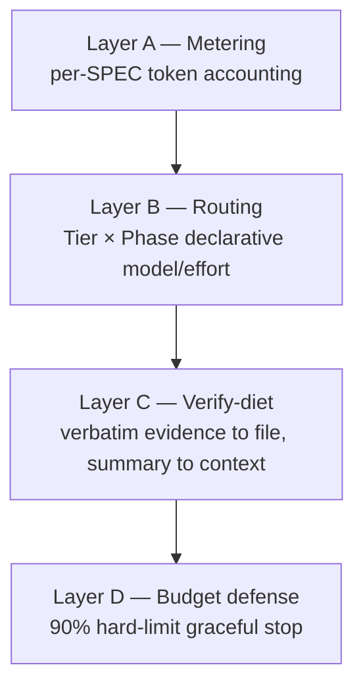
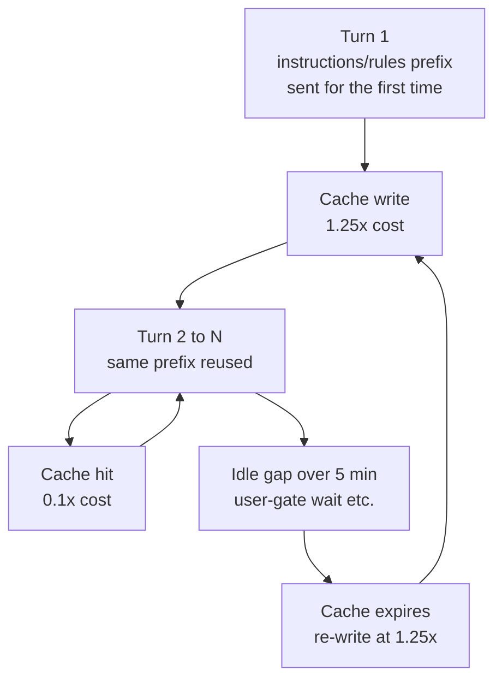

# Tokenomics Overview

Tokenomics (Token Economics) is the first pillar of MoAI-ADK v3.0. Even as per-token prices fall, agentic development consumes tokens at scale, so what determines cost is not the model price but how tokens are managed. This page overviews the tokenomics architecture and links to the deep-dive pages for each sub-topic.

## Why Tokenomics

As multiple agents run, contexts grow longer, and reasoning deepens, a single session's token consumption increases sharply. When token-price declines cannot keep pace with token-usage growth, how the harness measures, routes, diets, and defends tokens becomes the core axis of cost competitiveness.

MoAI-ADK's answer has three parts.

1. **Assign the right model and reasoning depth per task** — deep for planning, cheap for implementation, independent for verification.
2. **Diet the context** — minimize always-loaded instructions and measure prompt-cache hit rate.
3. **System-enforced budget** — track token usage and stop gracefully before the threshold is exceeded.

## The 3-Pillar Narrative

v3.0 product differentiation consists of three core values. Tokenomics is the first, tightly connected to the other two.

 **Tokenomics** (this page) — meter, route, diet, defend.

 **Autonomous Continuation Loops** — when to stop, when to continue. Covered in the [Autonomous Continuation Loops](/en/advanced/autonomous-loops/) page.

 **Agentic Harness** — which agent, at which profile, how it evolves. Covered in the [3-Tier Architecture](/en/advanced/no-haiku-3tier/), [Profile Matrix](/en/advanced/profile-matrix/), and [Harness Self-Evolution](/en/advanced/self-evolving/) pages.

## The 4-Layer Tokenomics Structure

Tokenomics consists of four layers. Each layer operates independently while complementing the others.

### Layer A — Metering

 Every agent call's token usage is accounted at the per-SPEC level. The token column in `moai spec audit` output and the token-accounting section in progress.md are this layer's outputs. Without knowing what consumed tokens, optimization is impossible.

### Layer B — Routing

 Models and reasoning depth (effort) are declaratively assigned to each retained agent. The active profile (`high`/`medium`/`low`) selects one column of the profile matrix, placing each agent on the reasoning-depth rung its work warrants and reserving Sonnet for single-shot mechanical rows, maximizing quality per cost. For the detailed profile matrix, see the [Profile Matrix](/en/advanced/profile-matrix/) page.

### Layer C — Verify-diet

 Long verification-command output is redirected to disk files, and only the exit code and a bounded tail (max 50 lines) remain in context. This file-redirect contract reduces context consumption while maintaining verification-evidence integrity. For the detailed mechanism, see the [Token Budget Management and Graceful Stop](/en/advanced/token-budget/) page.

### Layer D — Budget defense

 When an agent's token usage reaches the hard-limit (default 90%), a graceful abort is performed. Progress is saved to progress.md, a paste-ready resume message is emitted, and auto-`/clear` is never performed. For the detailed procedure, see the [Token Budget Management and Graceful Stop](/en/advanced/token-budget/) page.

## Prompt Cache: Reusing the Same Instructions Cheaply

A cost structure often overlooked in tokenomics is the prompt cache — a feature that briefly stores previously sent input. Anthropic's prompt caching works as a prefix match over the front of the rendered request (in the order tools → system → messages). The first time, that prefix must be written to the cache at 1.25× cost, but subsequent turns reusing the same prefix read it at 0.1× cost. This is a structure that can make a single turn's input nearly 10× cheaper.

There are two traps here.

First, the cache lifetime is 5 minutes. But this 5 minutes is not "expires after 5 minutes" — it is "expires when an idle gap longer than 5 minutes occurs." When the wait at a user gate stretches on, the cache expires, and the next turn must re-write the entire prefix at 1.25×. So a question asked late costs more.

Second, a cache cannot be read while it is being written. When multiple agents sharing the same definition are launched at once, the simultaneously departing requests do not wait for the first to finish writing to the cache, so each re-writes the prefix cold.

Because of this structure, MoAI-ADK consciously adjusts execution order. User gates are asked early when the context is small; when launching multiple agents of the same kind in parallel, one is spawned first to warm the cache before the rest follow (stagger-spawn); session-start instruction files are not edited mid-session but deferred to the end of the task. The cache does not change gate semantics — approval gates remain mandatory, and cache-aware execution only adjusts *when* and *in what order* those gates are asked.

## Per-Model Context Thresholds

The operational threshold at which the budget guard stops is model-specific. Larger windows tolerate higher utilization; smaller windows have less absolute headroom.

| Model class | Window | Handoff threshold | Absolute ceiling |
|-------------|--------|-------------------|------------------|
| Opus 5 (1M) | 1,000,000 tokens | 50% | ~500,000 tokens |
| GLM-5.2 (1M) | 1,000,000 tokens | 50% | ~500,000 tokens |
| Fable (256K) | 256,000 tokens | 90% | ~230,000 tokens |
| Sonnet / Opus standard (200K) | 200,000 tokens | 90% | ~180,000 tokens |

The 1M-context models (Opus 5, GLM-5.2) recommend handoff at 50%. A wider window does not mean using it to the end — folding earlier to protect cache and headroom is the more stable choice. Watch the statusline context gauge (CW%) and prepare a `/clear` as you approach the threshold. For the detailed procedure and handoff-message structure, see the [Token Budget Management and Graceful Stop](/en/advanced/token-budget/) page.

## Model Tier Routing

What concretizes Layer B's routing is the model profile policy. MoAI-ADK v3.0 excludes Haiku from the routing model set and distributes work across a 3-tier structure keyed to task character — Sonnet on single-shot rows, Opus across the agentic ladder, and `max` effort on the two rarest-invocation rows. The rationale for this design and the profile matrix implementation are covered in the next two pages.

- [3-Tier Agent Architecture](/en/advanced/no-haiku-3tier/) — why Haiku is excluded, DeepSWE leaderboard rationale
- [Profile Matrix](/en/advanced/profile-matrix/) — the single 3-column per-agent profile matrix

## CG Mode (Cost Optimization)

`moai cg` is a hybrid mode combining a Claude leader with GLM workers. Strategy, planning, and audit are handled by Claude, while high-volume implementation work is handled by GLM. This yields a 60-70% cost reduction on implementation-heavy tasks.

GLM-5.2 is a 1M-context single model priced at $2 input / $8 output (per 1M tokens), with z.ai implicit prompt caching applied automatically. Although Claude Code reports `context_window_size` based on the Claude slot (so a GLM session's raw value may show ~180K), MoAI corrects it to 1M and operates at the 50% threshold. Trust the statusline CW% gauge. For details on CG mode and standalone GLM sessions (`moai glm`), see the [Multi-Model Audit](/en/advanced/multi-model-audit/) page.

## Verified Facts and Roadmap

The implementation status of the content on this page is clearly distinguished.

 **Implemented (shipped)** — all 4 layers (A/B/C/D), 3-tier model policy (profile matrix resolver), CG mode, verify-diet file-redirect contract, graceful-abort mechanism.

 **Design-stage (roadmap)** — the GLM backend effort overlay's wire effectiveness is a verification item requiring live GLM session outbound observation. The Profile Matrix page states this distinction explicitly.

## Next Steps

- [Token Budget Management and Graceful Stop](/en/advanced/token-budget/) — Layer D deep-dive (per-model thresholds, paste-ready resume structure)
- [3-Tier Agent Architecture](/en/advanced/no-haiku-3tier/) — harness architecture foundation
- [Profile Matrix](/en/advanced/profile-matrix/) — the single 3-column per-agent profile matrix
