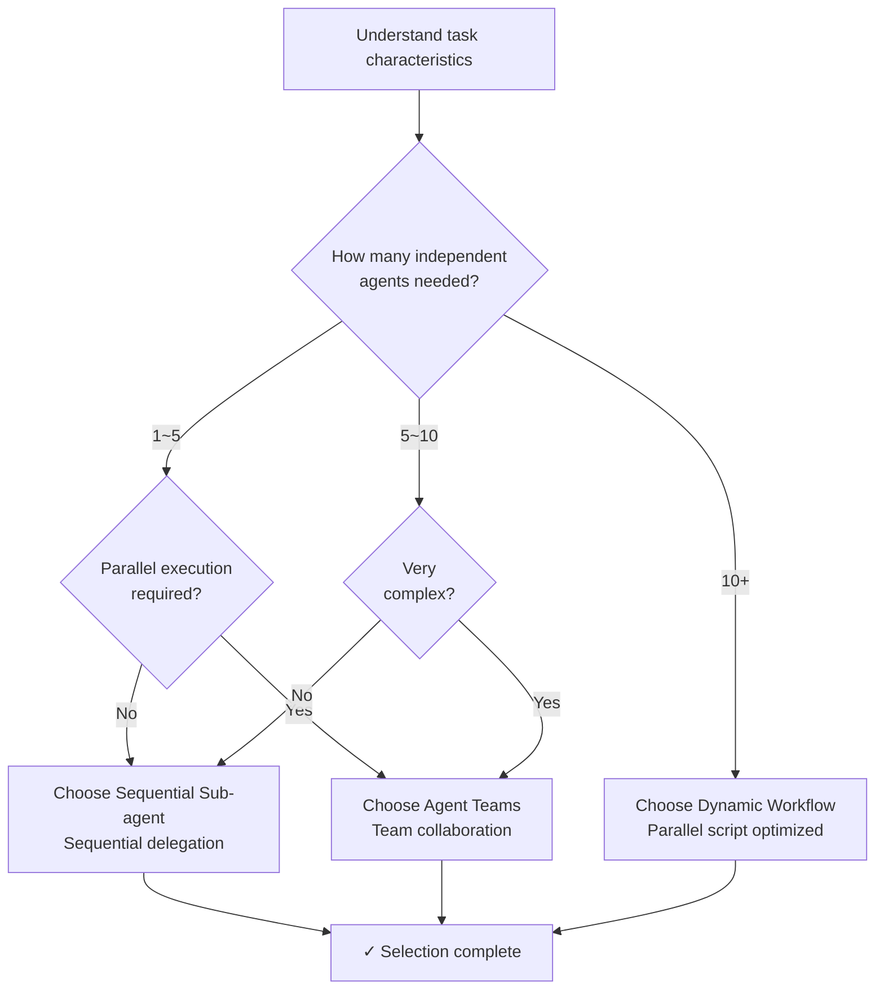

Guide to Claude Code's dynamic workflow primitives and MoAI-ADK's Ultracode integration.


**One-line summary**: Dynamic Workflows are automation scripts written in JavaScript that coordinate dozens to hundreds of agents in parallel. Ultracode is triggered via `/effort ultracode` or the `ultracode` keyword.


## Three Orchestration Primitives

MoAI-ADK provides **three different orchestration primitives**, each optimized for different use cases.

### 1. Sequential Sub-agents

MoAI's default mode — delegates one agent per turn sequentially.

| Characteristic | Description |
|---|---|
| **Plan location** | Claude's context (turn-by-turn decision) |
| **Intermediate results** | Accumulate in Claude's context window |
| **Parallelism** | Sequential execution (1 agent per turn) |
| **Scale** | Typically 3~5 agents |
| **Context cost** | Each agent result consumes context |

**When to use**:
- Simple 1~5 agent tasks
- Coding-focused run-phase work
- High inter-agent dependencies

### 2. Agent Teams

Multiple teammates collaborate via **shared TaskList** in advanced mode.

| Characteristic | Description |
|---|---|
| **Plan location** | Shared TaskList (team coordination) |
| **Intermediate results** | TaskList + per-teammate context |
| **Parallelism** | 3~5 simultaneous (Anthropic recommendation) |
| **Scale** | Small team (3~5 members) |
| **Context cost** | Independent context per teammate |

**When to use**:
- Multiple teammates working in parallel
- Cross-layer dependencies (backend ↔ frontend)
- Teammate handoff and review needed

### 3. Dynamic Workflows

**Automation scripts** written in JavaScript coordinate many agents.

| Characteristic | Description |
|---|---|
| **Plan location** | Script code (declarative plan) |
| **Intermediate results** | Script variables (no context accumulation) |
| **Parallelism** | Up to 16 concurrent (up to 1000 total) |
| **Scale** | Very large (dozens to hundreds of agents) |
| **Context cost** | Final results only |

**When to use**:
- Large-scale parallel work (dozens to hundreds of agents)
- Codebase-wide scans
- Large-scale migrations
- Cross-source verification

## Selection Decision Tree

Flowchart for choosing which primitive to use.



## Ultracode and Dynamic Workflows

### /effort ultracode

```bash
/effort ultracode
```

Enables **automatic workflow generation** for all substantive tasks in the current session.

**Effects**:
- Reasoning effort: Set to `xhigh`
- Auto-workflow generation enabled
- Each task selects optimal orchestration primitive

**When to use**:
- Very complex multi-phase tasks
- Large projects requiring auto-orchestration

### ultracode Keyword

Triggers workflows in a single request.

```bash
> Find and categorize all TODO comments in our codebase.
> (Without ultracode keyword triggers regular sub-agent)

VS

> ultracode: Find and categorize all TODO comments in our codebase.
> (Auto-generates workflow)
```

## Dynamic Workflow Structure

### Basic Script Template

```javascript
// Workflow script: categorize all TODO comments across codebase
const packages = [
  "internal/auth",
  "internal/api",
  "internal/db",
  "pkg/utils"
];

const results = [];

for (const pkg of packages) {
  // Create independent agent per package
  const result = await agent({
    agentType: "Explore",
    model: "haiku",
    effort: "low",
    prompt: `
      Find all TODO comments in ${pkg} package and categorize them.
      Format: [file] [line] [category] [text]
    `
  });
  results.push({ pkg, todos: result });
}

// Final synthesis
const summary = {
  total_packages: packages.length,
  package_summaries: results,
  grand_total_todos: results.reduce((sum, r) => sum + r.todos.length, 0)
};

return summary;
```

### Characteristics

| Item | Description |
|---|---|
| **Agent creation** | Dynamic creation via loop (`await agent({...})`) |
| **Intermediate results** | Stored in script variables (no context accumulation) |
| **Parallel execution** | Independent tasks auto-parallelize (max 16 concurrent) |
| **Final return** | Integrated results only returned to session |

## MoAI Integration Considerations

### AskUserQuestion Constraint

Workflow agents **cannot interact directly with users**.

```
❌ Workflow agent prompts user → Not possible
✓ MoAI orchestrator collects choices beforehand → Execute workflow
```

**Resolution approach**:
1. MoAI orchestrator calls `AskUserQuestion`
2. Collect user responses
3. Include responses in workflow inputs before execution

### Implementation Kickoff Approval

Workflow execution also requires user approval like regular run-phase.

```
/moai run --workflow SPEC-XXX

→ MoAI: "Execute this SPEC as a workflow. Proceed?"
→ AskUserQuestion approval required
```

### Cost Awareness

Dynamic workflows can incur **high token consumption**.

| Task | Agent Count | Expected Cost |
|---|---|---|
| Small package scan | 5 | Low |
| Medium codebase | 20 | Medium |
| Full repo scan | 100+ | High |

**Cost management**:
- Model: Use `haiku` (read-only extraction)
- Agent count: Limit scope (`packages.slice(0, 20)`)
- Parallelism: Adjust max 16 manually if needed

## Workflow Activation and Configuration

### Activation Requirements

Dynamic workflows run only when:

1. Claude Code v2.1.154+
2. Paid plan (Pro or Team)
3. `/config` has `"disableWorkflows": false`

### Disabling

Disable at organization or user level:

```bash
/config
# Turn off Dynamic workflows toggle

OR

export CLAUDE_CODE_DISABLE_WORKFLOWS=1
```

## Related Documentation

- [Harness v4 Builder](/advanced/builder-agents) - Dynamic team creation
- [Agent Guide](/advanced/agent-guide) - Agent system overview
- [SPEC-Based Development](/workflow-commands/moai-plan) - Integrated workflow


**Tip**: For small scale, Sequential Sub-agents is sufficient. Use dynamic workflows only when you need "parallel coordination of dozens to hundreds of independent tasks".

