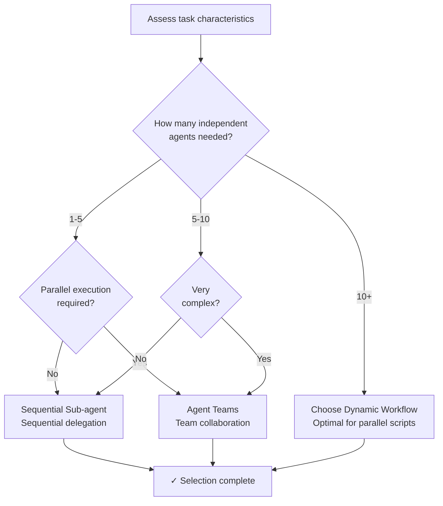

Delegate 100 agents sequentially and your context collapses first. Dynamic workflows solve this by keeping the plan in **script variables** rather than in Claude's context — intermediate results stay in the script, and only the final result returns to the session. It is where tokenomics meets loop engineering: enabling massive fan-out while containing context cost.


**One-line summary**: Dynamic workflows are automation scripts written in JavaScript that orchestrate dozens to hundreds of agents in parallel. Ultracode is triggered by `/effort ultracode` or the `ultracode` keyword.


## The 3 Orchestration Primitives

MoAI-ADK provides **3 orchestration primitives**, and the selection criterion is "who holds the plan."

### 1. Sequential Sub-agents

MoAI's default mode — delegating one agent per turn, in sequence.

| Characteristic | Description |
|------|------|
| **Plan location** | Claude's context (turn-by-turn judgment) |
| **Intermediate results** | Accumulate in Claude's context window |
| **Parallelism** | Sequential execution (1 agent per turn) |
| **Scale** | Typically 3-5 agents |
| **Context cost** | Every agent result consumes context |

**When to use**:
- Simple 1-5 agent tasks
- Coding-centric run-phase work
- When agents have many inter-dependencies

### 2. Agent Teams

A mode where multiple teammates collaborate via a **shared TaskList**.

| Characteristic | Description |
|------|------|
| **Plan location** | Shared TaskList (cross-team coordination) |
| **Intermediate results** | TaskList + each teammate's context |
| **Parallelism** | 3-5 concurrent (Anthropic recommendation) |
| **Scale** | Small teams (3-5 members) |
| **Context cost** | Independent context per teammate |

**When to use**:
- Multiple teammates working in parallel
- Cross-layer dependencies (backend ↔ frontend)
- Collaboration and review between teammates needed


In v3.0, MoAI's Agent Teams **static orchestration layer was retired**. Forcing `--team` falls back to sub-agent mode. The native Claude Code teammate runtime (e.g. the GLM panes of `moai cg`) continues to operate.


### 3. Dynamic Workflows

**Automation scripts** written in JavaScript orchestrate many agents.

| Characteristic | Description |
|------|------|
| **Plan location** | Script code (declarative plan) |
| **Intermediate results** | Script variables (no context accumulation) |
| **Parallelism** | Up to 16 concurrent (up to 1000 total) |
| **Scale** | Very large (dozens to hundreds of agents) |
| **Context cost** | Only the final result consumes context |

**When to use**:
- Large-scale parallel work (dozens to hundreds of agents)
- Whole-codebase scans
- Large migrations
- Cross-source verification

## Selection Decision Tree

A flowchart for deciding which primitive to choose.


```mermaid
flowchart TD
    START[Assess task characteristics] --> Q1{How many independent<br>agents needed?}
    
    Q1 -->|1-5| Q2{Parallel execution<br>required?}
    Q1 -->|5-10| Q3{Very<br>complex?}
    Q1 -->|10+| WORKFLOW["Choose Dynamic Workflow<br>Optimal for parallel scripts"]
    
    Q2 -->|No| SUBAGENT["Sequential Sub-agent<br>Sequential delegation"]
    Q2 -->|Yes| TEAMS["Agent Teams<br>Team collaboration"]
    
    Q3 -->|Yes| TEAMS
    Q3 -->|No| SUBAGENT
    
    SUBAGENT --> DONE["✓ Selection complete"]
    TEAMS --> DONE
    WORKFLOW --> DONE
```

## Ultracode and Dynamic Workflows

### /effort ultracode

```bash
/effort ultracode
```

Enables **automatic workflow generation** for all substantive work in the current session.

**Effects**:
- Reasoning effort: set to `xhigh`
- Automatic workflow generation enabled
- The optimal orchestration primitive is chosen per task

**When to use**:
- Very complex multi-phase work
- Large projects that need automatic orchestration

### The ultracode Keyword

If you want to trigger a workflow for a single request rather than the whole session, use the keyword.

```bash
> 우리 codebase의 모든 TODO 주석을 찾아서 분류해줘.
> (ultracode keyword를 포함하지 않으면 일반 sub-agent 실행)

VS

> ultracode: 우리 codebase의 모든 TODO 주석을 찾아서 분류해줘.
> (워크플로우 자동 생성)
```

## Dynamic Workflow Structure

### Basic Script Template

```javascript
// 워크플로우 스크립트: 코드베이스 전체 TODO 분류
const packages = [
  "internal/auth",
  "internal/api",
  "internal/db",
  "pkg/utils"
];

const results = [];

for (const pkg of packages) {
  // 각 패키지마다 독립 에이전트 생성
  const result = await agent({
    agentType: "Explore",
    model: "haiku",
    effort: "low",
    prompt: `
      ${pkg} 패키지에서 모든 TODO 주석을 찾고 분류하세요.
      형식: [파일] [라인] [카테고리] [내용]
    `
  });
  results.push({ pkg, todos: result });
}

// 최종 종합
const summary = {
  total_packages: packages.length,
  package_summaries: results,
  grand_total_todos: results.reduce((sum, r) => sum + r.todos.length, 0)
};

return summary;
```

### Characteristics

| Item | Description |
|------|------|
| **Agent creation** | Dynamically created in a loop (`await agent({...})`) |
| **Intermediate results** | Stored in script variables (no context accumulation) |
| **Parallel execution** | Independent tasks auto-parallelized (up to 16 concurrent) |
| **Final return** | Only the consolidated result returns to the current session |

## MoAI Integration Considerations

### The AskUserQuestion Constraint

Workflow agents **cannot interact with the user directly**.

```
✗ 워크플로우 에이전트가 사용자 질문 발생 → 불가능
✓ MoAI 오케스트레이터가 사전에 모든 선택지 수집 → 워크플로우 실행
```

**Resolution**:
1. The MoAI orchestrator calls `AskUserQuestion`
2. Collects the user's responses
3. Runs the workflow with the responses included in its input

### Implementation Kickoff Approval

Workflow execution requires user approval just like any run phase. A massive fan-out does not make the human gate disappear.

```
/moai run --workflow SPEC-XXX

→ MoAI: "이 SPEC을 워크플로우로 실행합니다. 진행할까요?"
→ AskUserQuestion 승인 필수
```

### Cost Awareness

Dynamic workflows save context, but **total token consumption can be large**. The fan-out scale is the cost.

| Task | Agent count | Expected cost |
|------|-----------|---------|
| Small package scan | 5 | Low |
| Mid-size codebase | 20 | Medium |
| Full repo scan | 100+ | High |

**Cost controls**:
- Model: use `haiku` (read-only extraction)
- Agent count: limit scope (`packages.slice(0, 20)`)
- Parallelism: manually tune down from the max of 16

## Workflow Activation and Configuration

### Activation Conditions

Dynamic workflows run only under the following conditions.

1. Claude Code v2.1.154+
2. A paid plan (Pro or Team)
3. `"disableWorkflows": false` in `/config`

### Disabling

Can be disabled at the organization or user level.

```bash
/config
# Dynamic workflows toggle 끄기

OR

export CLAUDE_CODE_DISABLE_WORKFLOWS=1
```

## Related Documents

- [Builder Agents and Harness v4](/en/advanced/builder-agents) - dynamic team creation
- [Agent Guide](/en/advanced/agent-guide) - agent system overview
- [SPEC-Based Development](/en/workflow-commands/moai-plan) - integrated workflow


**Tip**: For small workloads, Sequential Sub-agents suffice. Use dynamic workflows only when you need to "orchestrate dozens to hundreds of independent tasks in parallel" — and remember that the fan-out itself is the cost.

