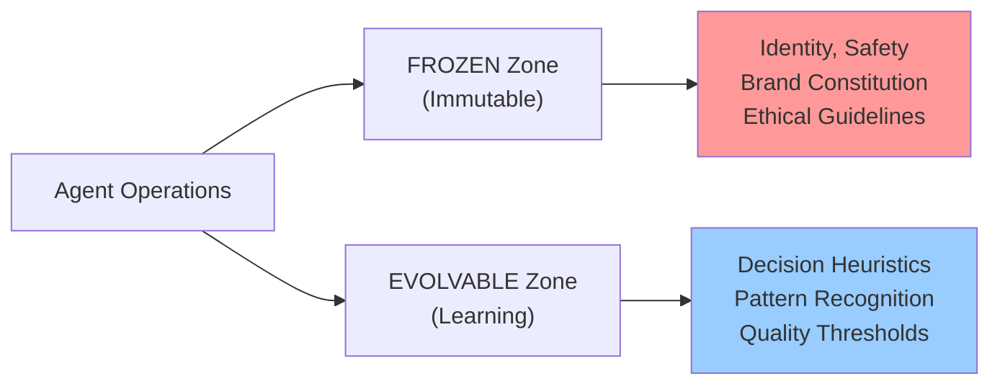
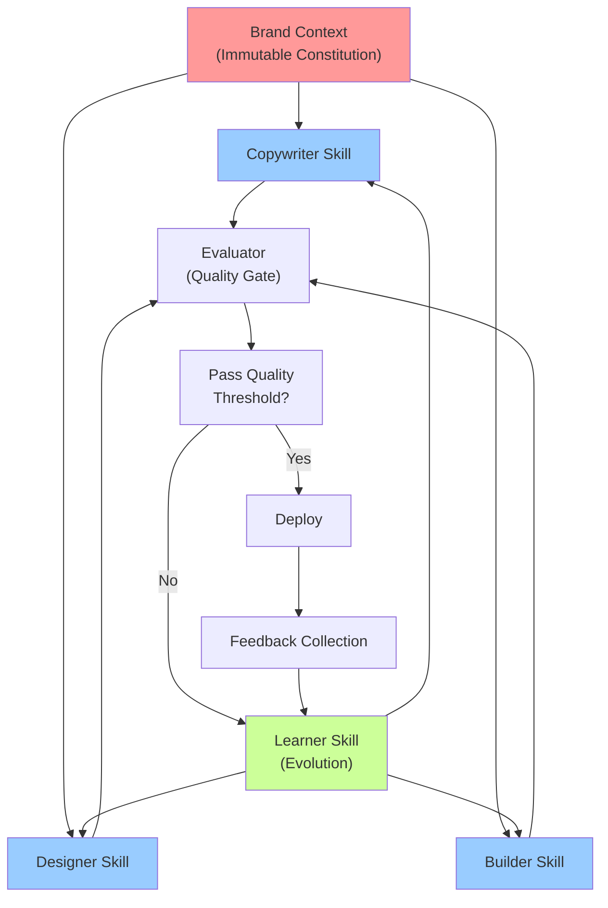


AI Agency uses 6 specialized agents that work together to transform briefs into complete websites. Each agent is optimized for one creative task.


## Agents Overview

| Agent | Role | Model | Isolation | Fork Source |
|-------|------|-------|-----------|------------|
| **Planner** | Expand brief to specification | Opus | Solo | manager-spec |
| **Copywriter** | Generate marketing content | Sonnet | Worktree | Custom |
| **Designer** | Create UI specifications | Sonnet | Worktree | Custom |
| **Builder** | Implement code with TDD | Sonnet | Worktree | expert-frontend |
| **Evaluator** | Quality assurance testing | Haiku | Solo | evaluator-active |
| **Learner** | Meta-evolution orchestration | Sonnet | Solo | Custom |

## Agent Details

### Planner Agent

**Purpose:** Transform client briefs into detailed, structured specifications with acceptance criteria and technical requirements.

**FROZEN Zone (Identity):**
- Always expand briefs using EARS format (Event, Requirement, State, Unwanted)
- Maintain structured specification format with clear sections
- Generate 500+ line specifications even from brief input
- Ensure all acceptance criteria are testable

**EVOLVABLE Zone (Learning):**
- Interview style and clarification question patterns
- Requirement organization and prioritization
- Goal/Outcome format preferences
- Client context synthesis methods

**Input:** 2-3 sentence brief from user

**Output:** Structured BRIEF document with goals, outcomes, requirements, acceptance criteria, technical specifications

**Example Flow:**
```
User: "AI startup landing page for research labs"
↓
Planner asks: What's the primary success metric? Who is the decision-maker?
↓
Output: 
  Goal: Increase trial signups by 15% from research institutions
  Outcome: Professional landing page with demo CTA, deployed in 2 weeks
  Requirements: Hero section, feature showcase, testimonials, pricing, contact form
  Acceptance Criteria: Mobile responsive, < 2s load time, 90+ Lighthouse score
```

---

### Copywriter Agent

**Purpose:** Generate marketing copy, messaging hierarchy, and promotional content aligned with brand voice.

**FROZEN Zone (Identity):**
- Respect brand voice and tone guidelines absolutely
- Never make unsupported claims or use competitor FUD
- Always include calls-to-action aligned with business goals
- Maintain consistent messaging across all copy

**EVOLVABLE Zone (Learning):**
- Headline formulas (what resonates with target audience)
- Benefit messaging vs feature messaging balance
- CTA language and urgency patterns
- Social proof integration strategies

**Input:** BRIEF spec, brand context, target audience profile

**Output:** JSON-structured marketing content with:
- Hero copy (headline, subheading, CTA)
- Feature copy (3-5 key features with benefits)
- Testimonials/social proof
- Pricing/plan descriptions
- Footer/legal copy

**Model:** Sonnet (balance of speed and quality)

**Example Output:**
```json
{
  "hero": {
    "headline": "Collaboration Built for Scientists",
    "subheading": "Real-time research data sharing, version control, and team insights in one platform",
    "cta": "Start Your Free Trial"
  },
  "features": [
    {
      "title": "Instant Collaboration",
      "benefit": "Your team moves faster when everyone sees the same data at the same time",
      "proof": "Teams save 8+ hours per week on data synchronization"
    }
  ]
}
```

---

### Designer Agent

**Purpose:** Create UI specifications, design system documentation, and visual hierarchy guidelines.

**FROZEN Zone (Identity):**
- Always adhere to brand color palette and typography
- Ensure WCAG 2.1 AA accessibility compliance
- Maintain consistent spacing and sizing scales
- Design for mobile-first responsive layout

**EVOLVABLE Zone (Learning):**
- Component structure preferences
- Visual hierarchy patterns (what works for conversions)
- Whitespace and layout balance
- Icon and imagery selection strategies

**Input:** BRIEF spec, brand context, copywriter output

**Output:** UI specification with:
- Component designs (Hero, Card, Button, Form, etc.)
- Layout specifications (grid, spacing, sizing)
- Typography hierarchy (heading scales, body text)
- Color usage guide
- Responsive breakpoints
- Interaction patterns

**Model:** Sonnet (design reasoning requires careful consideration)

---

### Builder Agent

**Purpose:** Implement all code using Test-Driven Development methodology with full test coverage and documentation.

**FROZEN Zone (Identity):**
- Always write tests first (RED phase)
- Maintain 85%+ test coverage
- Use TypeScript for type safety
- Follow accessibility standards (WCAG 2.1 AA)
- Include JSDoc comments for all exports

**EVOLVABLE Zone (Learning):**
- Component structure patterns
- State management approaches
- Integration patterns with APIs
- Performance optimization techniques

**Input:** Designer specs, copywriter content, technical context

**Output:** Production-ready code:
- React/Next.js components with TypeScript
- Test files (Vitest/Jest)
- Documentation and JSDoc
- Deployment configuration
- Performance optimizations

**Model:** Sonnet (code quality requires precision)

**Isolation:** Worktree (parallel builders need file isolation)

---

### Evaluator Agent

**Purpose:** Automated quality assurance using 4 weighted criteria and Playwright testing.

**FROZEN Zone (Identity):**
- Always run all 4 criteria for complete evaluation
- Block deployment if any criterion fails minimum threshold
- Generate detailed failure reports with remediation
- Enforce GAN loop on rejections (max 5 iterations)

**EVOLVABLE Zone (Learning):**
- Weighting adjustments based on business priorities
- New test cases based on past failures
- Performance thresholds refinement
- Accessibility testing patterns

**Evaluation Criteria:**
- **Design Quality (25%)** - Brand alignment, visual hierarchy, spacing
- **Code Quality (25%)** - Test coverage, type safety, documentation
- **Performance (25%)** - Load time < 2s, Lighthouse 90+, Core Web Vitals
- **Accessibility (25%)** - WCAG 2.1 AA compliance, keyboard nav, screen readers

**Model:** Haiku (evaluation is rule-based, doesn't need Opus reasoning)

**Output:** Quality report with score and pass/fail for each criterion

---

### Learner Agent

**Purpose:** Meta-evolution orchestrator that analyzes feedback patterns and improves all other agents.

**FROZEN Zone (Identity):**
- Never modify brand constitution or safety guidelines
- Always validate improvements against quality thresholds
- Require 5+ occurrences before promoting heuristics to rules
- Maintain complete evolution audit trail

**EVOLVABLE Zone (Learning):**
- This agent learns how to improve itself
- Pattern detection algorithms
- Confidence scoring for new rules
- Rollback mechanisms for unsuccessful changes

**Input:** Feedback collection from users and evaluator results

**Output:**
- learnings.md (extracted patterns)
- rule-candidates.md (proposed improvements)
- Skill module updates (generation increments)

**Evolution Trigger Thresholds:**
- 1 occurrence: Record observation
- 3 occurrences: Generate heuristic (provisional rule)
- 5 occurrences: Promote to high-confidence rule
- 10+ occurrences: Integrate into core skill

---

## Dual Zone Architecture

Every agent has two zones that define how it operates:



**FROZEN Zone** (Red) - Cannot be modified by learning:
- Brand voice and tone
- Safety guidelines and ethical constraints
- Accessibility requirements
- Legal compliance rules
- Core decision-making patterns

**EVOLVABLE Zone** (Blue) - Improves through feedback:
- Copywriting formulas
- Design patterns
- Code structure preferences
- Performance optimization strategies
- Pattern recognition heuristics

This architecture prevents Agency from drifting away from your core brand while allowing continuous improvement in creative domains.

---

## Skill Modules

| Module | Purpose | Base Context | Triggers |
|--------|---------|--------------|----------|
| **copywriter** | Copy generation and messaging | brand.md, audience.md | Every build, evolves from feedback |
| **designer** | UI design and layout | brand.md, technical.md | Every build, learns visual patterns |
| **builder** | Code implementation | technical.md, governance.md | Every build, improves TDD patterns |
| **evaluator** | Quality testing and validation | business.md, governance.md | Every build, raises thresholds |
| **learner** | Evolution and improvement | All contexts, all feedback | Triggered manually, incremental |

### Static Zone vs Dynamic Zone

**Static Zone (Frozen):**
- Core skill modules (copywriter/, designer/, builder/)
- Brand context files (brand.md, audience.md, governance.md)
- Constitutional rules (never violate brand voice)
- Safety guidelines (WCAG, OWASP, legal)

**Dynamic Zone (Evolvable):**
- learnings.md (pattern database)
- rule-candidates.md (proposed improvements)
- Individual skill configurations (*.config.yaml)
- Decision heuristics and weights

---

## Skill Dependency Graph



---

## Copying Moai Skills for Self-Evolution

Agency can copy and specialize moai-adk skills for its own domain. The copy mechanism enables Agency to learn independently while staying synchronized with moai-adk improvements.

**Example: Creating agency-lang-python from moai-lang-python**

When Agency needs Python-specific skills for backends or integrations, it copies the moai-lang-python skill:

```
agency-lang-python/
├── SKILL.md (specialized for Agency)
├── modules/
│   ├── agency-patterns.md (Agency-specific patterns)
│   ├── fastapi-patterns.md (inherits from moai)
│   └── database-patterns.md (specialized for Agency projects)
├── examples.md (Agency project examples)
└── reference.md (Agency-specific reference)
```

**Inheritance Model:**
- Base content copied from moai-adk skill
- Agency-specific sections added (copywriting API endpoints, design-aware backends)
- Learning loop updates agency-* versions
- moai-adk updates merged via 3-way diff (fork-manifest.yaml)

This allows Agency to:
1. Learn domain-specific patterns from feedback
2. Stay synchronized with moai-adk improvements
3. Resolve conflicts when both sides evolve
4. Maintain independent evolution for creative domains

---

## Agent Spawning and Isolation

When you execute `/agency build`, Agency spawns agents with specific isolation and execution modes:

**Spawning Pattern:**
```
Agent(
  subagent_type: "general-purpose",
  model: "sonnet",
  isolation: "worktree",
  mode: "acceptEdits",
  name: "copywriter-build-001"
)
```

**Isolation Levels:**
- **Solo** (planner, evaluator, learner) - No worktree, full context access
- **Worktree** (copywriter, designer, builder) - Isolated filesystem, prevents conflicts

**Parallel Execution:**
When using `--team` mode, copywriter and designer agents spawn in parallel with separate worktrees, reducing total execution time by 30-40%.

---

## Next Steps

Explore [Self-Evolution System](/en/agency/self-evolution) to understand how feedback transforms into improved agents, or jump to [Command Reference](/en/agency/command-reference) for all available commands.
