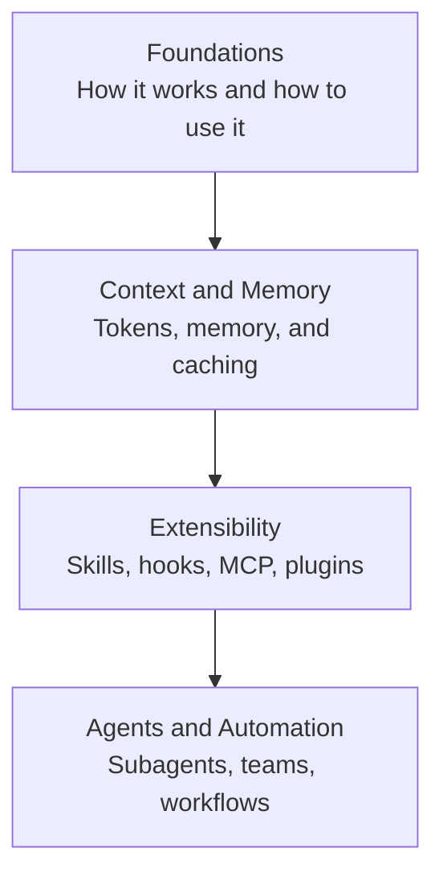

This section is a learning path for understanding Claude Code, Anthropic's terminal CLI, from the ground up. It is a guide for developers who are new to Claude Code, as well as for those who want to accurately grasp the foundation on which MoAI-ADK operates.

Claude Code is a coding agent that runs in your terminal — it reads and modifies code, executes commands, and works through conversation with the developer. MoAI-ADK is an orchestration layer that operates on top of Claude Code, adding SPEC-based workflows and delegation to specialized agents. To make the most of MoAI-ADK, it is therefore important to first understand the underlying platform (Claude Code itself).


**TL;DR**: This section is the stage for learning Claude Code itself — the tool (the platform). MoAI's own usage patterns are covered later in the Core Concepts and Advanced sections.


## Learning Path

First, the Foundations group teaches you how Claude Code works, and then Context and Memory management solidifies the essentials of long sessions. After that, Extensibility broadens its capabilities, and finally Agents and Automation takes you all the way to autonomous execution.

## Contents

| Document | Description |
|------|------|
| [Foundations](/claude-code/foundations) | How Claude Code works and the basics of using it |
| [Context and Memory](/claude-code/context-memory) | Managing tokens, context, memory, caching, and checkpoints |
| [Extensibility](/claude-code/extensibility) | Extending functionality with skills, hooks, MCP, and plugins |
| [Agents and Automation](/claude-code/agentic) | Subagents, teams, workflows, and autonomous execution |

Once you complete the four groups in order, you will understand the Claude Code platform as a whole. From there, move on to the MoAI-ADK Core Concepts section to see how to carry out SPEC-based development on top of this foundation.
