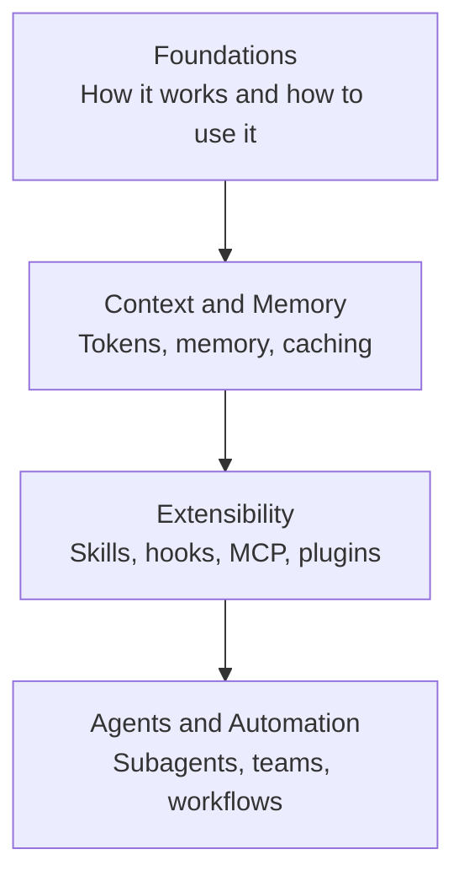

This section is a learning path for understanding Claude Code, Anthropic's terminal CLI, from scratch. It is a guide for developers who are new to Claude Code, and for anyone who wants a precise grasp of the foundation MoAI-ADK operates on.

Claude Code is a coding agent that runs in the terminal — it reads and modifies code, executes commands, and works through conversation with the developer. MoAI-ADK is an orchestration layer that runs on top of Claude Code, and its three core values — **Tokenomics** (Token Economics), **Agentic Loop Engineering** (recursive self-learning), and the **Agentic Harness** — are all built on the fundamental Claude Code mechanisms covered in this section. You cannot design tokenomics without knowing the context window and prompt caching, you cannot understand agentic loops without knowing subagents and `/goal`, and you cannot build a harness without knowing skills, hooks, and MCP.


**One-line summary**: This section is where you learn Claude Code itself — the tool (platform). How MoAI-ADK builds its three pillars on this foundation is covered in the Core Concepts and Advanced Learning sections.


## Learning Flow

```mermaid
flowchart TD
    A[Foundations<br/>How it works and how to use it] --> B[Context and Memory<br/>Tokens, memory, caching]
    B --> C[Extensibility<br/>Skills, hooks, MCP, plugins]
    C --> D[Agents and Automation<br/>Subagents, teams, workflows]
```

Start with the Foundations group to learn how Claude Code's agentic loop turns, then build your token-economy fundamentals with context and memory management. Next, gather the harness ingredients in Extensibility, and finally advance to autonomous execution loops in Agents and Automation.

## Contents — Four Groups Mapped to the Three Pillars

| Document | Description | Connected MoAI pillar |
|------|------|--------------------|
| [Foundations](/claude-code/foundations) | How Claude Code works and basic usage | Shared foundation of all three pillars |
| [Context and Memory](/claude-code/context-memory) | Managing tokens, context, memory, caching, checkpoints | Tokenomics |
| [Extensibility](/claude-code/extensibility) | Extending capabilities with skills, hooks, MCP, plugins | Agentic Harness |
| [Agents and Automation](/claude-code/agentic) | Subagents, teams, workflows, autonomous execution | Agentic Loop Engineering |

Completing the four groups in order gives you an understanding of the entire Claude Code platform. From there, move on to the MoAI-ADK Core Concepts section to see how SPEC-based development and token-efficient design combine on top of this foundation.
