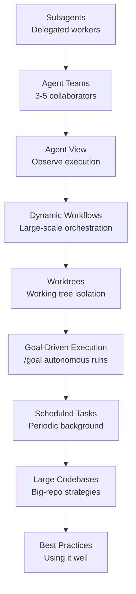

This group covers Claude Code's agent orchestration and autonomous execution. It is written for developers who want to learn how to delegate to multiple workers beyond a single conversation, collaborate as a team, and fan out large tasks with scripts.

Centered on three orchestration primitives — subagents, agent teams, and dynamic workflows — it then moves through worktree isolation, goal-driven execution, scheduled tasks, large-codebase exploration, and best practices in turn.


**TL;DR**: Choose who (a subagent, a team, or a workflow) runs which task, then learn how to operate autonomous execution reliably with worktree, goal, scheduling, and scaling strategies.


## Learning Path

We recommend first understanding the three orchestration primitives (subagents → agent teams → dynamic workflows), then expanding with worktree, goal, scheduling, and scaling strategies, and finishing with best practices.

## Contents

| Document | Description |
|------|------|
| [Subagents](/claude-code/agentic/sub-agents) | Delegated workers in isolated contexts |
| [Agent Teams](/claude-code/agentic/agent-teams) | 3-5 member team collaboration |
| [Agent View](/claude-code/agentic/agent-view) | Execution observation screen |
| [Dynamic Workflows](/claude-code/agentic/workflows) | Script-based large-scale orchestration |
| [Worktrees](/claude-code/agentic/worktrees) | Working tree isolation |
| [Goal-Driven Execution (/goal)](/claude-code/agentic/goal) | Autonomous execution until the condition is met |
| [Scheduled Tasks](/claude-code/agentic/scheduled-tasks) | Periodic background execution |
| [Large Codebases](/claude-code/agentic/large-codebases) | Big-repository exploration strategies |
| [Best Practices](/claude-code/agentic/best-practices) | How to use Claude Code well |

Start by reading [Subagents](/claude-code/agentic/sub-agents) to learn the basic unit of delegation, then move on to the next document.
