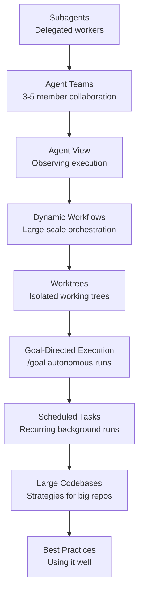

This group covers Claude Code's agent orchestration and autonomous execution. It is for developers who want to go beyond a single conversation — delegating to multiple workers, collaborating as a team, and fanning out large-scale work with scripts.

Centered on the three orchestration primitives — subagents, agent teams, and dynamic workflows — it continues through worktree isolation, goal-directed execution, scheduled tasks, large-codebase exploration, and best practices. What MoAI-ADK calls **Agentic Loop Engineering** — designing the loop itself instead of having a human intervene every turn, and training the harness with the observations the loop leaves behind — is built precisely on the mechanisms in this group (`/goal`'s condition-evaluation loop, subagent delegation, workflow fan-out).


**One-line summary**: Choose who executes a given task (subagents, teams, or workflows), then learn to operate autonomous execution loops reliably using worktrees plus goal, scheduling, and scale strategies.


## Learning Flow

```mermaid
flowchart TD
    A[Subagents<br>Delegated workers] --> B[Agent Teams<br>3-5 member collaboration]
    B --> C[Agent View<br>Observing execution]
    C --> D[Dynamic Workflows<br>Large-scale orchestration]
    D --> E[Worktrees<br>Isolated working trees]
    E --> F[Goal-Directed Execution<br>/goal autonomous runs]
    F --> G[Scheduled Tasks<br>Recurring background runs]
    G --> H[Large Codebases<br>Strategies for big repos]
    H --> I[Best Practices<br>Using it well]
```

We recommend first understanding the three orchestration primitives (subagents → agent teams → dynamic workflows), then extending into worktrees plus goal, scheduling, and scale strategies, and finishing with best practices.

## Contents

| Document | Description |
|------|------|
| [Subagents](/claude-code/agentic/sub-agents) | Delegated workers in isolated contexts |
| [Agent Teams](/claude-code/agentic/agent-teams) | 3-5 member team collaboration |
| [Agent View](/claude-code/agentic/agent-view) | The execution observation screen |
| [Dynamic Workflows](/claude-code/agentic/workflows) | Script-based large-scale orchestration |
| [Worktrees](/claude-code/agentic/worktrees) | Isolated working trees |
| [Goal-Directed Execution (/goal)](/claude-code/agentic/goal) | Autonomous execution until a condition holds |
| [Scheduled Tasks](/claude-code/agentic/scheduled-tasks) | Recurring background execution |
| [Large Codebases](/claude-code/agentic/large-codebases) | Strategies for exploring big repositories |
| [Best Practices](/claude-code/agentic/best-practices) | Using Claude Code well |

Start with [Subagents](/claude-code/agentic/sub-agents) to learn the basic unit of delegation, then move on to the next documents.
