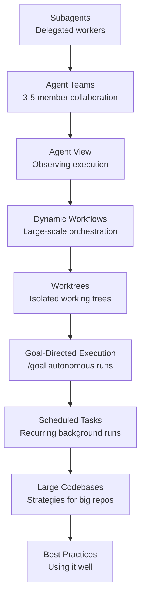

This group covers Claude Code's agent orchestration and autonomous execution. It is for developers who want to go beyond a single conversation — delegating to multiple workers, collaborating as a team, and fanning out large-scale work with scripts.


This page is background material on **Claude Code itself**, the platform MoAI-ADK runs on. MoAI-ADK's own features are covered in the sections above it in the sidebar.


## Three Orchestration Primitives

At the heart of this group stand three **orchestration primitives** — subagents, agent teams, and dynamic workflows. All three "perform multi-step work", but they differ in **who holds the plan**. That single question separates the three, and it is also the key that anchors this entire group's understanding.

| Primitive | Identity | Where the plan lives |
|------|------|---------------|
| **Subagent** | A one-shot worker spawned by Claude | In Claude's head (decided per turn) |
| **Agent Teams** | Sessions collaborating via a shared task list | Shared list + Claude's coordination |
| **Dynamic Workflow** | A JavaScript script executed by the runtime | In the script's code |

Subagents and agent teams have Claude, as orchestrator, decide what to build each turn, and the results land in Claude's context. A dynamic workflow, by contrast, holds its own coordination logic inside the script, so the intermediate output of hundreds of agents does not fill the orchestrator's context. That difference is the heart of "why workflows win for large-scale fan-out".

## Beyond Delegation to Autonomous Execution

Centered on the three orchestration primitives — subagents, agent teams, and dynamic workflows — it continues through worktree isolation, goal-directed execution, scheduled tasks, large-codebase exploration, and best practices. What MoAI-ADK calls **Agentic Loop Engineering** — designing the loop itself instead of having a human intervene every turn, and training the harness with the observations the loop leaves behind — is built precisely on the mechanisms in this group (`/goal`'s condition-evaluation loop, subagent delegation, workflow fan-out).


**One-line summary**: Choose who executes a given task (subagents, teams, or workflows), then learn to operate autonomous execution loops reliably using worktrees plus goal, scheduling, and scale strategies.



This group is the heart of recent Claude Code changes. **Subagent nesting** is enabled again by default since v2.1.219, allowing nested spawns up to depth 3 (disable with `CLAUDE_CODE_MAX_SUBAGENT_SPAWN_DEPTH=1`), and **background execution** became the default in v2.1.198. The latest **Opus 4.7+/4.8/5** models do not auto-spawn subagents and prioritize reasoning, so explicit instruction is recommended when delegation is needed; keeping agent definition bodies concise improves spawn cost and cache efficiency. **Dynamic workflows** are available from v2.1.154+. Specific versions and implications are revisited in each document.


## Learning Flow

```mermaid
flowchart TD
    A[Subagents<br>Delegated workers] --> B[Agent Teams<br>3-5 member collaboration]
    B --> C[Agent View<br>Observing execution]
    C --> D[Dynamic Workflows<br>Large-scale orchestration]
    D --> E[Worktrees<br>Isolated working trees]
    E --> F[Goal-Directed Execution<br>/goal autonomous runs]
    F --> G[Scheduled Tasks<br>Recurring background runs]
    G --> H[Large Codebases<br>Strategies for big repos]
    H --> I[Best Practices<br>Using it well]
```

We recommend first understanding the three orchestration primitives (subagents → agent teams → dynamic workflows), then extending into worktrees plus goal, scheduling, and scale strategies, and finishing with best practices.

## Contents

| Document | Description |
|------|------|
| [Subagents](/en/claude-code/agentic/sub-agents) | Delegated workers in isolated contexts |
| [Agent Teams](/en/claude-code/agentic/agent-teams) | 3-5 member team collaboration |
| [Agent View](/en/claude-code/agentic/agent-view) | The execution observation screen |
| [Dynamic Workflows](/en/claude-code/agentic/workflows) | Script-based large-scale orchestration |
| [Worktrees](/en/claude-code/agentic/worktrees) | Isolated working trees |
| [Goal-Directed Execution (/goal)](/en/claude-code/agentic/goal) | Autonomous execution until a condition holds |
| [Scheduled Tasks](/en/claude-code/agentic/scheduled-tasks) | Recurring background execution |
| [Large Codebases](/en/claude-code/agentic/large-codebases) | Strategies for exploring big repositories |
| [Best Practices](/en/claude-code/agentic/best-practices) | Using Claude Code well |

Start with [Subagents](/en/claude-code/agentic/sub-agents) to learn the basic unit of delegation, then move on to the next documents.
