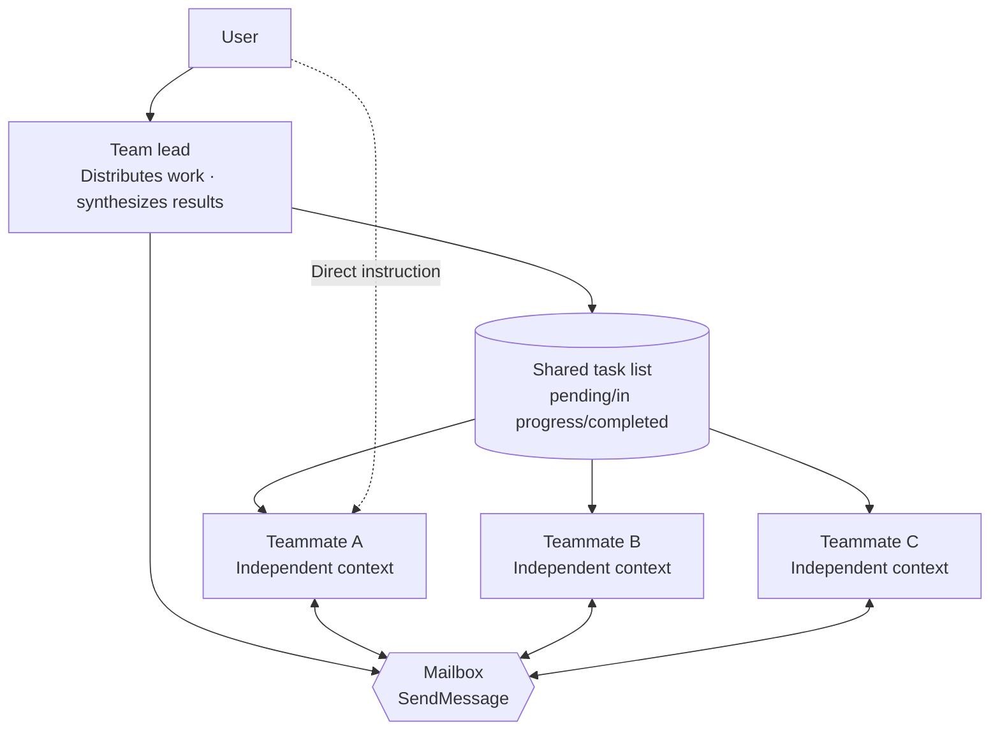

Agent Teams is an experimental feature that groups multiple Claude Code sessions into a single team so they can collaborate through a shared task list and peer-to-peer messaging.


**TL;DR**: Where subagents are one-way workers that report only to the lead, an agent team is a group of peers that talk to each other, claim work directly, and even exchange verification.


## What Are Agent Teams

Agent teams are a structure that coordinates multiple Claude Code instances working together. One session becomes the **team lead** that distributes work and synthesizes results, while the remaining **teammates** each work in their own independent context window and communicate with one another directly.

The decisive difference from subagents is the direction of communication. A subagent reports its results only to the main agent and cannot talk to other subagents, but a teammate in an agent team reads the shared task list, claims work on its own, and exchanges messages directly with other teammates. The user can also instruct a specific teammate directly, without going through the lead.

Agent teams are most powerful for work where **parallel exploration** adds real value.

| Suitable work | Why |
| --- | --- |
| Research / review | Multiple teammates investigate different angles simultaneously and cross-verify findings |
| New module / feature | Each teammate owns a separate area, working in parallel without conflicts |
| Debugging competing hypotheses | Different theories are verified in parallel, converging faster |
| Cross-layer work | Frontend / backend / tests are split across teammates |

Conversely, sequential work, work that edits the same file together, and work with many dependencies are handled more efficiently by a single session or by subagents. Agent teams incur significantly higher coordination cost and token usage than a single session.

## Subagents vs Agent Teams

|  | Subagents | Agent Teams |
| --- | --- | --- |
| **Context** | Own context window; results returned to the caller | Own context window, fully independent |
| **Communication** | Reports results only to the main agent | Teammates exchange messages directly |
| **Coordination** | The main agent manages all work | Autonomous coordination based on a shared task list |
| **Best for** | Focused work where only the result matters | Complex work that needs discussion and collaboration |
| **Token cost** | Low (result summarized into the main context) | High (a separate Claude instance per teammate) |

Choose subagents when a fast, focused worker just needs to report back; choose agent teams when teammates need to share findings, verify one another, and coordinate autonomously.

## Recommended Size: 3-5

There is no hard upper limit on the number of teammates, but there are practical constraints.

- **Token cost grows linearly.** Each teammate has an independent context window and consumes tokens separately.
- The more teammates you have, the greater the **communication and coordination overhead**, and the higher the chance of conflicts.
- Beyond a certain count, you hit **diminishing returns**. Additional teammates do not speed up the work proportionally.

The official guide recommends starting with **3-5** for most workflows. Assigning 5-6 tasks per teammate keeps everyone busy without excessive context switching. For example, if you have 15 independent tasks, three teammates are a good starting point. A focused team of three often produces better results than a scattered team of five.

## Collaboration Mechanisms

Agent teams operate through four components.

| Component | Role |
| --- | --- |
| **Team lead** | The main session that creates the team, spawns teammates, and coordinates the work |
| **Teammate** | An independent Claude Code instance that performs assigned tasks |
| **Task list** | The shared task list that teammates claim and complete from |
| **Mailbox** | The messaging system responsible for inter-agent communication |

### Shared Task List and SendMessage

Tasks have three states—`pending`, `in progress`, and `completed`—and you can also set dependencies between tasks. A `pending` task whose dependencies are unresolved cannot be claimed until its predecessor completes. When a teammate completes a predecessor task, the dependent tasks are automatically unlocked.

Work is distributed in two ways.

- **Lead assignment**: The lead explicitly assigns a specific task to a specific teammate.
- **Self-claim**: When a teammate finishes a task, it claims the next unassigned and unblocked task on its own.

Task claiming uses **file locking** to prevent the race condition that arises when multiple teammates try to claim the same task at once. Communication between teammates happens through `SendMessage`, and a sent message is delivered to the recipient automatically. Messages arrive without the lead having to poll, and when a teammate finishes a task and stops, it automatically notifies the lead.

### File Ownership

If two teammates edit the same file, overwrites occur. So the key best practice is to split the work so that each teammate **owns a different set of files**. This is also why agent teams work especially well when areas divide naturally, as in new modules or cross-layer work.

### Collaboration Structure



The lead distributes work through the task list, teammates talk to each other directly via the mailbox, and the user can also instruct individual teammates without going through the lead.

## Enablement Requirements

Agent teams are an **experimental feature and disabled by default**. They require Claude Code v2.1.32 or later, and you enable them by setting the environment variable `CLAUDE_CODE_EXPERIMENTAL_AGENT_TEAMS` to `1`. Specify it directly in your shell environment or register it in `settings.json`.

```json
{
  "env": {
    "CLAUDE_CODE_EXPERIMENTAL_AGENT_TEAMS": "1"
  }
}
```

Once enabled, you simply request team creation in natural language. Claude creates the team, spawns the teammates, and then coordinates the work.

```text
I'm designing a CLI tool that tracks TODO comments across the codebase.
Please create an agent team to explore it from different perspectives.
One on UX, one on technical architecture, and one as a critic.
```

### Display Modes and Teammate Model

Agent teams support two display modes. **In-process** runs all teammates inside the main terminal and works in any terminal with no extra setup. **Split panes** opens a separate window for each teammate and requires tmux or iTerm2. The default is `"auto"`, which uses split panes when running inside a tmux session and in-process otherwise.

You can set the mode with the `teammateMode` key in `~/.claude/settings.json`, or force it for a single session only with the `--teammate-mode in-process` flag.

```json
{
  "teammateMode": "in-process"
}
```

By default, teammates do not inherit the lead's `/model` selection. The model to use when no model is specified in the prompt is configured under **Default teammate model** in `/config`.

### Quality Gate Hooks

Using [hooks](/claude-code/extensibility/hooks), you can enforce rules when a teammate finishes work, or when a task is created or completed.

| Hook event | Trigger point | Meaning of exit code 2 |
| --- | --- | --- |
| `TeammateIdle` | Just before a teammate transitions to idle | Send feedback and keep it working |
| `TaskCreated` | When a task is about to be created | Block creation and send feedback |
| `TaskCompleted` | When a task is about to be marked complete | Block completion and send feedback |

## Limitations to Know

Because agent teams are experimental, use them with awareness of the following limitations.

- **No session resume**: `/resume` and `/rewind` cannot restore in-process teammates. After resuming, instruct the lead to spawn new teammates.
- **Task state lag**: A teammate may miss marking a task complete, blocking dependent tasks.
- **One team at a time**: A lead manages only one team. You must clean up the current team before creating a new one.
- **No nested teams**: A teammate cannot spawn its own team or teammates. Only the lead can manage teams.
- **Fixed lead**: The session that created the team is the lead for its lifetime, and leadership cannot be transferred.

Always perform team cleanup through the lead. When the work is done, ask the lead to clean up—but if running teammates remain, cleanup fails, so you must shut them down first.

## Integration with MoAI CG Mode

MoAI-ADK layers **CG mode (Claude + GLM)** on top of agent teams to optimize cost. The lead coordinates the workflow with Claude, while teammates inherit the GLM environment through tmux session-level environment isolation to perform implementation work. This can dramatically reduce cost on token-heavy work such as implementation-focused SPECs, code generation, and test writing.

The configuration and operation of CG mode are covered in detail in a separate document, so see the link below.

## Related Docs

- [Dynamic Workflows](/claude-code/agentic/workflows)
- [CG Mode (Claude + GLM)](/multi-llm/cg-mode)

## References

- [Claude Code Docs — Orchestrate teams of Claude Code sessions](https://code.claude.com/docs/en/agent-teams)


If you're new to agent teams, start with work that doesn't write code. Clearly bounded tasks like PR review, library research, and bug investigation let you feel the value of parallel exploration right away, without the coordination overhead of parallel implementation.

