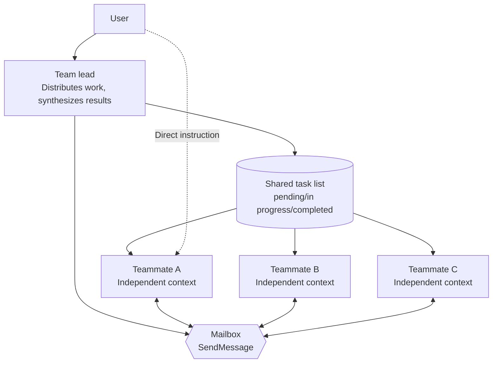

# Agent Teams

Agent Teams is an experimental feature that binds multiple Claude Code sessions into one team, collaborating through a shared task list and mutual messaging.



**One-line summary**: If a subagent is a one-way worker reporting only to the leader, an agent team is a group of peers who talk to each other, claim work directly, and exchange verification.


## What Is an Agent Team

An agent team is a structure that coordinates multiple Claude Code instances working together. One session becomes the **team lead**, distributing work and synthesizing results, while the remaining **teammates** each work in independent context windows and communicate with one another directly.

The decisive difference from subagents is the direction of communication. Subagents report results only to the main agent and cannot talk to each other, whereas agent-team teammates watch a shared task list, claim work on their own, and message each other directly. The user can also instruct a specific teammate directly, without going through the lead.

Agent teams are most powerful for work where **parallel exploration** adds real value.

| Suited work | Why |
| --- | --- |
| Research / review | Multiple teammates investigate different aspects simultaneously and cross-check findings |
| New modules / features | Each teammate owns a separate area, working in parallel without conflicts |
| Competing-hypothesis debugging | Verify different theories in parallel and converge faster |
| Cross-layer work | Split frontend / backend / tests across teammates |

Conversely, sequential work, work editing the same files together, and dependency-heavy work are more efficient in a single session or with subagents. An agent team's coordination cost and token usage grow substantially compared to a single session.

## Subagents vs Agent Teams

|  | Subagents | Agent teams |
| --- | --- | --- |
| **Context** | Own context window; results returned to the caller | Own context window; fully independent |
| **Communication** | Report results only to the main agent | Teammates message each other directly |
| **Coordination** | Main agent manages all work | Autonomous coordination via a shared task list |
| **Best for** | Focused work where only the result matters | Complex work needing discussion and collaboration |
| **Token cost** | Low (results summarized into the main context) | High (a separate Claude instance per teammate) |

Choose subagents when a fast, focused worker only needs to report back; choose agent teams when teammates must share findings, verify each other, and coordinate autonomously.

## Recommended Size: 3-5

There is no enforced cap on teammate count, but there are practical constraints.

- **Token cost grows linearly.** Each teammate has an independent context window and consumes tokens separately.
- More teammates mean **more communication and coordination burden**, and more chances for conflicts.
- Beyond a certain number, **diminishing returns** set in. Additional teammates do not raise throughput proportionally.

The official guidance recommends starting with **3-5** for most workflows. Assigning 5-6 tasks per teammate keeps everyone busy without excessive context switching. For example, with 15 independent tasks, 3 teammates is a good starting point. Three focused teammates often beat five scattered ones.

## The Collaboration Mechanism

Agent teams run on four components.

| Component | Role |
| --- | --- |
| **Team lead** | The main session that creates the team, spawns teammates, and coordinates work |
| **Teammate** | An independent Claude Code instance performing assigned tasks |
| **Task list** | The shared task list teammates claim from and complete |
| **Mailbox** | The messaging system handling inter-agent communication |

### The Shared Task List and SendMessage

Tasks have three states — `pending`, `in progress`, `completed` — and dependencies between tasks can be set. A `pending` task with unresolved dependencies cannot be claimed until its prerequisites complete. When one teammate finishes a prerequisite, dependent tasks unlock automatically.

Work distribution happens two ways:

- **Lead assignment**: the lead explicitly assigns a specific task to a specific teammate.
- **Self-claim**: when a teammate finishes a task, it claims the next unassigned, unblocked task on its own.

Task claiming uses **file locking** to prevent race conditions when multiple teammates try to claim the same task simultaneously. Teammates communicate via `SendMessage`, and sent messages are delivered to the recipient automatically. Messages arrive without the lead polling, and when a teammate finishes and stops, the lead is notified automatically.

### File Ownership

Two teammates editing the same file causes overwrites. The key best practice is therefore to split work so each teammate **owns a distinct set of files**. This is also why agent teams work especially well for new modules or cross-layer work where areas divide naturally.

### The Collaboration Structure


```mermaid
flowchart TD
    User[User] --> Lead[Team lead<br/>Distributes work, synthesizes results]
    Lead --> TaskList[(Shared task list<br/>pending/in progress/completed)]
    Lead --> Mailbox{{Mailbox<br/>SendMessage}}
    TaskList --> T1[Teammate A<br/>Independent context]
    TaskList --> T2[Teammate B<br/>Independent context]
    TaskList --> T3[Teammate C<br/>Independent context]
    T1 <--> Mailbox
    T2 <--> Mailbox
    T3 <--> Mailbox
    User -.Direct instruction.-> T1
```

The lead distributes work through the task list, teammates talk to each other directly via the mailbox, and the user can instruct individual teammates without going through the lead.

## Activation Requirements (v2.1.178+)

Agent teams are an **experimental feature, disabled by default**. Claude Code v2.1.178 or later is required, and you activate it by setting the environment variable `CLAUDE_CODE_EXPERIMENTAL_AGENT_TEAMS` to `1`.

### What Changed in v2.1.178

- **Implicit Teams**: team creation got simpler. When the lead spawns the first teammate, the team forms automatically and is cleaned up automatically at session end.
- **TeamCreate/TeamDelete removed**: these commands are gone as of v2.1.178 (no more manual team creation or deletion).
- **`team_name` accepted-but-ignored**: the `team_name` field is still included in hook payloads but is actually ignored (legacy compatibility).

Set it directly in the shell environment or register it in `settings.json`.

```json
{
  "env": {
    "CLAUDE_CODE_EXPERIMENTAL_AGENT_TEAMS": "1"
  }
}
```

Once activated, request team creation in natural language. Claude creates the team, spawns teammates, and coordinates the work.

```text
I am designing a CLI tool that tracks TODO comments across the codebase.
Create an agent team to explore from different angles —
one on UX, one on technical architecture, one as a critic.
```

## Display Modes and Teammate Models

Agent teams support two display modes.

| Mode | Characteristics | Requirements |
|------|------|---------|
| **In-process** | All teammates run inside the main terminal | No extra setup (default) |
| **Split panes** | A separate pane per teammate | Requires tmux or iTerm2 (`it2` CLI) |

The default is `in-process` (since v2.1.179; previously `"auto"`). It works anywhere without extra setup; to switch to split-pane mode, change the `teammateMode` setting.

There are four values you can assign to `teammateMode`.

| Value | Behavior | Notes |
|------|------|------|
| `in-process` | All teammates run in the main terminal | Default (v2.1.179+) |
| `auto` | Split pane inside a tmux session or iTerm2 with the `it2` CLI installed, otherwise falls back to in-process | Pre-v2.1.179 default |
| `tmux` | Force split-pane — auto-detects tmux or iTerm2 by terminal environment | Requires tmux |
| `iterm2` | Force iTerm2 native split panes | v2.1.186+, requires the `it2` CLI |

Set it in `~/.claude/settings.json`.

```json
{
  "teammateMode": "auto"
}
```

You can also override it for a single session with the `--teammate-mode auto` flag.

Split-pane mode requires external tools. Install tmux with your system package manager; for iTerm2, install the [`it2` CLI](https://github.com/mkusaka/it2) and then enable the Python API in iTerm2 settings (Settings → General → Magic → Enable Python API).

Teammates do not inherit the lead's `/model` selection by default. The model used when the prompt does not specify one is set under **Default teammate model** in `/config`. However, since v2.1.186 teammates inherit the lead's effort level (applied in split-pane mode from v2.1.186; earlier versions do not pass the lead's effort).

## Quality-Gate Hooks

Using [hooks](/claude-code/extensibility/hooks), you can enforce rules when a teammate finishes work or when tasks are created and completed.

| Hook event | When it fires | Meaning of exit code 2 |
| --- | --- | --- |
| `TeammateIdle` | Right before a teammate goes idle | Send feedback and keep it working |
| `TaskCreated` | When a task is about to be created | Block creation and send feedback |
| `TaskCompleted` | When a task is about to be marked complete | Block completion and send feedback |

## Known Limitations

Agent teams are experimental; use them with these limitations in mind.

- **No session resume**: `/resume` and `/rewind` do not restore in-process teammates. After resuming, instruct the lead to spawn new teammates.
- **Task-state lag**: a teammate may miss marking a task complete, blocking dependent tasks.
- **One team at a time**: the lead manages a single team. Clean up the current team before creating a new one.
- **No nested teams**: teammates cannot spawn their own teams or teammates. Only the lead manages the team.
- **Fixed leadership**: the session that created the team is the lead for its lifetime; leadership cannot be transferred.

Team cleanup always goes through the lead. Ask the lead to clean up when work is done — but cleanup fails while running teammates remain, so shut them down first.

## The Link to MoAI CG Mode — Team Structure as Tokenomics

MoAI-ADK layers **CG mode** (`moai cg`, a Claude + GLM hybrid) on top of this native team runtime to optimize cost. The lead uses Claude to coordinate strategy, planning, and audits, while teammates inherit a GLM environment through tmux session-level environment isolation and perform bulk implementation work. It couples the team-structure question of "who does what" with the tokenomics answer of "which model does work at what price," yielding **60-70% cost savings** on token-heavy work like implementation-centric SPECs, code generation, and test writing.

One distinction worth keeping: MoAI-ADK retired its static agent-team layer in its own workflow orchestration, defaulting to sequential subagents and dynamic workflows — but the native Claude Code team runtime covered on this page (tmux panes, shared task list) is used as-is by CG mode. In other words, the "team" execution form lives on, with its purpose shifted from collaboration coordination to cost routing.

CG mode setup and operations are covered in detail in a separate document — see the link below.

## Related Documents

- [Dynamic Workflows](/claude-code/agentic/workflows)
- [CG Mode (Claude + GLM)](/multi-llm/cg-mode)

## References

- [Claude Code Docs — Orchestrate teams of Claude Code sessions](https://code.claude.com/docs/en/agent-teams)


New to agent teams? Start with work that writes no code. Clearly bounded tasks like PR review, library research, and bug investigation let you feel the value of parallel exploration immediately, without the coordination burden of parallel implementation.

