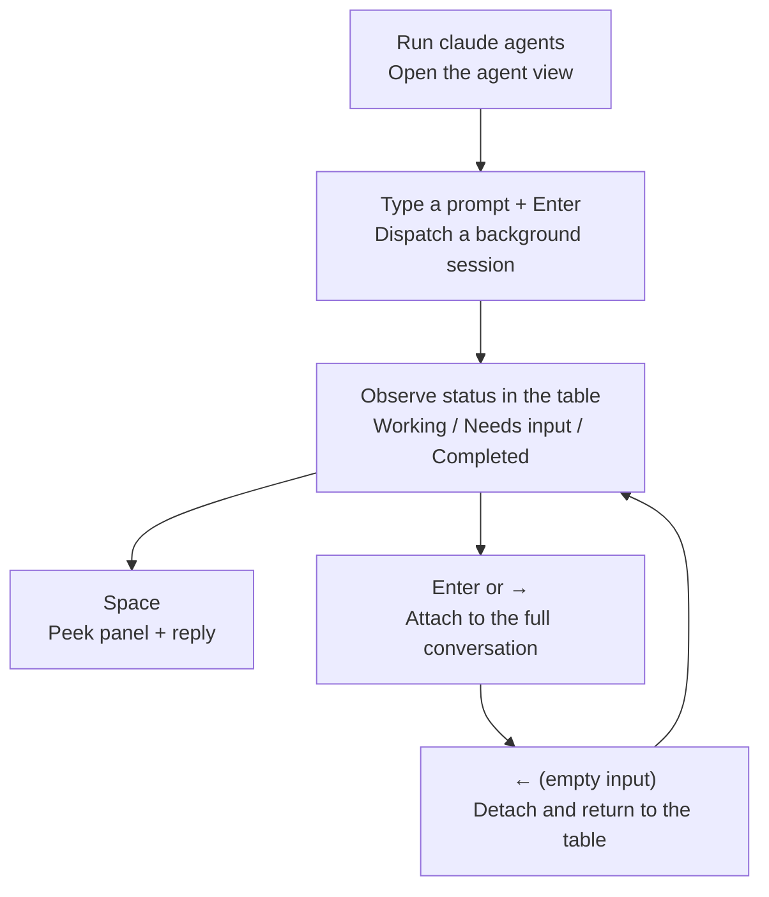

The agent view, opened with the `claude agents` command, is a single control surface that lets you dispatch, observe, and intervene in multiple Claude Code sessions from one screen — stepping in only on the sessions that need your hands.


**TL;DR**: Instead of scrolling through transcripts one by one, view every running, waiting, and completed background session in a single table and jump in only at the moment you are needed.


## What Is the Agent View

The agent view is an interface for managing **background sessions** that keep running without being tied to a terminal. Each background session is a complete Claude Code conversation in its own right, and a separate supervisor process keeps it running even after you close the terminal. So you can throw a bug fix, a PR review, and a flaky-test investigation onto separate rows, work on something else, and come back when a row is waiting for input or has produced a result.

> The agent view is a research preview and works with Claude Code v2.1.139 or later. Check your version with `claude --version`. The interface and shortcuts may change as the feature evolves.

Here is how it fits alongside the other parallel-execution mechanisms.

| Mechanism | Characteristics | Best for |
| :--- | :--- | :--- |
| Agent view | Dispatch and observe multiple independent full sessions in one table | Running several unrelated tasks in parallel and collecting only the results |
| Subagent | An auxiliary worker invoked within a single session | Breaking a single task into sub-steps |
| Agent team | Multiple sessions collaborating by exchanging messages | Collaborative work that requires coordination |
| Worktree | A git workspace that isolates file edits | Parallel edits in the same checkout without conflicts |

## What It Shows

When you open the agent view, it takes over the entire terminal and lists every session grouped by status. Sessions waiting for input and pinned sessions float to the top, and each row shows the session name, the current activity, and the time elapsed since the last change.

```text
Needs input
  ✻ power-up design     needs input: double jump or wall climb?     1m

Working
  ✽ collision detection Edit src/physics/CollisionSystem.ts          2m
  ✢ playtest level 3    run 12 · all checkpoints cleared          in 4m

Completed
  ✻ title screen        result: menu, options, and credits done      9m
  ∙ sound effects       result: 14 SFX exported to assets/audio       4h
```

### Progress and Session Status

The icon at the front of each row indicates the session status through color and animation.

| Status | Icon display | Meaning |
| :--- | :--- | :--- |
| Working | Animated | Claude is running a tool or generating a response |
| Needs input | Yellow | Waiting on the user for a specific question or permission decision |
| Idle | Dimmed | Nothing to do; waiting for the next prompt |
| Completed | Green | The task finished successfully |
| Failed | Red | The task ended with an error |
| Stopped | Gray | Stopped via `Ctrl+X` or `claude stop` |

Separately, the **shape** of the icon indicates whether the underlying process is alive. `✻` (or the animated `✽`) means the process is alive and responds immediately; `∙` means the process has exited (you can still peek, reply, or attach, and Claude resumes from where it stopped); `✢` means a `/loop` session is waiting between iterations.

The one-line summary on each row is generated by a Haiku-class model, so you can tell what a session is doing, what it wants, and what it produced without opening the transcript. A working session refreshes its summary at most once every 15 seconds, and again at the end of each turn.

### Background Tasks and PR Status

When a session opens a PR, a label like `PR #1234` appears at the right end of the row, and it becomes a link in terminals that support hyperlinks. The PR number is colored according to its status.

| Color | PR status |
| :--- | :--- |
| Yellow | Awaiting checks/review, or a check failed |
| Green | Checks passed + no blocking reviews |
| Purple | Merged |
| Gray | Draft or closed |

For most tasks, this column is where you collect the result. Once the PR number turns green, you can review and merge it. You can also dispatch a shell command as a background task by prefixing the input with `!`, as in `! pytest -x`; in this case the command runs on its own without invoking the model, and its most recent output line is shown as the status.

### Subagent Output

**Subagents** spawned by a session, or **agent team** members, are not listed on separate rows. Their output and progress are folded into the parent session's row summary and output. To see the details, peek at that session or attach to it to view the full conversation.

## Usage Scenarios

The agent view is useful when you have several independent tasks that Claude can make progress on without you watching every step.

- **Monitoring long-running work**: Throw a long task like a flaky-test investigation onto a row, work in another window, and come back when the row switches to a needs-input or result status. Background sessions keep running thanks to the supervisor process even if you close the terminal or shell.
- **Tracking parallel work**: Dispatch a bug fix, a PR review, and a test investigation across three rows at once and compare their status at a glance. File edits are isolated per session into a **worktree** under `.claude/worktrees/`, so each one reads the same checkout but writes separately.
- **Managing multiple projects on one screen**: By default, background sessions from all projects appear in a single table. To narrow it to one project, specify a directory, as in `claude agents --cwd ~/projects/my-app`.

Each session consumes your subscription usage independently. In other words, running 10 agents in parallel burns through your quota roughly 10 times faster, so keep your usage limits in mind before dispatching a lot at once.

## How to Access and Operate It

The basic flow is a cycle of dispatch → observe → peek and reply → attach.



### How to Dispatch

You can start a new background session through three paths.

```bash
# 1) Open the agent view, type a prompt in the bottom input box, then press Enter
claude agents

# 2) Start directly in the background from the shell
claude --bg "investigate the flaky SettingsChangeDetector test"

# 3) Designate a specific subagent as the main agent
claude --agent code-reviewer --bg "address review comments on PR 1234"
```

A prompt you enter in the agent view input box starts a new session every time (it is not appended to an existing session). To send an in-progress conversation to the background, run `/background` or its alias `/bg` inside the session, or press `←` on an empty input.

### Peek and Attach

| Action | Key | Effect |
| :--- | :--- | :--- |
| Peek | `Space` | Show the selected row's recent output or pending question in a panel. Type a reply in the panel and send it with `Enter` |
| Attach | `Enter` or `→` | Enter the full conversation. Behaves exactly as if you had run `claude` directly |
| Detach | `←` (empty input) | Return to the table while leaving the session running. If a dialog blocks it, use `Ctrl+Z` |

Attaching never stops a session. To fully end a session from within, run `/stop`.

### Key Shortcuts

Press `?` to see all shortcuts on screen. The most frequently used ones are summarized below.

| Shortcut | Action |
| :--- | :--- |
| `↑` / `↓` | Move between rows |
| `Enter` | Attach to the selected session (dispatch if there is text in the input) |
| `Space` | Open/close the peek panel |
| `Shift+Enter` | Dispatch and attach immediately |
| `Ctrl+S` | Toggle the grouping criterion between status/directory |
| `Ctrl+T` | Pin/unpin the selected session (keeps the process alive even when idle) |
| `Ctrl+R` | Rename the session |
| `Ctrl+X` | Stop the session. Press again within 2 seconds to delete it |
| `Esc` | Close the panel, clear the input, or exit |

> A worktree that Claude created for a session is removed along with it when you delete it with `Ctrl+X` twice, and any uncommitted changes are lost too. To preserve them, push or commit first.

### Managing from the Shell

You can also work with sessions directly by short ID without opening the agent view.

```bash
claude agents --json        # Output live sessions as a JSON array
claude attach <id>          # Attach to the session in this terminal
claude logs <id>            # Show the session's recent output
claude stop <id>            # Stop the session
claude respawn <id>         # Restart the session while keeping the conversation
```

### How to Turn It Off

To fully disable the agent view and background agents, set `disableAgentView` to `true`, or set the `CLAUDE_CODE_DISABLE_AGENT_VIEW` environment variable. You can add the setting to `settings.json`.

```json
{
  "worktree": {
    "bgIsolation": "none"
  }
}
```

Setting `worktree.bgIsolation` above to `"none"` makes background sessions edit your working copy directly instead of moving into a worktree (v2.1.143 or later).

## Related Docs

- [Subagents](/claude-code/agentic/sub-agents)
- [Agent Teams](/claude-code/agentic/agent-teams)

## References

- [Manage multiple agents with agent view (Claude Code Docs)](https://code.claude.com/docs/en/agent-view)


To keep a long-running session responsive, pin it with `Ctrl+T`. An unpinned session that goes untouched for about an hour after finishing has its process stopped by the supervisor to reclaim resources, and it wakes up a beat late when you reattach.

