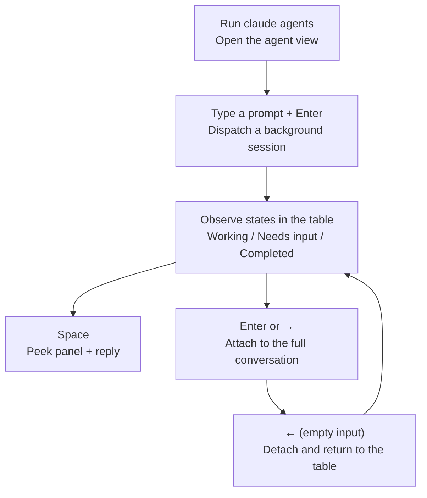

The agent view, opened by the `claude agents` command, is a single control screen that lets you put several Claude Code sessions on one table, watch how they are doing, and step in only in the sessions that need a hand. Toss a bug fix, a PR review, and a flaky-test investigation each onto its own row, do other work, and come back only when a row is waiting for input or has produced a result.


This page is background material on **Claude Code itself**, the platform MoAI-ADK runs on. MoAI-ADK's own features are covered in the sections above it in the sidebar.



**One-line summary**: Instead of scrolling transcripts one by one, see every running, waiting, and completed background session in one table and step in only at the moments that matter.


## What Is the Agent View

The agent view is an interface for managing **background sessions** — sessions that keep running without being tied to one terminal — from one screen. Each background session is a complete Claude Code conversation in its own right, and a separate supervisor process keeps it running even if you close the terminal. So you can toss a bug fix, a PR review, and a flaky-test investigation each onto its own row, go do other work, and come back when a row is waiting for input or has produced a result.

The agent view is in **research preview** and works on Claude Code v2.1.139 or later. Check your version with `claude --version`. The interface and shortcuts may change as the feature evolves.

Claude Code has several means of running work in parallel — the agent view occupies the "dispatch several unrelated full sessions and collect only results" seat among them.

| Option | Characteristics | Best for |
| :--- | :--- | :--- |
| Agent view | Dispatch and observe multiple independent full sessions in one table | Running several unrelated tasks in parallel and collecting only results |
| Subagents | Helper workers invoked within one session | Decomposing a single task into substeps |
| Agent teams | Multi-session collaboration with mutual messaging | Collaborative work needing coordination |
| Worktrees | Git workspaces isolating file edits | Conflict-free parallel editing on the same checkout |

## Why Background (v2.1.198)

The agent view exists because **background execution became the default** in Claude Code v2.1.198. The runtime puts sessions that do not need their results right away into the background and lifts them to the foreground only at the moment the result is needed. The agent view is precisely the control window for watching those background sessions in one place.

When a background session hits a tool that needs permission (e.g., Bash, WebFetch), the prompt is **displayed on the main session screen**. Since v2.1.186 the prompt even carries the name of which subagent is asking, and `Esc` can deny just that one call. Pre-listing frequently-used tools in the `settings.json` allow list before starting a long background task cuts the prompt frequency substantially.

## What It Shows

Opening the agent view takes over the terminal and lists every session grouped by status. Sessions waiting for input and pinned sessions rise to the top, and each row shows the session name, current activity, and time since last change.

```text
Needs input
  ✻ power-up design     needs input: double jump or wall climb?     1m

Working
  ✽ collision detection Edit src/physics/CollisionSystem.ts          2m
  ✢ playtest level 3    run 12 · all checkpoints cleared          in 4m

Completed
  ✻ title screen        result: menu, options, and credits done      9m
  ∙ sound effects       result: 14 SFX exported to assets/audio       4h
```

### Progress and Session Status

The icon at the front of each row indicates the session status through color and animation.

| Status | Icon display | Meaning |
| :--- | :--- | :--- |
| Working | Animated | Claude is running tools or generating a response |
| Needs input | Yellow | Waiting on the user for a specific question or permission decision |
| Idle | Dimmed | Nothing to do; waiting for the next prompt |
| Completed | Green | The work finished successfully |
| Failed | Red | The work ended with an error |
| Stopped | Gray | Stopped via `Ctrl+X` or `claude stop` |
| Needs attention | Orange | A session that stalled and needs a look (e.g., no stream events for a while); floated to the top (CC 2.1.196) |

Separately, the icon **shape** indicates whether the underlying process is alive. `✻` (or animated `✽`) means the process is alive and responds instantly; `∙` means the process has exited (you can still peek, reply, or attach, and Claude resumes from where it stopped); `✢` means a `/loop` session is waiting between iterations.

Each row's one-line summary is generated by a Haiku-family model, so you know what a session is doing, wanting, and producing without opening the transcript. Working sessions refresh their summary at most every 15 seconds and at the end of each turn.

### Background Tasks and PR Status

When a session opens a PR, a label like `PR #1234` appears at the right end of the row, hyperlinked in terminals that support links. The PR number is colored by state.

| Color | PR state |
| :--- | :--- |
| Yellow | Checks/review pending, or checks failing |
| Green | Checks passing + no blocking reviews |
| Purple | Merged |
| Gray | Draft or closed |

For most work, this column is where you collect results — when a PR number turns green, review and merge. You can also dispatch a shell command as a background task by prefixing the input with `!`, like `! pytest -x`; in that case no model is invoked, only the command runs on one row, and the latest output line is shown as its status.

### Subagent and Teammate Output

**Subagents** or **agent-team** teammates spawned by a session are not listed as separate rows. Their output and progress merge into the parent session's row summary and output. To see the details, peek into or attach to that session and view the full conversation.

For reference, since v2.1.219 subagent nesting is re-enabled by default, so one background session can fan out nested spawns up to depth 3 (disable with `CLAUDE_CODE_MAX_SUBAGENT_SPAWN_DEPTH=1`). The agent view does not expand this nested structure row by row — it shows status by the outermost session.

## Usage Scenarios

The agent view shines when you have several mutually independent tasks Claude can advance without you watching every step.

- **Monitoring long-running work**: toss a long task like a flaky-test investigation onto a row, work in another window, and return when the row flips to needs-input or a result. Background sessions keep running even if you close the terminal or shell, thanks to the supervisor process.
- **Tracking parallel work**: dispatch a bug fix, a PR review, and a test investigation as three rows at once and compare states at a glance. File edits are isolated per session in **worktrees** under `.claude/worktrees/`, so all rows read the same checkout but each writes separately.
- **Managing multiple projects on one screen**: by default, background sessions from all projects appear in one table. To narrow to one project, specify the directory, e.g. `claude agents --cwd ~/projects/my-app`.

Each session consumes subscription usage independently. Running 10 agents in parallel burns your quota roughly 10x faster, so keep usage limits in mind before dispatching many at once. Parallelization is a trade — buying time by paying tokens. The reason MoAI-ADK prioritizes parallel fan-out for read-only investigation and review while running write work sequentially takes this cost structure into account alongside safety.

## Access and Controls

The basic flow cycles dispatch → observe → peek and reply → attach.


```mermaid
flowchart TD
    A["Run claude agents<br/>Open the agent view"] --> B["Type a prompt + Enter<br/>Dispatch a background session"]
    B --> C["Observe states in the table<br/>Working / Needs input / Completed"]
    C --> D["Space<br/>Peek panel + reply"]
    C --> E["Enter or →<br/>Attach to the full conversation"]
    E --> F["← (empty input)<br/>Detach and return to the table"]
    F --> C
```

### How to Dispatch

A new background session starts via three routes.

```bash
# 1) Open the agent view, type a prompt in the bottom input, press Enter
claude agents

# 2) Start directly in the background from the shell
claude --bg "investigate the flaky SettingsChangeDetector test"

# 3) Designate a specific subagent as the main agent
claude --agent code-reviewer --bg "address review comments on PR 1234"
```

Every prompt entered in the agent view input starts a new session (it does not append to an existing one). To send an ongoing conversation to the background, run `/background` or its alias `/bg` inside the session, or press `←` on an empty input.

When you designate a subagent definition as the main agent like the third route, you can fix the model per session via that agent file's `model` field (the default `inherit` simply uses the main session's model). For cost-sensitive collection work, set a cheaper model in advance; for reasoning-heavy work, set a higher-tier model — the model will not drift at dispatch time.

### Peek and Attach

| Action | Key | Effect |
| :--- | :--- | :--- |
| Peek | `Space` | Shows the selected row's recent output or pending question in a panel. Type a reply in the panel and send with `Enter` |
| Attach | `Enter` or `→` | Enters the full conversation. Behaves exactly as if you ran `claude` directly |
| Detach | `←` (empty input) | Returns to the table with the session still running. If a dialog blocks, `Ctrl+Z` |

Attaching never stops a session. To end a session completely, run `/stop` inside it.

### Key Shortcuts

Press `?` to view all shortcuts on screen. The most-used ones:

| Shortcut | Action |
| :--- | :--- |
| `↑` / `↓` | Move between rows |
| `Enter` | Attach to the selected session (dispatch if the input has text) |
| `Space` | Open/close the peek panel |
| `Shift+Enter` | Dispatch and attach immediately |
| `Ctrl+S` | Toggle grouping between status/directory |
| `Ctrl+T` | Pin/unpin the selected session (keeps the process alive when idle) |
| `Ctrl+R` | Rename the session |
| `Ctrl+X` | Stop the session. Press again within 2 seconds to delete |
| `Esc` | Close the panel, clear the input, or exit |


Worktrees Claude created for a session are removed along with it when deleting via double `Ctrl+X`, and uncommitted changes are lost. Push or commit first to preserve them.


### Managing from the Shell

You can also work directly with short IDs without opening the agent view.

```bash
claude agents --json        # print live sessions as a JSON array
claude attach <id>          # attach to a session in this terminal
claude logs <id>            # show a session's recent output
claude stop <id>            # stop a session
claude respawn <id>         # restart a session keeping the conversation
```

### How to Turn It Off

To fully disable the agent view and background agents, set `disableAgentView` to `true` or set the `CLAUDE_CODE_DISABLE_AGENT_VIEW` environment variable. You can put the setting in `settings.json`.

```json
{
  "worktree": {
    "bgIsolation": "none"
  }
}
```

Setting `worktree.bgIsolation` above to `"none"` makes background sessions edit the working copy directly instead of moving into worktrees (v2.1.143+).

## Related Documents

- [Subagents](/en/claude-code/agentic/sub-agents)
- [Agent Teams](/en/claude-code/agentic/agent-teams)
- [Worktrees](/en/claude-code/agentic/worktrees)

## References

- [Manage multiple agents with agent view (Claude Code Docs)](https://code.claude.com/docs/en/agent-view)


To keep a long-running session responsive, pin it with `Ctrl+T`. An unpinned session left untouched for about an hour after finishing has its process stopped by the supervisor to reclaim resources, and it wakes a beat late on reattach.

