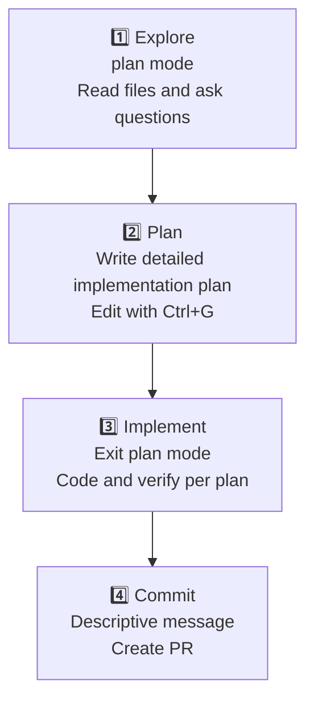

Claude Code is an agentic tool that reads code, runs commands, makes changes, and works through problems autonomously — so how you instruct it and how you have it verify its work determines the quality of the results.


**Core Principle**: The context window fills up fast, and the fuller it gets, the worse performance becomes. Every best practice centers on **conserving context while giving precise signals**.


## 1. Give Claude Verification Tools

Claude stops when the work "looks done." Without verification tools, you become the verification loop—catching every mistake one by one. Give Claude **a pass/fail check** and it runs the check itself, reads the result, and iterates until it passes.

A check can be anything that produces a signal you can read from the conversation: a test suite, a build exit code, a linter, a script comparing outputs against fixtures, a browser screenshot checked against a design.

| Strategy | Weak instruction | Recommended instruction |
|----------|------------------|------------------------|
| **Provide test cases** | "Implement validateEmail function" | "Write validateEmail. Test cases: user@example.com → true, invalid → false, user@.com → false. Run tests after implementation and confirm pass" |
| **Visual verification for UI** | "Make the dashboard look better" | "[Screenshot attached] Implement this design. Take a result screenshot and compare against the original, listing any differences" |
| **Root-cause fixing** | "Build is failing" | "Build fails with: [error text]. Find the root cause and fix it—don't hide the error, solve it" |

Verification methods differ in how strongly you enforce the check:

| Approach | Behavior | Best for |
|----------|----------|----------|
| **Within a prompt** | Request running the check and iterating in one message | General tasks completable immediately |
| **`/goal` condition** | A separate evaluator rechecks every turn and continues until met | Automated verification across a session |
| **Stop hook** | Runs a deterministic gate and blocks turn-end until it passes | Hard quality requirements |
| **Verification subagent** | Fresh-context model tries to refute the result | Separating author from grader |

The key is to **show evidence rather than claim success**. Receiving test output, command results with return values, and screenshots is faster than verifying yourself.


**TL;DR**: A single verification check is autonomy itself — the difference between "a session you watch" and "a session you delegate" comes down to whether Claude has a check it can run on its own.


## 2. Explore → Plan → Implement in Four Stages

Jumping straight into coding can produce **code that solves the wrong problem**. The recommended flow separates exploration from execution in four stages using plan mode.



**Stage-by-stage detail**:

1. **Explore (plan mode)**: Read files and understand the structure without making changes.
   ```
   Read src/auth to understand the session and login flow.
   Also check how secrets are managed via environment variables.
   ```

2. **Plan**: Write a detailed implementation plan. Edit it directly with `Ctrl+G` in the editor.

3. **Implement**: Exit plan mode, then write code per the plan. Run tests and verify alignment with the plan as you go.

4. **Commit**: Write a descriptive commit message and create a PR.

**Exception**: For small, clearly scoped tasks like fixing a typo, adding a log line, or renaming a variable, you can skip the plan stage. Planning delivers the most value when the approach is uncertain, multiple files change, or you're touching unfamiliar code.

## 3. Be Specific with Context

Claude can infer intent, but it cannot read your mind. Pointing to specific files, stating constraints, and referencing existing patterns cuts the correction loop in half.

| Strategy | Vague instruction | Recommended instruction |
|----------|------------------|------------------------|
| **Scope the task** | "Add tests to foo.py" | "Write tests for foo.py covering the logged-out edge case, avoiding mocks" |
| **Point to the source** | "Why is this API weird?" | "Check the git history of ExecutionFactory and explain how the API evolved" |
| **Reference patterns** | "Add a calendar widget" | "Look at existing home-screen widget patterns, especially HotDogWidget.php. Follow that pattern to build a calendar widget" |
| **Describe the symptom** | "Fix the login bug" | "Login fails after session expires. Check the token refresh flow in src/auth/. Write a failing test that reproduces the bug, then fix it" |

### Ways to Provide Rich Context

- **@-reference files**: Instead of describing where code lives, use `@path/file` so Claude reads it before responding.
- **Paste images**: Attach screenshots or design mockups directly.
- **Provide URLs**: Give documentation or API reference URLs, then use `/permissions` to allowlist those domains.
- **Pipe input**: Pass file contents directly like `cat error.log | claude`.

## 4. Set Up Your Environment

Small setup changes make every session more efficient.

### Create CLAUDE.md

A special file Claude reads at session start. Write project-specific details here: code style, workflow, test frameworks, repository etiquette, and architectural decisions.

**Generate a baseline** with `/init` then refine it.

**Include**:
- Bash commands Claude cannot guess
- Code-style rules different from the default
- Test framework and how to run tests
- Repository etiquette (branch naming, PR rules)
- Architectural decisions specific to this project

**Exclude**:
- Things readable from code (API docs should be linked, not pasted)
- Frequently changing information

### Permission Modes

By default, Claude asks for permission on every action that can change your system. Three options reduce friction while keeping you in control.

- **Auto mode** (`Shift+Tab`): A classifier model reviews commands and blocks only risky ones (privilege escalation, unknown infrastructure, adversarial content).
- **Permission allowlist**: Use `/permissions` to approve safe commands like `npm run lint`, `git commit` in advance.
- **Sandboxing**: Use `/sandbox` for OS-level isolation restricting filesystem and network access.

### Reversible vs Irreversible Actions

- **Local, reversible actions** (file edits, running tests) can be performed freely. Stop with `Esc` or restore with `/rewind`.
- **Hard-to-reverse actions** (force push, `rm -rf`, dropping tables, external publishing) must always get user confirmation.
- **Never use verification-skipping flags** like `--no-verify`. Skipping checks hides problems; it does not solve them.

## 5. Use CLI Tools Efficiently

`gh` (GitHub CLI), `aws`, `gcloud` and similar tools are highly context-efficient. Claude uses them automatically if available; without them, API calls are slower and more limited.

## 6. Connect MCP Servers


MCP (Model Context Protocol) — connect external tools directly to Claude.


```bash
claude mcp add --transport http <server-name>
```

Connect issue trackers, databases, and monitoring dashboards so Claude can query them directly.

## 7. Extend with Skills and Subagents

### Skills — Domain Knowledge

Create `.claude/skills/SKILL.md` files to auto-load domain-specific guidance.

```markdown
---
name: api-conventions
description: Our REST API design rules
---

- URL paths: kebab-case
- JSON properties: camelCase
- Versioning: /v1/, /v2/ in path
```

Skills load only when needed, keeping session context clean.

### Subagents — Isolated Work

Delegate large explorations or deep analysis to subagents. They process work in their own context, return only summaries, keeping the main conversation clean.

## 8. Session Management

### /clear for Context Separation

Long projects with many tasks can benefit from context resets. Use `/clear` when moving between unrelated work or after context hits 150K tokens.

- After completing a phase
- When context usage exceeds 150K tokens
- When switching to unrelated tasks

### /rewind for Experimentation

Press `Esc` or use `/rewind` to step back and try different approaches while preserving context.

### Delegate Large Explorations to Subagents

When massive file exploration is needed, send a subagent instead. Read files pile up in the subagent's context, not your main session's.

## 9. Parallel Work: Multiple Sessions

Read-only tasks like analysis and review can run in parallel across separate sessions.

**Writer/Reviewer pattern**:
- Session A (Writer): Implement code
- Session B (Reviewer): Code review (independent perspective)
- Session A: Reflect feedback

Or **Test/Code split**:
- Session A: Test-first writing (TDD)
- Session B: Implementation satisfying those tests

## 10. Non-Interactive and Scaled Automation

### Headless Mode

```bash
claude -p "prompt" --output-format json
```

Integrate Claude into CI pipelines, pre-commit hooks, and scripts.

### Multiple Sessions in Parallel

Run many SPECs concurrently or transform large file batches in parallel.

### /goal for Autonomous Completion

```
/goal "all tests pass and coverage is 85%"
```

Claude keeps working toward the condition automatically.

## 11. Common Anti-Patterns to Avoid

| Anti-pattern | Problem | Remedy |
|--------------|---------|--------|
| **Kitchen sink session** | Unrelated tasks mixed, context full of noise | `/clear` between tasks |
| **Repeated corrections** | Same problem fixed twice, failed approach pollutes context | After 2 failures, `/clear` and restart with specific prompt |
| **Over-engineering** | Unrequested abstraction layers, defensive code | Keep only the minimum needed complexity |
| **Trust-then-verify gap** | Plausible implementation misses edge cases | Always provide verification tools; if you cannot verify, don't ship |
| **Infinite exploration** | Unscoped "investigate" instruction reads hundreds of files | Narrow scope or delegate to a subagent |

## References

This guide is based on Anthropic's official [Best practices for Claude Code](https://code.claude.com/docs/en/best-practices) documentation.
