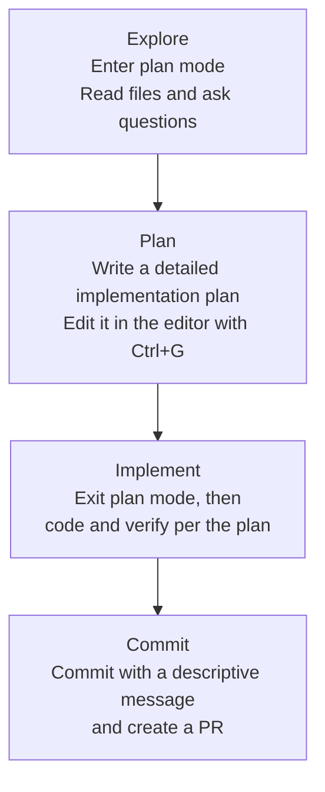

Claude Code is an agentic tool that reads code, runs commands, makes changes, and works through problems autonomously — so how you instruct it and how you have it verify its work determines the quality of the results.


**TL;DR**: Instruct clearly, plan first, and put verification tools in its hands, and Claude Code becomes a colleague you can delegate to rather than a tool you have to watch.


## Why Best Practices Matter

Nearly every recommendation Anthropic's official guide emphasizes starts from a single constraint: **the context window fills up fast, and the fuller it gets, the worse performance becomes**. Every message in the conversation, every file Claude reads, and every command output accumulates in the context window — and once it fills up, Claude starts to "forget" earlier instructions and makes more mistakes. The essence of best practices, therefore, is **conserving context while giving precise signals**.

## Clear, Direct Instructions + Context

Claude can infer intent, but it cannot read your mind. The more you point to specific files, state constraints, and call out existing patterns to follow, the fewer rounds of correction you'll need.

| Strategy | Vague instruction | Recommended instruction |
|------|------------|----------|
| **Scope the task** | "Add tests to `foo.py`" | "Write tests for `foo.py` covering the logged-out edge case, and avoid mocks" |
| **Point to the source** | "Why is this API so weird?" | "Look at the git history of `ExecutionFactory` and summarize how the API came to be" |
| **Reference existing patterns** | "Add a calendar widget" | "Look at the existing widget implementations on the home screen to learn the pattern. `HotDogWidget.php` is a good example. Follow that pattern to build a new calendar widget" |
| **Describe the symptom** | "Fix the login bug" | "There's a report that login fails after the session expires. Check the token refresh flow in `src/auth/`, write a failing test that reproduces the bug first, then fix it" |

### How to Provide Rich Context

- `@` references: Instead of describing where the code lives, reference it directly with `@path/file` so Claude reads the file before responding.
- Paste images: Paste screenshots or design mockups directly into the prompt.
- Provide URLs: Give documentation or API reference URLs, and use `/permissions` to add frequently used domains to the allowlist.
- Pipe input: Pass file contents directly, like `cat error.log | claude`.


**TL;DR**: For the same task, specifying "what, in which file, and by what criteria" cuts the correction loop in half.


## Explore First, Plan Next, Code Last

Jumping straight into coding can produce **code that solves the wrong problem**. The recommended flow uses plan mode to separate exploration from execution in four stages.

| Stage | Mode | Key actions |
|------|------|----------|
| Explore | plan mode | Read files and understand the code structure without making changes |
| Plan | plan mode | Write a plan covering the files and flow to change; edit it directly with `Ctrl+G` |
| Implement | default mode | Write code per the plan, run and fix tests |
| Commit | default mode | Write a descriptive commit message, then create a PR |

Plan mode is useful, but it also has overhead. **For small, clearly scoped tasks like fixing a typo, adding a log line, or renaming a variable, it's better to instruct directly without a plan.** Planning delivers the most value when the approach is uncertain, when multiple files change, or when you're touching unfamiliar code. If you can describe the change in a single sentence, skip the plan.

## Put Verification Tools in Its Hands

Claude stops when the work "looks done." Without verification tools, you become the verification loop yourself, having to catch every mistake one by one. Give it **a pass or fail check** and Claude runs it on its own, reads the result, and iterates until it passes.

A check can be anything that produces a signal readable from the conversation: a test suite, a build exit code, a linter, a script that compares fixtures against output, a browser screenshot checked against the design, and so on.

The stages differ by how strongly you enforce the check.

| Approach | Behavior | Suitable for |
|------|------|------------|
| Within a single prompt | Request running the check and iterating in the same message | General tasks that can be handled immediately |
| `/goal` condition | A separate evaluator rechecks the condition every turn and continues until it is met | Automated verification across an entire session |
| Stop hook | Runs the check as a script and blocks the turn from ending until it passes | When a deterministic gate is needed |
| Verification subagent | A model with fresh context tries to refute the result | When you want to separate the author from the grader |

The key is to **have it show evidence rather than claim success**. Receiving the test output, the commands run and their return values, and result screenshots is faster than verifying it yourself, and it works even in sessions you don't watch.


**TL;DR**: A single check is autonomy itself — the difference between a "session you watch" and a "session you delegate" comes down to whether Claude has a check it can run on its own.


## Permissions and Safety

By default, Claude Code asks for permission on actions that can change your system (writing files, Bash commands, MCP tools, and so on). This is safe but tedious, so the following three options reduce friction while keeping you in control.

- **auto mode**: A separate classifier model reviews commands and blocks only risky ones, such as privilege escalation, unknown infrastructure, and actions driven by adversarial content. Use it like `claude --permission-mode auto -p "fix all lint errors"`.
- **Permission allowlist**: Use `/permissions` to allow only the tools you know are safe, like `npm run lint` and `git commit`.
- **Sandboxing**: Use `/sandbox` to apply OS-level isolation that restricts filesystem and network access.

### Reversible Actions and Irreversible Ones

The core principle of safety is **dividing actions by reversibility**.

- **Local, reversible actions** such as editing files and running tests can be performed **freely**. If something goes wrong, you can stop with `Esc` or restore the previous state with `/rewind` (or `Esc` twice).
- **Hard-to-reverse actions or those affecting shared systems** (force push, `rm -rf`, dropping tables, external publishing, and so on) must always get user confirmation before execution.
- **Destructive shortcuts are prohibited.** You must not use verification-skipping flags like `--no-verify` to get past obstacles. Skipping checks only hides problems, it doesn't solve them.

## Anti-Patterns: Common Failure Modes

These are failure patterns that recur in the official guide and in everyday agent use. Knowing them early saves time.

| Anti-pattern | Symptom | Remedy |
|----------|------|------|
| Kitchen sink session | One task → an unrelated question → back to the first task, with context full of noise | `/clear` between unrelated tasks |
| Correcting over and over | Correcting the same problem more than twice, with the failed approach polluting context | After two failures, `/clear` and restart with a more specific prompt that captures what you learned |
| Over-engineering | Unrequested abstraction layers, defensive code, tests for cases that can't happen | Instruct a review subagent to "report only defects that affect correctness or requirements" |
| Trust-then-verify gap | A plausible implementation that misses edge cases | Always provide verification tools (tests, scripts, screenshots); if you can't verify, don't ship |
| Infinite exploration | An unscoped "investigate" instruction reads hundreds of files and exhausts context | Narrow the investigation scope or delegate to a subagent |

The three core anti-patterns, called out separately:

- **Over-engineering**: When a reviewer is asked to find defects, it reports something even if the work is fine. Chasing every flagged item piles up unnecessary complexity. Keep only the minimum complexity needed.
- **Clarify instead of guessing**: When something is ambiguous, ask rather than guess. For large features, the recommended approach is to have Claude interview you first with the `AskUserQuestion` tool, then write the spec.
- **No claims without evidence**: Show the passing test output and the commands run, not "I fixed it."

## Alignment with the MoAI-ADK Workflow

MoAI-ADK institutionalizes the best practices above at the workflow level. Where Claude Code's recommendations are one-off prompting techniques, MoAI-ADK pins them down into a **SPEC-based Plan-Run-Sync pipeline**.

| Claude Code best practice | MoAI-ADK counterpart |
|----------------------|---------------|
| Explore first, plan next (plan mode) | `/moai plan` writes the SPEC document (requirements, plan, acceptance criteria) first |
| Provide verification tools (tests, self-checks) | TRUST 5 quality gates and SPEC acceptance criteria enforce pass/fail |
| Delegate isolated work to subagents | Per-stage dedicated subagents like manager-spec / manager-develop / manager-docs |
| Adversarial review with fresh context | plan-auditor (plan audit) + evaluator-active (4-dimension quality evaluation) |
| Confirm hard-to-reverse work | Implementation Kickoff Approval (the plan-to-implement user approval gate) and Tier-based PR routing |

For details, see the linked documents below. MoAI-ADK's own SPEC authoring rules and quality criteria are defined in those documents, so here we only summarize the points of alignment.

## Related Docs

- [How It Works](/claude-code/foundations/how-claude-code-works)
- [Quick Start](/getting-started/quickstart)
- [TRUST 5 Quality Framework](/core-concepts/trust-5)

## References

- [Best practices for Claude Code (official docs)](https://code.claude.com/docs/en/best-practices)


If you've corrected the same problem more than twice, your context is already polluted with the failed approach. It's almost always faster to reset with `/clear` without hesitation and start fresh with a more specific prompt that captures what you've learned.

