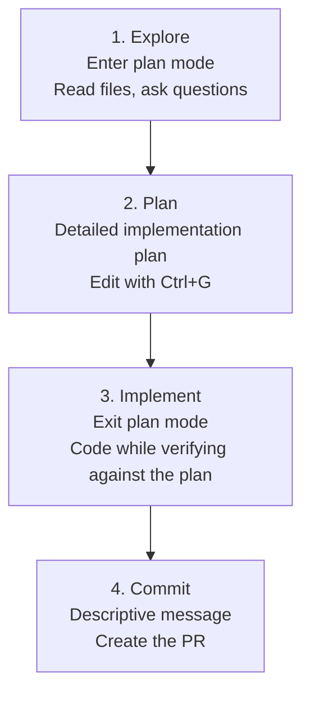

# Best Practices

Claude Code is an agentic tool that autonomously reads files, runs commands, and makes changes. Unlike simply getting code reviewed, **how you instruct it and how you have it verify** largely determines result quality. The patterns on this page converge on one mindset — instead of hand-steering every turn, design the loop and the environment in which the agent runs well on its own.


**One-line summary**: Most problems share one root cause. **The context window fills fast, and as it fills, response quality drops while cost rises.** Every best practice is designed around this constraint.


## Hand Over a Way to Verify

Claude stops when it gets the signal "the work seems done." Without tools to verify, you end up with a **verification loop where the user discovers every mistake**.

Provide verification Claude can run itself. A test suite, a build command, a linter, a screenshot-comparison script — anything Claude can read and react to works.

| Strategy | Weak instruction | Recommended instruction |
|------|---------|-----------|
| **Provide verification criteria** | `Implement a validateEmail function` | `Write a validateEmail function. Test cases: user@example.com is true, invalid is false, user@.com is false. Run the tests after implementing and confirm they pass` |
| **Visual verification of UI changes** | `Make the dashboard look better` | `[Screenshot attached] Implement to match this design. Take a screenshot of the result, compare with the original, and list the differences` |
| **Root-cause resolution** | `The build is failing` | `Build failure: [error text]. Find and fix the root cause. Resolve the error — do not hide it` |

Once verification is provided, Claude runs this cycle on its own:

1. Execute the work
2. Run the verification
3. Read the results
4. Repeat until it passes

This is why an unwatched session can still finish correctly. Demand evidence with completion reports — test output, commands run and their results, screenshots. It is faster than re-running things yourself. "Verifiable completion conditions + evidence-based judgment" is also the principle MoAI-ADK systematized into SPEC acceptance criteria (AC) and the TRUST 5 gates.

## The 4 Stages: Explore → Plan → Implement → Commit

Jumping straight into coding can produce **code that solves the wrong problem**. Explore and plan first. Read-only turns are cheap and implementation turns are expensive, so this ordering is a matter of token economics as much as quality.


```mermaid
flowchart TD
    A["1. Explore<br/>Enter plan mode<br/>Read files, ask questions"] --> B["2. Plan<br/>Detailed implementation plan<br/>Edit with Ctrl+G"]
    B --> C["3. Implement<br/>Exit plan mode<br/>Code while verifying against the plan"]
    C --> D["4. Commit<br/>Descriptive message<br/>Create the PR"]
```

Stage by stage:

1. **Explore** (plan mode): read files and ask questions. No changes allowed.
   ```text
   In plan mode:
   Read /src/auth and understand the session and login flows.
   Also look at how secrets are managed via environment variables.
   ```
2. **Plan**: write a detailed implementation plan. `Ctrl+G` lets you edit it directly in your editor.
3. **Implement**: exit plan mode and code. Run tests, verifying against the plan.
4. **Commit**: commit with a descriptive message and create the PR.

For clearly scoped, simple work (fixing a typo, adding one line, renaming a variable), skipping the plan stage is fine. Planning is most effective **when scope is uncertain or multiple files change**. MoAI-ADK's plan→run→sync lifecycle and Implementation Kickoff Approval gate institutionalize these 4 stages as the SPEC workflow.

## Provide Specific Context

Claude can infer intent, but it cannot read minds. **The more specific you are, the fewer corrections needed** — and fewer corrections mean fewer tokens.

| Strategy | Vague instruction | Recommended instruction |
|------|---------|-----------|
| **Constrain the scope** | `Add tests to foo.py` | `Write foo.py tests covering the logged-out edge case. No mocks` |
| **Point to sources** | `Why is the ExecutionFactory API weird?` | `Look through ExecutionFactory's git history and summarize how the API evolved` |
| **Reference patterns** | `Add a calendar widget` | `Study the existing widget implementation pattern on the home screen. HotDogWidget.php is a good example. Implement the calendar widget in that pattern` |
| **Describe symptoms** | `Fix the login bug` | `Login fails after session expiry. Check the token-refresh flow in src/auth. Write a failing test that reproduces the bug first, then fix it` |

### Ways to Provide Rich Context

- **Reference files with @**: point directly with `@path/file` instead of describing, and Claude reads it first
- **Paste images**: attach screenshots or design mocks directly
- **Provide URLs**: give doc/API reference URLs and allowlist the domain via `/permissions`
- **Pipe input**: pass data directly with `cat error.log | claude`

## Set Up the Environment

Small configuration changes make every session more efficient. Moving the corrections you repeat each session into the environment — that is where harness engineering starts.

### Writing CLAUDE.md

A special file Claude reads at the start of every session. Write code style, workflows, and project setup. Auto-generating a draft with the `/init` command and refining it is fast. `/init` analyzes the project — detecting the build system, finding the test framework, learning code patterns — to produce the draft.

**Include**:

- Bash commands (things Claude cannot guess)
- Code style rules (where they differ from defaults)
- The test framework and how to run it
- Repository etiquette (branch names, PR rules)
- Architecture decisions (project-specific quirks)

**Exclude**:

- Anything readable from the code (link API docs instead)
- Frequently changing information

CLAUDE.md loads in full every session and consumes tokens, so as it grows, it needs a diet.

### Configuring Permission Modes

The default has Claude requesting approval for every action. Safe but tedious.

- **Auto mode** (`Shift+Tab`): a classifier model judges risk and auto-approves.
- **Permission allowlists**: pre-allow safe commands like `npm run lint` and `git commit`.
- **Sandboxing**: OS-level isolation for freer work while keeping boundaries.

### Leveraging CLI Tools

CLIs like `gh` (GitHub CLI), `aws`, and `gcloud` are highly context-efficient. If installed, Claude uses them automatically; if not, it falls back to APIs, which can be slower and more constrained.

### Connecting MCP Servers

Issue trackers, databases, and monitoring dashboards connect directly to Claude via MCP (Model Context Protocol).

```bash
claude mcp add --transport http <server-name>
```

## Extending with Skills and Subagents

### Skills — Domain Knowledge

Write a `SKILL.md` file in `.claude/skills/` to auto-load domain-specific guidance.

```markdown
---
name: api-conventions
description: REST API design rules for our service
---

- URL paths: kebab-case
- JSON properties: camelCase
- Versions: included in the URL path (/v1/, /v2/)
```

It loads only when needed, so it never pollutes every session's context.

### Subagents — Isolated Experts

Delegate to a subagent when many files must be read or deep analysis is needed. It works in an independent context and returns only a summary, so the investigation's file reads never occupy the main session context.

## Session Management

### Separating Contexts with /clear

When moving between tasks in a big project, running `/clear` to shed the previous context before starting new work keeps performance up.

- After completing a stage of work
- When context usage exceeds 150K
- When switching to unrelated work

### Experimenting with Rewind

The `Esc` key or `/rewind` command returns you to an earlier state. You can try a different approach while keeping context, enabling experimentation without fear of failure.

### Delegate Investigation to Subagents

When large-scale exploration is needed, send a subagent. The files it reads never contaminate the main session context.

## Running Multiple Agents in Parallel

Read-only analysis and review can proceed in parallel across multiple sessions.

- **Writer/Reviewer pattern**: session A (Writer) implements the code, session B (Reviewer) reviews from an independent perspective, then session A applies the feedback. This separation of the builder from the checker is the same principle MoAI-ADK institutionalized with its independent audit agents, plan-auditor / sync-auditor.
- **Test/Code split**: session A writes the tests (TDD) and session B implements code that passes them.

## Automation and Scale

### Non-Interactive Mode

```bash
claude -p "prompt" --output-format json
```

Integrate Claude into CI pipelines, pre-commit hooks, and scripts.

### Parallel Multi-Session Runs

Advance multiple SPECs at once, or transform large batches of files in parallel. Isolating with [worktrees](/claude-code/agentic/worktrees) so file edits never overlap is the safe way.

### Autonomous Completion with /goal

```text
/goal "all tests pass and coverage is at or above 85%"
```

Declare the completion condition and Claude iterates automatically, stopping when the goal is achieved. By this point your role has shifted from "instructing every turn" to "designing the loop" — MoAI-ADK's `/moai goal` and `/moai loop` are extensions coupling this loop to the project's quality tooling and SPEC lifecycle.

## Avoiding Common Failure Patterns

| Pattern | Problem | Fix |
|------|------|------|
| **The kitchen-sink session** | Unrelated tasks mixed together pollute context | `/clear` between unrelated tasks |
| **Repeated corrections** | The same problem recurs despite fixing it twice | `/clear`, then restart with better instructions |
| **A bloated CLAUDE.md** | Instructions so long Claude ignores more than half | Prune ruthlessly. The test: "would it make a mistake without this rule?" |
| **The trust-verify gap** | A plausible-looking implementation misses edge cases | Always provide verification (tests, screenshots, linters) |
| **Endless exploration** | An unscoped "look into this" reads hundreds of files | State the scope or delegate to a subagent |

## Related Documents

- [Context Window](/claude-code/context-memory/context-window)
- [Subagents](/claude-code/agentic/sub-agents)
- [Goal-Directed Execution (/goal)](/claude-code/agentic/goal)
- [Large Codebases](/claude-code/agentic/large-codebases)

## References

- [Best practices for Claude Code (official docs)](https://code.claude.com/docs/en/best-practices)


If you take only one thing from this page, make it "hand over a way to verify." A verifiable completion condition is what lets the loop run itself, and a self-running loop is what gives every other best practice its power.

