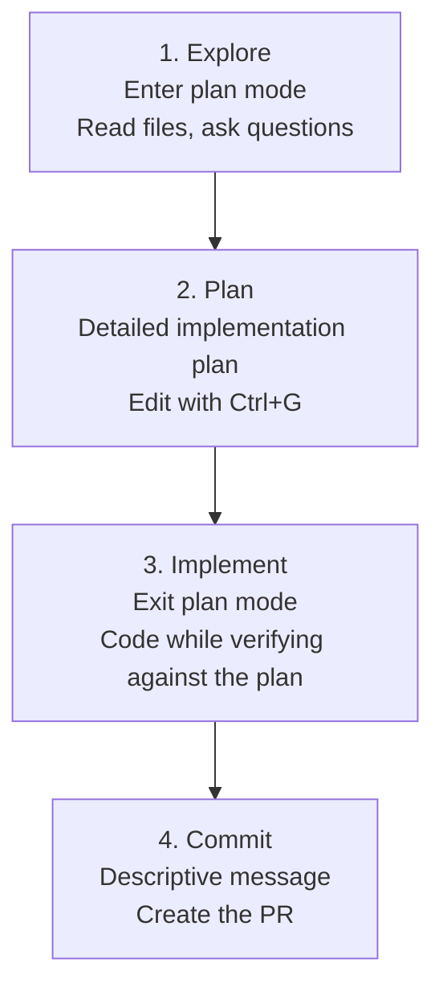

# Best Practices

Claude Code is an agent that reads files, runs commands, and edits code on its own. Result quality therefore depends not on how smart the model is, but on **how you instruct it and how you make it verify**.

The patterns on this page all converge on one place. Instead of hand-steering every turn, you design the loop and the environment in which the agent runs well on its own.


**One-line summary**: most problems share a single root cause. **The context window fills fast, and as it fills, response quality drops while cost rises.** Every best practice on this page is designed around that constraint.


## Hand over a way to verify

Claude stops when it receives the signal "the work seems done." Without tools to verify, you end up with a **verification loop where the user discovers every mistake**.

So hand over verifications Claude can run itself. A test suite, a build command, a linter, a screenshot-comparison script — anything Claude can read and react to works.

| Strategy | Weak instruction | Recommended instruction |
|------|---------|-----------|
| **Provide verification criteria** | `Implement a validateEmail function` | `Write a validateEmail function. Test cases: user@example.com is true, invalid is false, user@.com is false. Run the tests after implementing and confirm they pass` |
| **Visual verification of UI changes** | `Make the dashboard look better` | `[Screenshot attached] Implement to match this design. Take a screenshot of the result, compare with the original, and list the differences` |
| **Root-cause resolution** | `The build is failing` | `Build failure: [error text]. Find and fix the root cause. Resolve the error — do not hide it` |

Once verification is provided, Claude runs this cycle on its own:

1. Execute the work
2. Run the verification
3. Read the results
4. Repeat until it passes

This is why an unwatched session still ends up going all the way correctly. Demand evidence with completion reports — test output, the commands run and their results, screenshots are that evidence, and it is faster than re-running them yourself. **Judging on observed results (evidence), not on a "done" claim** — this is also the principle MoAI-ADK systematized into SPEC acceptance criteria (AC) and the TRUST 5 gates.

### Batch verifications into one turn

If there are several verification commands — tests, lint, build, type check — hand them over together in a single turn. Running one, reporting the result, then running the next, serializes a round trip each time, repeating wait time and permission confirmations. Bundling several read-only verifications into one response collapses those N round trips into one.

The same pattern applies when Claude verifies itself. Recent Claude Code versions run independent read-only commands in parallel within a single response, so the more you design verification as "one batch" rather than "one at a time," the shorter the wall-time. The larger lesson: design verification as a **batch**, not a sequence.

## The 4 stages: Explore → Plan → Implement → Commit

Jumping straight into coding can produce **code that solves the wrong problem**. Explore and plan first. Read-only turns are cheap and implementation turns are expensive, so this ordering is a matter of token economics as much as quality.


```mermaid
flowchart TD
    A["1. Explore<br/>Enter plan mode<br/>Read files, ask questions"] --> B["2. Plan<br/>Detailed implementation plan<br/>Edit with Ctrl+G"]
    B --> C["3. Implement<br/>Exit plan mode<br/>Code while verifying against the plan"]
    C --> D["4. Commit<br/>Descriptive message<br/>Create the PR"]
```

Stage by stage:

1. **Explore** (plan mode): read files and ask questions. No changes allowed.
   ```text
   In plan mode:
   Read /src/auth and understand the session and login flows.
   Also look at how secrets are managed via environment variables.
   ```
2. **Plan**: write a detailed implementation plan. `Ctrl+G` lets you edit it directly in your editor.
3. **Implement**: exit plan mode and code. Run tests, verifying against the plan.
4. **Commit**: commit with a descriptive message and create the PR.

For clearly scoped, simple work (a typo fix, a one-line addition, a variable rename), skipping the plan stage is fine. Planning pays off most **when scope is uncertain or multiple files change**. MoAI-ADK's plan→run→sync lifecycle and Implementation Kickoff Approval gate institutionalize these 4 stages as the SPEC workflow.

## Provide specific context

Claude can infer intent, but it cannot read minds. **The more specific you are, the fewer corrections needed** — and fewer corrections save tokens too.

| Strategy | Vague instruction | Recommended instruction |
|------|---------|-----------|
| **Constrain the scope** | `Add tests to foo.py` | `Write foo.py tests covering the logged-out edge case. No mocks` |
| **Point to sources** | `Why is the ExecutionFactory API weird?` | `Look through ExecutionFactory's git history and summarize how the API evolved` |
| **Reference patterns** | `Add a calendar widget` | `Study the existing widget implementation pattern on the home screen. HotDogWidget.php is a good example. Implement the calendar widget in that pattern` |
| **Describe symptoms** | `Fix the login bug` | `Login fails after session expiry. Check the token-refresh flow in src/auth. Write a failing test that reproduces the bug first, then fix it` |

### Put it all in one turn

Recent Opus-class models (Opus 4.7+, 4.8, 5) prefer working **fully loaded in one turn**. Put the intent, the constraints, the completion criteria, and the relevant file locations into a single prompt. Dribbling it out piece by piece across multiple turns wastes tokens and degrades result quality — the model has to rebuild its understanding from an incomplete picture every turn. Say everything relevant up front, then let it work.

In the same spirit, **state what "done" means in the same turn that describes the task**. Handing over the completion condition before the model has to ask is exactly what "fully loaded in one turn" means in practice.

### Ways to provide rich context

- **Reference files with @**: point directly with `@path/file` instead of describing, and Claude reads it first
- **Paste images**: attach screenshots or design mocks directly
- **Provide URLs**: give documentation/API reference URLs and allowlist the domain via `/permissions`
- **Pipe input**: pass data directly with `cat error.log | claude`

## Set up the environment

Small configuration changes make every session more efficient. Moving the corrections you repeat each session into the environment — that is where harness engineering starts.

### CLAUDE.md — the home of invariant rules

`CLAUDE.md` is a special file Claude reads at the start of every session. What belongs in it are the **invariant rules that would go wrong if left unsaid** — not facts readable from the code, but the project's own conventions and preferences. Auto-generating a draft with `/init` and refining it is fast. `/init` analyzes the project — detecting the build system, finding the test framework, learning code patterns — to produce the draft.

**Include**:

- Bash commands (things Claude cannot guess)
- Code style rules (where they differ from the defaults)
- The test framework and how to run it
- Repository etiquette (branch names, PR rules)
- Architecture decisions (project-specific quirks)

**Exclude**:

- Anything readable from the code (link API docs instead)
- Frequently changing information

`CLAUDE.md` is loaded for the entire session and consumes tokens, so as it grows it needs a diet. Prune ruthlessly, with "would it make a mistake without this rule?" as the bar.

### Configuring permission modes

By default, Claude requests approval for every action. Safe, but tedious.

- **Auto mode** (`Shift+Tab`): a classifier model judges risk and auto-approves.
- **Permission allowlists**: pre-allow safe commands like `npm run lint` and `git commit`.
- **Sandboxing**: OS-level isolation for freer work while keeping boundaries.

Subagents have run in the background by default since v2.1.198, and when they hit a tool that needs permission, the prompt surfaces in the main session (since v2.1.186, it even names which subagent asked). So adding the tools you will need to the `settings.json` allowlist before starting long work sharply reduces prompt frequency.

### CLI tools and MCP servers

CLIs like `gh` (GitHub CLI), `aws`, and `gcloud` are highly context-efficient. If installed, Claude uses them automatically; if not, it falls back to APIs, which can be slower and more constrained.

Issue trackers, databases, and monitoring dashboards connect directly to Claude via MCP (Model Context Protocol).

```bash
claude mcp add --transport http <server-name>
```

## Extending with skills and subagents

### Skills — domain knowledge

Write a `SKILL.md` file under `.claude/skills/` to auto-load domain-specific guidance.

```markdown
---
name: api-conventions
description: REST API design rules for our service
---

- URL paths: kebab-case
- JSON properties: camelCase
- Versions: included in the URL path (/v1/, /v2/)
```

It loads only when needed, so it never pollutes every session's context.

### Subagents — isolated experts

Delegate to a subagent when many files must be read or deep analysis is needed. It works in an independent context and returns only a summary, so the investigation's file reads never occupy the main session context. Subagent definitions, too, should keep losing weight over time — the definition text enters the context on every spawn, so any flab becomes a per-call cost.

Subagent nesting is enabled by default since v2.1.219 (depth 3), but if you want to keep the hierarchy flat, removing the `Agent` tool from the subagent's definition guarantees it. See [Subagents](/en/claude-code/agentic/sub-agents) for structure and configuration details.

## Session management

### Separate contexts with /clear

When moving between tasks in a big project, running `/clear` to shed the previous context before starting new work keeps performance up.

- After completing a stage of work
- When context usage runs high
- When switching to unrelated work

### Experiment with rewind

The `Esc` key or the `/rewind` command returns you to an earlier state. You can try a different approach while keeping context, enabling experimentation without fear of failure.

### Delegate investigation to subagents

When large-scale exploration is needed, send a subagent. The files it reads never pollute the main session context.

## Agent teams and parallel execution

Running several agents at once is powerful, but **the core skill is discerning what to run in parallel**.

### Parallel for research, sequential for coding

One observation from the official guide is worth engraving: **most coding work has less genuinely parallelizable portion than research does.** Code is interdependent — a change in one file entangles another. So the default for coding-centered work is sequential subagents.

Research and review, conversely, parallelize beautifully. Several agents investigating from different angles and cross-validating findings is a natural structure.

- **Where parallel shines**: PR review, library research, testing bug-cause hypotheses, whole-codebase scans
- **Where sequential is safe**: implementation touching the same files, changes with step-by-step dependencies, everyday single-file edits

### Start with 3-5

When using agent teams, the official guide recommends starting with **3-5 members** — meaning do not grow past that easily. The reasons are simple.

- Token cost grows linearly with the headcount. Every member spends separately in its own context.
- More members mean more communication and coordination overhead, and a higher chance of two agents touching the same file.
- Past a certain count, returns diminish. Additional members do not speed the work up proportionally.

Assigning 5-6 tasks per member keeps everyone busy without excessive context switching. Three focused members often beat five scattered ones.

### Teams, subagents, workflows — which and when

Three orchestration primitives exist, distinguished by "who holds the plan."

| Primitive | When | Detailed doc |
|------|------|------------|
| **Subagents** | Focused work where you only need the result; the default for coding | [Subagents](/en/claude-code/agentic/sub-agents) |
| **Agent teams** | Parallel research · review where findings must be shared and cross-checked | [Agent Teams](/en/claude-code/agentic/agent-teams) |
| **Dynamic workflows** | Fan-outs of tens to hundreds of agents, too many to coordinate in one conversation | [Dynamic Workflows](/en/claude-code/agentic/workflows) |

### Flat hierarchies are safer

Subagent nesting is enabled by default since v2.1.219, allowing spawns up to depth 3 (`CLAUDE_CODE_MAX_SUBAGENT_SPAWN_DEPTH=1` disables it). But nesting being possible does not make nesting good. The deeper the hierarchy, the harder it is to track what is happening where. To keep the hierarchy flat, remove the `Agent` tool from the subagent definition's `tools:` list — that is today's only flat-hierarchy guarantee. MoAI-ADK making flat orchestration a founding principle comes from the same place.

### Background by default, permission prompts go to the main session

Subagents run in the background by default since v2.1.198; Claude runs one in the foreground only when it needs the result immediately. When a background subagent hits a tool that needs permission, the prompt surfaces in the main session (v2.1.186+ also names which subagent asked), and `Esc` denies just that call. That is why pre-allowing safe commands before long work is recommended.

One more thing: the spawn-time `mode` parameter is **ignored** since v2.1.213. Subagents inherit the parent session's permission mode, so to guarantee read-only scoping, enforce it not by permission mode but by **tool restriction** (removing write tools from the `tools:` list).

### Name the model on every spawn

When spawning a subagent, passing `model` explicitly is recommended. The `model:` default in subagent definitions is `inherit` (inherit the main session's model), so leaving it unstated can silently run the spawn on a different model than intended. Stating which model runs at which effort on every spawn is also the practice of the tokenomics principle "plan deep, implement cheap, verify independently."


Recent Opus-class models (Opus 4.7+, 4.8, 5) **do not spawn subagents on their own**. They lean toward reasoning over tool calls, so when fan-out helps, you must instruct it explicitly — "investigate these files in parallel." Not spawning a subagent for work finishable in one response is the default.


## Automation and scale

### Non-interactive mode

```bash
claude -p "prompt" --output-format json
```

Integrate Claude into CI pipelines, pre-commit hooks, and scripts.

### Parallel multi-session runs

Advance several tasks at once, or transform large volumes of files in parallel. Isolating with [worktrees](/en/claude-code/agentic/worktrees) so file edits never overlap is the safe way. To turn dynamic workflows off, set the environment variable `CLAUDE_CODE_DISABLE_WORKFLOWS=1`.

### Autonomous completion with /goal

```text
/goal "when all tests pass and coverage is at or above 85%"
```

Declare the completion condition and Claude iterates automatically, stopping when the goal is met. Reaching this point, your role has moved from "instructing every turn" to "designing the loop." MoAI-ADK's `/moai goal` and `/moai loop` are extensions that couple this loop to the project's quality tooling and SPEC lifecycle.

## Avoiding common failure patterns

| Pattern | Problem | Fix |
|------|------|------|
| **The kitchen-sink session** | Unrelated tasks mixed together pollute context | `/clear` between unrelated tasks |
| **Repeated corrections** | The same problem recurs despite fixing it twice | `/clear`, then restart with better instructions |
| **A bloated CLAUDE.md** | Instructions so long Claude ignores more than half | Prune ruthlessly, with "would it make a mistake without this rule?" as the bar |
| **Claim-only reports** | A plausible-looking implementation misses edge cases | Always provide verification. Demand evidence with completion reports |
| **Endless exploration** | An unscoped "look into this" reads hundreds of files | State the scope or delegate to a subagent |
| **Parallel-abused coding** | Running genuinely non-parallelizable coding through teams causes conflicts | Sequential subagents are the default for coding. Teams · workflows are for research · scans |

## Related documents

- [Context Window](/en/claude-code/context-memory/context-window)
- [Subagents](/en/claude-code/agentic/sub-agents)
- [Agent Teams](/en/claude-code/agentic/agent-teams)
- [Dynamic Workflows](/en/claude-code/agentic/workflows)
- [Goal-Directed Execution (/goal)](/en/claude-code/agentic/goal)
- [Large Codebases](/en/claude-code/agentic/large-codebases)

## References

- [Best practices for Claude Code (official docs)](https://code.claude.com/docs/en/best-practices)


If you take only one thing from this page, make it "hand over a way to verify." A verifiable completion condition is what lets the loop run itself, and a self-running loop is what gives every other best practice its power.

