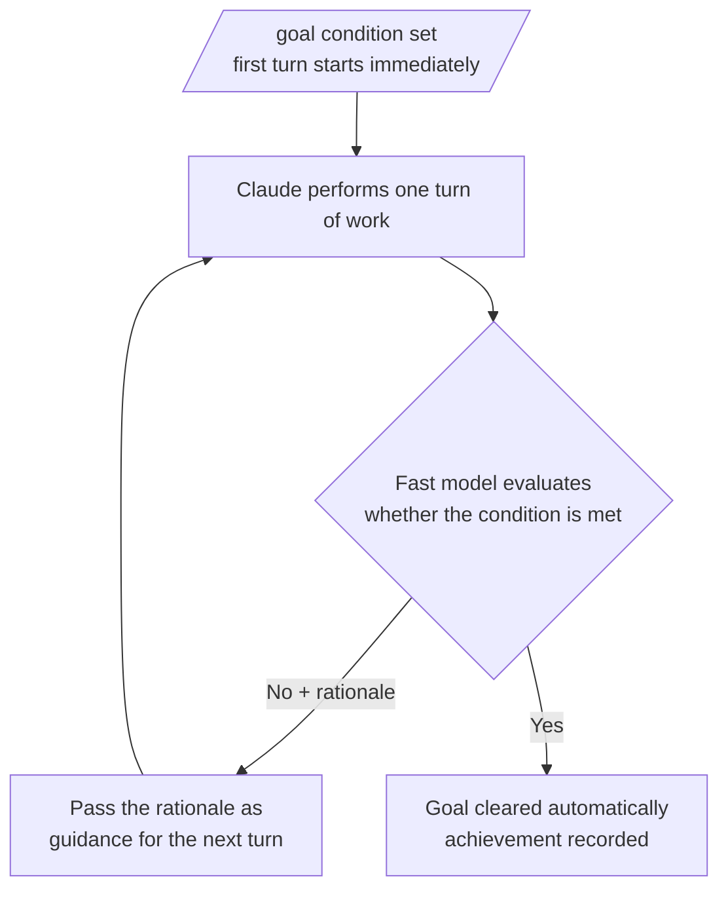

The `/goal` command is an autonomous continuation mechanism: once you set a verifiable completion condition, Claude Code keeps advancing the work on its own every turn until that condition is met.


**TL;DR**: At the end of each turn a fast model judges "is the condition met?" — if not, it automatically starts the next turn, so you never have to re-enter a prompt until the work is done.


## What /goal Is

`/goal` sets a **completion condition** and keeps Claude Code working toward it without any further input from you until the condition holds. At the end of each turn, a small fast model checks whether the condition is satisfied; if not, instead of returning control to you, it automatically starts the next turn. Once the condition is met, the goal is cleared automatically.

It suits large tasks that have a verifiable end state.

- Migrating a module to a new API until every call site compiles and the tests pass
- Implementing a design document until every acceptance criterion holds
- Splitting a large file until each file drops below the size budget
- Processing a labeled issue backlog until the queue is empty

Only one goal can be active per session. The same `/goal` command handles setting, checking status, and clearing, depending on its arguments.

## How It Works

`/goal` is a wrapper around a session-scoped **prompt-based Stop hook**. Each time Claude finishes a turn, the condition and the conversation so far are passed to a configured small fast model (Haiku by default). The model returns a yes/no judgment and a short rationale.



The evaluator does not call tools or read files directly. It judges solely from the content Claude has already **surfaced** in the conversation. That is why a condition like "all tests in `test/auth` pass" works well — Claude runs the tests and the results stay in the conversation record.

The evaluator runs on the same provider the session uses, and the tokens spent on evaluation are billed to the small fast model, which is usually negligible compared to the cost of the turn itself.

## Writing an Effective Condition

Since the evaluator judges only from what is surfaced in the conversation, you must write the condition in a form that Claude's output can **prove**. A condition that holds up over a long-running goal usually has three elements.

| Element | Description | Example |
| --- | --- | --- |
| Measurable end state | A test result, a build exit code, a file count, an empty queue, and so on | "all auth tests pass" |
| Stated verification method | How Claude should prove it | "`npm test` exits 0" or "`git status` is clean" |
| Constraints to uphold | What must not change along the way | "no other test file is modified" |

A condition can be up to **4,000 characters** long.

To keep the goal from looping indefinitely, include a turn or time limit clause in the condition. For example, writing `or stop after 20 turns` makes Claude report progress against that limit each turn, and the evaluator judges it together by looking at the conversation record.

```text
/goal all tests in test/auth pass and the lint step is clean, or stop after 20 turns
```

Once you set a goal, the first turn starts right away — the condition itself serves as the guidance, with no separate prompt required. While a goal is active, a `◎ /goal active` indicator appears showing how long the goal has been running.

## Checking Status and Clearing

### Checking Status

Run `/goal` with no arguments to see the current status.

```text
/goal
```

If a goal is active, it shows the condition, the running time, the number of evaluated turns, the current token usage, and the evaluator's most recent rationale. Even when no goal is active, if you achieved a goal earlier in this session, it shows that condition along with the elapsed time, turn count, and token usage.

### Clearing the Goal

To remove an active goal before the condition is met, run `/goal clear`.

```text
/goal clear
```

`stop`, `off`, `reset`, `none`, and `cancel` are accepted as aliases for `clear`. Running `/clear`, which starts a new conversation, also removes the active goal.

### Session Resume Behavior

A goal that was still active when the session ended is restored if you resume that session with `--resume` or `--continue`. The condition carries over as-is, but the turn count, timer, and token-usage baselines are all reset on resume. Goals that were already achieved or cleared are not restored.

### Non-Interactive Execution

`/goal` also works in **headless mode**, the desktop app, and remote control. Setting a goal with the `-p` flag runs the loop to completion in a single invocation.

```bash
claude -p "/goal CHANGELOG.md has an entry for every PR merged this week"
```

To interrupt a non-interactive goal before the condition is met, terminate the process with `Ctrl+C`.

## Comparison with /moai loop

`/goal` and `/moai loop` are complementary, not competing. The distinction is clear when you frame it by **what starts the next turn**.

| Aspect | When the next turn starts | When it ends |
| --- | --- | --- |
| `/goal` | When the previous turn finishes | When the fast model confirms the condition is met |
| `/moai loop` (Ralph Engine) | When the diagnostic cycle (LSP / AST-grep / test / coverage) finds remaining work | When all issues are resolved or the maximum iterations are reached |
| Stop hook | When the previous turn finishes | When your script or prompt decides |

The key differences are as follows.

- **`/moai loop`** is a deterministic, diagnostic-tool-driven fix loop. It already knows the project's quality tools and the SPEC lifecycle, so it fits "fix everything the tools flag."
- **`/goal`** is a model-evaluation loop over the conversation record. It does not run commands or read files; it judges what Claude has already surfaced, so it fits "keep going until this state is demonstrably true in the conversation."

## Operating Notes for MoAI-ADK

- `/goal` only removes the per-turn STOP prompt; it does not exempt the orchestrator's obligation to ask actual user-facing decisions via `AskUserQuestion`.
- Even with an active goal, you cannot automatically bypass GATE-2 (the user-approval gate) for the transition from the plan phase to the run phase. If entering the run phase requires user approval, you must still ask first.
- A goal only decides whether to continue; it does not pre-approve hard-to-reverse actions such as force-pushing or dropping a table.

## Requirements

- Claude Code **v2.1.139** or later is required.
- It works only in a workspace where the trust dialog has been accepted, because the evaluator is part of the hooks system.
- It cannot be used if `disableAllHooks` is enabled at any settings level, or if `allowManagedHooksOnly` is enabled in managed settings. In that case the command is not silently ignored — it tells you the reason.

## Related Docs

- [Dynamic Workflows](/claude-code/agentic/workflows)
- [/moai loop](/utility-commands/moai-loop)

## References

- [Keep Claude working toward a goal (`/goal`)](https://code.claude.com/docs/en/goal)


Write the condition in a form that Claude's output can prove, and always include a limit clause such as `or stop after N turns`. Because the evaluator does not read files directly, it is far more reliable to specify a verification method whose result stays in the conversation record — like "`go test ./...` exits 0" rather than "the tests pass."

