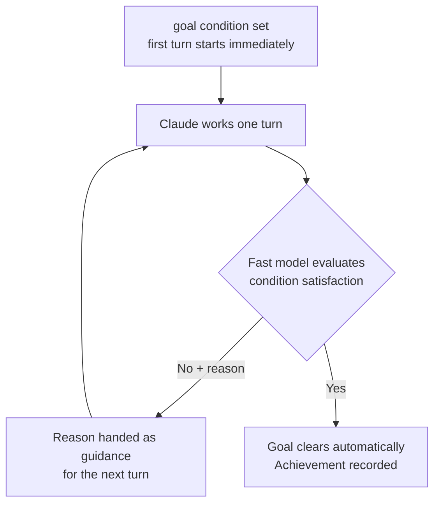

# Goal-Directed Execution (/goal)

When you hand Claude a large task that does not finish in one turn, you normally have to keep typing "continue" until it is done. The `/goal` command removes that repeated input — define an end condition once, and Claude keeps working every turn on its own until the condition holds. It is like asking someone to "sit at the desk until this stack of paperwork is sorted" and then stepping away.


**One-line summary**: At the end of every turn a fast model judges "is the condition met?", and if not, the next turn starts on its own — so you never need to type another prompt until the finish.


## When /goal Is Needed

`/goal` fits large tasks with a verifiable end state.

- Migrating a module to a new API until every call site compiles and tests pass
- Implementing a design document until all acceptance criteria hold
- Splitting a large file until each file falls below a size budget
- Working a labeled issue backlog until the queue is empty

Conversely, it does not suit light work that finishes in a turn or two, or exploratory work whose end state is hard to pin down. Just talking without a goal is better then.

Only one goal can be active per session. The same `/goal` command handles setting, status checks, and clearing, depending on its arguments.

## How It Works

`/goal` is a condition-evaluation loop layered on top of Claude Code's **Stop hook** system. Every time a turn ends, the following procedure runs.

1. Claude finishes one turn of work.
2. A configured **small fast model** (default **Haiku**) takes the condition and the conversation so far and judges "is it satisfied".
3. If satisfied, the goal clears automatically and an achievement record is left behind.
4. If not yet, the evaluation reason is handed to the next turn as guidance, and the next turn starts immediately.


```mermaid
flowchart TD
    A["goal condition set<br>first turn starts immediately"] --> B[Claude works one turn]
    B --> C{Fast model evaluates<br>condition satisfaction}
    C -->|No + reason| D[Reason handed as guidance<br>for the next turn]
    D --> B
    C -->|Yes| E[Goal clears automatically<br>Achievement recorded]
```

The evaluator **does not call tools or read files itself**. It judges only from what has surfaced in the conversation. That is the single most important fact shaping how conditions should be written (see "Writing an Effective Condition" below). The evaluator runs on the same provider the session uses, and its evaluation tokens are billed to the small fast model — usually negligible relative to the cost of the main turn.

## Writing an Effective Condition

Because the evaluator judges only from the conversation record, the condition must be in a form Claude's output can **prove**. Conditions that hold up over long goals usually have three elements.

| Element | Description | Example |
| --- | --- | --- |
| A measurable end state | Test results, build exit code, file count, an empty queue | "All auth tests pass" |
| A stated verification method | How Claude should prove it | "`npm test` exits 0" or "`git status` is clean" |
| Constraints to respect | What must not change along the way | "no other test file is modified" |

Conditions can be up to **4,000 characters** long.

To keep a goal from running forever, include a turn limit clause. Write `or stop after 20 turns` and Claude reports progress against that limit each turn, with the evaluator judging alongside from the conversation record.

```text
/goal all tests under test/auth pass and the lint step is clean, or stop after 20 turns
```

Setting a goal starts the first turn immediately, using the condition itself as the directive — no separate prompt needed. While a goal is active, a `◎ /goal active` indicator appears, showing how long the goal has been running.


Running verifications serially, one per turn inside the loop, accumulates round-trip latency and slows the whole loop down. Steer the instructions or condition to bundle independent read-only verifications as multiple Bash calls inside a single response (a parallel batch). Gathering verifications into one turn is the most effective way to shorten one loop revolution.


## Checking Status and Clearing

### Status Check

Run `/goal` with no arguments to see the current state.

```text
/goal
```

If a goal is active, it shows the condition, the run time, the number of evaluated turns, current token usage, and the evaluator's most recent reason. Even with no active goal, if a goal was achieved earlier in the session, it shows that condition along with the elapsed time, turn count, and token usage.

### Clearing a Goal

To remove an active goal before the condition is met, run `/goal clear`.

```text
/goal clear
```

`stop`, `off`, `reset`, `none`, and `cancel` are accepted as aliases for `clear`. Running `/clear` to start a new conversation also removes an active goal.

### Session-Resume Behavior

A goal still active when the session ended is restored when you resume that session with `--resume` or `--continue`. The condition carries over, but the turn-count, timer, and token-usage baselines all reset on resume. Goals already achieved or cleared are not restored.

### Non-Interactive Runs

`/goal` also works in **headless mode**, the desktop app, and remote control. Set a goal with the `-p` flag and one invocation runs the loop to completion.

```bash
claude -p "/goal CHANGELOG.md has an entry for every PR merged this week"
```

To interrupt a non-interactive goal before the condition is met, kill the process with `Ctrl+C`.

## The Evaluator Is a Model — What That Means

The evaluator of native `/goal` is a **model**. Because the Stop hook asks a fast model at every turn-end "is this condition true in the conversation record", the verdict depends on a language model's reading. Since the evaluator does not run commands itself, the fact "the tests pass" must **surface as text in the conversation record** to be judged.

So conditions are far more stable when they state the verification command and how its result lands in the conversation. Writing "`go test ./...` exits 0" makes Claude run the command and leave its result in the record, giving the evaluator evidence to read. Writing "the tests pass" forces the evaluator to guess at Claude's declaration in language.

This approach is flexible but not as solid as **mechanical judgment** that looks at a command's exit code directly. When you need machine discrimination that depends on a definite signal like an exit code, MoAI's `/moai goal` fills that gap.

## `/moai goal` — The Programmatic Counterpart

Native `/goal` is a TUI command only a user can type, so a model or workflow cannot set a goal on the user's behalf. MoAI-ADK fills this gap with **`/moai goal`** — a reimplementation of the same "declare a condition → Stop-hook evaluation at each turn-end → clear on satisfaction" semantics using a goal engine MoAI owns. The key difference is that it parses conditions into two kinds — **mechanical** and **model** — and lets you mix them.

| Condition kind | How it is judged | Example |
| --- | --- | --- |
| Mechanical | True/false from a shell command's exit code | `go test ./...` exits 0 |
| Model | The model judges whether it is a claim plainly surfaced in the conversation record | "All acceptance criteria hold in the conversation" |

Mechanical conditions rely on a definite signal — the exit code — so they are more solid than the model's language reading. Model conditions offer the same flexibility as native `/goal`. Declare a condition and the session works on its own until the condition is met or the **turn ceiling** (default 30) is reached, with `/moai goal status` and `/moai goal clear` handling status and clearing.

The loop has two more safety layers. The runtime's consecutive-block cap (environment variable `CLAUDE_CODE_STOP_HOOK_BLOCK_CAP`, default 8) can end the loop before the turn ceiling on an unattended run, so the effective bound is `min(turn ceiling, consecutive-block cap)`. And a **stagnation guard** that catches N consecutive no-progress iterations stops a loop stuck circling the same spot.

`/moai loop` is a preset on this goal engine — the condition "until the queue of issues the diagnostics found is empty" pre-filled. This condition-declared loop is the execution unit of MoAI-ADK's **Agentic Loop Engineering**; the record of the loop's run (how many turns, which verdicts, which failures) accumulates as observations, and the harness learns from them.

## /goal vs /moai loop

`/goal` and `/moai loop` are complementary, not competitors. The distinction is clear when framed as **what starts the next turn**.

| Approach | Next turn starts when | Ends when |
| --- | --- | --- |
| `/goal` | The previous turn finishes | The fast model confirms the condition holds |
| `/moai loop` (Ralph Engine) | The diagnostic cycle (LSP, AST-grep, tests, coverage) finds remaining work | All issues resolved or max iterations reached |
| Stop hook | The previous turn finishes | Your script or prompt decides |

- `/moai loop` is a deterministic, diagnostic-tool-driven fix loop. It already knows the project's quality tooling and the SPEC lifecycle, making it right for "fix everything the tooling flags".
- `/goal` is a model-evaluated loop over the conversation record. It runs no commands and reads no files, judging only what Claude has already surfaced — right for "keep going until this state is demonstrably true in the conversation".

## Cautions When Operating

- `/goal` only removes the per-turn STOP prompt; it does not exempt the orchestrator from routing genuine user decisions through `AskUserQuestion`.
- An active goal does not automatically bypass the Implementation Kickoff Approval (the user-approval gate) from the plan phase to the run phase. If run-phase entry requires user approval, you still ask first.
- A goal only decides whether to keep going; it does not pre-approve hard-to-reverse actions like force pushes or table drops.

## Requirements

- Requires Claude Code **v2.1.139** or later.
- Works only in workspaces where the trust dialog has been accepted, because the evaluator is part of the hooks system.
- Unavailable when `disableAllHooks` is on at any settings level.
- Also unavailable when the organization-level managed setting `allowManagedHooksOnly` is on.
- When these conditions are not met, the command is not silently ignored — it explains why it is unavailable.

## Related Documents

- [Dynamic Workflows](/en/claude-code/agentic/workflows)
- [/moai loop](/en/utility-commands/moai-loop)

## References

- [Goal directive (`/goal`) — Claude Code official docs](https://code.claude.com/docs/en/goal)


Write the condition in a form Claude's output can prove, and always include a limit clause like `or stop after N turns`. The evaluator does not read files itself, so stating a verification method that leaves its result in the conversation record — "`go test ./...` exits 0" rather than "the tests pass" — is far more reliable.

