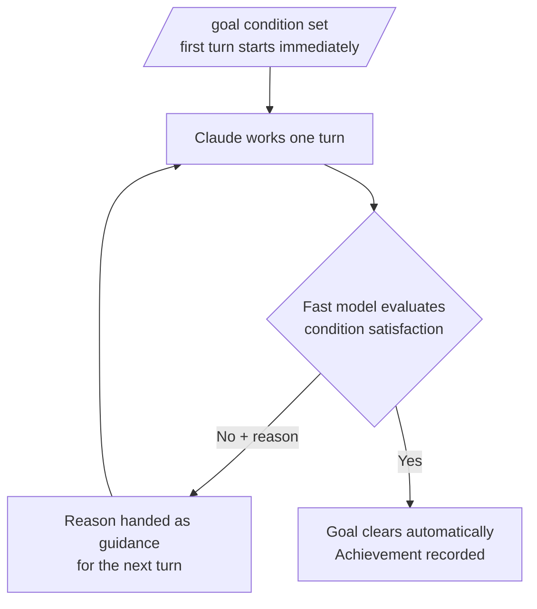

# Goal-Directed Execution (/goal)

The `/goal` command is an autonomous-continuation mechanism: define a verifiable completion condition once, and Claude Code keeps working on its own every turn until the condition is met.



**One-line summary**: At the end of every turn a fast model judges "is the condition met?", and if not, the next turn starts on its own — so you never need to type another prompt until the finish.


## What Is /goal

`/goal` sets a **completion condition** and lets Claude Code keep working without further user input until the condition holds. When each turn ends, a small fast model checks whether the condition is satisfied; if not yet, the next turn starts automatically instead of returning control to you. When the condition is met, the goal clears automatically.

It suits large tasks with a verifiable end state:

- Migrating a module to a new API until every call site compiles and tests pass
- Implementing a design document until all acceptance criteria hold
- Splitting a large file until each file falls below a size budget
- Working a labeled issue backlog until the queue is empty

Only one goal can be active per session. The same `/goal` command handles setting, status checks, and clearing, depending on its arguments.

## How It Works

`/goal` wraps a session-scoped **prompt-based Stop hook**. Every time Claude finishes a turn, the condition plus the conversation so far are handed to a configured small fast model (default **Haiku**). The model judges whether the condition holds based solely on what has surfaced in the conversation, returning yes/no with a short reason. The evaluator does not call tools or read files itself, so its verdict rests only on what Claude has already exposed in the conversation.


```mermaid
flowchart TD
    A[/goal condition set<br>first turn starts immediately/] --> B[Claude works one turn]
    B --> C{Fast model evaluates<br>condition satisfaction}
    C -->|No + reason| D[Reason handed as guidance<br>for the next turn]
    D --> B
    C -->|Yes| E[Goal clears automatically<br>Achievement recorded]
```

The evaluator runs on the same provider the session uses, and its evaluation tokens are billed to the small fast model — usually negligible relative to the cost of the main turn.

## Writing an Effective Condition

Since the evaluator judges from what surfaces in the conversation, write conditions in a form Claude's output can **prove**. Conditions that hold up over long goals usually have three elements.

| Element | Description | Example |
| --- | --- | --- |
| A measurable end state | Test results, build exit code, file count, an empty queue | "All auth tests pass" |
| A stated verification method | How Claude should prove it | "`npm test` exits 0" or "`git status` is clean" |
| Constraints to respect | What must not change along the way | "no other test file is modified" |

Conditions can be up to **4,000 characters** long.

To keep a goal from running forever, include a turn or time limit clause. For example, write `or stop after 20 turns` and Claude reports progress against that limit each turn while the evaluator judges from the conversation record.

```text
/goal all tests under test/auth pass and the lint step is clean, or stop after 20 turns
```

Setting a goal starts the first turn immediately, using the condition itself as the directive — no separate prompt needed. While a goal is active, a `◎ /goal active` indicator appears, showing how long the goal has been running.

## Checking Status and Clearing

### Status Check

Run `/goal` with no arguments to see the current state.

```text
/goal
```

If a goal is active, it shows the condition, the run time, the number of evaluated turns, current token usage, and the evaluator's most recent reason. Even with no active goal, if a goal was achieved earlier in the session, it shows that condition along with the elapsed time, turn count, and token usage.

### Clearing a Goal

To remove an active goal before the condition is met, run `/goal clear`.

```text
/goal clear
```

`stop`, `off`, `reset`, `none`, and `cancel` are accepted as aliases for `clear`. Running `/clear` to start a new conversation also removes an active goal.

### Session-Resume Behavior

A goal still active when the session ended is restored when you resume that session with `--resume` or `--continue`. The condition carries over, but the turn-count, timer, and token-usage baselines all reset on resume. Goals already achieved or cleared are not restored.

### Non-Interactive Runs

`/goal` also works in **headless mode**, the desktop app, and remote control. Set a goal with the `-p` flag and one invocation runs the loop to completion.

```bash
claude -p "/goal CHANGELOG.md has an entry for every PR merged this week"
```

To interrupt a non-interactive goal before the condition is met, kill the process with `Ctrl+C`.

## Comparison with /moai loop

`/goal` and `/moai loop` are complementary, not competitors. The distinction is clear when framed as **what starts the next turn**.

| Approach | Next turn starts when | Ends when |
| --- | --- | --- |
| `/goal` | The previous turn finishes | The fast model confirms the condition holds |
| `/moai loop` (Ralph Engine) | The diagnostic cycle (LSP, AST-grep, tests, coverage) finds remaining work | All issues resolved or max iterations reached |
| Stop hook | The previous turn finishes | Your script or prompt decides |

The core differences:

- **`/moai loop`** is a deterministic, diagnostic-tool-driven fix loop. It already knows the project's quality tooling and the SPEC lifecycle, making it right for "fix everything the tooling flags."
- **`/goal`** is a model-evaluated loop over the conversation record. It runs no commands and reads no files, judging only what Claude has already surfaced — right for "keep going until this state is demonstrably true in the conversation."

### /moai goal — The Programmatic Counterpart

Native `/goal` is a TUI command only a user can type, so a model or workflow cannot set a goal on the user's behalf. MoAI-ADK fills this gap with **`/moai goal`** — a reimplementation of the same "declare a condition → Stop-hook evaluation at each turn-end → clear on satisfaction" semantics using a goal engine MoAI owns. Declare a completion condition and the session works on its own until the condition is met or the turn ceiling (default 30) is reached, with `/moai goal status` and `/moai goal clear` handling status and clearing. `/moai loop` is a preset on this goal engine — the condition "until the queue of issues the diagnostics found is empty" pre-filled.

This condition-declared loop is the execution unit of MoAI-ADK's **Agentic Loop Engineering** pillar. The record of the loop's run (how many turns, which verdicts, which failures) accumulates as observations, and the harness learns from them.

## Cautions When Operating with MoAI-ADK

- `/goal` only removes the per-turn STOP prompt; it does not exempt the orchestrator from routing genuine user decisions through `AskUserQuestion`.
- An active goal does not automatically bypass the Implementation Kickoff Approval (the user-approval gate) from the plan phase to the run phase. If run-phase entry requires user approval, you still ask first.
- A goal only decides whether to keep going; it does not pre-approve hard-to-reverse actions like force pushes or table drops.

## Requirements

- Requires Claude Code **v2.1.139** or later.
- Works only in workspaces where the trust dialog has been accepted, because the evaluator is part of the hooks system.
- Unavailable when `disableAllHooks` is on at any settings level.
- Also unavailable when the organization-level managed setting `allowManagedHooksOnly` is on.
- When these conditions are not met, the command is not silently ignored — it explains why it is unavailable.

## Related Documents

- [Dynamic Workflows](/claude-code/agentic/workflows)
- [/moai loop](/utility-commands/moai-loop)

## References

- [Goal directive (`/goal`) — Claude Code official docs](https://code.claude.com/docs/en/goal)


Write the condition in a form Claude's output can prove, and always include a limit clause like `or stop after N turns`. The evaluator does not read files itself, so stating a verification method that leaves its result in the conversation record — "`go test ./...` exits 0" rather than "the tests pass" — is far more reliable.

