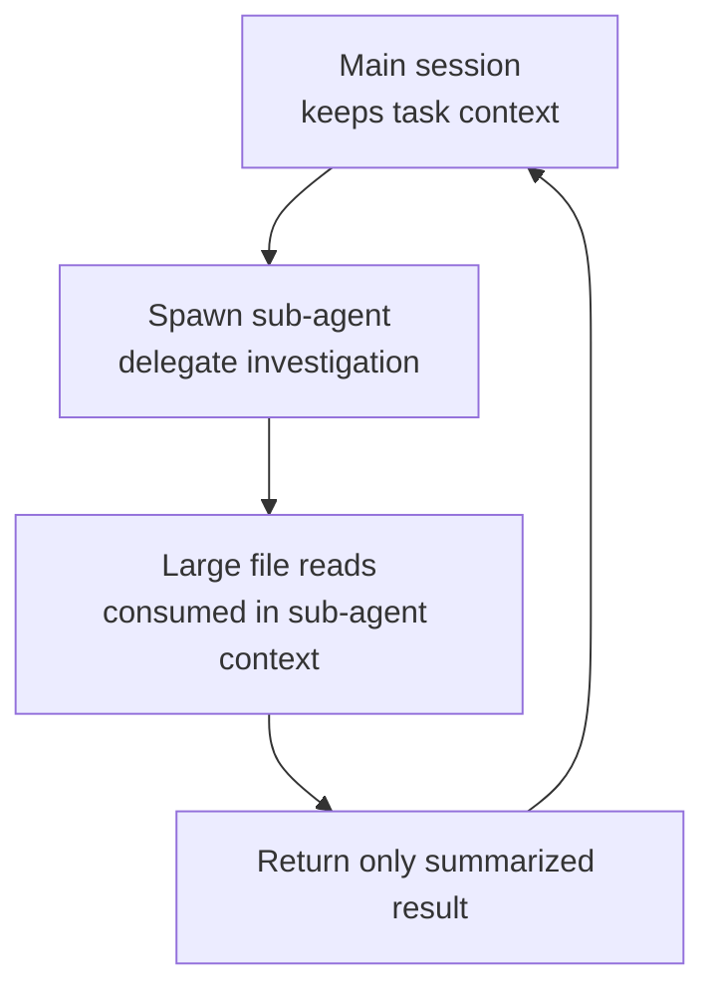

This page covers how to work efficiently with Claude Code in million-line single repositories and monorepos split across many packages.


**TL;DR**: The key to a large codebase is not "having everything read" but "loading only the part your current task touches into context."


## Why You Need a Dedicated Strategy

Claude Code works regardless of scale, but as a codebase grows, the default behavior tuned for small projects starts to cause problems. Instructions and file reads unrelated to your task fill the context window, waste tokens, and ultimately degrade response quality.

That is why best practices for large codebases all converge on one idea: **narrow Claude's field of view to the area your task actually touches.**

| Problem | Means of narrowing |
| --- | --- |
| A single root `CLAUDE.md` carrying every subsystem's rules | Split into per-directory `CLAUDE.md` files |
| `CLAUDE.md` files from packages you're not working on getting loaded | `claudeMdExcludes` setting |
| Generated and vendor code creeping into search results | `Read` deny rules in `permissions.deny` |
| Reading many files just to locate symbol definitions and call sites | Code intelligence plugin (LSP) |
| A worktree checking out the entire tree | `worktree.sparsePaths` sparse checkout |

## Deciding Where to Start Claude

The location where you run `claude` determines both the file access scope and the range of `CLAUDE.md` loaded at startup. It is the first thing to decide.

| Start location | File access | CLAUDE.md loaded at startup | When it fits |
| --- | --- | --- | --- |
| Repository root | All files | Root only (subdirectories on demand when read) | Work spans multiple packages or subsystems |
| Subdirectory | That subtree only | That directory plus all parent directories | Work is confined to one package or subsystem |

If you are focused on a single package, just running `claude` from that package directory drops other packages' instructions from context. Note that project settings in `.claude/settings.json`, unlike `CLAUDE.md`, are not inherited from parent directories and load only from the start directory.

## Context Management: Read Only What You Need

In a large codebase, two things mainly consume context: instructions that are always loaded, and file reads that happen during work. Both need to be reduced.

### Splitting Instructions with Per-Directory CLAUDE.md

If you cram every rule into a single root `CLAUDE.md`, it either bloats by carrying every subsystem's rules or becomes useless by being too generic. When you split instructions per directory, Claude loads the repository-wide rules plus **only the rules for the code you're working on right now**.

```markdown
# packages/api/CLAUDE.md
This package is the REST API server.

- Run tests: `npm test` (uses Vitest)
- Run dev server: `npm run dev` (port 3001)

API routes are in src/routes/. Database queries use Knex in src/db/.
```

When you start in `packages/api/`, the root `CLAUDE.md` and `packages/api/CLAUDE.md` load together, while `packages/web/`'s instructions never enter context. Commit these files to the repository so teammates can share them.

### Excluding Irrelevant CLAUDE.md

When you start from the root, a subdirectory's `CLAUDE.md` loads the moment you read a file there. For areas you never work on, such as another team's package or legacy code, you can block them entirely with `claudeMdExcludes`.

```json
{
  "claudeMdExcludes": [
    "**/packages/admin-dashboard/**",
    "**/packages/legacy-*/**"
  ]
}
```

Patterns are matched as globs against absolute paths, so to match anywhere in the tree, start with `**/`. For personal use, put them in `.claude/settings.local.json`. Note that this list is static, so if you have to change it every time ("this package today, that package tomorrow"), it is better to start Claude from the relevant package directory than to keep editing the exclude list.

### Blocking Reads of Generated and Vendor Code

Claude's content search respects `.gitignore` by default, so `node_modules/`, `dist/`, and `build/` are excluded from search results without any extra configuration. Vendor SDKs or generated code that is committed to the repository, on the other hand, can be blocked with `Read` deny rules in `permissions.deny`.

```json
{
  "permissions": {
    "deny": [
      "Read(./**/dist/**)",
      "Read(./**/*.generated.*)",
      "Read(./vendor/**)"
    ]
  }
}
```

Deny rules cover both Claude's built-in file tools and recognizable Bash file commands such as `cat`, `head`, `grep`, and `find`. They do not, however, filter paths out of recursive search output, nor do they block arbitrary subprocesses that open files directly.

## Parallel Exploration: Sub-agents and Explore

Another way to avoid piling task-irrelevant files into context is to run the exploration itself in a separate context. When you run an investigation inside a sub-agent, the many file reads it incurs do not remain in the main conversation; only the summarized result comes back.



The Explore agent is an Anthropic built-in sub-agent specialized in read-only codebase exploration. When you want to understand the structure or find where a feature lives, delegating to Explore instead of having the main session read dozens of files directly keeps the main context clean.

> MoAI-ADK structures this pattern one step further, orchestrating so that read-only investigation is parallelized across Explore or sub-agents while the main agent handles only synthesis. For the detailed delegation policy, see the [Sub-agents](/claude-code/agentic/sub-agents) document.

## Efficient Search Pattern: Glob → Grep → Read

In a large codebase, the search order itself governs token efficiency. The default is progressive narrowing — starting broad and gradually tightening.

| Step | Tool | Purpose |
| --- | --- | --- |
| 1 | Glob | Narrow down candidate files by name or pattern |
| 2 | Grep | Narrow matching files by content (`files_with_matches`) |
| 3 | Grep | Inspect precisely with context lines |
| 4 | Read | Read only the needed range with `offset`/`limit` |

The key is to always locate the position with a search before reading an entire file, then read only that range partially.

### Reducing File Reads with Code Intelligence

Finding a symbol's definition or call sites can balloon into many file reads and grep calls. Attaching a code intelligence plugin (LSP-based) lets Claude query the language server directly for go-to-definition, find-references, and type-error checks instead of scanning the tree.

```bash
/plugin install typescript-lsp@claude-plugins-official
```

The official marketplace provides plugins for major languages such as TypeScript, Python, Go, and Rust. Each developer machine must have that language's language server binary installed. This feature pairs well with `claudeMdExcludes` and `Read` deny rules: the first two push irrelevant content out of context, while code intelligence keeps Claude from reading files to find definitions in what remains.

## Narrowing Worktree Scope

The `--worktree` flag starts a session in a new worktree to isolate changes from the main checkout. The default is a full repository checkout, but in large repositories you can apply a git sparse checkout with `worktree.sparsePaths` to write only the needed directories to disk.

```json
{
  "worktree": {
    "sparsePaths": [".claude", "packages/api", "packages/shared"],
    "symlinkDirectories": ["node_modules"]
  }
}
```

Paths are relative to the repository root, independent of the start directory. List them at the directory level; root-level files such as `package.json` are always checked out together. This is especially useful for per-sub-agent worktree isolation, where each parallel sub-agent gets a lightweight checkout instead of the full tree. Adding `symlinkDirectories` shares large directories like `node_modules` via symbolic links instead of duplicating them.

## Pinning Project Knowledge with Progressive Understanding and Memory

A large codebase cannot be understood all at once. When you record the structure and rules you discover through exploration in `CLAUDE.md`, that knowledge is pinned in context without being rediscovered every session.

- **Root `CLAUDE.md`**: rules that apply everywhere, such as coding standards, commit conventions, and repository layout
- **Per-directory `CLAUDE.md`**: rules specialized to that area's stack (per package in a monorepo, or per subsystem such as `src/db/` and `src/api/` in a single tree)

There are also practices for keeping `CLAUDE.md` current. Review it alongside other documentation changes in pull requests, and after a major model release, re-examine rules you added to work around an older model's limitations. You can even set up a `Stop` hook to propose `CLAUDE.md` updates when a session ends.

### Handling Cross-Package Changes

When a change spans multiple packages — like fixing a shared type and all its call sites together — two things help.

1. **Hand the entire change to one session**: handling the shared edit and its call sites together keeps the rationale for each edit consistent rather than re-deriving it per package.
2. **Save the plan to a file before editing**: plan first, then save that plan as a markdown file. Long sessions compact the context partway through, so a saved plan survives even when the conversation history is lost.

## Related Docs

- [Sub-agents](/claude-code/agentic/sub-agents)
- [Context Window](/claude-code/context-memory/context-window)

## References

- [Set up Claude Code in a monorepo or large codebase](https://code.claude.com/docs/en/large-codebases)


Practical tip: When starting a new task, first decide "which directory does this task touch," and if possible, run `claude` from that directory. Getting just the start location right automatically drops irrelevant `CLAUDE.md` files and file reads out of context.

