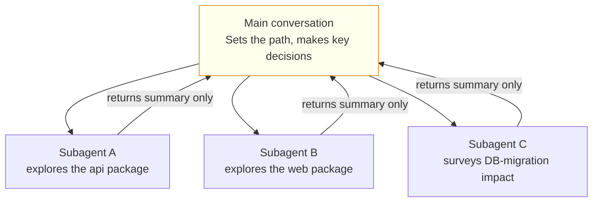

# Large Codebases

Claude Code works well even on large codebases — whether a multi-million-line single repository or a monorepo of many packages. But the defaults assume a small project, so a **strategy of narrowing context to only what each task actually touches** is essential.


This page is background material on **Claude Code itself**, the platform MoAI-ADK runs on. How to use MoAI-ADK is covered in [Tokenomics Overview](/en/advanced/tokenomics-overview).



**One-line summary**: The real problem in a large codebase is not "many files" but **irrelevant guidance and files filling the context**. Irrelevant tokens degrade quality while raising cost — context narrowing IS tokenomics.


## Context Diet Is the Key

In a small project, a single CLAUDE.md, one directory, and a handful of files are enough — there is enough slack in the context to load everything at once. But as the repository grows, the picture changes. Guidance from dozens of packages, auto-generated files, vendor SDKs, and other teams' legacy code all climb into a single session, diffusing Claude's attention away from the one function you actually want to fix.

So the large-codebase strategy reduces to one question: **"how do I keep what is irrelevant to the current task from being loaded in the first place?"** Every setting and habit in this document is a different answer to that same question.

-  Narrow the starting location — irrelevant package guidance never loads in the first place.
-  Split CLAUDE.md and pull files with `@` — only global rules enter every session; area-specific rules load on demand.
-  Delegate exploration to subagents — the dirty work of reading hundreds of files happens in a context other than the main conversation.
-  Tidy up midway with `/compact` — even after early exploration has filled the context, only the core conclusions remain.

## Choosing Where to Start

Where you run `claude` determines everything that follows.

| Starting location | File access scope | CLAUDE.md loaded | Best when |
|---------|-----------|---------------|---------|
| **Repository root** | Everything | Root only (subdirectories on demand) | Work spanning multiple packages/subsystems |
| **A subdirectory** | Only that subtree | That directory + every ancestor | Work confined to one package/subsystem |

If the work focuses on one package (say `packages/api/`), run `claude` in that directory. Guidance from `packages/web/` never loads in the first place, so the context lightens on its own without any effort spent pruning rules.

## Splitting CLAUDE.md by Directory

Cramming every rule into a single root CLAUDE.md creates three problems:

- It gets too long, hurting readability
- Trying to apply to every package makes it too generic to be useful
- Guidance irrelevant to the task loads every session anyway

The fix is layering: keep repo-wide rules at the root and put each area's rules in its own subdirectory.

```markdown
# ./CLAUDE.md (root, loaded in every session)
This is a monorepo with three packages:
- packages/api: Node.js REST API with Express, TypeScript, PostgreSQL
- packages/web: React frontend with Vite, TypeScript, TailwindCSS
- packages/shared: shared TypeScript utilities

Run commands from the package directory.
```

```markdown
# ./packages/api/CLAUDE.md (loaded only when working in this directory)
This package is the REST API server.

- Run tests: `npm test` (uses Vitest)
- Run dev server: `npm run dev` (port 3001)
- Database migrations: `npm run migrate`

API routes are in src/routes/. Never write raw SQL in handlers.
```

When Claude starts in `packages/api/`, the root and `packages/api/` CLAUDE.md files both load, but the guidance in `packages/web/` does **not**.

## Pulling Other Files with `@` Inside CLAUDE.md

CLAUDE.md can use the `@path` syntax to import other markdown files and expand them inline. With this, you can keep the root guidance short while moving heavy rules — full coding standards, API contracts, architecture decision records — into separate files referenced only where they are needed.

```markdown
# ./CLAUDE.md (root)
This repo follows the conventions in @./docs/coding-standards.md
and the API contract in @./docs/api-contract.md.
```

Directory layering (auto-loaded by starting location) and `@` imports (explicit inclusion inside a file) play different roles. Layering is a switch that turns bundles on and off based on "where you ran the command"; `@` imports are inline references you pull manually "wherever this rule is needed." Mixing the two lets you keep the global CLAUDE.md light while still reaching for rich area knowledge.

## Pulling Files on Demand with `@` from the Prompt

During a conversation, `@` can also lift a specific file's contents into the context for just that turn. Write `@packages/api/src/routes/users.ts` in the prompt and that file's contents are pulled in for the turn. Instead of pasting the whole file while saying "take a look at this," pointing with `@` is enough — the path is all that is needed.

This is especially useful in large codebases. Rather than pre-loading dozens of files during exploration, you pull in exactly the file you need at the moment you need it. The work of deciding what to upload in advance disappears, and the context grows only as much as the turn actually requires.

## Delegate Exploration to Subagents

One of the most expensive things to do in a large codebase is "read files end-to-end just to find a symbol definition." When the main conversation does this dirty work itself, the context floods with search results. Since Claude Code v2.1.219, the pattern of delegating exploration to **subagents** is open by default, sidestepping the problem elegantly.


```mermaid
flowchart TD
    M["Main conversation<br/>Sets the path, makes key decisions"] --> A["Subagent A<br/>explores the api package"]
    M --> B["Subagent B<br/>explores the web package"]
    M --> C["Subagent C<br/>surveys DB-migration impact"]
    A -->|"returns summary only"| M
    B -->|"returns summary only"| M
    C -->|"returns summary only"| M
    style M fill:#ffe,stroke:#c80
```

The key is that **the main conversation sets the path while the file-sifting happens in the subagent's separated context**. Subagents return only a summary of their results, so the main conversation is sustained with a few lines of conclusions instead of hundreds of lines of file contents.

Three patterns see frequent use in practice.

| Pattern | When | How |
|------|------|--------|
| Built-in `Explore` | Read-only exploration | The inherently read-only built-in subagent; control depth with `thoroughness` |
| Parallel fan-out | Investigating several independent areas at once | Instruct explicitly to "spawn several subagents in the same turn" |
| Nested delegation | When one subagent needs to dig deeper | Nesting is enabled by default (depth 3) since v2.1.219 |

### What v2.1.219 changed

The recent runtime shifts are why these patterns feel especially natural now.

- **Nested spawning enabled by default** (v2.1.219): subagents can now spawn further subagents inside themselves, removing the need to fiddle with settings for deep exploration. Set `CLAUDE_CODE_MAX_SUBAGENT_SPAWN_DEPTH=1` to disable nesting.
- **Background is the default** (v2.1.198): the main session can continue other independent work while an exploration subagent runs in the background. Permission prompts surface in the main session (with names since v2.1.186+).
- **Read-only scoping is by tool restriction**: the `mode` parameter at spawn time has been ignored since v2.1.213. To guarantee "this exploration is read-only," drop write tools from the subagent's `tools:`, or use the inherently read-only `Explore`.

Details (the concurrency cap `CLAUDE_CODE_MAX_CONCURRENT_SUBAGENTS=20`, the per-session total cap removed in v2.1.224, etc.) are covered in the [subagents document](/en/claude-code/agentic/sub-agents).


Recent Opus models (Opus 4.7+ / 4.8 / 5) do **not** auto-spawn subagents and prioritize reasoning. When exploration fan-out helps, it is important to instruct **explicitly** to "spawn multiple subagents in the same turn to investigate independent areas."


## Tidy Up Midway with `/compact`

After exploration, the context accumulates file contents and search results. When you need to keep going but do not want to carry the early-stage loading with you, `/compact` bridges that gap.

`/compact` summarizes the current conversation in place, trimming the earlier portion while continuing the same work. By adding an instruction as an argument, you can **direct what to keep** yourself.

```text
/compact Keep the list of call sites found so far and the modification plan as-is; drop the intermediate file contents from exploration.
```

It is important not to confuse `/compact` with `/clear`.

| Command | Effect | When |
|------|------|------|
| `/compact <instruction>` | Summarizes in place, **keeps the same work going** | When the context is heavy but you want to preserve the context |
| `/clear` | Wipes the conversation entirely, **fresh start** | When moving to a completely different task |

A rhythm often used in large changes is "explore → `/compact` to distill the essentials → implement." The dirty detail of the exploration phase is pushed into the summary, and the implementation phase starts on top of the conclusions.

## Excluding Irrelevant CLAUDE.md Files

Skip guidance from other teams' packages or legacy code with the `claudeMdExcludes` setting.

```json
{
  "claudeMdExcludes": [
    "**/packages/admin-dashboard/**",
    "**/packages/legacy-*/**"
  ]
}
```

The root CLAUDE.md still loads; only the excluded packages' guidance leaves the context.

## Blocking Generated and Vendor Code

Paths already in `.gitignore` (node_modules, dist, build) are automatically excluded from search results.

For committed generated code or vendor SDKs, block reads outright with permission rules. Generated files are long and repetitive, making them an especially large context waste.

```json
{
  "permissions": {
    "deny": [
      "Read(./**/dist/**)",
      "Read(./**/build/**)",
      "Read(./**/*.generated.*)",
      "Read(./vendor/**)"
    ]
  }
}
```

## Code Intelligence (LSP) Plugins

Reading a file line by line to locate a symbol definition is the most expensive exploration in token terms. Install a language-server plugin and go-to-definition, find-references, and direct type-error queries become available, dramatically cutting the file reads themselves.

```bash
/plugin install typescript-lsp@claude-plugins-official
```

- Major languages are supported: TypeScript, Python, Go, Rust, and more
- The language's LSP binary must be installed on the system (see the [plugins document](/en/claude-code/extensibility/plugins))

With an LSP in place, a question like "find every caller of this function" is handled as a structured query rather than file reads, which makes this — alongside subagent exploration — the highest-return investment in a large codebase.

## Checking Out Only the Needed Directories with Worktrees

Worktrees created via `--worktree` can check out **only the listed directories** — not everything — with the `worktree.sparsePaths` setting.

```json
{
  "worktree": {
    "sparsePaths": [
      ".claude",
      "packages/api",
      "packages/shared"
    ]
  }
}
```

- Creation gets faster (only the needed parts instead of a full copy)
- Disk space is saved
- `symlinkDirectories` can also eliminate node_modules duplication across worktrees.

```json
{
  "worktree": {
    "sparsePaths": ["packages/api", "packages/shared"],
    "symlinkDirectories": ["node_modules"]
  }
}
```

Directories listed under `symlinkDirectories` are shared as symbolic links to the main checkout's copy.

## Granting Access to Other Packages/Repositories

If you started in one package but need to modify a sibling package, widen access with `additionalDirectories`.

```json
{
  "permissions": {
    "additionalDirectories": [
      "../shared",
      "../web"
    ]
  }
}
```

Runtime flags work instead of settings, too.

```bash
claude --add-dir ../shared --add-dir ../web
```

## Per-Package Skills

Each package can have skills for its own area. Skills load only when needed, making them a good vessel for package-specific knowledge with no context burden.

```bash
mkdir -p packages/api/.claude/skills/api-testing
```

```markdown
# packages/api/.claude/skills/api-testing/SKILL.md
---
name: api-testing
description: Test patterns for the API package
---

## Test structure
Tests are in `src/__tests__/` mirroring `src/`.

## Running tests
- All: `npm test`
- Single file: `npm test -- src/__tests__/routes/users.test.ts`

## Test utilities
- `src/__tests__/helpers/db.ts`: setupTestDb(), teardownTestDb()
- `src/__tests__/helpers/auth.ts`: createTestUser(), getAuthToken()
```

Work in `packages/api` and the api-testing skill loads automatically; in `packages/web`, it does not.

## Coordinating Cross-Package Work

When one change touches multiple packages (say, updating a shared type and fixing every call site), two principles apply:

- **Handle the whole change in one session**: load the related files together to keep decisions consistent.
- **Save the plan to a file first**: leave the plan in a markdown file. Long sessions get their context compacted, but a plan saved to disk never disappears. "Persist important state to files" is also a fundamental of operating agentic loops.

## Large-Scale Sweeps and Dynamic Workflows

Sweeping the entire codebase (a full audit of deprecated APIs, a large-scale migration, a consistency check) may need more than a handful of subagents. Claude Code's **dynamic workflows** (v2.1.154+) let a JavaScript script orchestrate dozens to hundreds of agents, with intermediate results staying in script variables rather than filling the main context. Entry methods and ceilings (16 concurrent / 1000 total) are covered in the [dynamic workflows document](/en/claude-code/agentic/workflows).

At a smaller scale, batching verification as a **parallel batch** may be enough. Independent read-only verifications bundled as multiple Bash calls inside a single response run together, avoiding the round-trip-per-turn context growth. Only when there are dependencies do you run them sequentially.

## A Concrete Configuration Example: Monorepo

Here is a complete configuration example. The root carries repo-wide deny rules, and each package carries its own worktree and access settings (in a MoAI-ADK project, workflow settings like `.moai/config/sections/workflow.yaml` also live at the root).

**Root** (`.claude/settings.json`):

```json
{
  "permissions": {
    "deny": [
      "Read(./**/dist/**)",
      "Read(./**/build/**)"
    ]
  }
}
```

**packages/api** (`.claude/settings.json`):

```json
{
  "worktree": {
    "sparsePaths": [
      ".claude",
      "packages/api",
      "packages/shared"
    ],
    "symlinkDirectories": ["node_modules"]
  },
  "permissions": {
    "additionalDirectories": ["../shared"],
    "deny": [
      "Read(./**/dist/**)",
      "Read(./**/build/**)"
    ]
  }
}
```

The effect of this configuration:

- Worktrees check out only `.claude/`, `packages/api/`, and `packages/shared/`
- The shared package is accessible
- Generated/vendor file access is blocked

## Tips and Tricks

### Scoped Searches

Before making a big change, map the blast radius first. The habit of narrowing search scope reduces how many files must be read.

```bash
grep -r "FunctionName" packages/api/  # search only api
grep -r "FunctionName" packages/      # all packages
```

### Layer-by-Layer Analysis

For changes touching multiple layers — DB, API, UI — understand each layer separately, and focus one session on one change.

### Verification in Parallel Batches

Running independent read-only verifications serially, one per turn, accumulates round-trip latency. Bundle them as multiple Bash calls inside a single response and run them together.

### Documentation Directives

So docs do not go stale after a large change, include a "update docs" item in the change plan.

## Related Documents

- [Context Window](/en/claude-code/context-memory/context-window)
- [Worktrees](/en/claude-code/agentic/worktrees)
- [Best Practices](/en/claude-code/agentic/best-practices)

## References

- [Set up Claude Code in a monorepo or large codebase (official docs)](https://code.claude.com/docs/en/large-codebases)
- [Best practices for Claude Code (official docs)](https://code.claude.com/docs/en/best-practices)
- [Memory management (official docs)](https://code.claude.com/docs/en/memory)


The easiest first move in a monorepo: "for single-package work, run `claude` in that package's directory." It cuts irrelevant guidance loading without touching a single config file — the highest-return habit for the cost.

