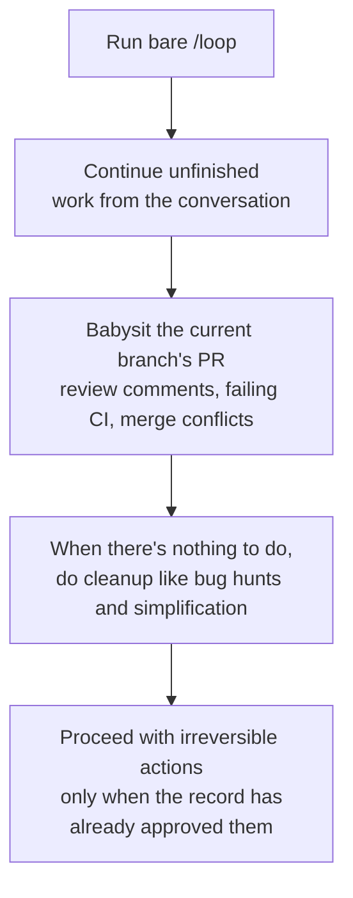

Scheduled tasks in Claude Code let you re-run a prompt on a fixed interval for as long as the same session stays open.


**TL;DR**: Session-bound, lightweight automation that hands deployment polling, PR babysitting, and periodic checks over to `/loop` and the cron tools, so you don't have to type them yourself every time.


Scheduled tasks are available in Claude Code v2.1.72 and later. Check your version with `claude --version`.

## What Scheduled Tasks Are

A scheduled task is a mechanism that automatically re-runs a single prompt on a regular interval. Use it to poll whether a deployment has finished, babysit a PR, revisit a long-running build, or remind yourself of something to do later.

The most important property is that they are **session-scoped**. A task lives only within the current conversation, and they all disappear when you start a new one. If you reopen a session with `--resume` or `--continue`, any task that has not yet expired is restored.

| Property | Behavior |
| --- | --- |
| Where it runs | Your machine (inside the open session) |
| When it fires | Between Claude's turns, while idle |
| Lifecycle | Bound to the current conversation; gone when a new conversation starts |
| Restoration | Only non-expired tasks on `--resume` / `--continue` |
| Minimum interval | **1 minute** (cron's 1-minute granularity) |
| Maximum tasks per session | 50 |

This feature is a substitute for polling. If you need to react the moment an event occurs, use Channels instead of polling so CI pushes failures straight into the session; and to keep working turn after turn until a condition is met, use `/goal` instead of interval-based execution.

## Use Cases

Scheduled tasks fit best for short, repeated work that runs while the session is open.

| Case | Example prompt | Effect |
| --- | --- | --- |
| Periodic check | `/loop 5m check if the deployment finished` | Checks every 5 minutes |
| Release tracking | `/loop check whether CI passed and address any review comments` | Tracks CI and reviews at adaptive intervals |
| Report generation | `/loop 1h summarize new commits on main` | Generates summary report hourly |
| One-off reminder | `remind me at 3pm to push the release branch` | Fires once at specified time, then deletes itself |

You can also re-run a packaged workflow on every iteration. For example, pass another command in place of the prompt, like `/loop 20m /review-pr 1234`.

## Creating and Managing Scheduled Tasks

### The /loop Skill

`/loop` is a bundled **skill** and the fastest way to re-run a prompt repeatedly while keeping a session open. Both the interval and the prompt are optional, and the behavior changes depending on what you provide.

| What you provide | Example | Behavior |
| --- | --- | --- |
| Interval + prompt | `/loop 5m check the deploy` | Runs on a fixed interval |
| Prompt only | `/loop check the deploy` | Claude picks the interval itself on each iteration |
| Interval only or nothing | `/loop` | Runs the built-in maintenance prompt or `loop.md` |

When you provide an interval, Claude converts it into a cron expression, registers the task, and confirms the interval and the task ID. You can put the interval up front like `30m` or at the end like `every 2 hours`. The supported units are `s` (seconds), `m` (minutes), `h` (hours), and `d` (days). Because cron is 1-minute granular, sub-minute values are rounded up, and intervals that don't divide cleanly — like `7m` or `90m` — are rounded to the nearest unit, after which Claude tells you what it settled on.

If you omit the interval, instead of a fixed cron, Claude dynamically picks a delay between 1 minute and 1 hour on each iteration. It waits a short time when a build is nearing completion or a PR is active, and a longer time when nothing is pending.

```text
/loop check whether CI passed and address any review comments
```

### Built-in Maintenance Prompt

When you omit the prompt, Claude uses the built-in maintenance prompt. On each iteration it works through the following steps in order.



`bare /loop` runs this prompt at a dynamic interval, and adding an interval like `/loop 15m` runs it on a fixed interval.

### Custom loop.md for the Default Prompt

Placing a `loop.md` file replaces the built-in maintenance prompt with your own instructions. This file defines a single default prompt for `bare /loop`, and it is ignored when you provide a prompt directly on the command line.

| Path | Scope |
| --- | --- |
| `.claude/loop.md` | Project level (takes precedence when both files exist) |
| `~/.claude/loop.md` | User level (applies when there is no project file) |

The file is plain Markdown with no fixed structure. Write it as if you were typing a `/loop` prompt directly.

```markdown
Check the `release/next` PR. If CI is red, pull the failing job log,
diagnose, and push a minimal fix. If new review comments have arrived,
address each one and resolve the thread. If everything is green and
quiet, say so in one line.
```

Edits to `loop.md` take effect from the next iteration, so you can refine the instructions even while the loop is running. Content over 25,000 bytes is truncated.

### One-off Reminders

For a reminder you want to run just once, describe it in natural language instead of using `/loop`. Claude registers a one-shot task that runs once and then deletes itself, and it confirms the run by pinning it to a specific minute and hour.

```text
in 45 minutes, check whether the integration tests passed
```

### Listing and Canceling Tasks

You can request task lookups and cancellations in natural language too. Under the hood, Claude uses the following cron tools.

| Tool | Purpose |
| --- | --- |
| `CronCreate` | Registers a new task: takes a 5-field cron expression, the prompt to run, and whether it repeats or fires once |
| `CronList` | Lists every scheduled task along with its ID, schedule, and prompt |
| `CronDelete` | Cancels a task by ID |

Each task has an 8-character ID you can pass to `CronDelete`, and a single session can hold up to 50 tasks. To stop a pending `/loop`, press `Esc`. Tasks scheduled in natural language are not affected by `Esc` and remain until you delete them.

### How Scheduling Works and Its Limits

The scheduler checks for due tasks every second and queues them at low priority. Scheduled prompts run between turns rather than mid-response. All times are interpreted in your local timezone, so `0 9 * * *` means 9 a.m. where Claude Code is running, not UTC.

- **Jitter**: To keep many sessions from hitting the API at the same instant, a deterministic offset derived from the task ID is added. Repeating tasks may fire up to 30 minutes after their scheduled time, and one-shot tasks may fire up to 90 seconds early. If you need precise timing, pick a minute other than `:00` or `:30`.
- **Seven-day expiry**: A repeating task fires one last time seven days after creation, then deletes itself automatically.
- **No catch-up for misses**: If a scheduled time passes while Claude is busy with a long request, the task fires once when it becomes idle — it does not catch up for the number of missed runs.

To turn off the entire scheduler, set the environment variable `CLAUDE_CODE_DISABLE_CRON=1`. That makes the cron tools and `/loop` unavailable and stops already-scheduled tasks from firing.

## Connecting to Headless Execution and Unattended Automation

Scheduled tasks only fire while a session is open and idle. They are not suitable for unattended automation that has to run even when the machine is off or there is no session. For those cases, use a separate persistent scheduling option.

| Option | Where it runs | Machine must be on | Open session required |
| --- | --- | --- | --- |
| `/loop` | Your machine | Required | Required |
| Desktop scheduled tasks | Your machine | Required | Not required |
| Routines (cloud) | Anthropic cloud | Not required | Not required |
| GitHub Actions | CI | Not required | Not required |

By calling `claude -p` headlessly from a CI pipeline or a GitHub Actions `schedule` trigger, you can build cron automation that isn't tied to a session. In short: use `/loop` for quick polling inside a session, Desktop scheduled tasks for unattended work that needs local file and tool access, and Routines for work that must run reliably regardless of the machine.

From a MoAI-ADK perspective, the best practice is to use `/loop` lightly for checking a PR or tracking CI status during SPEC implementation, while separating out unattended work like periodic release tracking into GitHub Actions scheduling.

## Related Docs

- [Hooks](/claude-code/extensibility/hooks)
- [Goal-driven Execution (/goal)](/claude-code/agentic/goal)

## References

- [Scheduled tasks — Claude Code official docs](https://code.claude.com/docs/en/scheduled-tasks)


A fixed-interval `/loop` auto-expires after seven days, so if you need it to run longer, it's safer to re-register it before expiry, or to choose persistent scheduling like Routines or Desktop scheduled tasks from the start.

