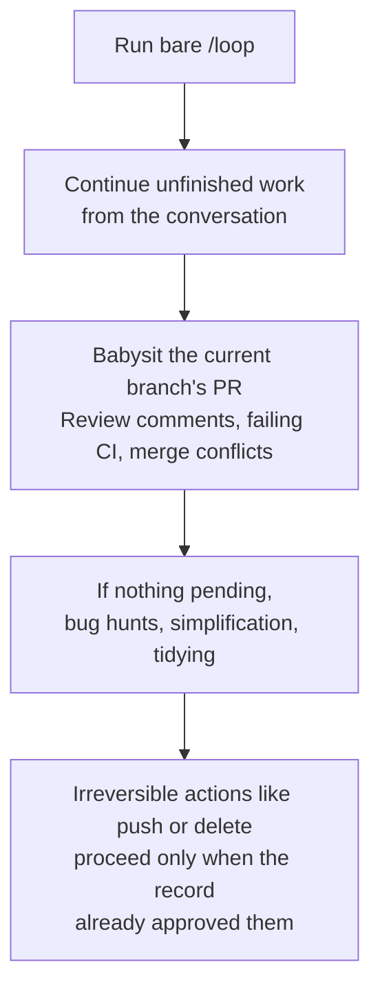

# Scheduled Tasks

Scheduled tasks in Claude Code re-run a prompt on a set cadence for as long as the same session stays open. Tell it once — "check whether the deployment finished every 5 minutes" — and Claude looks in on it on its own afterwards, without you retyping the prompt.


This page is background material on **Claude Code itself**, the platform MoAI-ADK runs on. How to use MoAI-ADK is covered in [Autonomous Continuation Loops](/en/advanced/autonomous-loops).



**One-line summary**: Lightweight, session-bound automation that hands deployment polling, PR babysitting, and periodic checks to `/loop` and the cron tools instead of a human retyping them.



A scheduled task is like handing Claude an **alarm clock**. Reserve "look at this every so often" and Claude rings the alarm during its idle time (between Claude's turns) to pull the work out and show it to you. The alarm rings only inside your room (the current session), so starting a new conversation (changing rooms) silences them all.


Scheduled tasks are available on Claude Code **v2.1.72** or later. Check your version with `claude --version`.

## What Are Scheduled Tasks

A scheduled task automatically re-runs a prompt at a fixed cadence. Use it to poll whether a deployment finished, babysit a PR, re-check a long build, or remind yourself of something later. The core value is moving the fatigue of "typing the same thing over and over" onto the machine side.

The most important property is that they are **session-scoped**. Tasks live only within the current conversation, and starting a new conversation removes them all. Reopening a session with `--resume` or `--continue` restores tasks that have not yet expired.

| Property | Behavior |
| --- | --- |
| Where it runs | Your machine (inside the open session) |
| When it fires | Between Claude's turns, when idle |
| Lifecycle | Bound to the current conversation; gone when a new one starts |
| Restoration | Only unexpired tasks on `--resume` / `--continue` |
| Minimum interval | **1 minute** (cron granularity) |
| Maximum tasks | 50 per session |

This feature covers session-scoped lightweight polling. Claude Code has other scheduling options that differ in where they run and whether the machine must be on.

| Option | Runs where | Minimum interval | Session required | Machine must be on |
| --- | --- | --- | --- | --- |
| `/loop` | Your machine | **1 minute** | Yes | Yes |
| Cloud Routines | Anthropic cloud | 1 hour | No | No |
| Desktop scheduled tasks | Your machine | 1 minute | No | Yes |

If you need to react the moment an event happens, use Channels to have CI push failures directly into the session instead of polling. Conversely, if you want Claude to keep working every turn until a condition holds, [Goal-Directed Execution (`/goal`)](/en/claude-code/agentic/goal) is the right tool, not periodic runs — `/loop` is time-driven ("it is time, look again"), while `/goal` is condition-driven ("do not stop until the condition holds").

## Use Cases

Scheduled tasks fit short, repeated work best, for as long as the session is open.

| Case | Example prompt | Effect |
| --- | --- | --- |
| Periodic checks | `/loop 5m check if the deployment finished` | Checks deployment completion every 5 minutes |
| Release tracking | `/loop check whether CI passed and address any review comments` | Tracks CI and review comments at an adaptive interval |
| Report generation | `/loop 1h summarize new commits on main` | Writes summary reports on a cadence |
| One-shot reminders | `remind me at 3pm to push the release branch` | Fires once at the given time, then auto-deletes |

You can also re-run a packaged workflow on every iteration — pass another command in the prompt slot, like `/loop 20m /review-pr 1234`.

## Repeating with `/loop`

`/loop` is a bundled **skill** — the fastest way to re-run a prompt while keeping the session open. Both the interval and the prompt are optional, and behavior differs by what you give.

| What you give | Example | Behavior |
| --- | --- | --- |
| Interval + prompt | `/loop 5m check the deploy` | Runs on a fixed cadence |
| Prompt only | `/loop check the deploy` | Claude picks the interval itself on each iteration |
| Interval only, or nothing | `/loop` | Runs the built-in maintenance prompt or `loop.md` |

Give an interval and Claude converts it to a cron expression, registers the task, and confirms the cadence and task ID. The interval can lead (`30m`) or trail (`every 2 hours`). Supported units are `s` (seconds), `m` (minutes), `h` (hours), `d` (days). Cron is minute-granular, so seconds round up, and awkward intervals like `7m` or `90m` are rounded to the nearest unit with a note of what was chosen.

Omit the interval and Claude dynamically picks a delay between 1 minute and 1 hour on each iteration instead of a fixed cron — short when a build is finishing or a PR is active, long when nothing is pending. It is the economy instinct of "if it is not busy right now, slow down a bit" turned into code.

```text
/loop check whether CI passed and address any review comments
```

### The Built-in Maintenance Prompt

Omit the prompt and Claude uses a built-in maintenance prompt. Each iteration handles work in this order:


```mermaid
flowchart TD
    A["Run bare /loop"] --> B["Continue unfinished work<br>from the conversation"]
    B --> C["Babysit the current branch's PR<br>Review comments, failing CI, merge conflicts"]
    C --> D["If nothing pending,<br>bug hunts, simplification, tidying"]
    D --> E["Irreversible actions like push or delete<br>proceed only when the record<br>already approved them"]
```

Bare `/loop` runs this prompt on a dynamic interval; adding an interval like `/loop 15m` runs it on a fixed cadence.

### Replacing the Default Prompt with `loop.md`

Placing a `loop.md` file replaces the built-in maintenance prompt with your instructions. The file defines a single default prompt for bare `/loop`, and is ignored when a prompt is given directly on the command line.

| Path | Scope |
| --- | --- |
| `.claude/loop.md` | Project level. Wins when both files exist |
| `~/.claude/loop.md` | User level. Applies when no project file exists |

The file is plain Markdown with no required structure. Write it as if typing a `/loop` prompt directly.

```markdown
Check the `release/next` PR. If CI is red, pull the failing job log,
diagnose, and push a minimal fix. If new review comments have arrived,
address each one and resolve the thread. If everything is green and
quiet, say so in one line.
```

Edits to `loop.md` apply from the next iteration, so you can refine the instructions while the loop is running. Content beyond 25,000 bytes is truncated.

### One-Shot Reminders

For a reminder that should fire only once, describe it in natural language instead of `/loop`. Claude registers a single-shot task that deletes itself after running, and confirms the exact minute and hour it will fire.

```text
in 45 minutes, check whether the integration tests passed
```

### Listing and Canceling Tasks

Task inspection and cancellation are also natural-language requests. Internally, Claude uses these cron tools.

| Tool | Purpose |
| --- | --- |
| `CronCreate` | Register a new task. Takes a 5-field cron expression, the prompt to run, and recurring/one-shot |
| `CronList` | List all scheduled tasks with IDs, schedules, and prompts |
| `CronDelete` | Cancel a task by ID |

Each task has an 8-character ID you can pass to `CronDelete`, and a session can hold up to 50 tasks. Press `Esc` to stop a pending `/loop`. Tasks scheduled via natural language are unaffected by `Esc` and remain until deleted directly with `CronDelete`.

### Mechanics and Constraints

The scheduler checks for due tasks every second and queues them at low priority, and scheduled prompts run between turns, not mid-response. All times are interpreted in the local timezone, so `0 9 * * *` means 9 AM where Claude Code is running, not UTC.

- **Jitter**: to keep multiple sessions from hitting the API at the same instant, a deterministic offset derived from the task ID is added. Recurring tasks can fire up to **30 minutes** late, and one-shot tasks up to **90 seconds** early. If precise timing matters, pick minutes other than `:00` or `:30`.
- **7-day expiry**: a recurring task fires one last time 7 days after creation, then is **deleted automatically**.
- **No missed-run catch-up**: if a scheduled time passes while Claude is busy with a long request, it fires once upon going idle rather than catching up on the missed count.

To turn the scheduler off entirely, set the environment variable `CLAUDE_CODE_DISABLE_CRON=1`. The cron tools and `/loop` become unavailable, and already-scheduled tasks stop firing.

## Background Execution and Between-Turn Firing

The fact that scheduled tasks fire "between turns, not mid-response" ties into Claude Code's **background execution** model. As background became the default for subagents in v2.1.198, scheduled tasks are also pulled from the queue only when the main conversation is idle. If Claude is busy with a long tool call, the scheduled time passes and the task waits, firing once when the turn ends and the session finally goes idle.

This property is why scheduled tasks are **unsuited as real-time triggers**. Channels exist precisely to fill that gap — instead of waiting for events like CI failures via polling, push them directly into the session. In short, "look in on it every interval" is `/loop`'s job; "react the moment an event arrives" is Channels' job.

## Pairing with Headless Execution

Scheduled tasks fire only when the session is open and idle. So they are not suited to unattended automation that must work with the machine off or without a session. For those cases, use a persistent scheduling option instead.

| Option | Runs where | Machine must be on | Open session required |
| --- | --- | --- | --- |
| `/loop` | Your machine | Yes | Yes |
| Desktop scheduled tasks | Your machine | Yes | No |
| Routines (cloud) | Anthropic cloud | No | No |
| GitHub Actions | CI | No | No |

Invoking `claude -p` non-interactively via a CI pipeline or a GitHub Actions `schedule` trigger builds cron automation untied to a session. In short: `/loop` for fast in-session polling, Desktop scheduled tasks for unattended work needing local file/tool access, and Routines for work that must run reliably regardless of your machine.

## Position on the Autonomous-Execution Spectrum

From the MoAI-ADK perspective, scheduled tasks are one axis of the autonomous-execution spectrum. The same "no human intervention every turn" autonomy can come from different mechanisms.

| Mode | Trigger | Stop condition | Representative tool |
| --- | --- | --- | --- |
| Goal-directed | Evaluate each turn whether the condition holds | When the condition is satisfied | `/goal`, `/moai goal` |
| Periodic | Time is up | Direct cancel or expiry | `/loop` |
| Event-triggered | Pushed from outside | When the events are drained | Channels |

In practice, the best pattern is to use `/loop` lightly for PR checks and CI-status tracking during SPEC implementation, and split unattended work like regular release tracking off to GitHub Actions-side scheduling. One thing not to forget: periodic runs **consume tokens every iteration** — the polling interval is a cost dial. A loop running every 5 minutes costs one-fifth of a loop running every minute.

## Related Documents

- [Goal-Directed Execution (`/goal`)](/en/claude-code/agentic/goal) — condition-driven autonomous execution, the counterpart to time-driven `/loop`
- [Dynamic Workflows](/en/claude-code/agentic/workflows) — large-scale orchestration where a script coordinates dozens to hundreds of agents at once
- [Hooks](/en/claude-code/extensibility/hooks)

## References

- [Scheduled tasks — Claude Code official docs](https://code.claude.com/docs/en/scheduled-tasks)


A fixed-cadence `/loop` auto-expires after 7 days, so if it must run longer, re-register before expiry — or choose a persistent scheduler like Routines or Desktop scheduled tasks from the start. And when setting the polling interval, asking "is this cadence really necessary?" once more cuts token cost significantly.

