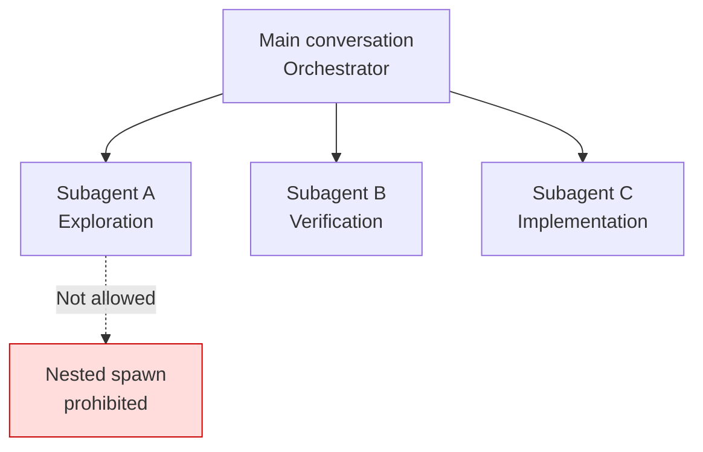

Claude Code subagents are delegated workers that handle side-tasks in a separate context window and return only a result summary to the main conversation.


**TL;DR**: A subagent is a delegated worker that handles side-tasks such as exploration and verification in its own context, returning only a summary — keeping the main conversation clean.



This page is a concept overview at the Claude Code level. How MoAI-ADK organizes its 8-agent catalog and delegates work, and the hands-on approach to building your own agents, are covered in depth in the [Agent Guide](/advanced/agent-guide) and the [Builder Agent Guide](/advanced/builder-agents).


## What Is a Subagent

A subagent is a specialized AI worker dedicated to a particular kind of task. When a side-task arises that would otherwise flood the main conversation with search results, logs, and file contents, the subagent handles it in its **own context window** and returns only a result summary.

Each subagent independently owns the following.

| Component | Description |
|-----------|-------------|
| System prompt | The body of the subagent file becomes its role instructions verbatim |
| Tool access | The tools it can use can be restricted via allow/deny lists |
| Independent permissions | It inherits the main conversation's permissions but can add further restrictions |
| Model selection | Cost can be lowered by using a fast, inexpensive model such as `haiku` |

Claude decides when to delegate by reading each subagent's `description`. Writing that description clearly is therefore the starting point for good delegation.

Claude Code includes built-in subagents such as `Explore` (read-only codebase exploration), `Plan` (plan-mode research), and `general-purpose` (combined exploration + modification tasks).

## Core Constraint: A Subagent Cannot Spawn Another Subagent

This is the most important structural constraint. **Subagents cannot spawn other subagents.** In other words, delegation descends exactly one level from the main conversation, and infinite nesting never occurs.

This constraint is also the foundation of MoAI-ADK's orchestration design. Only the orchestrator (the main session) can invoke subagents, and an invoked agent cannot delegate to anyone in turn. As a result, instead of a hierarchical agent chain, MoAI-ADK follows a flat structure in which **the orchestrator invokes each step directly**.



This is also why the built-in `Plan` subagent exists separately: to perform research when plan mode needs context, without circumventing this constraint.

## When to Use One

Subagents are most effective in situations like these.

| Situation | Benefit |
|-----------|---------|
| Parallel exploration | Investigate multiple files and directories simultaneously and collect only the summaries |
| Independent verification | Check results in a separate context, free of the main conversation's bias |
| Context isolation | Quarantine large logs and search results away from the main conversation |
| Cost control | Route simple tasks to a fast model such as `haiku` |

Conversely, if a task finishes in a single response, or if it spans multiple steps that **require shared context**, it is better to handle it directly in the main conversation without delegation.

## Definition Overview

A subagent is defined as a Markdown file with YAML frontmatter. You can create one interactively with the `/agents` command, or write the file directly.

```markdown
---
name: code-reviewer
description: 코드 품질과 모범 사례를 검토합니다
tools: Read, Glob, Grep
model: sonnet
---

당신은 코드 리뷰어입니다. 호출되면 코드를 분석하고
품질·보안·모범 사례에 대해 구체적이고 실행 가능한 피드백을 제공합니다.
```

The only required fields are `name` and `description`, and the body becomes the system prompt. The scope of application depends on where the file is stored.

| Location | Scope |
|----------|-------|
| `.claude/agents/` | Current project (include in version control to share with the team) |
| `~/.claude/agents/` | All of my projects |
| A plugin's `agents/` | Wherever the plugin is enabled |

You can restrict tool access with `tools` (allow list) or `disallowedTools` (deny list), specify the model with `model`, and use `isolation: worktree` to have the agent work in an isolated copy of the repository. However, user-interaction tools such as `AskUserQuestion` cannot be used in a subagent. This is why, in MoAI-ADK, a subagent cannot ask the user directly and instead returns a blocker report to the orchestrator.

## For Depth, See the MoAI Agent Guide

That covers the subagent concept at the Claude Code level. How MoAI-ADK operates its agent catalog on top of this mechanism, how it delegates each stage of the Plan-Run-Sync workflow, and how it generates project-specific domain-expert agents are covered in the advanced guides below.

## Related Docs

- [Agent Guide](/advanced/agent-guide)
- [Builder Agent Guide](/advanced/builder-agents)

## References

- [Create custom subagents (Claude Code official docs)](https://code.claude.com/docs/en/sub-agents)


When you create a subagent, write the `description` concretely from the perspective of "when delegation should happen." Claude decides whether to delegate based solely on this description, so if it is vague, even a good tool may never be invoked.

