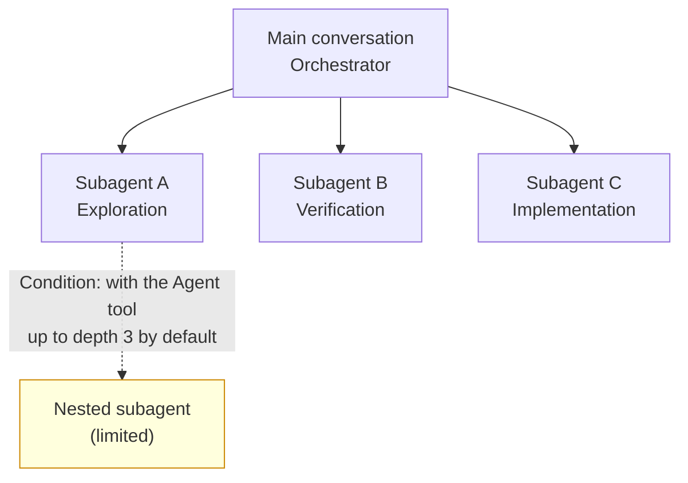

# Subagents

A subagent is a delegated worker that has Claude handle a side task in **its own context window** and return only a summary of the results to the main conversation. It is like handing investigation or verification to a colleague with their own desk — the colleague finishes the work on their own desk and hands back just a one-page summary without cluttering yours.


**One-line summary**: A subagent is a delegated worker that handles side jobs like exploration and verification in its own context and returns only a summary, keeping the main conversation clean.



This page is background material on **Claude Code itself**, the platform MoAI-ADK runs on. How to use MoAI-ADK is covered in [Agent Guide](/en/advanced/agent-guide), and the hands-on procedure for building your own agents continues in [Builder Agents Guide](/en/advanced/builder-agents).


## What Is a Subagent

A subagent is a specialized AI worker dedicated to a particular kind of task. When a side task arises that would flood the main conversation with search results, logs, and file contents, the subagent handles it in **its own context window** and returns only a summary. Because the contexts are separated, the main conversation can stay focused on the core thread — and several subagents can be launched simultaneously to do independent work in parallel.

Each subagent independently has:

| Component | Description |
|-----------|------|
| System prompt | The subagent file's body becomes the role instructions verbatim |
| Tool access | Usable tools can be restricted via allow/deny lists |
| Permission mode | Inherits the parent session's permission mode (see "Permission Inheritance" below) |
| Model | Cost can be lowered with a fast, cheap model like `haiku` |

Claude looks at each subagent's `description` to decide when to delegate. Writing a clear description is therefore the starting point of good delegation.

### Built-in Subagents

Claude Code includes these built-in subagents.

| Agent | Characteristics |
|---------|------|
| **Explore** | Read-only codebase exploration. Since v2.1.198 it inherits the main session's model (Claude API caps at Opus; older versions fix Haiku). The `thoroughness` option offers quick / medium / very-thorough |
| **Plan** | Plan-mode research (read-only) |
| **general-purpose** | Access to all tools; can both explore and modify |

Explore and Plan skip the main session's CLAUDE.md and git status, running faster and lighter.

## Nested Spawning and Execution Limits

There used to be a structural constraint that "subagents cannot spawn other subagents" — delegation descended only one level from the main conversation. But as of v2.1.19, that constraint is no longer a runtime guarantee — it is a **configuration choice**.

### Nesting Now Enabled by Default (v2.1.219, Depth 3)

Subagent nesting was introduced in v2.1.172, briefly turned off by default in v2.1.217–2.1.218, and is **enabled by default** as of v2.1.219. The changelog states that subagents can spawn nested subagents up to depth 3 by default. To turn nesting off, set the environment variable `CLAUDE_CODE_MAX_SUBAGENT_SPAWN_DEPTH=1`.

| Setting | Behavior | Usage |
|------|------|------|
| Include the `Agent` tool in the subagent definition (frontmatter `tools:` list) | Nesting allowed | Up to depth 3 by default; tune with `CLAUDE_CODE_MAX_SUBAGENT_SPAWN_DEPTH`, `=1` disables |
| Omit the `Agent` tool | Nesting prohibited | Flat orchestration — the sole way to guarantee a flat hierarchy |

Just because nesting is possible does not mean hierarchical agent chains are always a good design. The deeper the nesting, the more each level's result is summarized on its way up, so information is lost and coordination cost grows. That is why a **flat structure** — the main conversation calls each worker directly — is generally more robust, and going one level deeper only when truly needed is the better default.


```mermaid
flowchart TD
    M[Main conversation<br/>Orchestrator] --> A[Subagent A<br/>Exploration]
    M --> B[Subagent B<br/>Verification]
    M --> C[Subagent C<br/>Implementation]
    A -.->|"Condition: with the Agent tool<br/>up to depth 3 by default"| X["Nested subagent<br/>(limited)"]
    style X fill:#ffd,stroke:#c80
```

### Concurrency and Session Limits

How many subagents can run at once is governed by two environment variables.

| Environment variable | Default | Meaning |
|-----------|--------|------|
| `CLAUDE_CODE_MAX_CONCURRENT_SUBAGENTS` | 20 | Cap on concurrently running subagents (`ultracode` sessions exempt) |
| `CLAUDE_CODE_MAX_SUBAGENT_SPAWN_DEPTH` | 3 (v2.1.219+) | Nesting depth cap; `=1` disables nesting |

The per-session total-spawn cap `CLAUDE_CODE_MAX_SUBAGENTS_PER_SESSION` (default 200) was **removed** in v2.1.224. Long-running sessions no longer refuse new agents, while the concurrency and depth caps still apply. So "20 at once, depth 3" is still in force, but the artificial "200 over a session lifetime" ceiling is gone.

## Background Execution and Permission Inheritance

### Background Is the Default (v2.1.198)

Subagents can run in the background, and as of v2.1.198 **background is the default**. Claude runs a subagent in the foreground only when it needs the result immediately; otherwise the subagent runs in the background. While a read-only task runs in the background, the main session can continue with other independent work.

When a background subagent hits a tool that needs permission (e.g., Bash, WebFetch):

- **Before v2.1.186**: auto-denied (no permission prompt)
- **From v2.1.186**: **the permission prompt appears in the main session**. `Esc` denies just that one call, and since v2.1.186 the prompt carries the name of the subagent that spawned it.

Before starting a long background task, pre-adding the needed tools to the allow list in `settings.json` cuts the prompt frequency.

### The Permission Mode Inherits from the Parent Session

A subagent inherits the parent session's permission mode as-is. You used to be able to set a different permission mode via the spawn-time `mode` parameter, but that spawn-time `mode` parameter is **deprecated and ignored since v2.1.213**.

There is one practical implication. The intent "restrict this subagent to read-only" can no longer be guaranteed via the `mode` parameter. To scope a subagent as read-only, the only way to guarantee it is to **remove write tools from the subagent's `tools:` list** — use the inherently read-only `Explore`, or omit Write/Edit from `tools:`.

## When to Use Them, When Not To

Subagents are most effective in situations like these.

| Situation | Effect |
|------|------|
| Parallel exploration | Investigate multiple files/directories simultaneously and collect only summaries |
| Independent verification | Check results in a separate context, free of the main conversation's bias |
| Context isolation | Quarantine large logs and search results away from the main conversation |
| Cost control | Route simple work to a fast model like `haiku` |

Conversely, in the following cases it is better to handle the work directly in the main conversation without delegation.

- Work that finishes in a single response
- Multi-stage work that **needs shared context** (delegation breaks the context)
- Work whose results must not be summarized (when the full output has to stay in the main conversation)

## How to Define One

A subagent is defined as a Markdown file with YAML frontmatter. You can ask Claude to create one, or write the file directly. Since v2.1.198 the `/agents` command no longer opens an interactive creation wizard — it just tells you to ask Claude or edit `.claude/agents/` directly (the file format and storage location are unchanged).

```markdown
---
name: code-reviewer
description: Reviews code quality and best practices
tools: Read, Glob, Grep
model: sonnet
---

You are a code reviewer. When invoked, analyze the code and
provide specific, actionable feedback on quality, security, and best practices.
```

### Required Fields

- `name` — the subagent's name (referenced when delegating)
- `description` — explains when to delegate (Claude judges from this alone)

### Optional Fields

| Field | Function |
|------|------|
| `tools` | Allowed tools (comma-separated list) |
| `disallowedTools` | Blocked tools (usable instead of an allowlist) |
| `model` | Model choice: `sonnet`, `opus`, `haiku`, `fable`, or a specific model ID; default `inherit` (the main session model) |
| `permissionMode` | Tool permission default (`default`, `acceptEdits`, `plan`, `bypassPermissions`, `auto`, `dontAsk`); ignored for plugin subagents |
| `maxTurns` | Maximum turn limit |
| `skills` | Default skills to load |
| `mcpServers` | MCP servers to connect |
| `hooks` | Hook events to invoke |
| `memory` | Memory scope (user, project, local) |
| `background` | If `true`, always runs in the background (even when the result is needed immediately); if unspecified, Claude chooses — and since v2.1.198 background is the default |
| `effort` | Reasoning intensity (low, medium, high, xhigh, max) |
| `isolation: worktree` | Works in an isolated copy of the repository |
| `color` | Color shown in the agent view |
| `initialPrompt` | The prompt used when the subagent is first spawned |

Where the file lives determines its scope.

| Location | Scope |
|------|------|
| `.claude/agents/` | The current project (put under version control to share with the team) |
| `~/.claude/agents/` | All my projects |
| A plugin's `agents/` | Wherever the plugin is enabled |

### Subagents Cannot Ask the User Questions

User-interaction tools like `AskUserQuestion` cannot be used inside subagents (an asymmetric boundary). A subagent only returns results to the main conversation (the orchestrator), and when an input it needs is missing it returns a blocker report. This is why subagents in MoAI-ADK cannot question the user directly.

## Model, Body, Parallel Execution (CC 2.1.219)

### State the Model Explicitly at Spawn Time

Most agent definitions default to `model: inherit`. So when you spawn a subagent without specifying the model, it quietly runs on the parent session's model. To prevent it from running on a model you did not intend, it is recommended to pass the `model` argument explicitly at spawn time. `effort` (reasoning intensity) travels only through the agent file's frontmatter, so it cannot be injected as a spawn argument.

### Keep the Body Concise

When the body of an agent definition grows long, every spawn pays a fixed cost and prompt-cache efficiency drops. Keep only the core role and the delegation conditions; trim repetitive instructions (a body diet). Pulling common instructions out into a shared file and having each agent reference it is an efficient pattern.

### Opus 4.7+ / 4.8 / 5 Does Not Auto-Spawn

The latest Opus-family models do not **auto-spawn subagents** — they prioritize reasoning over tool calls. So when delegation helps, you need to explicitly instruct "spawn multiple subagents in the same turn", and for work that can finish in one response, handling it directly without launching a subagent is recommended.

### Verifications in Parallel Batches

Running several verifications serially, one per turn, accumulates round-trip latency. Bundle independent read-only verifications as multiple Bash calls inside a single response (a parallel batch) and run them together; serialize only when there are dependencies. This pattern is the same context as subagent delegation — independent work bundled and run concurrently, dependent work sequenced.

## Session Fork (`/fork`)

The `/fork <directive>` command forks the current session. The forked subagent inherits the current conversation contents, leverages the parent's prompt cache, and continues exploration in a new direction. Useful when you want to try a different approach without throwing away the existing context.

## Going Deeper via the MoAI Agent Guide

That covers the Claude Code-level subagent concept. MoAI-ADK operates an **11-agent catalog** on top of this mechanism — the Manager family (manager-spec / manager-develop / manager-docs / manager-git / manager-design) handles the plan→run→sync lifecycle, the Evaluator family (plan-auditor / sync-auditor) handles independent audits, builder-harness handles harness scaffold generation, super-advisor handles high-reasoning consultation, e2e-tester handles E2E test execution across web/mobile/desktop, and the Anthropic built-in `Explore` handles read-only exploration. The separation of planning and auditing — the agent that built something never checks its own work — is the core design of this catalog. Declaratively assigning each agent the model and reasoning depth (effort) matched to its task is the tokenomics principle of "plan deeply, implement cheaply, verify independently." Details are covered in the advanced guides below.

## Related Documents

- [Agent Teams](/en/claude-code/agentic/agent-teams) — if a subagent is a report-only worker, a team is a group of colleagues who talk to each other
- [Dynamic Workflows](/en/claude-code/agentic/workflows) — large-scale orchestration where a script coordinates dozens to hundreds of agents
- [Worktrees](/en/claude-code/agentic/worktrees) — the separate working tree that `isolation: worktree` creates
- [Agent Guide](/en/advanced/agent-guide)
- [Builder Agents Guide](/en/advanced/builder-agents)

## References

- [Create custom subagents (Claude Code official docs)](https://code.claude.com/docs/en/sub-agents)


When creating a subagent, write the `description` concretely from the perspective of "when should this be delegated to?" Claude decides delegation from this description alone — if it is vague, a good tool goes uncalled. To guarantee read-only, do not reach for `mode`; omit write tools from the `tools:` list instead.

