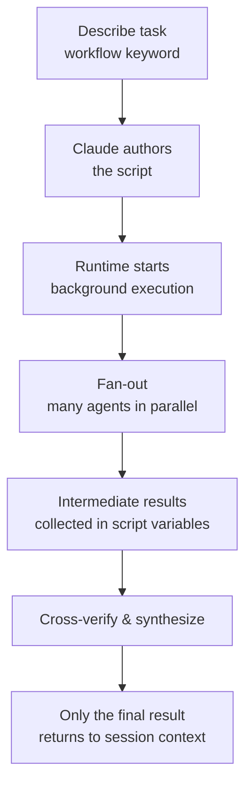

A dynamic workflow is a Claude Code execution primitive in which a JavaScript script that Claude authors itself orchestrates dozens to hundreds of subagents in the background — more than a single conversation can coordinate.


**TL;DR**: Whereas subagents and agent teams keep "the plan in Claude's head," dynamic workflows move "the plan into script code" and run large-scale fan-out in one pass.


## What Is a Dynamic Workflow

A dynamic workflow is a (JavaScript script) **that Claude authors directly once you describe the task**, and the runtime executes that script in the background, separate from the conversation. Because the script holds all the loops, branches, and intermediate results, only the final answer returns to the session's context window.

The key is not simply "running more agents" but **moving the plan into code**. As a result, the following becomes possible:

- Independent agents adversarially cross-verify each other's results before reporting
- A single plan is drafted from multiple angles at once and then compared and evaluated
- More reliable results than a single pass

> Dynamic workflows are at the research preview stage and require Claude Code v2.1.154 or later. They are available on all paid plans; on the Pro plan you must enable them under the Dynamic workflows item in `/config`.

## Comparing the 3 Orchestration Primitives

Subagents, skills, and workflows can all perform multi-step tasks. The difference is **who holds the plan**.

| Aspect | Subagent | Agent team / Skill | Workflow |
|------|-------------|-------------------|-----------|
| Identity | A worker Claude creates | Instructions Claude follows | A script the runtime executes |
| Decides the next step | Claude, per turn | Claude, per the prompt | The script |
| Where intermediate results live | Claude's context window | Claude's context window | Script variables |
| Repeatable unit | The worker definition | The instruction content | The orchestration itself |
| Scale | A few delegations per turn | Same as subagents | Dozens to hundreds of agents per run |
| On interruption | Turn restarts | Turn restarts | Resumable within the same session |

With subagents and skills, Claude acts as the orchestrator deciding what to create each turn, and every result enters Claude's context. A workflow script, by contrast, holds that logic itself, so Claude's context receives only the final answer.

## When to Use It

Choose a workflow when you need **more agents than a single conversation can coordinate**, or when you want to **codify** the orchestration itself into a script you can read and rerun.

| Use case | Description |
|------|------|
| Codebase-wide sweep | e.g., checking every API endpoint under `src/routes/` for missing auth checks |
| Large-scale migration | e.g., a migration that transforms 500 files independently |
| Cross-verified research | A research question where multiple sources must be checked against each other |
| Multi-angle plan drafting | Drafting one hard plan from several independent perspectives before committing |

Conversely, the cases where you should **not** use one are clear:

- A few tasks a single conversation can coordinate → use a subagent directly
- Interactive work that needs user approval at each step → workflows take no input during execution
- Routine single-file edits → just run it directly

## How It Works

The workflow runtime executes the script in an **isolated environment** separate from the conversation. Intermediate results stay in script variables, not in Claude's context. Because the runtime tracks each agent's result, the run can be resumed within the same session.



Running a bundled workflow like `/deep-research`, or putting the word `workflow` anywhere in a prompt, makes Claude author a script for that task. You can save a run you like as a `/<name>` command by pressing `s` on the `/workflows` screen and reuse it.

```text
# Run a task as a workflow
Run a workflow to audit every API endpoint under src/routes/ for missing auth checks
```

## Constraints and Limits

The runtime applies the following constraints:

| Constraint | Reason |
|------|------|
| No user input during execution | Only an agent permission prompt can pause a run. If you need step-by-step approval, make each step a separate workflow |
| The workflow itself cannot access the filesystem or shell directly | Agents handle reads, writes, and command execution; the script only coordinates |
| Up to 16 agents running concurrently (fewer on machines with few CPU cores) | Limits local resource usage |
| 1,000 agents total per run | Prevents runaway loops |

Additional behaviors to be aware of:

- **Permission mode**: Subagents created by a workflow always run as `acceptEdits` regardless of the session mode, so file edits are auto-approved. However, shell commands, web fetches, and MCP tools not on the allowlist may prompt during execution, so it is best to add the commands you need to the `settings.json` allowlist before a long run.
- **Resume**: If you stop and then resume a run, agents that already finished return cached results and only the rest run live. This is valid only within the same Claude Code session; if you end the session, the next session starts over from the beginning.
- **Cost**: A single run can use far more tokens than handling the same task in conversation, so it is safer to check `/model` before a large run.

### /deep-research and ultracode

| Item | Description |
|------|------|
| `/deep-research <question>` | A bundled workflow. Fans out web searches from multiple angles, cross-verifies and votes on sources, then returns a cited report with the claims that failed verification filtered out. Requires the WebSearch tool |
| `/effort ultracode` | Combines `xhigh` reasoning effort with automatic workflow orchestration. When on, Claude plans a workflow for every substantive task. It applies only to the current session and resets in a new session. Return to routine work with `/effort high` |

### How to Turn It Off

Workflows can be disabled in any of the following ways; once off, the bundled workflow commands, the `workflow` keyword, and `ultracode` in the `/effort` menu all disappear.

```json
{
  "disableWorkflows": true
}
```

- Turn off the Dynamic workflows toggle in `/config` (persists across sessions)
- Set `"disableWorkflows": true` in `~/.claude/settings.json`
- Set the environment variable `CLAUDE_CODE_DISABLE_WORKFLOWS=1`
- For an entire organization, apply it across the board with `"disableWorkflows": true` in managed settings

## Relationship to MoAI-ADK

MoAI-ADK recognizes dynamic workflows as a **third orchestration primitive**, distinct from the SPEC-based plan/run/sync lifecycle. Workflow agents follow the same asymmetric boundary of not being able to ask the user directly, so the MoAI orchestrator collects all preferences **before** launching a workflow. See the related docs below for best practices and a primitive-selection guide.

## Related Docs

- [Subagents](/claude-code/agentic/sub-agents)
- [Agent Teams](/claude-code/agentic/agent-teams)

## References

- [Orchestrate subagents at scale with dynamic workflows (official Claude Code docs)](https://code.claude.com/docs/en/workflows)


Most coding tasks have fewer truly parallelizable parts than research. Keep the default for coding-centric work as sequential subagents, and reserve dynamic workflows for tasks that genuinely require massive parallelism, such as codebase-wide sweeps and large-scale migrations.

