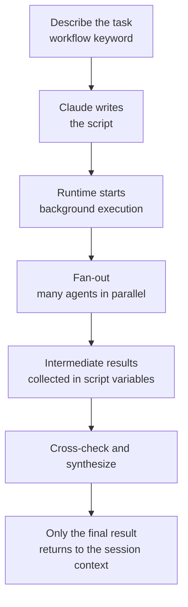

A dynamic workflow is a Claude Code execution primitive in which a JavaScript script written by Claude itself orchestrates, in the background, dozens to hundreds of subagents that a single conversation could not coordinate.


**One-line summary**: Where subagents and agent teams keep "the plan in Claude's head," a dynamic workflow moves "the plan into script code," running a large fan-out in one go.


## What Is a Dynamic Workflow

A dynamic workflow is a JavaScript script **that Claude writes itself when you describe the task**, and the runtime executes this script in the background, separate from the conversation. Because the script holds all loops, branches, and intermediate results, only the final answer returns to the session's context window.

The essence is not simply "running more agents" but **moving the plan into code**. This enables:

- Independent agents adversarially cross-checking each other's results before reporting
- Drafting one plan from multiple angles simultaneously, then comparing and evaluating
- Producing results more reliable than a single pass

> Dynamic workflows are in research preview and require Claude Code v2.1.154 or later. They are available on all paid plans; on the Pro plan, enable them under Dynamic workflows in `/config`.

## Comparing the 3 Orchestration Primitives

Subagents, skills, and workflows can all carry out multi-step work. The difference is **who holds the plan**.

| Aspect | Subagents | Agent teams / skills | Workflows |
|------|-------------|-------------------|-----------|
| What it is | Workers Claude spawns | Instructions Claude follows | A script the runtime executes |
| Who decides the next step | Claude, turn by turn | Claude, following the prompt | The script |
| Where intermediate results live | Claude's context window | Claude's context window | Script variables |
| The repeatable unit | Worker definition | The instructions | The orchestration itself |
| Scale | A few delegations per turn | Same as subagents | Dozens to hundreds of agents per run |
| On interruption | Restart the turn | Restart the turn | Resumable within the same session |

With subagents and skills, Claude as the orchestrator decides what to spawn every turn, and all results flow into Claude's context. A workflow script, by contrast, holds that logic itself, so Claude's context receives only the final answer.

## When to Use It

Choose a workflow when you need **more agents than one conversation can coordinate**, or when you want the orchestration itself **codified into a script** you can read and re-run.

| Use case | Description |
|------|------|
| Full-codebase sweeps | E.g., checking every API endpoint under `src/routes/` for missing auth |
| Large migrations | E.g., a migration transforming 500 files independently |
| Cross-checked research | Research questions requiring multiple sources verified against each other |
| Multi-angle plan drafting | Drafting one hard plan from several independent perspectives before committing |

The cases **not** to use it are equally clear:

- A handful of tasks one conversation can coordinate → use subagents directly
- Interactive work needing user approval at each step → workflows cannot take input mid-run
- Routine single-file edits → do them directly

## How It Works

The workflow runtime executes the script in an **isolated environment** separate from the conversation. Intermediate results live in script variables, not Claude's context. The runtime tracks each agent's result, so a run can resume within the same session.


```mermaid
flowchart TD
    A[Describe the task<br>workflow keyword] --> B[Claude writes<br>the script]
    B --> C[Runtime starts<br>background execution]
    C --> D[Fan-out<br>many agents in parallel]
    D --> E[Intermediate results<br>collected in script variables]
    E --> F[Cross-check and synthesize]
    F --> G[Only the final result<br>returns to the session context]
```

Run a bundled workflow like `/deep-research`, or put the word `workflow` anywhere in a prompt and Claude writes a script for that task. Save a run you like from the `/workflows` screen with the `s` key as a `/<name>` command for reuse.

```text
# Run one task as a workflow
Run a workflow to audit every API endpoint under src/routes/ for missing auth checks
```

## Constraints and Limits

The runtime enforces these constraints.

| Constraint | Reason |
|------|------|
| No user input during a run | Only agent permission prompts can pause execution. If per-step approval is needed, make each step its own workflow |
| No direct filesystem/shell access for the workflow itself | Agents do the reading, writing, and command execution; the script only coordinates |
| Max 16 concurrent agents (fewer with fewer CPU cores) | Limits local resource use |
| 1,000 agents total per run | Prevents infinite loops |

Additional behaviors worth knowing:

- **Permission mode**: subagents a workflow spawns always run in `acceptEdits` regardless of the session mode, and file edits are auto-approved. Shell commands, web fetches, and MCP tools not on the allow list can still prompt mid-run, so pre-adding needed commands to the `settings.json` allow list before long runs is wise.
- **Resume**: stop and resume a run and already-finished agents return cached results while the rest run live. This holds only within the same Claude Code session — end the session and the next session starts from scratch.
- **Cost**: one run can burn far more tokens than doing the same work conversationally, so checking `/model` before a big run is a safe habit.

### /deep-research and ultracode

| Item | Description |
|------|------|
| `/deep-research <question>` | A bundled workflow. Fans out web searches from multiple angles, cross-checks and votes on sources, then returns a cited report with claims that failed verification filtered out. Requires the WebSearch tool |
| `/effort ultracode` | Combines `xhigh` reasoning intensity with automatic workflow orchestration. While on, Claude plans a workflow for every substantive task. Applies to the current session only and resets in a new session. Return to everyday work with `/effort high` |

### How to Turn It Off

Workflows can be disabled by any of the following; disabling removes the bundled workflow commands, the `workflow` keyword, and `ultracode` from the `/effort` menu.

```json
{
  "disableWorkflows": true
}
```

- Turn off the Dynamic workflows toggle in `/config` (persists across sessions)
- Set `"disableWorkflows": true` in `~/.claude/settings.json`
- Set the environment variable `CLAUDE_CODE_DISABLE_WORKFLOWS=1`
- Organization-wide, apply `"disableWorkflows": true` in managed settings

## Relationship to MoAI-ADK

MoAI-ADK recognizes dynamic workflows as a **third orchestration primitive**, distinct from the SPEC-based plan/run/sync lifecycle, and puts them into its actual pipeline — the sync-phase 4-dimension quality evaluation (sync-audit-4dim) and the plan-phase parallel research fan-out (plan-research-fanout) are implemented as workflow scripts. The primitive's nature — "move the plan into script code and confine intermediate results to script variables" — is also attractive from a tokenomics standpoint: the intermediate output of dozens of agents occupies none of the orchestrator's context.

Workflow agents follow the same asymmetric boundary of not questioning the user directly, so the MoAI orchestrator collects all preferences **before** launching a workflow. See the related documents below for best practices and the primitive-selection guide.

## Related Documents

- [Subagents](/claude-code/agentic/sub-agents)
- [Agent Teams](/claude-code/agentic/agent-teams)

## References

- [Orchestrate subagents at scale with dynamic workflows (Claude Code official docs)](https://code.claude.com/docs/en/workflows)


Most coding work has less genuinely parallelizable surface than research does. Keep sequential subagents as the default for coding-centric work, and save dynamic workflows for tasks that truly need mass parallelism — full-codebase sweeps and large migrations.

