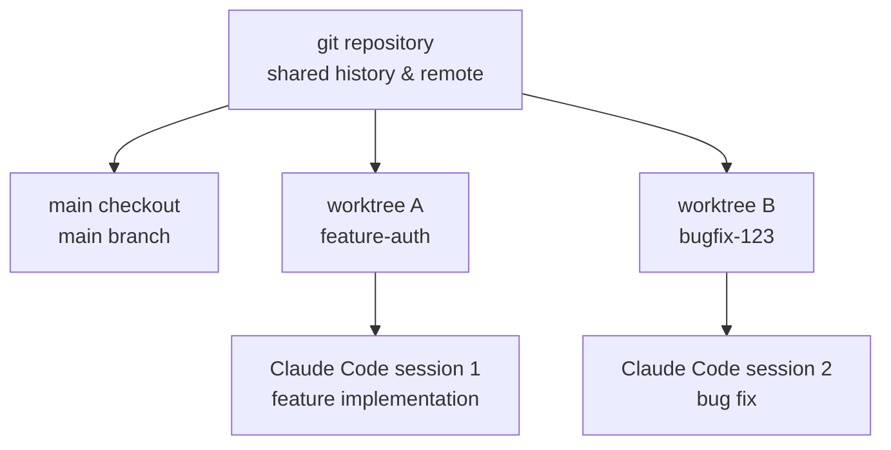

A worktree lets you split a single git repository into multiple working trees, so Claude Code sessions can work in parallel without ever touching each other's files.


**TL;DR**: A worktree shares the same repository while keeping its working directory and branch separate, so you can build a feature in one terminal and fix a bug in another at the same time, with no conflicts.



This page serves only as a bridge that gives an overview of Claude Code's worktree concept. For the details of how to actually apply worktrees to SPEC-level parallel development in MoAI-ADK, see the [Git Worktree Overview](/worktree), the [Complete Git Worktree Guide](/worktree/guide), and [Git Worktree Practical Examples](/worktree/examples).


## What Is a Worktree

A git worktree is a **separate working directory** with its own files and branch, while sharing the same repository history and remote as the main checkout. In other words, you gain an additional, independent workspace without cloning the entire repository.

| Aspect | Main Checkout | Additional Worktree |
|--------|--------------|---------------------|
| Working directory | One | Separate directory |
| Branch | Current branch | Independent branch |
| Repository history | Shared | Shared |
| Remote | Shared | Shared |
| File-edit isolation | Baseline | Fully isolated |

The key is the **separation of sharing and isolation**. History and the remote are managed together in one place, while file edits are completely split per tree.

## Parallel Work and Isolation

When each Claude Code session runs in its own worktree, one session's edits never touch another session's files. This makes the following kinds of concurrent work safe:

- Implement an authentication feature in terminal A while fixing an unrelated bug in terminal B
- Run different branches at the same time without builds/tests getting mixed
- Even if an experiment fails on one side, the other working tree is unaffected



Worktrees are one of several ways to work in parallel in Claude Code. While worktrees **isolate file edits**, subagents and agent teams **coordinate the work** itself. The two can be used together, so you can also set up subagents to perform parallel edits each in its own worktree.

## Integration Overview in Claude Code

Claude Code handles worktree creation and cleanup directly. At a conceptual level, here are the key flows.

### Starting in a Worktree

Passing the `--worktree` (or `-w`) flag creates an isolated worktree and starts Claude inside it. By default it is created under `.claude/worktrees/<name>/` at the repository root, and a new branch in the form `worktree-<name>` is created.

```bash
# Create a worktree with a specified name
claude --worktree feature-auth

# A second isolated session in another terminal
claude --worktree bugfix-123
```

If you omit the name, Claude auto-generates one like `bright-running-fox`. You can also create a worktree mid-session with the `EnterWorktree` tool by asking it to "work in a worktree."

> Before using `--worktree` for the first time in a directory, you must first run `claude` once in that directory and accept the workspace trust dialog.

### Base Branch and Copying Ignored Files

| Item | Behavior | Notes |
|------|----------|-------|
| Base branch | Branches from `origin/HEAD` by default | Falls back to local `HEAD` if there is no remote |
| `worktree.baseRef` | Only `"fresh"` or `"head"` allowed | `"head"` brings in unpushed commits as well |
| PR base branch | `claude --worktree "#1234"` | Created at `.claude/worktrees/pr-1234` |
| `.worktreeinclude` | Copies ignored files using gitignore syntax | Automatically copies untracked files such as `.env` into the new tree |

Adding `.claude/worktrees/` to `.gitignore` keeps worktree contents from showing up as untracked files in the main checkout.

### Subagent Isolation

Subagents can also run each in their own worktree to prevent parallel-edit conflicts. Adding `isolation: worktree` to a custom subagent's frontmatter makes it always isolated. A subagent's temporary worktree is automatically removed if it finishes without any changes.

### Cleanup

How cleanup happens on exit depends on whether there were changes.

- If there are no commits, changes, or untracked files, the worktree and branch are automatically removed.
- If there are changes, Claude asks whether to keep or remove them.
- Non-interactive (`-p`) runs are not cleaned up automatically, so remove them yourself with `git worktree remove`.

For non-git systems such as SVN, Perforce, and Mercurial, you can define the creation/cleanup logic yourself with the `WorktreeCreate` / `WorktreeRemove` hooks.

## Deep Use in MoAI-ADK

MoAI-ADK makes broad use of this worktree mechanism for SPEC-level parallel development and multi-session isolation. Practical topics—such as which situations call for turning on worktrees and how they mesh with session handoff—are covered in the MoAI-ADK-specific guides below, so this page stops at the conceptual introduction and points to the links for the deeper material.

## Related Docs

- [Git Worktree Overview](/worktree)
- [Complete Git Worktree Guide](/worktree/guide)
- [Git Worktree Practical Examples](/worktree/examples)

## References

- [Run parallel sessions with worktrees (official Claude Code docs)](https://code.claude.com/docs/en/worktrees)


If you are adopting worktrees for the first time, add `.claude/worktrees/` to `.gitignore` first. This keeps the main checkout clean so you can tell at a glance which change belongs to which tree.

