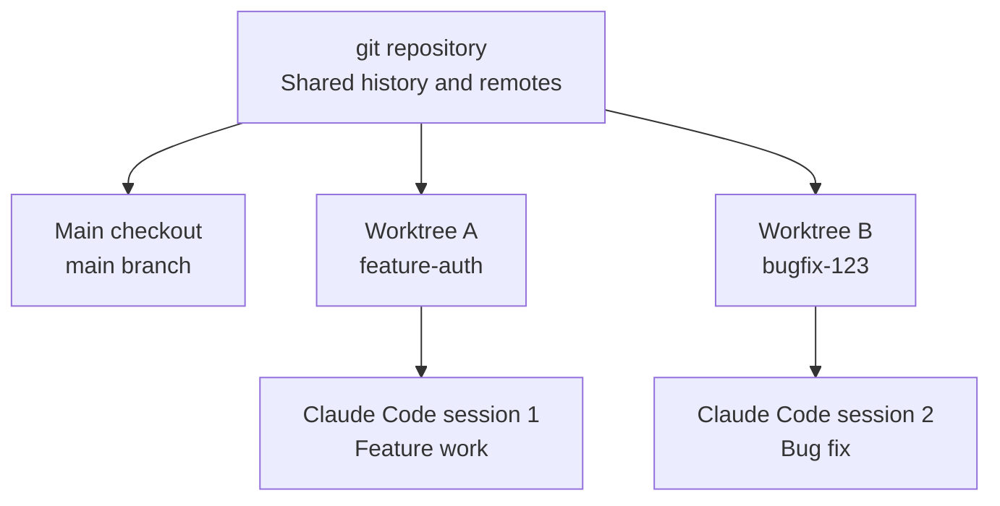

A worktree splits one git repository's working tree into several, letting each Claude Code session or subagent work side by side without touching each other's files. You gain one more independent workspace without cloning the whole repository, which makes parallel work natural.


This page is background material on **Claude Code itself**, the platform MoAI-ADK runs on. How MoAI-ADK actually applies worktrees to SPEC-level parallel development is covered in [Git Worktree Overview](/en/worktree).



**One-line summary**: Worktrees share the same repository history and remotes while separating only the working directory and branch, making it possible to build a feature in one terminal and fix a bug in another simultaneously, without conflicts.


## Why Isolation Is Needed

Without worktrees, every session opened in one repository shares **the same working directory**. So if one session edits a file at the same moment another session tries to edit the same file, a conflict arises — both sessions overwrite the same lines, or one side's messy experiment breaks the other side's build.

Worktrees solve this by **splitting file edits completely per tree**. Each session edits in its own working directory, so one side's changes never reach the other side's files.

- Implement an auth feature in terminal A while fixing a separate bug in terminal B
- Advance different branches simultaneously without builds and tests mixing
- One side's failed experiment leaves the other side's work tree unaffected


```mermaid
flowchart TD
    Repo[git repository<br/>Shared history and remotes]
    Repo --> Main[Main checkout<br/>main branch]
    Repo --> WT1[Worktree A<br/>feature-auth]
    Repo --> WT2[Worktree B<br/>bugfix-123]
    WT1 --> S1[Claude Code session 1<br/>Feature work]
    WT2 --> S2[Claude Code session 2<br/>Bug fix]
```

The key is the **separation of sharing and isolation**. Repository history and remotes are managed together in one place, while file edits are split completely per tree.

Worktrees are one of several ways to work in parallel in Claude Code — the axis that **isolates file edits**. Subagents and agent teams are the other axis that **coordinates the work** itself, and the two compose: you can configure subagents to perform parallel edits each in their own worktree.

## Three Isolation Layers

The word "worktree" refers to three different things depending on context. They are used together but have different roles and lifetimes, so it helps to draw the line.

| Layer | Name | Path | Lifetime | Created by |
|------|------|------|------|-------------|
| **git worktree** | git's underlying isolation primitive | Arbitrary path | Cleaned up explicitly via `git worktree remove` | git itself (`git worktree add`) |
| **L1** | Claude Code autonomous worktree | `.claude/worktrees/<name>/` | Session-scoped temporary — auto-cleaned on session end | Claude Code runtime (autonomous) |
| **L2** | MoAI opt-in worktree | `~/.moai/worktrees/<project>/<SPEC>/` | Persistent — disposed only via `moai worktree done` | MoAI (user opts in) |

### git worktree — the underlying primitive

At the bottom sits git's own `git worktree` feature. It lets one repository's `.git` directory be shared by multiple working trees, with each tree checking out a separate branch. Both L1 and L2 are isolation layers built on top of this git primitive.

### L1 — Claude Code autonomous worktree

A temporary worktree the Claude Code runtime creates and cleans up **on its own**. It is created when the user starts with `claude --worktree` directly, or when a subagent definition has `isolation: worktree` and the runtime spins one up autonomously. The default location is `.claude/worktrees/<name>/` at the repository root, and clean trees are removed automatically when the session ends. Omit the name and one like `bright-running-fox` is auto-generated.

### L2 — MoAI opt-in worktree

A persistent worktree that MoAI-ADK uses for SPEC-level parallel development, **opted into by the user**. It is created under the home directory at `~/.moai/worktrees/<project>/<SPEC>/` and reused across the run and sync phases. Disposal is explicit, performed by the user with `moai worktree done <SPEC>`. Operational detail is covered in [Git Worktree Overview](/en/worktree).

This page focuses on the Claude Code platform-level isolation principle — **git worktree and L1**. Hands-on content for L2 is left to the MoAI-specific guide.

## Agent(isolation: "worktree")

Putting `isolation: worktree` in a subagent definition's frontmatter makes that subagent run in its own isolated worktree every time it is invoked (v2.1.49+). It is the key device for preventing edit collisions when running file-writing implementer subagents in parallel.

```yaml
---
name: my-implementer
isolation: worktree   # runs in its own isolated worktree
background: true      # runs in the background without blocking the main conversation
---
```

### How it works

When `isolation: "worktree"` is on, Claude Code does the following.

1. Creates a temporary worktree off the current branch.
2. Sets the subagent's working directory (CWD) to that worktree's root.
3. The subagent composes relative paths against its own CWD to access files.

```
Main repository:  $HOME/project/src/auth/handler.go
Worktree:         $HOME/project/.claude/worktrees/abc123/src/auth/handler.go
```

Both trees share the same project structure, so a relative path like `src/auth/handler.go` resolves correctly on either side. Edits stay on the worktree side; the main repository file is left untouched.

### When to use it and when not to

| Situation | Recommendation | Reason |
|------|------|------|
| File-writing role (implementer / tester / designer) | `isolation: worktree` | Blocks file-overwrite collisions between parallel subagents at the source |
| Read-only role (researcher / analyst / reviewer) | Omit | `permissionMode: plan` already blocks writes; isolation only adds overhead |

`Agent(isolation: "worktree")` creates a **new L1 temporary worktree**; it is not a way to re-enter an existing L2 persistent worktree. To re-enter an existing worktree, use the `EnterWorktree(<path>)` tool within the same session, or the `moai cc -w <name>` launcher flag from a new session. Mixing the two is a trap where the base drifts and parallel-session coordination silently breaks.

## CLAUDE_PROJECT_DIR and Path Resolution

When delegating work to an isolated subagent, how paths are written in the prompt decides whether isolation holds. Write paths wrong and the worktree isolation is defeated.

`$CLAUDE_PROJECT_DIR` is an environment variable Claude Code exposes that points to the session's project root. Hooks and scripts use this value to locate project-relative paths (settings, memory, logs, etc.). Claude Code interprets this value to the correct directory for the agent's context, so using `$CLAUDE_PROJECT_DIR` inside hook commands is safe.

**Write-target file paths inside an agent prompt** are different. The subagent's CWD is already the worktree root, so write targets must be written as project-root-relative paths (e.g. `src/auth/handler.go`). Writing the main repository's absolute path into the prompt, or prefixing `cd /absolute/path &&`, makes the subagent touch main-repository files directly instead of the worktree, breaking isolation.

| Path type | Example | Absolute paths allowed? | Reason |
|-----------|----|-----------------|------|
| Write-target file | source code, tests | No — use relative paths | Subagent CWD is the worktree root; relative paths resolve correctly |
| Read-only reference | skills, settings on a `${CLAUDE_SKILL_DIR}` path | Yes | Content matches the main repository; read-only access is safe |
| SPEC document | `.moai/specs/SPEC-XXX/spec.md` | Relative recommended | Copied into the worktree on checkout |
| Bash command | `go test ./...` | No `cd` prefix | CWD is already the worktree root |

Only read-only references may use absolute paths; every path involved in writes stays relative. Honoring this principle keeps isolation working as intended.

## Starting in a Worktree

To start an isolated session directly, use the `--worktree` (or `-w`) flag (v2.1.50+). By default the worktree is created under `.claude/worktrees/<name>/` and a new branch of the form `worktree-<name>` is created.

```bash
# Create a worktree with a chosen name
claude --worktree feature-auth

# A second isolated session in another terminal
claude --worktree bugfix-123

# Branch from the local HEAD instead of origin/HEAD
# (requires worktree.baseRef: "head" in settings)
claude --worktree experimental
```

Omit the name and Claude auto-generates one like `bright-running-fox`. You can also ask "work in a worktree" mid-session and Claude creates one with the `EnterWorktree` tool.

### Base branch and ignored-file copying

| Item | Behavior | Notes |
|------|------|------|
| Base branch | Forks from `origin/HEAD` by default | `worktree.baseRef: "head"` forks from the local `HEAD` |
| PR-based fork | `claude --worktree "#1234"` | Created in the `.claude/worktrees/pr-1234` directory |
| `.worktreeinclude` | Copies ignored files using gitignore syntax | Auto-copies untracked files like `.env` into the new tree |
| Workspace trust | Trust dialog on first use | Skippable with the `-p` flag |

The base branch forks from `origin/HEAD` by default. To include unpushed commits, change to forking from the local `HEAD` with the `worktree.baseRef: "head"` setting.

Before first using `--worktree` in a directory, run `claude` once in that directory and accept the workspace trust dialog. The `-p` flag skips the trust dialog in non-interactive mode.

## Worktree Lifecycle

A worktree has a clear lifecycle of being created, used, and cleaned up. L1 temporary trees are managed automatically by Claude Code; L2 persistent trees are disposed by the user.

### Auto-cleanup of L1 temporary trees

L1 temporary worktrees for subagents are cleaned up by these rules.

- **Clean state** (no commits, changes, or untracked files): the worktree and branch are removed automatically.
- **Changes present**: Claude asks whether to preserve or remove.
- **Prompt changed**: previously created temporary worktrees are removed automatically.
- **Non-interactive runs** (`-p`): not auto-cleaned; remove directly with `git worktree remove`.
- **Worktrees created via the `--worktree` flag**: not auto-swept by tools like `git worktree prune`.

### Disposal of L2 persistent trees

L2 worktrees do not disappear when a session ends. After the run and sync phase PRs are all merged, the user disposes of them explicitly with `moai worktree done <SPEC>`. This process is detailed in [Git Worktree Overview](/en/worktree).

### Keeping the main checkout clean

Adding `.claude/worktrees/` to `.gitignore` prevents worktree directories from appearing as untracked files in the main checkout. You can see at a glance which changes belong to which tree, which cuts down on confusion during parallel work.

## How MoAI-ADK Uses Worktrees

MoAI-ADK uses this worktree mechanism extensively for SPEC-level parallel development and multi-session isolation (`moai cc -w <name>` to enter one, the `moai worktree` CLI to maintain them). To run several agentic loops at once, each loop's file edits must not contaminate the others — worktrees provide exactly that isolation, making them the physical precondition of loop parallelization. Hands-on content — when to turn worktrees on, how they mesh with session handoff — is compiled in the MoAI-ADK-specific guides below, so this page stops at the concept and links onward for depth.

## Related Documents

- [Subagents](/en/claude-code/agentic/sub-agents)
- [Git Worktree Overview](/en/worktree)
- [Complete Git Worktree Guide](/en/worktree/guide)
- [Git Worktree Real-World Examples](/en/worktree/examples)

## References

- [Worktrees — Claude Code official docs](https://code.claude.com/docs/en/worktrees)


If you are adopting worktrees for the first time, add `.claude/worktrees/` to `.gitignore` first. The main checkout stays clean, and you can see at a glance which changes belong to which tree.

