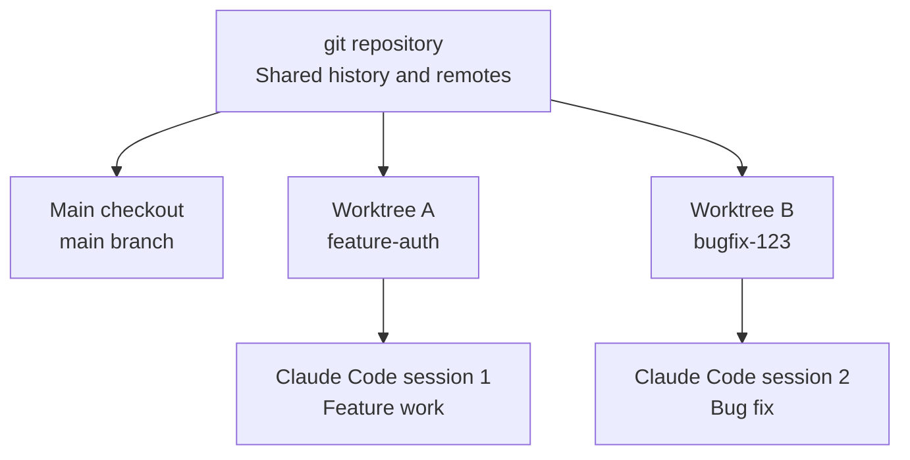

A worktree separates multiple working trees within one git repository, letting Claude Code sessions work in parallel without touching each other's files.


**One-line summary**: Worktrees share the same repository while separating working directories and branches, making it possible to build a feature in one terminal and fix a bug in another simultaneously, without conflicts.



This page serves only as a bridge overviewing Claude Code's worktree concept. For how MoAI-ADK actually applies worktrees to SPEC-level parallel development, see the [Git Worktree Overview](/worktree), the [Complete Git Worktree Guide](/worktree/guide), and [Git Worktree Real-World Examples](/worktree/examples).


## What Is a Worktree

A git worktree is a **separate working directory** with its own files and branch that nonetheless shares the same repository history and remotes as the main checkout. In other words, you gain one more independent workspace without cloning the whole repository.

| Aspect | Main checkout | Additional worktree |
|------|--------------|--------------|
| Working directory | 1 | Separate directory |
| Branch | Current branch | Independent branch |
| Repository history | Shared | Shared |
| Remotes | Shared | Shared |
| File-edit isolation | Baseline | Fully isolated |

The key is the **separation of sharing and isolation**: history and remotes are managed together in one place, while file edits are split completely per tree.

## Parallel Work and Isolation

Run each Claude Code session in its own worktree, and one session's edits never touch another session's files. That makes concurrent work like this safe:

- Implement an auth feature in terminal A while fixing a separate bug in terminal B
- Advance different branches simultaneously without builds/tests mixing
- One side's failed experiment leaves the other side's tree unaffected


```mermaid
flowchart TD
    Repo[git repository<br/>Shared history and remotes]
    Repo --> Main[Main checkout<br/>main branch]
    Repo --> WT1[Worktree A<br/>feature-auth]
    Repo --> WT2[Worktree B<br/>bugfix-123]
    WT1 --> S1[Claude Code session 1<br/>Feature work]
    WT2 --> S2[Claude Code session 2<br/>Bug fix]
```

Worktrees are one of several ways to work in parallel in Claude Code. Where worktrees **isolate file edits**, subagents and agent teams **coordinate the work** itself. The two combine: you can configure subagents to perform parallel edits each in their own worktree.

## Integration Overview in Claude Code

Claude Code handles worktree creation and cleanup itself. At the concept level, the key flow is:

### Starting in a Worktree

Pass the `--worktree` (or `-w`) flag to create an isolated worktree and start Claude inside it. By default it is created under `.claude/worktrees/<name>/` at the repository root, and a new branch of the form `worktree-<name>` is created.

```bash
# Create a worktree with a chosen name
claude --worktree feature-auth

# A second isolated session in another terminal
claude --worktree bugfix-123

# Branch from the local HEAD instead of origin/HEAD
# (requires worktree.baseRef: "head" in settings)
claude --worktree experimental
```

Omit the name and Claude auto-generates one like `bright-running-fox`. You can also ask "work in a worktree" mid-session and Claude creates one with the `EnterWorktree` tool.

The base branch forks from `origin/HEAD` by default. To include unpushed commits, change to forking from the local `HEAD` with the `worktree.baseRef: "head"` setting.

> Before first using `--worktree` in a directory, run `claude` once in that directory and accept the workspace trust dialog. The `-p` flag skips the trust dialog in non-interactive mode.

### Base Branch and Ignored-File Copying

| Item | Behavior | Notes |
|------|------|------|
| Base branch | Forks from `origin/HEAD` by default | `worktree.baseRef: "head"` forks from the local `HEAD` |
| PR-based fork | `claude --worktree "#1234"` | Created in the `.claude/worktrees/pr-1234` directory |
| `.worktreeinclude` | Copies ignored files using gitignore syntax | Auto-copies untracked files like `.env` into the new tree |
| Workspace trust | Trust dialog on first use | Skippable with the `-p` flag |

Adding `.claude/worktrees/` to `.gitignore` prevents worktree contents from appearing as untracked files in the main checkout.

### Subagent Isolation

Subagents can also run each in their own worktree to prevent parallel edit conflicts. Add `isolation: worktree` to a custom subagent definition's frontmatter and it always runs in a worktree.

Temporary worktrees of subagents that finished with no changes are removed automatically. When the prompt changes, the previous worktree is cleaned up as well.

### Cleanup

Worktree cleanup follows these rules:

- **Clean state** (no commits, changes, or untracked files): the worktree and branch are removed automatically.
- **Changes present**: Claude asks whether to preserve or remove.
- **Prompt changed**: previously created temporary worktrees are removed automatically.
- **Non-interactive runs** (`-p`): not auto-cleaned; remove directly with `git worktree remove`.
- **Worktrees created via the `--worktree` flag**: not auto-swept by tools like `git worktree prune`.

Adding `.claude/worktrees/` to `.gitignore` keeps the worktree directories themselves from showing as untracked files, so the main checkout stays clean.

## Deeper Use in MoAI-ADK

MoAI-ADK uses this worktree mechanism extensively for SPEC-level parallel development and multi-session isolation (`/moai plan --worktree`, the `moai worktree` CLI). To run several agentic loops at once, each loop's file edits must not contaminate the others — worktrees provide exactly that isolation, making them the physical precondition of loop parallelization. Hands-on content — when to turn worktrees on, how they mesh with session handoff — is compiled in the MoAI-ADK-specific guides below, so this page stops at the concept and links onward for depth.

## Related Documents

- [Git Worktree Overview](/worktree)
- [Complete Git Worktree Guide](/worktree/guide)
- [Git Worktree Real-World Examples](/worktree/examples)

## References

- [Worktrees — Claude Code official docs](https://code.claude.com/docs/en/worktrees)


If you are adopting worktrees for the first time, add `.claude/worktrees/` to `.gitignore` first. The main checkout stays clean, and you can see at a glance which changes belong to which tree.

