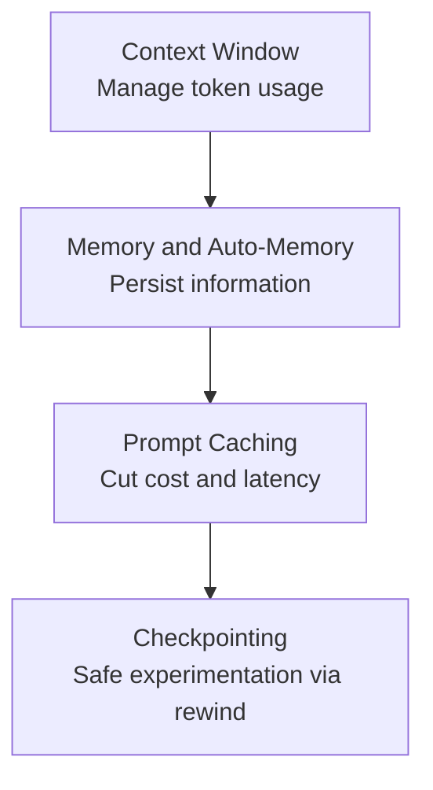

This group covers the context window, memory, prompt caching, and checkpointing that Claude Code relies on to keep long sessions stable. It is intended for developers who want to reduce context loss and rising costs in large tasks or development that spans multiple sessions.


**TL;DR**: Secure the stability of long-running tasks along four axes — managing token usage (the context window), persisting information (memory), reducing cost (prompt caching), and rewinding safely (checkpointing).


## Learning Path

We recommend reading in this order: first understand the limits of the context window and automatic compaction, then persist information with memory, reduce repeated cost with prompt caching, and finally set up an experimentation environment where failure is nothing to fear, thanks to checkpointing.

## Contents

| Document | Description |
|------|------|
| [Context Window](/claude-code/context-memory/context-window) | Tokens, automatic compaction, usage management |
| [Memory and Auto-Memory](/claude-code/context-memory/memory) | The CLAUDE.md hierarchy and auto-memory |
| [Prompt Caching](/claude-code/context-memory/prompt-caching) | Cutting cost and latency with caching |
| [Checkpointing](/claude-code/context-memory/checkpointing) | Experiment safely via rewind |

Once you complete this group, the next group looks at how to combine these foundations into your actual development process through workflows and automation.
