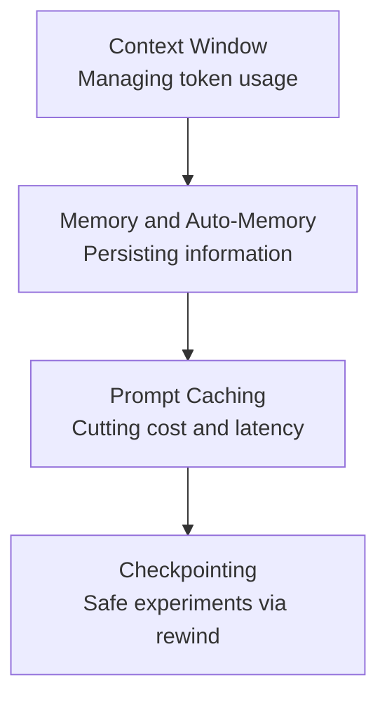

This group covers the context window, memory, prompt caching, and checkpointing that Claude Code uses to sustain long sessions reliably. It is for developers who want to reduce context loss and cost growth in large tasks or development spanning multiple sessions.

In agentic development, what determines cost is not the model price sheet but **how you operate tokens**. What and how much you put in context, whether you reuse the unchanging parts via cache, whether you persist knowledge to files across sessions — these four mechanisms are the technical foundation of what MoAI-ADK calls **Tokenomics** (Token Economics).


This page is background material on **Claude Code itself**, the platform MoAI-ADK runs on. MoAI-ADK's own features are covered in the sections above it in the sidebar.



**One-line summary**: Secure both the stability and the economics of long tasks through four mechanisms — managing token usage (context window), persisting information (memory), cutting cost (prompt caching), and rewinding safely (checkpointing).


## Learning Flow

```mermaid
flowchart TD
    A[Context Window<br>Managing token usage] --> B[Memory and Auto-Memory<br>Persisting information]
    B --> C[Prompt Caching<br>Cutting cost and latency]
    C --> D[Checkpointing<br>Safe experiments via rewind]
```

We recommend reading in this order: first understand the context window's limits and auto-compaction, then persist information with memory, reduce repeated cost with prompt caching, and finally set up a fear-free experimentation environment with checkpointing.

## Contents

| Document | Description |
|------|------|
| [Context Window](/en/claude-code/context-memory/context-window) | Tokens, auto-compaction, usage management |
| [Memory and Auto-Memory](/en/claude-code/context-memory/memory) | The CLAUDE.md hierarchy and auto-memory |
| [Prompt Caching](/en/claude-code/context-memory/prompt-caching) | Cutting cost and latency with caching |
| [Checkpointing](/en/claude-code/context-memory/checkpointing) | Experimenting safely with rewind |
| [Session Management](/en/claude-code/context-memory/sessions) | Resume, rename, clear — and MoAI session handoff |

After finishing this group, move on to the next group, [Extensibility](/en/claude-code/extensibility) — skills, hooks, MCP, and plugins, the materials for building a harness.
