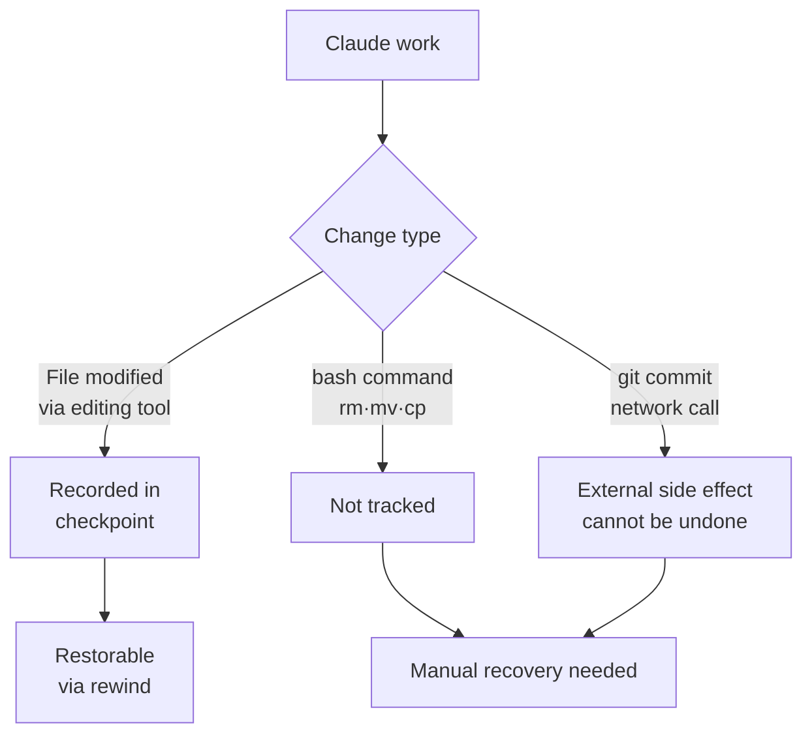

Checkpointing is a safety net that lets Claude Code automatically snapshot the state of your code before it starts editing, so you can roll back to an earlier point at any time.


**TL;DR**: A session-scoped "undo" safety net — when work goes sideways, press `Esc` twice to rewind both your code and your conversation to an earlier state.


## The Checkpoint Concept

Checkpointing automatically captures the state right before Claude edits a file during your work. As a result, even ambitious work against a large codebase can be attempted boldly, on the premise that you can always return to the state just before.

Automatic tracking behaves as follows.

| Item | Behavior |
| --- | --- |
| When created | A new checkpoint is created every time you send a prompt |
| What is tracked | Every change made by Claude's file-editing tools |
| Cross-session persistence | Preserved across sessions, so it remains accessible in a resumed conversation |
| Cleanup cycle | Cleaned up automatically along with the session after 30 days (configurable) |

Checkpoints are a mechanism for **fast, session-scoped recovery**, and do not replace a version control system like Git. Think of checkpoints as "local undo" and Git as "permanent record," and the division of roles becomes clear.

## Rewind

Running the `/rewind` command, or pressing `Esc` twice while the prompt input box is empty, opens the rewind menu.

```text
/rewind
# or, when the input box is empty
Esc  Esc
```

If there is still text in the input box, pressing `Esc` twice clears the input instead of opening the menu. That said, the cleared text is saved to your input history, so after finishing the rewind operation you can bring it back with the `Up` key.

The rewind menu shows a list of the prompts you sent during the session. After choosing the point to roll back to, select one of the following actions.

| Action | Effect |
| --- | --- |
| Restore both code and conversation | Rolls back both code and conversation history to the selected point |
| Restore conversation only | Keeps the current code and rolls back only the conversation to that message |
| Restore code only | Keeps the conversation and rolls back only the file changes |
| Summarize from here | Compresses the selected message and everything after it into a summary (freeing up context window) |
| Summarize up to here | Compresses everything before the selected message into a summary (later messages are kept as-is) |
| Never mind | Returns to the message list without making changes |

If you restore the conversation or choose `Summarize from here`, the original prompt of the selected message is restored to the input box, so you can resend it as-is or edit it before sending.

### The Difference Between Restore and Summarize

The restore family **rolls back** state — it undoes code changes, conversation history, or both. The summarize family, on the other hand, does not touch the files on disk; it only **compresses** part of the conversation into an AI-generated summary.

- **Summarize from here**: Everything before the selected message stays intact, while the selected message and everything after it is replaced by a summary. Use it when you want to discard side discussions but keep the early context in detail.
- **Summarize up to here**: Everything before the selected message is replaced by a summary, while the selected message and everything after it is kept as-is. Use it when you want to compress the initial setup discussion but keep recent work in detail.

In both cases the original messages are preserved in the session transcript, so Claude can reference the details again if needed. It is similar to `/compact`, but differs in that you can choose which side to compress relative to the selected message, rather than the whole conversation.

## What Gets Restored and What Doesn't

Rewind only tracks **changes made by Claude's file-editing tools within a session**. Changes outside that boundary are not restored.

| Category | Tracked? | Description |
| --- | --- | --- |
| Claude's direct file edits | Tracked | Changes made with editing tools are subject to rewind |
| File changes from bash commands | Not tracked | Files changed by `rm`, `mv`, `cp`, etc. cannot be rolled back |
| Manual edits outside the session | Not tracked | Changes from another editor or a concurrently running session are not captured |
| git commits / pushes | Not tracked | Commits and pushes already made are not undone by rewind |
| Network calls / external side effects | Not tracked | Things that happen externally, such as API requests or sending email, cannot be rolled back |



The key point is that rewind is **rolling back the local file state**. Side effects that have already been applied to external systems are outside the scope of checkpoint responsibility, so such operations require separate attention.

## How to Use It for Safe Experimentation

Checkpoints are especially useful in situations like the following.

- **Exploring alternatives**: Freely try different implementation approaches without losing your starting point.
- **Recovering from mistakes**: Quickly roll back a change that introduced a bug or broke a feature.
- **Iterating on a feature**: Experiment with variations on the premise that you can return to a working state.
- **Freeing up context space**: Summarize a verbose debugging session from a midpoint onward, clearing the context window while keeping the initial instructions intact.

For work with uncertain outcomes, such as experimental refactoring, an efficient flow is to first send a prompt to create a checkpoint and proceed with peace of mind, then roll back both code and conversation with `Esc Esc` if you do not like the result.

From the MoAI-ADK perspective, you can use it as an in-session safety net for quickly returning to the state just before, when the code gets badly shaken during SPEC-scoped work. That said, the principle is to always leave permanent history as Git commits.

## Limitations and Caveats

- **bash command changes are not tracked**: Files changed by shell commands rather than editing tools cannot be rolled back. Destructive shell commands must be handled with care.
- **External / concurrent changes are not tracked**: Changes from another session or an external editor are not captured unless they happen to touch the same file.
- **No substitute for version control**: Checkpoints are for session-scoped recovery. Permanent records and collaboration must always be carried forward with a version control system like Git.
- **Retention period**: Checkpoints are cleaned up automatically along with the session after 30 days (adjustable via settings).
- **The difference between summarize and fork**: Summarize compresses context within the same session. To leave the original session as-is and try a different approach, branching the session with `claude --continue --fork-session` is more appropriate.

## Related Docs

- [Context Window](/claude-code/context-memory/context-window)
- [Interactive Mode](/claude-code/foundations/interactive-mode)

## References

- [Checkpointing — Claude Code Docs](https://code.claude.com/docs/en/checkpointing)


If you deliberately create a checkpoint with a single short prompt before starting a destructive refactoring, then even if the experiment fails you can return cleanly to the state just before with a single `Esc Esc`.

