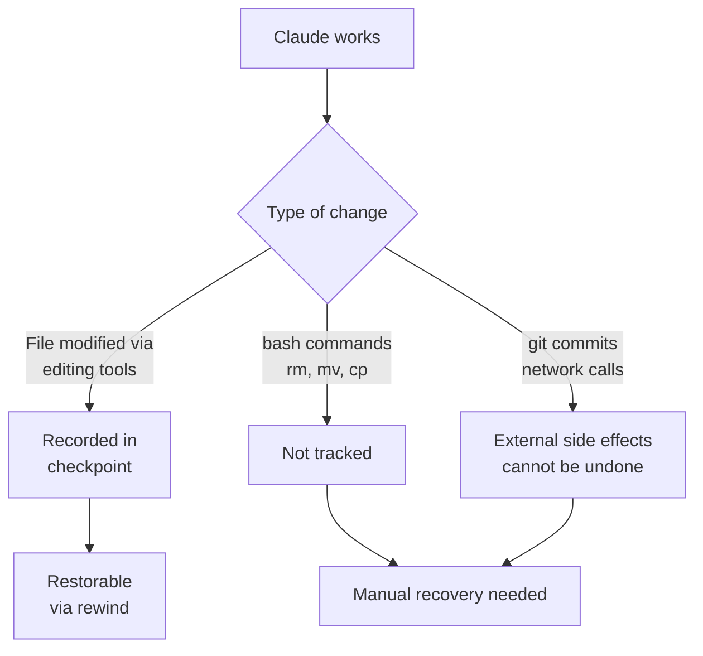

Checkpointing is a safety net: Claude Code automatically snapshots the state of your code before it starts editing, so you can return to an earlier point at any time.


**One-line summary**: Even when work goes sideways, pressing `Esc` twice rewinds code and conversation together to an earlier state — a session-scoped "undo" safety net.


## The Checkpoint Concept

Checkpointing automatically captures the state right before Claude edits a file. Thanks to this, even ambitious work against a large codebase can be attempted boldly, on the premise that you can always return to the immediately preceding state.

Automatic tracking works as follows.

| Item | Behavior |
| --- | --- |
| Creation timing | A new checkpoint is created every time you send a prompt |
| What is tracked | All changes made by Claude's file-editing tools |
| Cross-session persistence | Preserved across sessions and accessible in resumed conversations |
| Cleanup cycle | Auto-cleaned with the session after 30 days (configurable) |

Checkpoints are a device for **fast session-level recovery** and do not replace a version control system like Git. Think of checkpoints as "local undo" and Git as the "permanent record" — the role split is then clear.

## Rewind

Run the `/rewind` command, or press `Esc` twice with an empty prompt input, to open the rewind menu.

```text
/rewind
# or, with an empty input box
Esc  Esc
```

If text remains in the input box, pressing `Esc` twice clears the input instead of opening the menu. The cleared text is saved to input history, though, so you can recall it with the `Up` key after finishing the rewind.

The rewind menu shows the list of prompts sent during the session. Pick the point to return to, then choose one of the following actions.

| Action | Effect |
| --- | --- |
| Restore both code and conversation | Rewinds code and conversation history together to the chosen point |
| Restore conversation only | Keeps the current code and rewinds only the conversation to that message |
| Restore code only | Keeps the conversation and reverts only the file changes |
| Summarize from here | Compresses the chosen message onward into a summary (frees context window) |
| Summarize up to here | Compresses everything before the chosen message into a summary (later messages stay intact) |
| Never mind | Returns to the message list with no changes |

When you restore the conversation or choose `Summarize from here`, the original prompt of the chosen message is restored into the input box, ready to resend as-is or edit first.

### The Difference Between Restore and Summarize

The restore family **reverts** state — canceling code changes, conversation history, or both. The summarize family, by contrast, touches no files on disk and only **compresses** part of the conversation into an AI-generated summary.

- **Summarize from here**: everything before the chosen message stays intact, and the chosen message onward is replaced with a summary. Use it to drop side discussions while keeping the early context detailed.
- **Summarize up to here**: everything before the chosen message is replaced with a summary, and the chosen message onward is kept. Use it to compress early setup discussion while keeping recent work detailed.

In both cases, the original messages are preserved in the session transcript, so Claude can re-reference the details when needed. It resembles `/compact`, but differs in that you choose which side to compress relative to a chosen message rather than compressing everything.

## What Is Restored and What Is Not

Rewind tracks only **changes made by Claude's file-editing tools within the session**. Changes outside that boundary are not restored.

| Category | Tracked? | Description |
| --- | --- | --- |
| Claude's direct file edits | Tracked | Changes made with the editing tools are rewindable |
| File changes from bash commands | Not tracked | Files changed via `rm`, `mv`, `cp`, etc. cannot be reverted |
| Manual edits outside the session | Not tracked | Changes from other editors or concurrent sessions are not captured |
| Git commits and pushes | Not tracked | Commits and pushes already made are not undone by rewind |
| Network calls and external side effects | Not tracked | API requests, sent emails, and other external events cannot be undone |


```mermaid
flowchart TD
    A[Claude works] --> B{Type of change}
    B -->|File modified via<br>editing tools| C[Recorded in<br>checkpoint]
    B -->|bash commands<br>rm, mv, cp| D[Not tracked]
    B -->|git commits<br>network calls| E[External side effects<br>cannot be undone]
    C --> F[Restorable<br>via rewind]
    D --> G[Manual recovery needed]
    E --> G
```

The key point is that rewind is an **undo of local file state**. Side effects already applied to external systems are outside the checkpoint's responsibility, so such work needs separate care.

## Using It for Safe Experimentation

Checkpoints are especially useful in situations like these:

- **Exploring alternatives**: freely try different implementation approaches without losing the starting point.
- **Recovering from mistakes**: quickly revert a change that introduced a bug or broke a feature.
- **Iterating on features**: experiment with variations on the premise that you can return to a working state.
- **Freeing context space**: summarize a long-winded debugging session from a midpoint, emptying the context window while keeping the initial instructions intact.

For work with uncertain outcomes, like an experimental refactor, an efficient flow is: send a prompt first to create a checkpoint, proceed with peace of mind, and if you dislike the result, press `Esc Esc` to rewind code and conversation together.

From the MoAI-ADK perspective, checkpointing is what allows the agentic loop to run boldly. For the loop to autonomously repeat "act → verify → correct," failed attempts must be cheaply reversible, and checkpoints drive that reversal cost to nearly zero. Use it as the in-session safety net for snapping back to the previous state when the code shakes badly during SPEC-scoped work — but the principle remains that permanent history always lands in Git commits.

## Limitations and Cautions

- **Bash-command changes untracked**: files changed by shell commands rather than the editing tools cannot be reverted. Handle destructive shell commands carefully.
- **External and concurrent changes untracked**: changes from other sessions or external editors are not captured unless they happen to touch the same files.
- **Not a version-control replacement**: checkpoints are for session-level recovery. Permanent history and collaboration must continue through a version control system like Git.
- **Retention period**: checkpoints are auto-cleaned with the session after 30 days (adjustable in settings).
- **Summarize vs fork**: summarizing compresses context within the same session. To leave the original session intact and try a different approach, forking the session with `claude --continue --fork-session` is the better fit.

## Related Documents

- [Context Window](/claude-code/context-memory/context-window)
- [Interactive Mode](/claude-code/foundations/interactive-mode)

## References

- [Checkpointing — Claude Code Docs](https://code.claude.com/docs/en/checkpointing)


Before starting a destructive refactor, deliberately create a checkpoint with one short prompt — if the experiment fails, a single `Esc Esc` returns you cleanly to the previous state.

