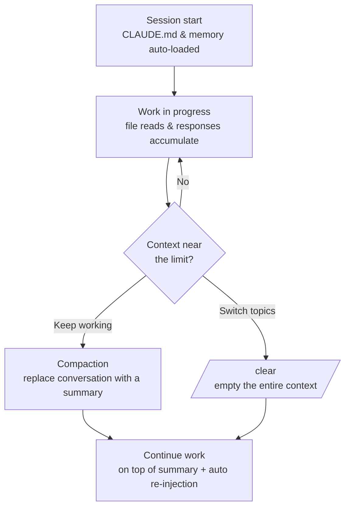

# Context Window

This page covers the context window — the space that holds everything Claude Code remembers during a single session — and how to manage it efficiently.


**TL;DR**: The context window is Claude's **work desk**, and you need to free up space with automatic compaction and `/clear` before the desk fills up so that long tasks flow smoothly to the end.


## Context Window and Tokens

The context window is the total amount of information Claude can "see" at once in a single session. It includes not only the prompts you type but also content that never appears in the terminal.

| What goes into the context | Visible in the terminal? | Notes |
|------------------------|-------------------|------|
| System prompt | Not visible | Behavior rules. Always loaded first |
| CLAUDE.md (global + project) | Not visible | Project rules and build commands |
| Auto memory (`MEMORY.md`) | Not visible | Notes left from previous sessions. Only the first 200 lines or 25KB loads |
| Environment info | Not visible | Operating system, shell, workspace path, etc. |
| MCP tool names (deferred loading) | Not visible | MCP tool definitions are loaded only when needed to conserve context |
| Skill descriptions (1 line) | Not visible | The actual body is loaded only when used |
| User prompt | Visible | The request you actually typed |
| Files Claude has read | Only a one-line summary | The file body is seen only by Claude |
| Claude's analysis, edits, and responses | Visible | Printed directly to the terminal |

A token is the unit used to count this information. Roughly, one English word is 1–2 tokens, while Korean takes more tokens per character. One counterintuitive fact is that **a substantial amount is already filled before the session even begins**. This is because CLAUDE.md, memory, the skill list, and MCP tool names are loaded before your first prompt.

### Reading Files Consumes the Most Context

The files Claude reads while working dominate context usage. That's why writing specific prompts ("fix the bug in `auth.ts`") to reduce the number of files Claude reads is the key to saving tokens. For work that requires digging through many files — like research — delegating to a subagent processes the large file reads in a separate context window and returns only a summary of the result to the main session.

## Size by Model

The size of the context window varies by model. The exact figures depend on the model you use, so treat the table below as a general guideline.

| Size (general) | Meaning |
|---------------|------|
| About 200K tokens | The standard window for many models. Sufficient for typical coding work |
| About 1M tokens | An extended window offered by some models. Advantageous for a large codebase |

A larger size lets you hold more files and conversation at once, but the window is not infinite. Whatever model you use, management becomes necessary as you approach the limit. The core principle is that **keeping the amount of content small is more stable than increasing the window size**.

## Automatic Compaction and /clear

As a session grows longer, the context approaches its limit. Claude Code handles this in two ways.

### Compaction

Compaction frees up space by **replacing the accumulated conversation history with a single structured summary**. You can run `/compact` yourself, or it can happen automatically as the context nears its limit. The summary preserves the following.

- The user's requests and intent
- Key technical concepts
- The files examined or modified and important code fragments
- Errors that occurred and how they were resolved
- Remaining work and current progress

In exchange, the full tool output and intermediate reasoning are lost. Claude can reference the work it did, but it no longer holds the original code it previously read verbatim.

What happens to each piece of information after compaction depends on how it was loaded.

| Mechanism | State after compaction |
|----------|--------------|
| System prompt, output style | Kept as-is (not part of the message history) |
| Project root CLAUDE.md, scope-less rules | Re-injected from disk |
| Auto memory | Re-injected from disk |
| Rules with `paths:` frontmatter | Gone until that file is read again |
| Nested CLAUDE.md in subdirectories | Gone until that directory's file is read again |
| Invoked skill bodies | Re-injected (5,000 tokens per skill, 25,000 tokens total cap, oldest removed first) |
| hooks | Not applicable (hooks run as code and do not remain in the context) |

If you want a rule to survive compaction, remove its `paths:` frontmatter or move it to the project root CLAUDE.md. Since a skill keeps its beginning when truncated, it's safest to put important instructions near the top of `SKILL.md`.

### Controlling Compaction Timing

To adjust when automatic compaction starts, use the `CLAUDE_AUTOCOMPACT_PCT_OVERRIDE` environment variable. The default threshold is approximately 75–80% of the total context. For example, to start compaction at 70%, set:

```bash
export CLAUDE_AUTOCOMPACT_PCT_OVERRIDE=70
```

### /clear — Full Reset

`/clear` is different from compaction. It empties the entire conversation context without even leaving a summary, starting **like a new session**. It's cleanest when you move on to a new task unrelated to the immediately preceding one. Remember it this way: use the summary (compaction) "when you'll keep working on the same thing" and the reset (`/clear`) "when you're switching topics."



## Usage Monitoring

You can't manage the context if you don't know how full it currently is. Claude Code provides tools that show the actual measurements.

| Command / Location | What it shows |
|-------------|-------------|
| `/context` | Real-time context usage by category, with optimization suggestions |
| `/cost` | The current session's token usage and cost |
| `/memory` | The list of CLAUDE.md and auto memory files loaded at startup |
| Status line | Always displays usage while a session is in progress |

Making it a habit to run `/context` once before or during a long task — to see which items are taking up the context — makes a big difference.

## Management Strategies for Long Tasks

The larger the task, the more context becomes the primary constraint. Combining the following strategies lets you carry a single task stably across multiple compaction boundaries.

- **Continue after summarizing**: When you finish one stage, tidy up with compaction and proceed with the next stage on top of the summary.
- **Split off into subagents**: Hand exploration and research that require reading many files to a subagent to protect the main session's context.
- **Leave checkpoints in memory**: Record important decisions and progress in memory so they survive compaction or `/clear`. Together with checkpointing, this sustains continuity across long sessions.
- **Keep CLAUDE.md slim**: Keep the project CLAUDE.md under 200 lines, and move reference content into skills or path-scoped rules so it loads only when needed.
- **Make prompts specific**: Narrow down the files to read to reduce unnecessary file reads.

Of these, memory and checkpoints interlock directly with MoAI-ADK's SPEC workflow and session handoff, so their detailed operation is covered in the related docs below. Here, it's enough to remember the best practice: "clear space before the context fills up, and leave important state on disk."

## Related Docs

- [Memory and Auto Memory](/claude-code/context-memory/memory)
- [Checkpointing](/claude-code/context-memory/checkpointing)

## References

- [Claude Code Docs — Context window](https://code.claude.com/docs/en/context-window)


Run `/clear` once right before starting a new task. If you enter a new task with file reads and conversation from the previous task still piled up, irrelevant tokens take up the desk, degrading both response quality and cost.

